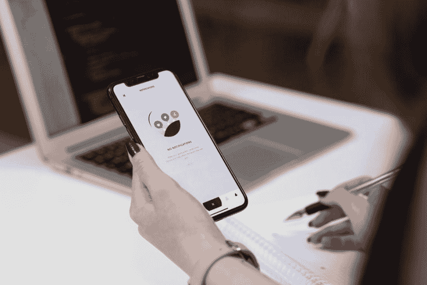

# 关于软件测试的 7 个误区

> 原文：<https://dev.to/automationhacks/7-myths-about-software-testing-ah2>

对测试和测试人员的常见误解。

<figure> 

<figcaption>来源:Unsplash</figcaption>

</figure>

* * *

你好。

作为软件工程中的一名测试员，伴随着关于这个角色的一系列神话和耻辱。这篇文章是关于这些误解的，我的目标是希望给那些真正经历过这些的人一个内在的视角，也许能帮助改变这些。

你可能会问，在今天的现实世界中，谁是测试人员？嗯，我现在公司的一位 MD 有了以下深刻的思考分享。

> 测试人员是开发人员和产品经理的混合体，有着健康的偏执

### 1。手动测试不是技术性的，也很容易

虽然听起来很刺耳，但这也是大多数**耻辱**作为一项技能出现在测试中的地方。从事手动测试的人被认为技术含量较低，因为在大多数情况下，他们需要像最终用户一样使用 UI 对应用程序进行黑盒测试。

这是真的吗？

嗯，是也不是。给定一个简单的事实，如果他有正确的心态去看待 T1，测试可以是个人所希望的技术。

一个做测试的人不需要仅仅局限于 UI 测试。测试人员可以在许多不同的领域为应用开发增值(API/DB/Contracts/Integration/Unit/Performance/Security)等等。所有这些领域都需要有人介入，了解具体细节是如何工作的，然后找到找出差距的方法 ***【打破】系统***

显然以上需要大量的技术技能和工具知识，并且相当繁琐。

### 2。测试人员天生具有特殊的技能，并且是“唯一”拥有质量的人

当这个问题来自开发人员而不是测试人员时，它让我很不爽。

在我的职业生涯中，我见过/面对这样的情况，没有足够动力测试他们自己的代码的开发人员会把每一个小的变化都扔给测试人员来验证，而测试人员会在代码中发现一些问题/错误。接下来是自我验证和兴奋，开发和测试无休止地重复这个循环。

测试不是只有少数人拥有或能够掌握的神奇技能。我们不是特别的雪花。任何相信这一点的人只是在浪费他和他的同龄人的时间。

> 开发人员可以测试代码，项目经理可以测试，测试人员也可以。任何拥有正确的测试心态并对事物如何工作/破坏感到好奇的人都可以为此做出贡献。

让我们对此半信半疑。一些活动由专门从事测试的人来指导会更好，并且可以将团队推向质量文化，但是这并不意味着是测试人员拥有质量。

现在，如果两个开发人员/测试人员能互相帮助，让他们的头脑清醒，一起工作，我们最终会有一个更好的团队和更高质量的产品。

### 3。测试只是从用户界面验证应用程序

> "你被介绍到一个没有测试覆盖的新项目中，你的方法是什么？"—一个测试人员问另一个测试人员

如果你问一个刚开始接触测试和自动化的人下面的问题，你很可能会听到类似下面的话。

> 嗯，我会使用 selenium/appium 或等效的工具在 UI 上测试并自动化每一个案例——测试人员回答道

你发现上述方法中的错误了吗？

首先，

*   它完全颠倒了自动化金字塔。测试的目的应该是尽可能快地获得反馈，而 UI 测试完全超越了这个目的
*   这也创造了一个功能失调的场景，其中有人必须维护和调试所有这些 1000+长时间运行的测试，奇怪的是**有时会失败。天哪！**

 *<figure>

<figcaption>[https://Martin fowler . com/articles/practical-test-pyramid . html](https://martinfowler.com/articles/practical-test-pyramid.html)</figcaption>

</figure>

是的，您可以在云提供商上并行执行，并投入更多的虚拟机或容器来解决问题，但这并不能改变一个事实，即成功地从 UI 测试中获得大量价值确实是一项非常具有挑战性的任务，在大多数情况下投资回报率都很低。

相反，如果更多的 API、契约测试、集成、单元测试都是在 UI 测试中精选出来的，这对每个人来说都是双赢。

### 4。手动测试和测试自动化是两个独立的实体

在测试领域有一个很大的分歧，人们很大程度上认为自己要么是测试自动化工程师(又名 SDET)，要么是手动测试人员，通常自动化技能比手动测试技能更受欢迎。很少有人吹嘘它。另一方面，人们不愿意选择自动化技能。

但实际上，经验丰富的测试人员意识到的是:

> 测试自动化只是达到目的的一种手段。本身并不是目的。

手动探索性测试是自动化的前身，需要高度的好奇心和不带有固有偏见地看待功能/应用的能力。

自动化只是熟练测试人员的另一个工具，用来摆脱枯燥或重复的任务，或者委托机器来完成更好的计算。例如，您是否希望通过嗅探数千行日志来识别一些错误模式？当然，机器可以做得更好。

认为测试自动化会扼杀手工测试人员的工作是愚蠢的，因为它会让生活变得更容易。没有人可以每晚测试 100 个微服务，每个微服务有 10 个条件。这是不实际的，甚至是不可能的。

本质上，手工测试和自动化实际上是在打同一场战争。

### 5。测试自动化不是“开发”

许多测试人员认为他们只需要理解编程的基础，就能够成功地进行测试自动化。只要测试人员能够写出完成工作的蹩脚代码，并且**能够工作**，这是可以接受的。

我们不需要模式或干净的代码。一个 100 LOC 长的测试函数非常好，因为我们反正不是“真正的”开发者

对吗？对吗？

#### 错了。

> 代码就是代码。不管是谁写的。

我们面临如下挑战:

*   精心制作有意义的自动化测试需要彻底理解其背后的特性，并确保我们使用功能或非功能方面在正确的级别断言代码。这需要良好的开发技能。
*   我们需要编写可维护的、可扩展的框架，这些框架对其他人来说是直观的，并且允许测试工作扩展。
*   选择具有支持不同项目需求的生态系统的编程语言、开发概念验证、使用 IDE、使用构建工具、CI、测试框架以及使用不同的报告解决方案设置遥测，这些活动都需要大量的技能。

这些怎么会比使用某些框架编写后端服务或 UI 的挑战性小呢？有时我会对此感到困惑。不能少，也不应该少。

测试人员还需要理解，任何不干净的代码都是不可接受的，如果框架/工具需要伸缩，我们需要理解合理的开发实践和模式。

> * *每个人都是开发人员，应该拥有相同的技术设计/编码技能** 以提高效率。

### 6。一切都需要自动化

这是那些对测试不够了解的人的一个普遍误解，如果你有 1000 个断言你的应用的案例，那么每一个都需要自动化。

人们从经验中学到的是，每增加一个新的测试都会增加维护成本。有经验的人都知道**测试选择和优先化**也就是选择自动化什么和什么时候自动化是一项重要的技能，可以决定自动化项目的成败。

### 7。作为测试人员，我们应该与开发人员隔离，不应该看开发人员代码/PRs/单元测试

你见过这样的案例吗？

*   测试人员会问开发人员，他是否为这个特性编写了足够的单元测试，并且对口头回答感到满意？
*   测试人员很少会查看不同拉取请求中创建的代码？_
*   *测试被视为一门独立的学科，他们认为应该从盒子外面测试所有东西*

所有这些都是某种形式的神话或旧的实践，在现代软件工程世界中没有太多的位置。

敏捷作为核心租户提倡“整个团队”的方法，在这种方法中，团队实际上是跨职能的，并且**能够并且应该**在代码上合作

作为测试人员。获得对你日复一日测试的应用程序的代码访问权，以获得其实际工作方式的内部视角，真的没有错。或对 PRs 进行评论。像这样的行为有助于在开发和测试之间架起一座桥梁。您可能不了解每一个组件，但是您可能会惊讶于您的* *系统思维模式** 和看到直接代码之外的影响的能力所带来的价值，经常地，一个开发人员在他的创造行为中错过了基本的或边缘的条件，这些条件通常作为单元/集成测试被更好地捕获。

嗯，作为测试人员，你可以帮助识别并**甚至修复**这些问题。

* * *

就是这样，伙计们！

你对以上有什么看法？我很想听听你对此的看法。希望这篇文章有助于澄清一些关于测试的误解。

如果你觉得这有用的话。为什么不和朋友或同事分享呢？

下次见。继续砸东西！干杯！*