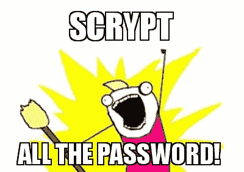

# (非常)基本的 Scrypt 散列介绍

> 原文：<https://dev.to/wagslane/very-basic-intro-to-the-scrypt-hash-7l5>

这将是对 Scrypt 散列函数，或者更准确地说， [KDF](https://en.wikipedia.org/wiki/Key_derivation_function) 函数的基本介绍。我会假设我的大多数观众是来了解**为什么使用 Scrypt**和**它如何工作的基础知识**。我的目标是从一般意义上解释它，我将省略证明和实现细节，而是专注于高层次的原则。

### 什么是 Scrypt？

Scrypt 是一个设计缓慢的 [哈希函数](https://blog.goodaudience.com/very-basic-intro-to-hash-functions-sha-256-md-5-etc-ed721622ff8)。它的目的是获取一些输入数据，并创建该数据的指纹，但速度非常慢。其真实使用案例的最佳示例之一是 Qvault 如何使用它。也就是说，**获取一个密码并创建一个 256 位的私钥**。

比如我们假设你的密码是 **password1234** 。通过使用 scrypt，我们可以确定性地将其扩展为 256 位密钥:

> **密码 1234**->
> 
> 【at4 hcwqfa 8d】
> 【awwhdqwpdwoubwooo】
> 【cqacagucjbq 0 jaayn】
> 
> bamcdq

这个 256 位长密钥现在可以用作私钥，使用 [AES-256](https://medium.com/coinmonks/very-basic-intro-to-aes-256-cipher-a60104847776) 密码加密和解密数据。

<figure>

<figcaption></figcaption>

</figure>

### 为什么不用密码直接加密？

大多数加密算法，包括 AES-256，都要求使用足够长的密钥。**通过散列**密码，**我们得到一个更长的固定长度的密钥。**

此外，我们选择使用 scrypt 算法，而不是像 SHA-256 这样更快的哈希算法，原因有二:

*   它很慢
*   它使用内存和 CPU 资源

我们需要慢速散列的原因是为了让**攻击者更难猜出**用户的密码。如果攻击者试图强行进入保险库，这意味着他们只是为了闯入而一遍又一遍地猜测密码。AES-256 非常快，所以这意味着攻击者在现代计算机上每秒钟可以尝试许多密码。

因为攻击者在试图解密保险库**之前必须对每个密码运行一个 scrypt hash，所以他们的攻击变得非常慢**，几乎不可能猜出密码。在一台相对强大的桌面计算机上，散列一个 Qvault 密码需要大约 1.5 秒，因为我们已经将内存和计算要求设置得相当高。

### 加密属性

像所有散列函数一样，scrypt 具有以下属性:

*   确定性(每次相同的输入产生相同的输出)
*   固定大小输出
*   不可逆(通过使用输出，攻击者无法找到输入)

此外，Scrypt 还具有以下属性:

*   计算成本高且速度慢(计算机运行哈希需要很长时间)
*   内存密集型(可能会使用几千兆字节的 RAM 来运行哈希)

感谢阅读！以下是一些附加资源:

【https://en.wikipedia.org/wiki/Scrypt】T2

[https://blog . good audience . com/very-basic-intro-to-hash-functions-sha-256-MD-5-etc-ed 721622 ff 8](https://blog.goodaudience.com/very-basic-intro-to-hash-functions-sha-256-md-5-etc-ed721622ff8)

[https://medium . com/coin monks/very-basic-intro-to-AES-256-cipher-a 60104847776](https://medium.com/coinmonks/very-basic-intro-to-aes-256-cipher-a60104847776)

[https://en.bitcoinwiki.org/wiki/Scrypt](https://en.bitcoinwiki.org/wiki/Scrypt)

跟着我们走！[https://medium.com/qvault](https://medium.com/qvault)

莱恩·瓦格纳