# 为 Google Assistant 动作构建一个 Webhook

> 原文：<https://dev.to/anudeepreddy/build-a-webhook-for-google-assistant-action-4312>

这篇文章是关于如何为你的 Google Assistant 操作构建你的 webhook，并临时托管在 Gitpod 上，测试你的代码。

## 先决条件

*   节点 JS
*   快递 JS
*   如何使用 Github 的基础知识

如果你有了这些，让我们开始吧。

## git pod 是什么？

首先，我想在这一节开始时说，我❤·吉特波德。Gitpod 是 Github 的在线 IDE。Gitpod 为您提供了一个完整的工作开发环境，包括一个 VS 代码驱动的 IDE 和一个专门为手边的项目配置的基于云的 Linux 容器。只需在你的 Github repo URL 前加上“[https://gitpod.io/#](https://gitpod.io/#)”，这样最终的链接看起来就像这样“[https://gitpod.io/#https://github.com/](https://gitpod.io/#https://github.com/)/”或者你也可以使用 Gitpod [浏览器扩展](https://chrome.google.com/webstore/detail/gitpod-online-ide/dodmmooeoklaejobgleioelladacbeki?hl=en)将 Gitpod 按钮添加到 Github 页面。

[https://www.youtube.com/embed/bFZMKpDV3GQ](https://www.youtube.com/embed/bFZMKpDV3GQ)

## 让我们开始建造吧

我已经创建了一个 Github repo，它将帮助你没有任何麻烦地开始。回购基本上是一个样板文件，用于开始构建 webhook。代码是用 Node JS 编写的，所以如果您已经熟悉 Node JS，那么在它的基础上进行构建会更容易。我们将使用 [action-on-google](https://www.npmjs.com/package/actions-on-google) Node JS 库(这个客户端库使得为 Google Assistant 创建动作变得容易，并且支持 Dialogflow、Actions SDK 和智能家居实现。).

### 创建你的行动

*   前往[https://console.actions.google.com/](https://console.actions.google.com/)，点击新项目。

[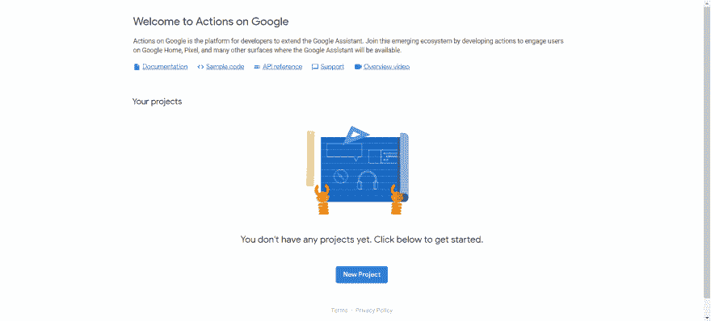](https://res.cloudinary.com/practicaldev/image/fetch/s--hUQbz__K--/c_limit%2Cf_auto%2Cfl_progressive%2Cq_auto%2Cw_880/https://blog.anudeepreddy.ml/conteimg/2019/06/Annotation-2019-06-28-141627.png)

*   输入您的项目名称，然后单击创建项目。

[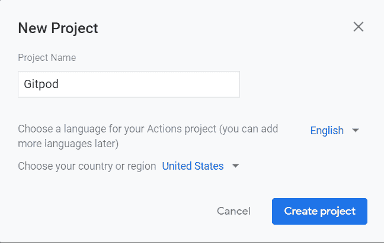](https://res.cloudinary.com/practicaldev/image/fetch/s--732aoqbP--/c_limit%2Cf_auto%2Cfl_progressive%2Cq_auto%2Cw_880/https://blog.anudeepreddy.ml/conteimg/2019/06/gitpod-action.png)

*   现在为您的操作选择一个类别。
*   现在在“开发”菜单下，给你的动作命名。
*   现在，前往开发选项卡中的操作菜单，点击**添加您的第一个操作**。

[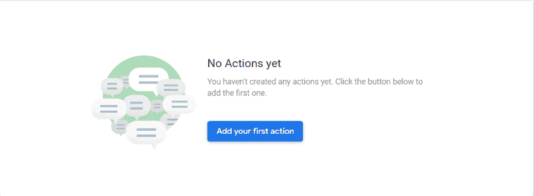](https://res.cloudinary.com/practicaldev/image/fetch/s--ch6kHyzs--/c_limit%2Cf_auto%2Cfl_progressive%2Cq_auto%2Cw_880/https://blog.anudeepreddy.ml/conteimg/2019/06/temp2.png)

*   在下一部分选择**自定义意图**并点击**构建**。这样做会将你重定向到**对话流控制台**，它应该看起来像这样。

[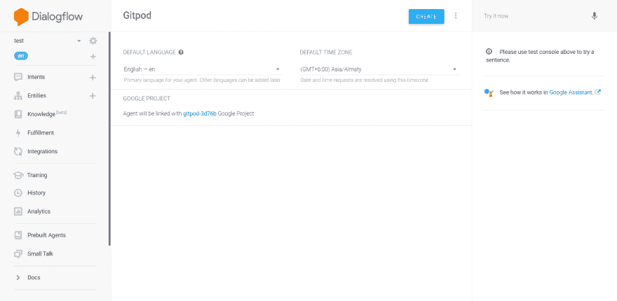](https://res.cloudinary.com/practicaldev/image/fetch/s--qdZ9c_us--/c_limit%2Cf_auto%2Cfl_progressive%2Cq_auto%2Cw_880/https://blog.anudeepreddy.ml/conteimg/2019/06/temp3.png)

*   点击创建，在 Dialogflow 上创建您的代理。
*   一旦你的代理准备好了，你就已经有了两个默认的意图(默认的后退意图和默认的欢迎意图),这两个都做得很好。
*   现在是时候创建一个新的意图并实现该意图了，这样我们就可以从我们将在下一节中构建的 webhook 获得响应。
*   点击创建一个新的意图，给它一个名称和训练短语(训练短语将用于调用意图)。现在您的意向几乎准备好了，向下滚动到 fulfillments **下，为新的默认欢迎意向和您刚刚创建的新意向启用 webhook 调用**。

### 了解. gitpod.yml

. gitpod.yml 文件用于自动设置运行应用程序所需的环境。

[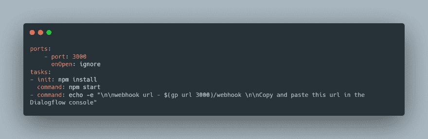](https://res.cloudinary.com/practicaldev/image/fetch/s--e6InGyPR--/c_limit%2Cf_auto%2Cfl_progressive%2Cq_auto%2Cw_880/https://blog.anudeepreddy.ml/conteimg/2019/06/carbon--4-.png)

如果您想要访问工作区中运行的服务，例如端口 8080 上的开发 HTTP 服务器，您需要首先公开该端口。Gitpod 有两种方法可以做到这一点:

1.  运行中:当你启动一个进程监听你的工作空间中的一个端口时，Gitpod 会询问你是否想要将这个端口暴露给互联网。
2.  在您的配置中:如果您已经知道您想要公开一个特定的端口，您可以在. gitpod.yml 文件中配置它，并跳过以后的额外点击。例如:

```
ports:
  - port: 3000 
```

当启动或重新启动工作区时，您通常希望运行某些任务。这很可能包括构建，也可能包括运行测试和自动启动应用程序，例如在开发服务器中。

Gitpod 允许您在. gitpod.yml 文件中配置启动任务。

例如，该存储库的启动脚本定义为:

```
tasks:
- init: npm install
  command: npm start 
```

您可以有多个任务，在不同的终端上打开。

```
tasks:
- init: npm install
  command: npm start
- command: echo -e "\n\nwebhook url - $(gp url 3000)/webhook \n\nCopy and paste this url in the Dialogflow console" 
```

#### `init`命令

init 属性可用于指定 shell 命令，这些命令只应在工作区刚刚克隆并且需要以某种方式进行初始化之后执行。这类任务通常是构建或下载依赖项。您只想执行一次，但不想在重启工作区或启动快照时执行的任何操作。

在我们的例子中,`init`命令是

```
tasks:
- init: npm install 
```

### 运行 Gitpod 设置

*   分叉我的[repo(dialog flow-web hook-boilerplate-nodejs)](https://github.com/anudeepreddy/dialogflow-webhook-boilerplate-nodejs)**或**只需点击我的 repo 中的 run in gitpod 按钮。(如果您这样做，您必须从工作区派生它，以便您可以将您自己的更改提交到您的 repo)。
*   现在你可以在你的回购网址前加上“[https://gitpod.io/#](https://gitpod.io/#)”前缀。这将带你到 Gitpod 并开始你的工作空间。工作区需要一些时间来启动。
*   工作区运行后，您应该会看到类似这样的内容。

[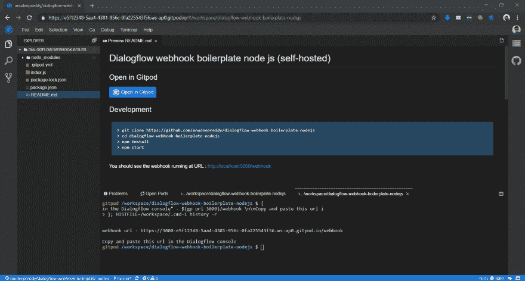](https://res.cloudinary.com/practicaldev/image/fetch/s--MeKCO3k---/c_limit%2Cf_auto%2Cfl_progressive%2Cq_auto%2Cw_880/https://blog.anudeepreddy.ml/conteimg/2019/06/Annotation-2019-06-25-171555.png)

*   如果您注意到 Node 应用程序已经在第一个终端中运行。这是由 Gitpod 配置文件自动完成的。并且 webhook URL 被打印到第二终端上。创建工作空间时，还会安装所有必需的依赖项。

[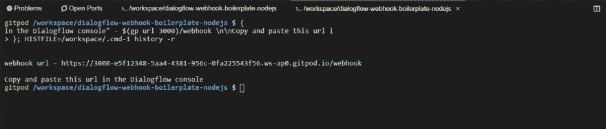](https://res.cloudinary.com/practicaldev/image/fetch/s--VbKZdJbl--/c_limit%2Cf_auto%2Cfl_progressive%2Cq_auto%2Cw_880/https://blog.anudeepreddy.ml/conteimg/2019/06/Annotation-2019-06-25-171555-crop.png)

*   现在 webhook 正在运行，我假设您已经在 Dialogflow 上有了代理(如果没有创建代理的话)，接下来您需要做的是从终端复制 webhook URL，并将其粘贴到 Dialogflow 控制台的 Fulfillments 部分。

[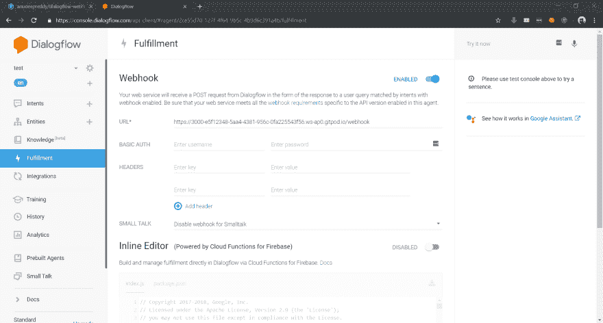](https://res.cloudinary.com/practicaldev/image/fetch/s--GihGHljr--/c_limit%2Cf_auto%2Cfl_progressive%2Cq_auto%2Cw_880/https://blog.anudeepreddy.ml/conteimg/2019/06/Annotation-2019-06-25-172359.png)

*   打开包含 webhook 代码的 index.js 文件。

[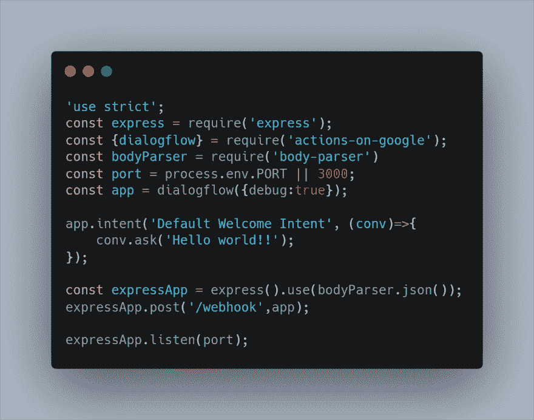](https://res.cloudinary.com/practicaldev/image/fetch/s--92tOvp9d--/c_limit%2Cf_auto%2Cfl_progressive%2Cq_auto%2Cw_880/https://blog.anudeepreddy.ml/conteimg/2019/06/carbon--1-.png)

该文件最初包含以下代码。现在，让我们向它添加一些代码，以便在调用我们在上一节中创建的新意图时显示一张卡片。google 上的 actions 库提供了许多功能，可以简化你的任务，在你的操作中呈现丰富的响应。

我们将添加以下代码，以便在调用新意图时显示一张卡片。

[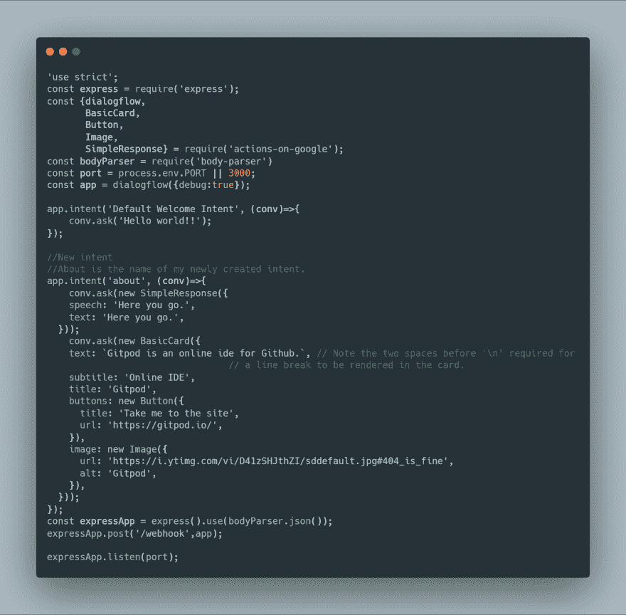](https://res.cloudinary.com/practicaldev/image/fetch/s--pk-zNLH4--/c_limit%2Cf_auto%2Cfl_progressive%2Cq_auto%2Cw_880/https://blog.anudeepreddy.ml/conteimg/2019/06/carbon--3-.png)

替换代码中的 URL 和其他内容，停止运行之前的应用程序实例，并在终端中运行`npm start`对代码进行更改后再次启动。

*   要测试您的操作，您可以在 Dialogflow 控制台中点击**查看它在 Google Assistant** 中的工作方式。

[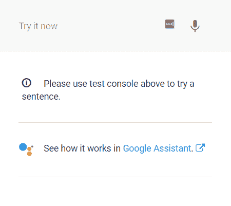](https://res.cloudinary.com/practicaldev/image/fetch/s--ozZINrvK--/c_limit%2Cf_auto%2Cfl_progressive%2Cq_auto%2Cw_880/https://blog.anudeepreddy.ml/conteimg/2019/06/Annotation-2019-06-28-175558.png)

*   调用意图会给你类似这样的响应。

[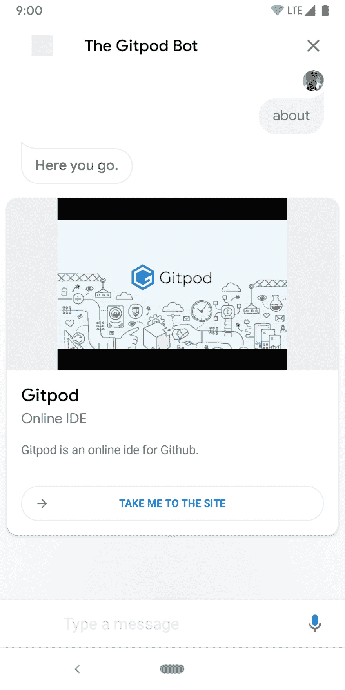](https://res.cloudinary.com/practicaldev/image/fetch/s--eugd_xsN--/c_limit%2Cf_auto%2Cfl_progressive%2Cq_auto%2Cw_880/https://blog.anudeepreddy.ml/conteimg/2019/06/Screenshot_20190628-181019.png)

请参考下面的链接来添加您自己的功能。

## 链接引用

*   如果你想了解更多关于谷歌图书馆的行动，你可以在这里找到它-[https://www.npmjs.com/package/actions-on-google](https://www.npmjs.com/package/actions-on-google)
*   浏览这些例子-[https://developers.google.com/actions/samples/github](https://developers.google.com/actions/samples/github)
*   丰富响应示例-[https://github . com/actions-on-Google/dialog flow-conversation-components-nodejs](https://github.com/actions-on-google/dialogflow-conversation-components-nodejs)

## 结论

Gitpod 可以通过向 repo 中添加一个简单的配置文件来自动化开发设置，从而使您的生活变得更加简单。你可以参考 Gitpod [文档](https://www.gitpod.io/docs/)来了解更多关于这个平台的信息。Gitpod 可以让你在无限的工作空间下工作，但运行时间为 100 小时/月。它还提供个人和无限的计划。如果你是一名学生，你可以只花 9 美元申请 Gitpod 无限计划。

[](https://res.cloudinary.com/practicaldev/image/fetch/s--B6KE5poA--/c_limit%2Cf_auto%2Cfl_progressive%2Cq_66%2Cw_880/https://blog.anudeepreddy.ml/conteimg/2019/06/character.gif)

# 快乐编码与 Gitpod ✨