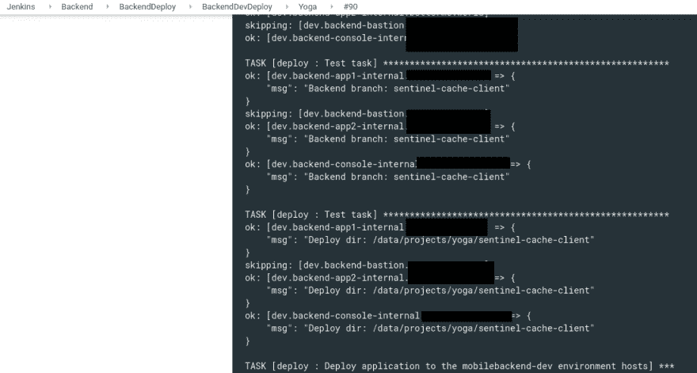

# NGINX:带有 Ansible、NGINX map 和 HTTP 头的多分支部署

> 原文：<https://dev.to/setevoy/nginx-multi-branch-deployment-with-ansible-nginx-map-and-http-headers-jh0>

[](https://res.cloudinary.com/practicaldev/image/fetch/s--r6fzzO2X--/c_limit%2Cf_auto%2Cfl_progressive%2Cq_auto%2Cw_880/https://rtfm.co.ua/wp-content/uploads/2012/09/nginx_logo2.jpg) 我们有一个标准的 LEMP 设置 NGINX，PHP-FPM。

应用程序-Yii-framework，使用 Ansible role 通过后端主机上的 [`synchronize`](https://docs.ansible.com/ansible/latest/modules/synchronize_module.html) 模块从 Jenkins 部署在`/data/projects/prjectname/frontend/web`目录中，该目录被设置为 NGINX 虚拟主机的根目录。

任务是能够在相同的后端部署相同的应用程序，但是由 Ansible 部署多个分支并由 NGINX 提供服务。

让我们在这里使用 NGINX 中的 [`map`](http://nginx.org/en/docs/http/ngx_http_map_module.html) :如果在 GET-request 期间将添加一个特殊的头——那么 NGINX 必须从`/data/projects/prjectname/<BRANCHNAME>/frontend/web`返回代码，如果没有设置头——那么使用默认目录`/data/projects/prjectname/frontend/web`。

相应地，需要更新部署流程——代码必须放在`/data/projects/prjectname/frontend/web`或`/data/projects/prjectname/<BRANCHNAME>/frontend/web`中——这取决于具体情况。

### NGINX `map`

更新`nginx.conf` :

```
...
    map $http_ci_branch $app_branch {
        default "";
        ~(.+)   $1;
    }
... 
```

检查语法:

```
root@bttrm-dev-app-1:/home/admin# nginx -t
nginx: [emerg] unknown "1" variable
nginx: configuration file /etc/nginx/nginx.conf test failed 
```

检查 NGINX 的版本:

```
root@bttrm-dev-app-1:/home/admin# nginx -v
nginx version: nginx/1.10.3 
```

更新一下。

卸载已经安装的 NGINX:

```
root@bttrm-dev-app-1:/home/admin# apt -y purge nginx 
```

添加其官方知识库:

```
root@bttrm-dev-app-1:/home/admin# echo "deb http://nginx.org/packages/mainline/debian/ stretch nginx" >> /etc/apt/sources.list

root@bttrm-dev-app-1:/home/admin# wget http://nginx.org/keys/nginx_signing.key

root@bttrm-dev-app-1:/home/admin# apt-key add nginx_signing.key
OK

root@bttrm-dev-app-1:/home/admin# apt update 
```

安装最新版本:

```
root@bttrm-dev-app-1:/home/admin# apt -y install nginx 
```

检查:

```
root@bttrm-dev-app-1:/home/admin# nginx -v
nginx version: nginx/1.17.0

root@bttrm-dev-app-1:/home/admin# nginx -t
nginx: the configuration file /etc/nginx/nginx.conf syntax is ok
nginx: configuration file /etc/nginx/nginx.conf test is successful

root@bttrm-dev-app-1:/home/admin# systemctl start nginx 
```

回到它的配置。

在`nginx.conf`我们现在有:

```
...
    underscores_in_headers on;
    map $http_ci_branch $app_branch {
        default "";
        ~(.+)   $1;
    }
... 
```

在这里，我们获取`http_ci_branch`变量(它将从请求期间传递的`ci_branch`头创建),然后将其值保存到`app_branch`变量:

*   *默认*-如果`ci_branch`为空，保存`app_branch`的 *""* 值
*   否则，使用 regex ( `(.+)`)获取`ci_branch`的值，并将其保存到`app_branch`

为了能够在标题名称中使用下划线，启用 NGINX 的“`underscores_in_headers`”选项。

然后，更新虚拟主机的配置–将`$app_branch`添加到虚拟主机的`root` :

```
...
    set $root_path /data/projects/projectname/$app_branch/frontend/web;
    root $root_path;
... 
```

检查一下。

创建一个新的目录，例如，“*开发*:

```
root@bttrm-dev-app-1:/home/admin# mkdir -p /data/projects/projectname/develop/frontend/web/ 
```

现在，我们必须在主机上编目—`/data/projects/projectname/frontend/web/`和`/data/projects/projectname/develop/frontend/web/`。

如果`ci_branch`为空，NGINX 必须使用第一个，如果`ci_branch`有"*开发"*值，则必须使用第二个。

文件几乎完全相同。

默认目录的索引文件:

```
root@bttrm-dev-app-1:/etc/nginx# cat /data/projects/projectname/frontend/web/index.php
Root

<?php

headers =  getallheaders();

foreach($headers as $key=>$val){

echo $key . ': ' . $val . '<br>';

}

?> 
```

并在*发展* :

```
root@bttrm-dev-app-1:/etc/nginx# cat /data/projects/projectname/develop/frontend/web/index.php

Develop

<?php

headers =  getallheaders();

foreach($headers as $key=>$val){

echo $key . ': ' . $val . '<br>';

}

?> 
```

让我们检查一下。

先不带`ci_branch`头:

```
$ curl https://dev.example.com/
Root

Accept: */*<br>User-Agent: curl/7.65.1<br>X-Amzn-Trace-Id: Root=1-5d1205f9-66ee8ea4b58b3400e02ecac4<br>Host: dev.example.com<br>X-Forwarded-Port: 443<br>X-Forwarded-Proto: https<br>X-Forwarded-For: 194.183.169.27<br>Content-Length: <br>Content-Type: <br> 
```

并以它和它的价值为"*发展出*:

```
$ curl -H "ci_branch:develop" https://dev.example.com/
Develop

Ci-Branch: develop<br>Accept: */*<br>User-Agent: curl/7.65.1<br>X-Amzn-Trace-Id: Root=1-5d120606-7e42cd0b419e20071d7f8a97<br>Host: dev.example.com<br>X-Forwarded-Port: 443<br>X-Forwarded-Proto: https<br>X-Forwarded-For: 194.183.169.27<br>Content-Length: <br>Content-Type: <br> 
```

太好了，这里一切正常。

### 可变部署

现在，我们可以通过传递头来提供不同的内容，是时候更新部署了——将代码复制到主机上的特定(或默认)目录。

部署的角色主要任务现在看起来如下:

```
...
- name: "Deploy application to the {{ aws_env }} environment hosts"
  synchronize:
    src: "app/"
    dest: "/data/projects/{{ backend_project_name }}"
    use_ssh_args: true
    delete: true
    rsync_opts:
      - "--exclude=uploads"
... 
```

`backend_project_name`从剧本文件传递给角色的变量:

```
...
    - role: deploy
      tags: deploy
      backend_prodject_git_branch: "{{ lookup('env','APP_REPO_BRANCH') }}"
      backend_project_git_repo: "{{ lookup('env','APP_REPO_RUL') }}"
      backend_project_name: "{{ lookup('env','APP_PROJECT_NAME') }}"
      when: "'backend-bastion' not in inventory_hostname" 
```

要使新部署工作，需要在`dest: "/data/projects/{{ backend_project_name }}"`中添加一个目录，并满足以下条件:

*   必须仅适用于*开发*或*暂存*环境
*   仅适用于分行名称！= *开发*，因为*开发*是*开发*和*登台*的默认分支，这个分支的代码必须部署到默认目录`/data/projects/{{ backend_project_name }}`

在角色剧本中添加[`set_fact`](https://docs.ansible.com/ansible/latest/modules/set_fact_module.html):

```
...
- set_fact: 
    backend_branch: "{{ lookup('env','APP_REPO_BRANCH') }}"
  when: "'develop' not in lookup('env','APP_REPO_BRANCH') and 'production' not in env"
... 
```

但是现在，如果这个角色将在*生产*或*开发*分支中使用，那么`backend_branch`变量将根本不会被设置。

让我们在`group_vars/all.yml`文件中添加一些默认值:

```
...
backend_branch: ""
... 
```

因此，它将首先设置""值，但优先级最低(参见 Ansible 的优先级[此处> > >](https://gist.github.com/ekreutz/301c3d38a50abbaad38e638d8361a89e) )，然后，如果`set_fact`中的`when`条件将被应用，它将覆盖`backend_branch`变量的值。

更新部署角色添加`{{ backend_branch }}`变量和几条调试消息:

```
...
- set_fact: 
    backend_branch: "{{ lookup('env','APP_REPO_BRANCH') }}"
  when: "'develop' not in lookup('env','APP_REPO_BRANCH') and 'production' not in env"

- name: Test task
  debug:
    msg: "Backend branch: {{ backend_branch }}"

- name: Test task
  debug:
    msg: "Deploy dir: {{ web_data_root_prefix }}/{{ backend_project_name }}/{{ backend_branch }}"

- meta: end_play 
... 
```

检查它——添加一个环境变量`APP_REPO_BRANCH="blabla"`和一个应用程序的名称变量，用于`deploy`角色:

```
$ export APP_PROJECT_NAME=projectname
$ export APP_REPO_BRANCH="blabla" 
```

运行脚本:

```
$ ./ansible_exec.sh -t deploy
...

TASK [deploy : Test task] ****

ok: [dev.backend-app1-internal.example.com] => {
"msg": "Backend branch: blabla"
}

ok: [dev.backend-app2-internal.example.com] => {
"msg": "Backend branch: blabla"
}

ok: [dev.backend-console-internal.example.com] => {
"msg": "Backend branch: blabla"
}

skipping: [dev.backend-bastion.example.com]

TASK [deploy : Test task] ****

ok: [dev.backend-app1-internal.example.com] => {
"msg": "Deploy dir: /data/projects/projectname/blabla"

}

ok: [dev.backend-app2-internal.example.com] => {
"msg": "Deploy dir: /data/projects/projectname/blabla"
}

ok: [dev.backend-console-internal.example.com] => {
"msg": "Deploy dir: /data/projects/projectname/blabla"
}
... 
```

好吧。

现在将分支的变量值改为 *develop* :

```
$ export APP_REPO_BRANCH="develop"
$ ./ansible_exec.sh -t deploy
...

TASK [deploy : Test task] ****

ok: [dev.backend-app1-internal.example.com] => {
"msg": "Backend branch: "
}

ok: [dev.backend-app2-internal.example.com] => {
"msg": "Backend branch: "
}

ok: [dev.backend-console-internal.example.com] => {
"msg": "Backend branch: "
}

skipping: [dev.backend-bastion.example.com]

TASK [deploy : Test task] ****

ok: [dev.backend-app1-internal.example.com] => {
"msg": "Deploy dir: /data/projects/projectname/"
}

ok: [dev.backend-app2-internal.example.com] => {
"msg": "Deploy dir: /data/projects/projectname/"
}

ok: [dev.backend-console-internal.example.com] => {
"msg": "Deploy dir: /data/projects/projectname/"
}
... 
```

好看吗？

更新部署任务–将`{{ backend_branch }}`添加到目标路径:

```
...
- name: "Deploy application to the {{ aws_env }} environment hosts"
  synchronize:
    src: "app/"
    dest: "/data/projects/{{ backend_project_name }}/{{ backend_branch }}"
    use_ssh_args: true
    delete: true
    rsync_opts:
      - "--exclude=uploads"
... 
```

从 Jenkins 部署，此处使用的应用程序分支—*sentinel-cache-client*:

[](https://rtfm.co.ua/wp-content/uploads/2019/06/Screenshot_20190625_173225.png)

检查后端主机上的目录:

```
root@bttrm-dev-app-1:/etc/nginx# ll /data/projects/projectname/
total 1380
drwxr-xr-x 14 projectname projectname   4096 Jun 13 17:19 backend
-rw-r--r--  1 projectname projectname    167 Jun 13 17:19 codeception.yml
...
-rw-r--r--  1 projectname projectname   5050 Jun 13 17:19 requirements.php
drwxr-xr-x 11 projectname projectname   4096 Jun 25 17:29 sentinel-cache-client
drwxr-xr-x  3 projectname projectname   4096 Jun 13 17:22 storage
-rw-r--r--  1 root root      5 Jun 25 17:29 test.txt
-rw-r--r--  1 projectname projectname   2624 Jun 13 17:19 Vagrantfile
... 
```

创建了 *sentinel-cache-client* 目录——很好。

而且内容和默认目录一样，只是用了 *sentinel-cache-client* 分支:

```
root@bttrm-dev-app-1:/etc/nginx# ll /data/projects/projectname/sentinel-cache-client/
total 1380
drwxr-xr-x 14 projectname projectname   4096 Jun 13 17:19 backend
-rw-r--r--  1 projectname projectname    167 Jun 13 17:19 codeception.yml
drwxr-xr-x 13 projectname projectname   4096 Jun 13 17:19 common
-rw-r--r--  1 projectname projectname   2551 Jun 13 17:19 composer.json
-rw-r--r--  1 projectname projectname 222276 Jun 13 17:19 composer.lock
drwxr-xr-x  9 projectname projectname   4096 Jun 13 17:19 console
drwxr-xr-x  6 projectname projectname   4096 Jun 13 17:19 docker
... 
```

检查一下。

在`/data/projects/projectname/sentinel-cache-client/`目录下创建一个测试文件:

```
root@bttrm-dev-app-1:/etc/nginx# echo "sentinel-cache-client" > /data/projects/projectname/sentinel-cache-client/frontend/web/test.php 
```

现在调用没有标题的 URL:

```
$ curl https://dev.example.com.com/test.php
<html>
<head><title>404 Not Found</title></head>
... 
```

并以`ci_branch`头和“ *sentinel-cache-client* 为其值:

```
$ curl -H "ci_branch:sentinel-cache-client" https://dev.example.com.com/test.php
sentinel-cache-client 
```

所有作品。

完成了。

### 类似的帖子

*   <small>03/15/2019</small> [詹金斯:HTTP 全双工通道超时](https://rtfm.co.ua/jenkins-http-full-duplex-channel-timeout/) <small>(0)</small>
*   <small>【09/20/2017】</small>[【不安分】:儿基会儿基会儿基会](https://rtfm.co.ua/ansible-primer-ustanovki-nginx/)<small></small>
<small>*   <small>03/15/2019</small> [詹金斯:HTTP 全双工通道超时](https://dev.to/setevoy/jenkins-http-full-duplex-channel-timeout-3hch-temp-slug-4867599) <small>(0)</small>*   <small>2018 年 8 月 25 日</small>[【AWS:∞rtfm 3.0(最终)─云形稳定形成】](https://rtfm.co.ua/aws-migraciya-rtfm-3-0-final-cloudformation-i-ansible-roli/)<small></small><small></small></small>

<small><small></small></small>