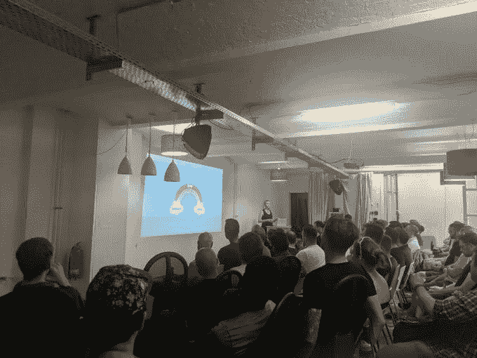

# CSS 战#6 -缺少切片

> 原文：<https://dev.to/pheeria/css-battle-6-missing-slice-3oob>

现在我是一名前端开发人员，我去了柏林。JS 。上次我去的时候，Cassie Evans 做了一个关于使用 SVG 制作动画的精彩演讲。

> 卡西伊文斯@卡西科德说来[@伯林金斯](https://twitter.com/berlinjs)真是一种享受。
> 
> 💜组织者鼓励和支持新演讲者的努力给了我很大的启发。和我一起把一些小技巧带回家给 [@CodebarBrighton](https://twitter.com/CodebarBrighton) 。
> 
> 🙊我的幻灯片仍然是一个 WIP，但如果你想让我知道，我会弹出你一个偷偷摸摸的私人链接。😉2019 年 6 月 21 日 12 点 42 分[](https://twitter.com/intent/tweet?in_reply_to=1142050104569999362)[](https://twitter.com/intent/retweet?tweet_id=1142050104569999362)[](https://twitter.com/intent/like?tweet_id=1142050104569999362)

所以我想，“为什么不呢？”除此之外，Cassie 告诉我使用 SVG，因为*div 从来不是用来绘制*的，SVG 才是。除此之外，你还需要*风格* SVG。
没那么快。CSS 战不允许 SVG。
悲伤。让我们用通常的方法解决第六个问题。

## 1。填料

为了避免类似`font-size: 0`的黑客攻击，三个 div 被挤在一起，使用填充放在内容的中间。内联阻塞实现了这个目的。我们也可以使用保证金(实际上我最初就是这么做的)，但这一次我们不会。

```
<div id="a"></div><div id="b"></div><div id="c">
</div>
<style>
  body {
    padding: 42px 92px;
    background: #E3516E;
  }
  div {
    width: 100px;
    height: 100px;
    display: inline-block;
  }
  #a {
    background: #51B5A9;
    border-radius: 100px 0 0;
  }
  #b {
    background: #FADE8B;
    border-radius: 0 100px 0 0;
  }
  #c {
    background: #F7F3D7;
    border-radius: 0 0 0 100px;
  }
</style> 
```

Enter fullscreen mode Exit fullscreen mode

## 2。转换

但是我们真的需要那么多 HTML 标记吗？毕竟这是 CSS 战。所以，让我们至少试着减少字符数。我们知道，一个`div`可以有一个边界半径使其变圆。我们还知道，我们可以有选择地修改每个边界边。并且边界将复制侧面形状。所以，我们可以用四种不同的颜色做一个圆。但是圈子本身，我们其实并不需要。如果我们不定义它呢？所以，没有高度和宽度的划分。这可能有用。如果你尝试过，你可能会注意到，颜色并没有完全按照我们需要的方式变化。嗯，这就是`transform: rotate(45deg)`发挥作用的地方。我刚刚查看了[可能的轮换单位](https://stackoverflow.com/a/27802062)，以防我们赢得更多的角色:`deg`、`rad`、`grad`和`turn`。但是我们没有。当谈到边框颜色时，你的眼睛可能会发现一些奇怪的东西。
`#0000`，你是什么？最初，我想让那部分透明。`rgba(0, 0, 0, 0)`是解决方案。16 个奇怪的角色！我们不能做得更好吗？当然，试试`transparent`。也管用。但是仍然很长。那#00000000 呢，其中那个`00`代表`opacity: 0`？好多了！但事实证明[4 字 RGBA 也支持][4]！

```
<div></div>
<style>
* {
  background: #E3516E;
}

div {
  margin: 50px 92px;
  border-radius: 100px;
  border: 100px solid;
  border-color: #FADE8B #0000 #F7F3D7 #51B5A9;
  transform: rotate(45deg);
}
</style> 
```

Enter fullscreen mode Exit fullscreen mode

这是第一个帖子，我试图减少字符的数量。不要试图在家里这样做！不管怎样，你更喜欢哪一种解决方案？你还知道其他人吗？