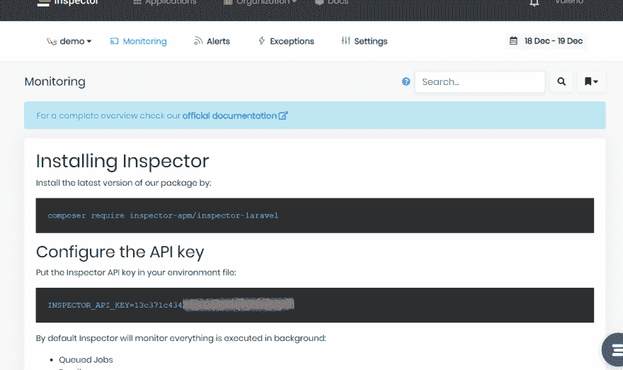
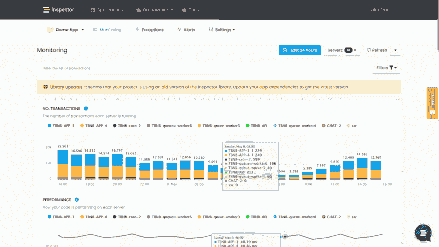
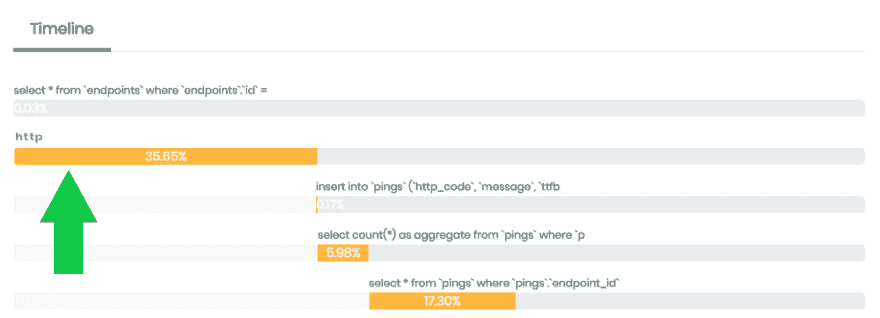
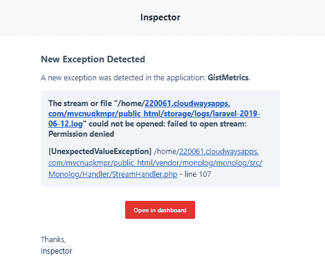
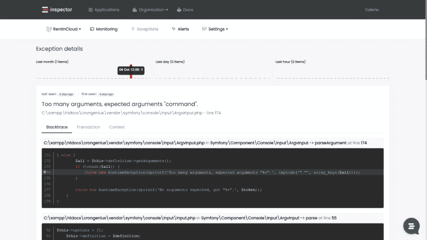

# Laravel 使用 Inspector 进行实时性能监控和警报

> 原文：<https://dev.to/inspector/laravel-real-time-monitoring-using-inspector-part-1-get-started-2bb3>

大家好，我是 Valerio 软件工程师，Inspector 的创始人兼首席技术官。

作为一个产品所有者，我知道解决一个软件问题有多难。尤其是当它对用户体验产生负面影响时。或者更糟的是，在入职期间阻止新的潜在客户。

在开发周期中，几乎每周都会发布新的代码变更，如果不是每天的话。不幸的是，不可能预测到每次发布后可能发生的所有问题。此外，用户不会花时间报告错误。如果你的产品没有达到预期效果，他们就会停止使用。然后他们寻找另一个更适合他们需要的。

而且，应用程序增长得越多(代码行越多，新的开发人员在工作)，避免事故就越困难。

当我开始分享我在 Inspector 后面的想法时，我意识到许多开发人员都知道这个问题。他们花太多时间研究应用程序内部的奇怪行为。最流行的监控平台非常复杂，可能超出了预算。

检查员填补了这一空白。

在用户发现问题之前，第一个知道你的应用程序是否有问题，可以极大地减少对用户产品体验的负面影响。这些是与您的客户建立成功业务关系的适当基础。

## laval El 代码执行监控:工作原理

Inspector 是一个 composer 包，用于向您的 Laravel 应用程序添加实时代码执行监控。它允许您在实时捕捉 bug 和瓶颈的同时处理连续的代码变更。在用户之前。

不到一分钟就能上手。让我们看看它是如何工作的。

## 安装 composer 包

在您的终端中运行 composer 命令:

```
composer require inspector-apm/inspector-laravel 
```

Enter fullscreen mode Exit fullscreen mode

## 配置摄取键

通过注册检查员([https://app.inspector.dev/register](https://app.inspector.dev/register))并创建一个新项目来获得一个新的摄取密钥，只需要几秒钟。

您将直接在应用程序屏幕中看到安装说明:

[](https://res.cloudinary.com/practicaldev/image/fetch/s--vej0pZXh--/c_limit%2Cf_auto%2Cfl_progressive%2Cq_auto%2Cw_880/https://miro.medium.com/max/1696/1%2AU7b5eckR5d3QnnS8DvY_iA.png)

在您的环境文件中设置摄取密钥:

```
INSPECTOR_INGESTION_KEY=9a304b04b8XXXXXXXXXXXX 
```

Enter fullscreen mode Exit fullscreen mode

## 测试一切正常

执行我们的`test`命令，检查您的应用程序是否正确地向检查员发送数据:

```
php artisan inspector:test 
```

Enter fullscreen mode Exit fullscreen mode

前往([https://app . inspector . dev/home)【https://app . inspector . dev/home】](https://app.inspector.dev/home)%5Bhttps://app.inspector.dev/home%5D)浏览您的演示数据。

* * *

默认情况下，检查器监控:

*   数据库交互
*   排队作业执行
*   Artisan 命令
*   发送的电子邮件
*   通知
*   未处理的异常

但是，我们打开了在后台执行的 50%的应用程序中的灯。下一步是监控用户交互产生的所有执行周期。

## 监控传入的 HTTP 请求

要激活 HTTP 请求监控，您可以使用 WebRequestMonitoring 中间件作为独立的组件。然后，您可以自由决定需要监控哪些路线。基于您的路由配置或监控首选项。

在`App\Http\Kernel`类中附加中间件:

```
/**
 * The application's route middleware groups.
 *
 * @var array
 */
protected $middlewareGroups = [
    'web' => [
       ...,
       \Inspector\Laravel\Middleware\WebRequestMonitoring::class,
    ],

    'api' => [
       ...,
       \Inspector\Laravel\Middleware\WebRequestMonitoring::class,
    ]
] 
```

Enter fullscreen mode Exit fullscreen mode

## 部署您的代码并导航执行流程

下一步是将代码部署到生产环境中。接下来，看看 Inspector 如何创建代码内部发生的事情的可视化表示。

您将在仪表板中看到交易流。对于每个事务，您可以实时监控应用程序执行的内容:

[](https://res.cloudinary.com/practicaldev/image/fetch/s--HpxL3nAp--/c_limit%2Cf_auto%2Cfl_progressive%2Cq_auto%2Cw_880/https://dev-to-uploads.s3.amazonaws.com/uploads/articles/w9zmyijejadbv6y8l14o.png)

对于每个事务，您可以实时监控您的应用程序正在执行什么:

[](https://res.cloudinary.com/practicaldev/image/fetch/s--hA6UKbeY--/c_limit%2Cf_auto%2Cfl_progressive%2Cq_auto%2Cw_880/https://cdn-images-1.medium.com/max/1500/1%2Ay6bS65wnxXRBwVlkBIzhBg.png)

## 丰富交易时间线

默认情况下,“检查器”会监视数据库查询、后台作业和 artisan 命令。不过，您的代码中可能有许多关键语句需要监控性能和错误:

*   对外部服务的 Http 调用
*   处理文件(pdf、excel、图像)的功能

得益于 Inspector，除了默认检测到的片段，您还可以在时间线中添加自定片段。这允许您测量隐藏代码块对事务性能的影响。

让我给你看一个真实的例子。

假设您有一个队列作业，它在后台执行一些数据库查询和一个对外部服务的 HTTP 请求。

默认情况下，检查器会检测作业和数据库查询。然而，**监视和测量对外部服务**的 HTTP 请求的执行是很有趣的。然后，如果出现问题，激活警报。

使用`inspector()`助手功能:

```
class TagUserAsActive extends Job
{
    /** @param User $user */
    protected $user;

    // Monitoring an external HTTP requests
    public function handle()
    {
        inspector()->addSegment(function () {

            $this->guzzle->post('/mail-marketing/add_tag', [
                'email' => $this->user->email,
                'tag' => 'active',
            ]);

        }, 'http');
    }
} 
```

Enter fullscreen mode Exit fullscreen mode

您将能够在交易时间表中确定新部分的影响:

[](https://res.cloudinary.com/practicaldev/image/fetch/s--kzCnHxqm--/c_limit%2Cf_auto%2Cfl_progressive%2Cq_auto%2Cw_880/https://cdn-images-1.medium.com/max/1000/1%2AZtc9wOBGcZKFSs4BXa904A.png)

## Laravel 错误&异常警报

默认情况下，Laravel 应用程序中触发的每个异常都会被报告。这可确保您实时收到不可预测错误的警报。

我希望我对代码所做的每一个改变都是完美的。但现实情况并非总是如此。有些错误会在更新后立即出现，而有些则会意外弹出。对于开发者来说，这是一个不幸的现实。它通常还取决于我们的应用程序和其他服务之间的连接所导致的问题。

然而，检查员使工作变得更容易。它自动检测未知问题，因此您不再需要手动检查您的应用程序的状态。您不再需要等待用户的报告。如果出现问题，您会收到实时通知。在每次发布之后，您可以随时了解最新代码重构的影响。

如果您的代码引发了一个异常，但您不想阻止执行，请手动将错误报告给 Inspector 进行个人监控。

```
 try {

   // Your dangerous code here...

} catch (GuzzleException $exception) {
   inspector()->reportException($exception)
} 
```

Enter fullscreen mode Exit fullscreen mode

此外，如果 HTTP 请求失败，您会通过您的收件箱收到实时警告，以检查错误。

[](https://res.cloudinary.com/practicaldev/image/fetch/s--N0aQX16v--/c_limit%2Cf_auto%2Cfl_progressive%2Cq_auto%2Cw_880/https://www.inspector.dev/wp-content/uploads/2019/06/notification-1.png)

您甚至可以访问检查员实时收集的详细信息:

[](https://res.cloudinary.com/practicaldev/image/fetch/s--1sejwQ71--/c_limit%2Cf_auto%2Cfl_progressive%2Cq_auto%2Cw_880/https://dev-to-uploads.s3.amazonaws.com/uploads/articles/qssicpnbbqbrzsohdxiv.png)

## 结论

当客户报告某样东西不工作时，它会迫使你放下手头的工作。然后开始尝试重现该场景，并重新捕获和分析工具集中的日志。

获得正在发生的事情的准确图片可能需要几个小时甚至几天。检查员可以在效率、生产力和客户满意度方面发挥巨大作用。

## 想用多久就用多久，免费试用 Inspector！

使用自动化监控工具增强您的开发团队。[免费试用检查员](https://inspector.dev)。

Inspector 是一个代码执行监控工具，可以帮助你自动识别应用程序中的错误和瓶颈。在你的顾客之前。

它完全是代码驱动的。您不必在服务器级别安装任何东西，也不必在您的云基础架构中进行复杂的配置。

[创建账户](https://app.inspector.dev/register?_ga=2.219921689.1413071013.1653902045-607693269.1613659492)，或访问我们的网站了解更多信息:【https://inspector.dev/laravel T2】