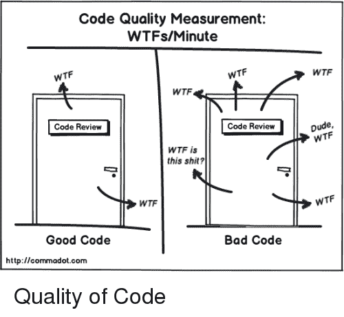
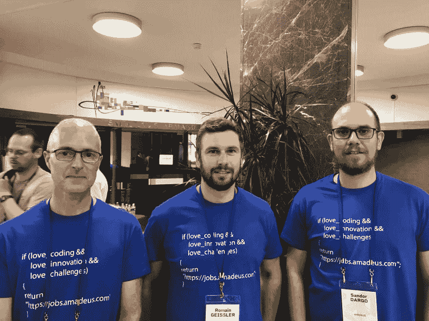

# 旅游报道:CPPP 2019

> 原文：<https://dev.to/sandordargo/travel-report-cppp-2019-2327>

在我结束了为期三周半、目的地遍及 5 个国家的公路旅行，然后参加了一个高级演讲技巧研讨会之后，我终于要去机场赶飞机去巴黎参加第一次 [CPPP](https://cppp.fr/) 会议。

第一天晚上，我有机会见到了我的一个大学朋友。每次我在巴黎有事要做的时候，我们都会设法见面，品尝一些精酿啤酒，同时讨论自上次以来发生在我们身上的事情。谢谢 [CPPP](https://cppp.fr/) 和[我的雇主阿玛迪斯](https://jobs.amadeus.com/)，你们让这一切再次发生！

第二天早上吃过早餐后，我无事可做，只好去了会议的[会场。它位于埃菲尔铁塔旁边的一个会议中心。当我们在休息时间出去呼吸新鲜空气时，这就是我们所看到的。](http://uicp.fr/?lang=fr#section7)

不用说，很容易就能认出非本地的服务员。

大约 200 名与会者在会议上有三条跑道。一个是专门为初学者准备的纯法语课程，另外两个是为更高级的主题准备的英语课程。

## 情感密码由[凯特·格雷戈里](https://twitter.com/gregcons)

这次演讲用了两个小时，我认为会非常长。凯特在 90 分钟后结束了演讲，并留下了大量的提问时间，我对此表示高度赞赏。

在她的演讲中，Kate 声称我们——软件开发人员，甚至是 C++开发人员！-人类内心是不是有-等等-情感！几十年来，她一直在审查代码，当然，她经常会抬起头来问为什么，以及其他问题...

过了一段时间，她意识到这个*为什么*值得回答，因为这个回答可以揭示关于作者、团队、环境的许多事情。通常，代码隐藏了编码者的负面情绪，如恐惧、傲慢、自私或懒惰。

我想详细说明最后一点。

有时你可能会觉得一段代码的作者很懒，只是提交了任何有用的东西。但是就产生的代码而言，真的很容易将懒惰与*嘎吱嘎吱*混为一谈。

当一个团队处于持续的危机中时，问题通常是*一个人至少能做什么*，仅仅是因为可怜的开发人员真的没有额外的 10 分钟来解决问题，因为他想在孩子们睡觉前回家看看他们，整个循环又开始了。

有时候，有些人根本不在乎，他们不交付好的代码，只是偷偷摸摸...但这也揭示了对公司的一些其他负面情绪，这些负面情绪可能会导致[离开团队](http://sandordargo.com/blog/2018/09/26/how-not-to-quit)。

理解潜在情绪的目标是培养同理心，并试图消除任何障碍。很多时候，障碍不是人，而是——对——糟糕的管理，令人不快的代码审查者，等等的不良反应。

如果我们承认情绪包含在我们的代码中，并且我们能够识别它们，下一步就是将它们转化为积极的情绪，比如自信、谦逊、慷慨。

我不想说得更详细，也许凯特的演讲应该有一整篇长文章，但是你也可以[看更早的](https://www.youtube.com/watch?v=uloVXmSHiSo)。

## 通过[马修·罗珀](https://twitter.com/MatRopert)的 STL 算法提高你的 C++

我参加的下一个演讲是关于在 C++ STL 中可以找到的[算法](https://en.cppreference.com/w/cpp/algorithm)。在一个小时内，很难对标准库中包含的所有算法有一个概述，这不是他的目标。

Mathieu 介绍了一些算法的历史，并解释了为什么我们没有将所有/大部分算法作为容器接口的一部分。长话短说，这将需要大量的代码复制，而将算法保存在其他地方使得使用一些通用实现成为可能。

在实际讨论一些算法之前，Mathieu 提醒了我们迭代器最重要的概念。

在剩下的时间里，他决定向我们展示一些不可或缺的东西和一些更有趣的算法。

我会把`find`等、`copy`、`transform`函数放在前一组，而在后一组他放[肖恩父](http://channel9.msdn.com/Events/GoingNative/2013/Cpp-Seasoning)，我指的是`rotate`算法和一些分区算法。更重要的是要记住如何使用和组合`erase`和`remove`的算法。(简单来说，remove 不会擦除，所以必须将`remove`包装到`erase`。

总的来说，即使我知道许多算法，我也没有空手而归，而是更多的一些我想更好地发现的主题。

## 休息一下

两个小时的午休时间对我来说有点长，但至少它不仅仅让我们吃一些美味的食物来填饱肚子，而且我们还可以讨论很多东西，甚至在埃菲尔铁塔附近漫步。自从我上次去过之后，这里发生了很大的变化。你不能在它下面自由行走，但是有很大但相当透明的栅栏，你必须在安检后排很长的队。很遗憾在越来越多的地方看到这种情况。

## [杰瑞米·德米勒](https://twitter.com/jeremydemeule)通过练习(现场编码)增加了一个新的整洁检查

午饭后，我开始做我最期待的报告。关于如何在 [clang-tidy](https://clang.llvm.org/extra/clang-tidy/) 中实现自定义检查的现场编码会议。对于那些不知道 clang-tidy 的人来说，它是 C++的一个术语。您可以使用它来诊断典型的编程错误、违反风格的情况、可以通过静态分析推断出的错误，更好的是，它甚至可以修复这些问题。

杰里米承担了一项非常艰巨的任务。演示并不容易，而现场编码会议更难，他选择了这种形式作为午餐后的时间段。非常勇敢。我认为他在交付没有阻塞和失败的代码方面做得非常出色。尽管他牺牲了一点自己的活力和与观众的接触而取得了成功。

我认为在这个现场编码会议之后添加新的检查是很容易的，但是我发现这个想法真的很有用，并且这个会议令人大开眼界。谢谢你，杰里米，我会找时间深入探讨这个话题。我觉得这个工具和思路可以用于 C++中的[突变测试](http://sandordargo.com/blog/2018/01/11/mutation-testing)。

## [帕特丽夏·奥斯](https://twitter.com/pati_gallardo)剖析漏洞

在接下来的三次会议中，作为部门中负责应用安全的人，*对漏洞利用的剖析*对我来说是必须的。我不认识[帕特丽夏·阿斯](https://twitter.com/pati_gallardo)，但我很快了解到她在业内享有很好的声誉——嗯，她是[以 CppCon](https://www.youtube.com/watch?v=0S0QgQd75Sw) 的身份演讲的人——她不仅是她所在领域的专家，而且她拥有做好演讲的所有技能。

充满活力的演讲，极简的幻灯片，关于奇怪的机器如何工作以及你如何利用它的好例子。奇怪的机器是什么？这是*,一种计算假象，额外的代码执行可能发生在原始规范之外。*最重要的一点是，如果你想黑一个应用程序，你必须考虑到你拥有的数据是程序本身，你能执行的程序是你喂给程序的数据。如果你对利用漏洞感兴趣，你必须认同心态上的巨大差异。

我常常觉得，即使我试图跟随她，我也感到迷失了。在演讲结束时，我意识到我一定不是一个人。事实上，我们观众辜负了帕特丽夏。在我看来，如果在演讲结束时没有任何问题，这很少意味着它太清楚了——不是这里的情况，因为这是一个困难的话题——有时这意味着它太无聊了，人们很久以前就不再听了——肯定不是这里的情况——或者这也意味着人们完全迷失了，因为这个话题对他们来说太复杂了。这个演示可能更适合最先进的*向前推*轨道。

无论如何，我喜欢帕特丽夏的演讲，并做了一些笔记，我想跟进。

## 识别幺半群:利用代码中的组成结构[本·迪恩](https://twitter.com/ben_deane)

对于上一次演讲，我在快速测试来自中间*生产*轨道的遗留代码*和在高级*推进*轨道的本之间犹豫了很久。*

我决定去后者，主要是因为我也想参加那个赛道的一个讲座。

本证明了他有资格在大礼堂演讲，我发现他是一个相当好的演讲者。他的主题很有趣，他没有忘记在一开始就说明幺半群和幺半群不是一回事。那么什么是幺半群呢？幺半群是由三部分组成的代数结构。1)一组值 2)一个关联二元运算和 3)一个单位元素。我不想赘述，我会为这个话题写一篇自己的帖子。

他带来了很多这种结构的例子。他说，如果人脑看到大量的事件，它就能最好地学习模式。嗯，我们做到了。

不幸的是，直到最后，他的观点对我来说还是有点模糊。我认为作为一个演讲者，你的义务之一就是尽可能多地重复你的主要信息。我认为主要的一点是，如果你能识别幺半群，你也能封装它们，并把它们当作你的代码单元，通常使用 STL 算法，这使得编程更容易，甚至运行时执行更快。尤其是如果你能把一个幺半群转化成另一个幺半群。在我写一些完全愚蠢的东西之前，我肯定要深入挖掘。

## 结论

我发现所有的演讲都很有趣，并且在一定程度上适用于我的工作。情感代码、算法和铿锵整齐绝对是我的拿手好戏。

我非常喜欢这个场地。我的意思是，你走出去，你会看到埃菲尔铁塔和巴黎仍然很棒，无论你在哪里都能看到奥斯曼的影响。

在餐饮方面，我特别喜欢我们可以享受的注入水和冰沙。唯一奇怪的是，在最后两次休息时，不再提供饮料。连水都没有。不过还好，主办方也需要一些未来几年的提升空间！:)

过去，我发现与陌生人交谈很困难，但我在这方面做了很多工作，在我最近的两次会议上，我与新人们的交谈比以前好得多。这对我来说是一次很好的经历，对那些和我交谈过的人来说不应该很尴尬。

总的来说，这次会议很棒，甚至令人敬畏，如果你考虑到这是仅用了几个月准备的第一次会议。太棒了。感谢组织、[弗雷德·廷高](https://twitter.com/FredTingaudDev)和[乔尔·法尔库](https://twitter.com/joel_f)！

有一件事我必须特别提到。节目准时，几乎所有的主持人都准时。这真是非同寻常。我真的很感激。毕竟，我已经离开了一个团队，部分原因是所有的会议都严重迟到，而我未能改变它。

明年，由于组织者将有更多的时间，他们将公开征集论文，我希望我会提交一些他们会觉得有吸引力的东西。

*这篇文章最初发表在我的[博客](http://sandordargo.com/blog//2019/06/26/travel-report-cppp)上。如果你有兴趣接收我的最新文章，请[注册我的简讯](http://eepurl.com/gvcv1j)和[在 Twitter 上关注我](https://twitter.com/SandorDargo)。*