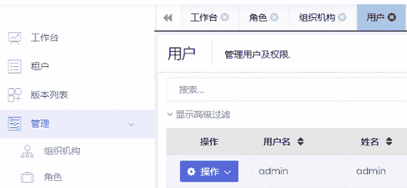
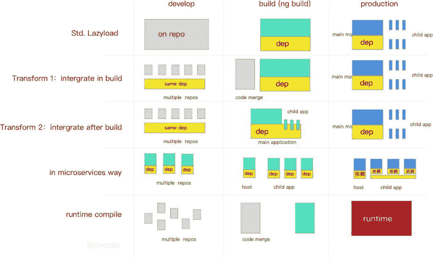
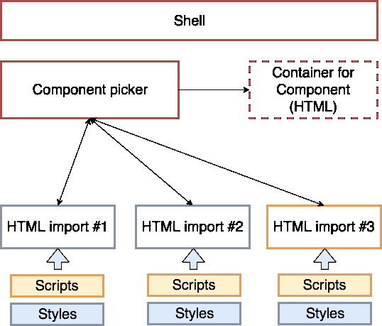
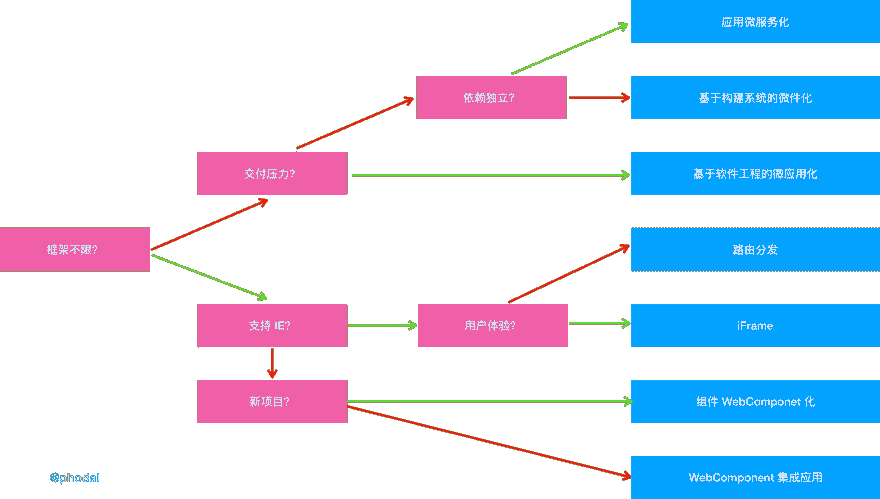
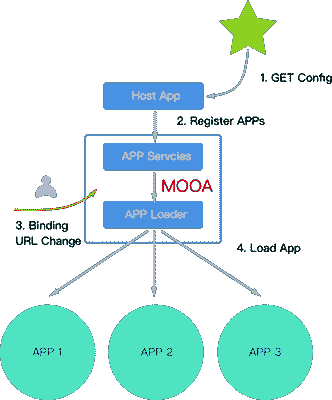
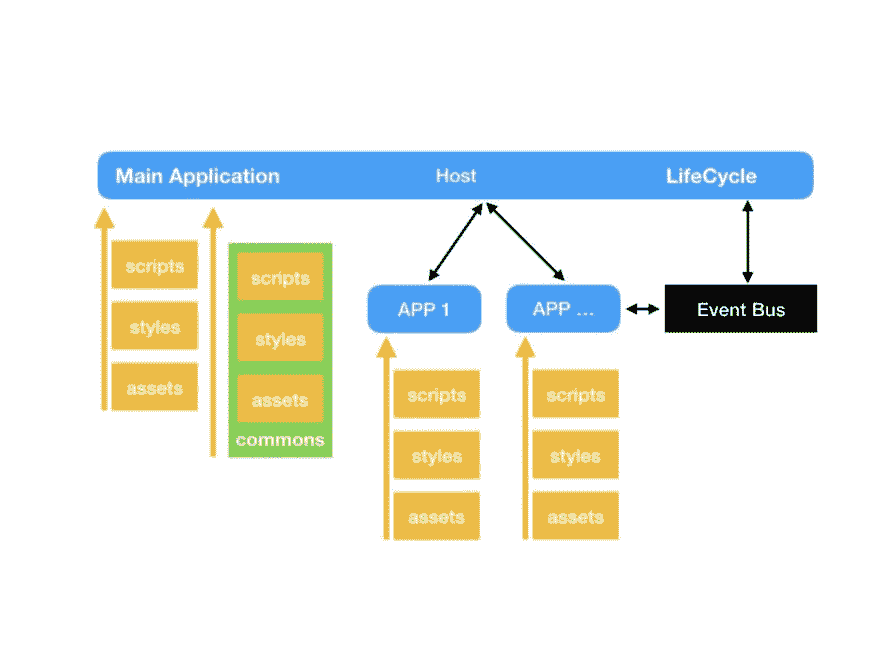
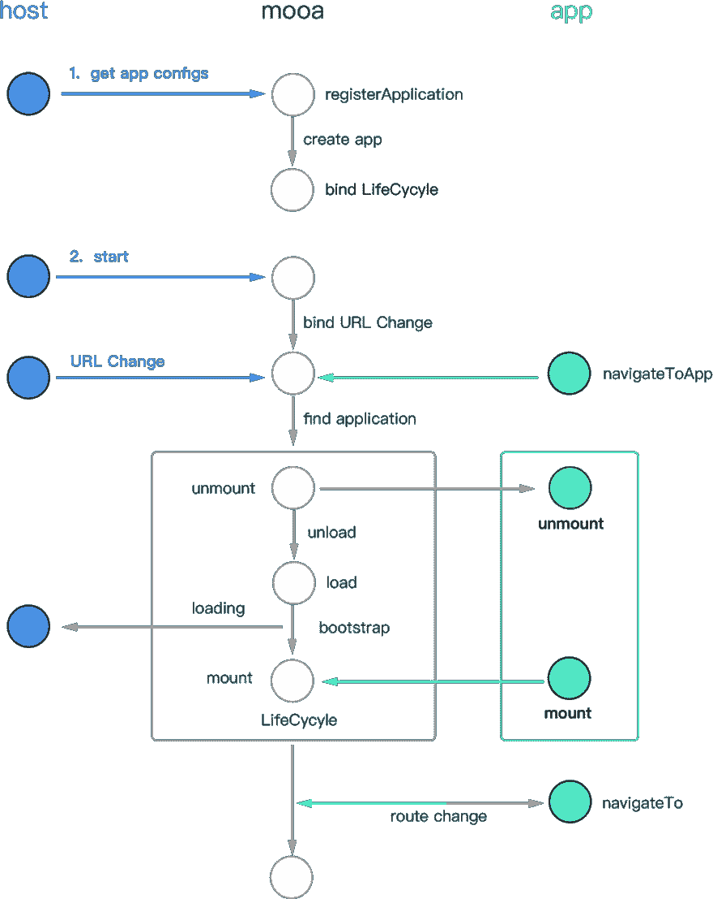

# 微前端架构以六种方式运行。

> 原文：<https://dev.to/phodal/micro-frontend-architecture-in-action-4n60>

> 微前端是一种类似微服务的架构，将微服务的概念应用到浏览器端。从单一的、单一的应用程序转变为结合多个小型前端应用程序的应用程序。每个前端应用也可以**独立运行**、**独立开发**、**独立部署**。

同时，它们也可以与共享组件的**并行开发——这些组件可以通过 NPM 或 Git 标签、Git 子模块等进行管理。**

**注**:这里的前端应用是指前后分离的单页应用。在此基础上谈微前端是有意义的。

目录:

*   [微前端思维](#thinking-in-microfrontend)
*   [为什么微前端会流行 web 应用的聚合](#why-micro-frontends-be-popular-%E2%80%93-aggregation-of-web-applications)
    *   [迁移前端遗留系统](#migration-frontend-legacy-system-)
    *   [后端解耦，前端聚合](#backend-decoupling-frontend-aggregation)
    *   [与传统系统兼容](#compatible-with-legacy-systems)
*   [实现微前端架构的六种方式](#six-ways-to-implement-a-micro-frontends-architecture)
    *   [基础:应用分发路由- >路由分发应用](#basic-application-distribution-routing---route-distribution-application)
        *   [后端:函数调用- >远程调用](#backend-function-call---remote-call)
        *   [前端:组件调用- >应用调用](#front-end-component-call---application-call)
    *   [路由调度微前端](#route-dispatch-micro-frontends)
    *   [用 iFrame 创建一个容器](#create-a-container-with-iframe)
    *   [自制微前端框架](#homemade-micro-frontends-framework-)
    *   [组合集成:Widging 应用](#combined-integration-widging-applications)
    *   [纯 Web 组件技术构建](#pure-web-components-technology-build)
    *   [使用 Web 组件构建](#build-with-web-components)
        *   [在 Web 组件中集成现有框架](#integrating-existing-frameworks-in-web-components)
        *   [集成到现有框架中的 Web 组件](#web-components-integrated-into-existing-frameworks)
    *   [复合型微前端](#compound-type-micro-frontends)
    *   [微前端快速选择指南](#microfrontend-quick-selection-guide)
    *   [微前端解决方案对比:简要对比](#comparison-of-micro-front-end-solutions-a-brief-comparison)
    *   [微前端方案对比:方式复杂](#comparison-of-micro-front-end-solutions-complex-ways)
*   [如何解构 mono 前端应用——前端应用的微服务拆分](#how-to-deconstruct-mono-front-end-application---microservice-splitting-of-front-end-applications)
    *   [前端微服务](#front-end-microservice)
        *   [自主开发](#independent-development)
        *   [独立部署](#independent-deployment)
        *   我们真的需要独立的技术吗？
        *   [不影响用户体验](#does-not-affect-the-user-experience)
    *   [微前端设计概念](#micro-frontends-design-concept)
        *   [设计理念 1:集中布线](#design-concept-1-centralized-routing)
        *   [设计概念 2:识别应用](#design-concept-2-identification-application)
        *   [设计理念 3:生命周期](#design-concept-3-life-cycle)
        *   [设计理念 4:独立部署和配置自动化](#design-concept-4-independent-deployment-and-configuration-automation)
    *   [实用微前端架构设计](#practical-micro-frontends-architecture-design)
        *   [独立部署和配置自动化](#independent-deployment-and-configuration-automation)
        *   [应用程序间路由事件](#inter-application-routing---events)
*   [四分裂大角度应用到微前端](#four-to-split-large-angular-application-to-micro-frontends)
    *   [1、前端微服务:路由惰性加载及其变种](#1-front-end-micro-services-routing-lazy-loading-and-its-variants)
    *   [2、微服务解决方案:子应用模式](#2-microservice-solution-sub-application-mode)
    *   [解决方案比较](#solution-comparison)
        *   [Standard LazyLoad](#standard-lazyload)
        *   [LazyLoad 变体 1:构建时集成](#lazyload-variant-1-build-time-integration)
        *   [LazyLoad 变体 2:构建后集成](#lazyload-variant-2-post-build-integration)
        *   [前端微服务](#front-end-micro-service)
    *   [总对比度](#total-contrast)

# 微前端为何流行 web 应用的聚合

> 采用新技术，更多的不是因为先进，而是因为能解决痛点。

过去我一直有一个疑问，人们是不是真的需要微服务，是不是真的需要微前端。毕竟，没有什么灵丹妙药。当人们考虑是否采用一种新的架构时，除了考虑其好处之外，还会考虑大量的风险和技术挑战。

## 迁移前端遗留系统

在过去的几年里，我收到了一些关于如何实现微前端架构的咨询。在此期间，我发现了一个很有意思的事情:**解决遗留系统是人们使用微前端解决方案**的最重要原因。

在这些咨询中，开发商遇到的情况和我之前遇到的情况差不多。我的场景是:设计一个新的前端架构。由于遗留系统，他们开始考虑使用微服务的前端。

过去用 Backbone.js、Angular.js、Vue.js 1 等框架编写的单页应用，一直在网上稳定运行，没有新的特性。对于这样的应用程序，没有理由浪费时间和精力来重写旧的应用程序。这里使用旧的、不再使用的技术堆栈的应用程序可以称为遗留系统。但是，这些应用程序需要组合成新的应用程序。我遇到的比较多的是老 app 是用 Angular.js 写的，新 app 是用 Angular 2+开始的。对于业务稳定的 IT 团队来说，这是一个非常常见的技术堆栈。

在不改写原有系统的前提下，可以抽取人力开发新业务。它不仅是一个非常吸引商务人士的功能；技术人员不重写老业务，做一些技术上的挑战，也是相当具有挑战性的。

## 后端解耦，前端聚合

前端微服务的一个卖点也在这里，要兼容不同类型的前端框架。这让我想起了微服务的好处，以及很多项目陷入微服务的原因:

在早期，后端微服务的一大卖点是可以使用不同的技术栈来开发后台应用程序。然而，事实上，采用微服务架构的组织和机构一般都是中大型的。相比中小型，框架和语言的选择更加严格，比如内部限制框架，语言限制。因此，充分利用不同的技术堆栈来利用微服务的情况几乎是罕见的。在这些大型组织中，采用微服务的主要原因是**使用微服务架构来解耦服务间的依赖性**。

在前端微服务中，恰恰相反。人们更想要的结果是**聚合**，尤其是那些 To B(To business)的应用。

在过去的两三年里，移动应用已经呈现出一种趋势，用户不希望安装那么多的应用。通常大型商业公司会提供一系列的应用程序。这些应用程序在某种程度上也反映了公司的组织结构。但是，在用户眼里他们是一个公司，他们应该只有一个产品。同样，这种趋势也出现在桌面网络上。**聚合**已经成为一种技术趋势，前端的聚合就是微服务架构。

## 兼容遗留系统

那么这个时候就需要用新的技术和新的架构来容纳和兼容这些旧的应用。前端的微服务正好契合了人们想要的卖点。

# 实现微前端架构的六种方式

结合我在[微前端](https://github.com/phodal/microfrontends)这半年的实践和研究，微前端架构一般可以通过以下方式实现:

1.  使用 HTTP 服务器路由重定向多个应用程序
2.  在不同的框架上设计通信和加载机制，如 [Mooa](https://github.com/phodal/mooa) 和 [Single-SPA](https://github.com/CanopyTax/single-spa)
3.  通过组合多个独立的应用程序和组件来构建单个应用程序
4.  iFrame。使用 iFrame 和自定义消息传递机制
5.  用纯 Web 组件构建应用程序
6.  使用 Web 组件构建
7.  构建时的独立应用程序 _ 待定)
8.  本地构建时的单独应用程序 _ 待定)

## 基础:应用分发路由- >路由分发应用

在 monoli 前端、mono 后端应用程序中，有一个典型的特征是路由由**框架**分发，它将路由分配给相应的组件或内部服务。微服务在过程中做的就是将**函数调用**调用成**远程调用**，比如远程 HTTP 调用。微前端类似，就是把应用中的组件调用**改成更细粒度的**应用间组件调用**，也就是我们只是把路由分配给应用组件执行。现在你需要根据路由找到对应的应用，然后由应用分发给对应的组件。

### 后端:函数调用- >远程调用

在大多数 CRUD 类型的 web 应用中，有一些非常相似的模式，即:Home -> List -> Details:

*   用于向用户显示特定数据或页面的主页。这些数据通常是有限的，并且是多种模型的。
*   列表，数据模型的聚合，典型的是某类数据的集合，可以看到尽可能多的**数据汇总**(比如 Google 只返回 100 页)，典型的是看到 Google，淘宝/ Ebay，亚马逊搜索结果页面。
*   详细信息，显示单个数据的尽可能多的内容。

这里有一个返回主页的 Spring 框架的例子:

```
@RequestMapping(value="/")
Public ModelAndView homePage(){
   Return new ModelAndView("/WEB-INF/jsp/index.jsp");
} 
```

Enter fullscreen mode Exit fullscreen mode

对于一个详细页面，它可能是这样的:

```
@RequestMapping(value="/detail/{detailId}")
Public ModelAndView detail(HttpServletRequest request, ModelMap model){
   ....
   Return new ModelAndView("/WEB-INF/jsp/detail.jsp", "detail", detail);
} 
```

Enter fullscreen mode Exit fullscreen mode

所以，在微服务的情况下，会是这样的:

```
@RequestMapping("/name")
Public String name(){
    String name = restTemplate.getForObject("http://account/name", String.class);
    Return Name" + name;
} 
```

Enter fullscreen mode Exit fullscreen mode

在这个过程中，后端有一个服务发现服务来管理不同微服务之间的关系。

### 前端:组件调用- >应用调用

从形式上来说，单前端框架和单后端应用的路由差别不大:**根据不同的路由返回不同页面的模板**。一个棱角分明的例子:

```
const appRoutes: Routes = [
  { path: 'index', component: IndexComponent },
  { path: 'detail/:id', component: DetailComponent },
]; 
```

Enter fullscreen mode Exit fullscreen mode

而当我们微服务它的时候，它就可能成为应用 A:
的路线

```
const appRoutes: Routes = [
  { path: 'index', component: IndexComponent },
]; 
```

Enter fullscreen mode Exit fullscreen mode

加上申请 B 的路线:

```
const appRoutes: Routes = [
  { path: 'detail/:id', component: DetailComponent },
]; 
```

Enter fullscreen mode Exit fullscreen mode

问题的关键是:**如何将路由分派给这些不同的应用**。同时还负责管理不同的前端应用。

## 路由调度微前端

**路由分布式微前端**，通过路由将不同的服务**分发给不同的、独立的前端应用。它通常可以通过 HTTP 服务器的反向代理来实现，或者通过应用程序框架附带的路由来实现。

目前，通过路由分发的微前端架构应该是最受欢迎和易于使用的“微前端”解决方案。但这种方式看起来更像是多个前端应用的聚合，也就是我们只是把这些不同的前端应用放在一起，让它们看起来像一个完整的整体。但他们不是，每次用户从 A 申请到 B，往往需要刷新页面。

在几年前的一个项目中，我们致力于一个**遗留系统重写**。我们有一个迁移计划:

1.  首先，使用**静态网站生成**动态生成主页
2.  其次，使用 React 堆栈重构详细信息页面
3.  最后，替换搜索结果页面

整个系统不是一次性迁移，而是循序渐进。所以当我们需要完成不同的步骤时，我们需要上线，所以我们需要使用 Nginx 进行路由分发。

以下是基于路由分布的 Nginx 配置示例:

```
http {
  server {
    listen       80;
    server_name  www.phodal.com;
    location /api/ {
      proxy_pass http://http://172.31.25.15:8000/api;
    }
    location /web/admin {
      proxy_pass http://172.31.25.29/web/admin;
    }
    location /web/notifications {
      proxy_pass http://172.31.25.27/web/notifications;
    }
    location / {
      proxy_pass /;
    }
  }
}}
} 
```

Enter fullscreen mode Exit fullscreen mode

在这个例子中，对不同页面的请求被分发到不同的服务器。

后来，我们在其他项目上使用了类似的方法，主要原因是:**跨团队协作**。当团队达到一定规模，我们就不得不面对这个问题。另外，还有安格鲁亚尔断崖式升级的问题。所以，这种情况下，用户前台使用 Angular 重写，后台继续使用 Angular.js 等保持技术栈。在不同的场景下，有一些类似的技术决策。

因此，在这种情况下，它适用于以下场景:

*   不同技术栈之间差异比较大，很难兼容、移植、修改。
*   该项目不想在该系统的改造上花费大量时间
*   现有系统将在未来被取代
*   系统功能完善，没有新的需求

在满足上述场景的情况下，如果是为了更好的用户体验，也可以使用 iframe 来解决。

## 用 iFrame 创建容器

iFrame 是一个很老的技术，大家都觉得很普通，但是一直都很管用。

> **HTML 内联框架元素** `<iframe>`表示正在浏览的嵌套上下文，其有效地将另一个 HTML 页面嵌入到当前页面中。

Iframes 可以创建一个全新的、独立的托管环境，这意味着我们的前端应用程序可以彼此独立运行。使用 iframe 有几个重要的先决条件:

*   网站不需要搜索引擎优化支持
*   拥有合适的**应用管理机制**。

如果是做应用平台，我们会在自己的系统中集成一个第三方的系统，或者是多个不同部门团队下的系统。显然这是一个很好的解决方案。一些典型的场景，如传统的桌面应用程序，被迁移到 web 应用程序:

[](https://res.cloudinary.com/practicaldev/image/fetch/s--__ylg4i6--/c_limit%2Cf_auto%2Cfl_progressive%2Cq_auto%2Cw_880/https://microfrontends.cn/imgs/angular-tabs-example.png)

如果这种类型的应用太复杂，那么它必须是微服务的拆分。因此，在使用 iframe 时，我们需要做两件事:

*   设计**管理应用机制**
*   设计**应用通信机制**

**装载机构**。在什么情况下，我们会加载和卸载这些应用程序；在这个过程中，使用什么样的动画过渡来使用户看起来更自然。

**沟通机制**。直接在每个 app 里创建一个`postMessage`事件，然后监听，并不是一件友好的事情。它本质上是对应用程序的干扰，所以通过`iframeEl.contentWindow`获取 iFrame 元素的窗口对象是一种简单得多的方法。然后，你需要**定义一套通信规范**:事件名使用什么格式，什么时候开始监听事件，等等。

有兴趣的读者可以看看我之前写的微前端框架: [Mooa](https://github.com/phodal/mooa) 。

无论哪种方式，iframe 都怕我们今年不能给我们的 KPI 带来效益，所以我们来造一个轮子。:)

## 自制微前端框架

无论是基于 Web 组件的 Angular 还是 VirtualDOM 的 React，现有的前端框架都离不开基本的 HTML 元素 DOM。

嗯，我们只需要:

1.  在页面上适当的地方引入或创建一个 DOM
2.  当用户操作时，加载相应的应用程序(触发应用程序的启动)并卸载应用程序。

第一个问题，创建 DOM 是一个容易解决的问题。第二个问题一点也不容易，尤其是要去掉对 DOM 和相应应用的监控。当我们有不同的技术堆栈时，我们需要设计一套这样的逻辑。

虽然 [Single-SPA](https://github.com/CanopyTax/single-spa) 已经有了大部分框架的启动和卸载处理(比如 React、Angular、Vue 等。)，还是不适合生产。当我为基于 Single-SPA 的 Angular 框架设计微前端架构应用时，我最终选择重写自己的框架， [Mooa](https://github.com/phodal/mooa) 。

这种方式虽然入门难度比较高，但是后期订购方便，可维护性强。不考虑每个应用被加载所带来的用户体验问题，唯一可能的风险可能是:**第三方库不兼容**。

然而，不管怎样，与 iFrame 相比，它在技术上更**精明**，也更有趣。同样，与 iframes 类似，我们仍然面临一系列小问题:

*   需要设计一种机制来管理应用程序。
*   对于高流量的 toC 应用，第一次加载时会有很多请求。

我们必须再次拆分应用程序，并希望 blabla...，我们还能做什么？

## 组合集成:Widging 应用

**组合集成**，是应用在预构建、构建时、构建后等步骤中的逐步拆分和重组。借助**软件工程**。

从这个定义来看，它可能不是微前端——它可以满足微前端的三个要素，即:**独立运行**、**独立开发**、**独立部署**。但是，有了前端框架的组件的 Lazyload 功能——也就是在加载所需的业务组件或应用时，看起来就像一个微型的前端应用。

同时，CSS 样式不需要重新加载，因为所有的依赖项和 pollyfill 已经第一次尽可能多地加载了。

常见的方式有:

*   独立构建组件和应用程序，生成块文件，构建并分类生成的块文件。(这种方法更类似于微服务，但成本更高)
*   在开发时独立开发组件或应用，在集成时合并组件和应用，最后生成单体应用。
*   在运行时，加载应用程序的运行时，然后加载相应的应用程序代码和模板。

下图显示了应用程序之间的关系

[](https://res.cloudinary.com/practicaldev/image/fetch/s--Ekf5wVcU--/c_limit%2Cf_auto%2Cfl_progressive%2Cq_auto%2Cw_880/https://microfrontends.cn/imgs/angular-split-code-compare-en.jpg)

这种方法看起来相当理想，即满足多个团队的并行开发，又能构建一个合适的可交付成果。

但是首先，它有一个严重的限制:**必须使用同一个框架**。对于大多数团队来说，这不是问题。使用微服务的团队不会因为微服务的前端而使用不同的语言和技术进行开发。当然，如果你想使用另一个框架，也不是问题，我们只需要结合上一步的**自制框架兼容应用就可以满足我们的需求。

第二，这种做法是有限度的，就是:**规范！** **规范！** **规范！**。在采用这种方法时，我们需要:

*   统一依赖关系。保留这些相关版本并添加新版本。
*   应用程序的组件和路由的规范。避免不同应用程序之间的冲突，因为这些组件名称冲突。
*   构建复合体。在一些场景中，我们需要修改构建系统，在一些场景中，我们需要复杂的模式脚本。
*   共享公共代码。这显然是我们必须经常面对的问题。
*   开发代码规范。

因此，这种方法看起来更像是一个软件工程问题。

现在，我们有四个选项，每个选项都有自己的优缺点。显然，将它们结合起来是更理想的方法。

考虑到现有的和常用的技术的局限性，让我们再从长远的角度来看。

## 纯 Web 组件技术构建

在学习 Web 组件开发一个微前端架构的过程中，我尝试编写了自己的 Web 组件框架: [oan](https://github.com/phodal/oan) 。在添加了一些基本的 web 前端框架特性后，我发现这项技术特别适合作为微前端基石的**。**

> Web 组件是一组不同的技术，它允许您创建可重用的定制元素(它们的功能被打包在您的代码之外)并在您的 web 应用程序中使用它们。

它主要由四个技术部分组成:

*   自定义元素，允许开发人员创建自定义元素，如。
*   影子 DOM，Shadow DOM，通常将影子 DOM 附加到主文档 DOM 上，并控制其相关的功能。这个影子 DOM 不能被其他主文档 DOM 直接控制。
*   HTML 模板，`<template>`和`<slot>`元素，用于编写不在页面上显示的标记模板。
*   用于引入自定义组件的 HTML 导入。

每个组件由`link`标签介绍:

```
<link rel="import" href="components/di-li.html">
<link rel="import" href="components/d-header.html"> 
```

Enter fullscreen mode Exit fullscreen mode

然后，在各自的 HTML 文件中，创建相应的组件元素，并编写相应的组件逻辑。典型的 Web 组件应用程序架构如下所示:

[](https://res.cloudinary.com/practicaldev/image/fetch/s--ZHHVE989--/c_limit%2Cf_auto%2Cfl_progressive%2Cq_auto%2Cw_880/https://microfrontends.cn/imgs/web-components-architecture.png)

你可以看到这类似于我们上面使用 iframes 的方式。组件有自己独立的`scripts`和`styles`，以及各个部署组件的相应域名。然而，它并没有想象中的那么好。很难直接使用 **Web 组件**构建前端应用程序:

*   重写现有的前端应用程序。是的，现在我们需要使用 Web 组件来完成整个系统的功能。
*   上下游生态系统不完善。缺乏对一些第三方控件的支持，这也是 jQuery 相当流行的原因。
*   系统架构很复杂。当一个应用程序被拆分成一个又一个组件时，组件之间的通信就成了一个特别大的问题。

Web 组件中的 ShadowDOM 更像是新一代的前端 DOM 容器。不幸的是，并不是所有的浏览器都能完全支持 Web 组件。

## 用 Web 组件构建

Web 组件离我们太远了，但是结合 Web 组件构建前端应用是未来演进的架构。或者在将来，我们可以开始以这种方式构建我们的应用程序。幸运的是，已经有框架来创造这种可能性。

目前，使用 Web 组件构建微前端应用程序有两种方式:

*   使用 Web 组件构建独立于框架的组件，然后在相应的框架中引入它们
*   在 Web 组件中引入现有框架，类似于 iframe 的形式

前者是基于组件的方法，或者它就像将未来的“遗留系统”迁移到未来的架构。

### 在 Web 组件中集成现有框架

现有的 Web 框架已经有支持 Web 组件的表单，比如 Angular 支持的 createCustomElement，以 Web 组件的形式实现一个组件:

```
platformBrowser()
  .bootstrapModuleFactory(MyPopupModuleNgFactory)
    .then(({injector}) => {
      const MyPopupElement = createCustomElement(MyPopup, {injector});
      customElements.define(‘my-popup’, MyPopupElement);
}); 
```

Enter fullscreen mode Exit fullscreen mode

将来，会有更多的框架可以使用这样的形式集成到 Web 组件应用程序中。

### Web 组件集成到现有框架中

或者类似于[模版](https://github.com/ionic-team/stencil)的形式，将组件直接构建成 Web 组件形式的组件，然后在相应的如 React 或 Angular 中直接引用。

下面是一个在 React 中引用模板生成的 Web 组件的例子:

```
import React from 'react';
import ReactDOM from 'react-dom';
import './index.css';
import App from './App';
import registerServiceWorker from './registerServiceWorker';

import 'test-components/testcomponents';

ReactDOM.render(<App />, document.getElementById('root'));
registerServiceWorker(); 
```

Enter fullscreen mode Exit fullscreen mode

在这种情况下，我们可以构建一个独立于框架的组件。

同样的模版仍然只支持 Chrome、Safari、Firefox、Edge 和 IE11 等近期的浏览器。

## 复合型微前端

**复合型**，就在上面的几类里，随便挑几个组合在一起。

我不是胡说:)

## 微前端快速选型指南

我还是直接给出结论:

[](https://res.cloudinary.com/practicaldev/image/fetch/s--VV8M3tWJ--/c_limit%2Cf_auto%2Cfl_progressive%2Cq_auto%2Cw_880/https://microfrontends.cn/imgs/choice-your-microservices-en.png)

要点相关说明如下:

**画面限制**。在后端微服务系统中，人们使用其他语言的库来开发新的服务，例如用于人工智能的 Python。但在前端，几乎没有这种可能。因此，当我们只有一个前端框架时，我们在使用微前端技术时有更广泛的选择。不幸的是，大多数组织需要与遗留系统兼容。

**IE 问题**。无论是几年前还是今年，我们在微前端实现的第一个考虑就是对 IE 的支持。在我遇到的项目中，基本上都需要支持 IE，所以在技术选择上有一定的限制。而在我们不需要支持 IE 的项目上，他们可以使用 WebComponents 技术来构建微前端应用。

**独立自主**。即各个微前端应用的依赖关系是要统一管理，还是在各个应用中自行管理。统一管理可以解决负载重复依赖的问题，独立管理带来额外的流量开销和延迟。

## 微前端解决方案对比:简要对比

如果你对以上方面还不熟悉，请阅读《前端微服务的六七种实现方式》。

| 方法 | 开发成本 | 维修费用 | 可行性 | 相同的框架要求 | 实施中的困难 |
| --- | --- | --- | --- | --- | --- |
| 路线分布 | 低的 | 低的 | 高的 | 不 | ★ |
| 内联框架 | 低的 | 低的 | 高的 | 不 | ★ |
| 应用微服务 | 高的 | 低的 | 中等 | 不 | ★★★★ |
| 微部件 | 高的 | 中等 | 低的 | 是 | ★★★★★★□ |
| 微型应用 | 中等 | 中等 | 高的 | 是 | ★★★ |
| 纯 Web 组件 | 高的 | 低的 | 高的 | 不 | ★★ |
| Web 组件 | 高的 | 低的 | 高的 | 不 | ★★ |

同样，一些复杂的概念解释如下:

**应用微服务**，即每个前端应用都是一个独立的面向服务的前端应用，并配备统一的应用管理和启动机制，如微前端框架 Single-SPA 或 [mooa](https://github.com/phodal/mooa) 。

**微 Widget** ，即通过对 build 系统的 hack，不同的前端应用可以使用同一套依赖关系。基本改善了 **Apps 微服务**中重复加载依赖文件的问题。

**微应用**，也称**组合集成**，即通过软件工程，在开发环境中将单个应用拆分，在构建环境应用中将应用组合成一个。详细内容可以期待下面的文章《单个前端应用的反汇编和微服务》

## 微前端方案对比:复杂方式

我看到一篇微服务相关的[文章](https://www.softwarearchitekt.at/post/2017/12/28/a-software-architect-s-approach-towards-using-angular-and-spas-in-general-for-microservices-aka-microfrontends.aspx)，介绍了不同微服务的区别，其中详细使用了一种比较有趣的对比方式，下面是同样的方式来展示:

| 建筑目标 | 描述 |
| --- | --- |
| a.独立发展 | 不受影响的独立发展 |
| b.独立部署 | 可以作为单一服务进行部署 |
| c.支持不同的框架 | 可以同时使用不同的框架，比如 Angular，Vue，React |
| d.震动树优化 | 可以消除未使用的代码 |
| e.环境隔离 | 应用程序之间的上下文不受干扰 |
| f.多个应用程序同时运行 | 不同的应用程序可以同时运行 |
| g.共享依赖项 | 不同的应用程序是否共享底层依赖库 |
| h.依赖性冲突 | 不同版本的依赖项是否会导致冲突 |
| 一.综合汇编 | 应用程序最终被编译成一个整体，而不是单独构建 |

那么，对于下表，表中的 a~j 代表了上面几种不同的架构考虑。

(PS:考虑到 Web 组件几个字的长度，暂称为 WC~~)

| 方法 | a | b | c | d | e | f | g | h | 我 |
| --- | --- | --- | --- | --- | --- | --- | --- | --- | --- |
| 路线分布 | O | O | O | O | O | O |  |  |  |
| 内联框架 | O | O | O | O | O | O |  |  |  |
| 应用微服务 | O | O | O |  |  | O |  |  |  |
| 小部件 | O | O |  |  | - | - | O | - |  |
| 微应用 | O | O |  | O | - | - | O | - |  |
| 纯 WC | O | O |  | O | O | O | - | - |  |
| 联合厕所 | O | O | O | O | O | O |  |  |  |

图中 o 表示支持，空白表示不支持，-表示无影响。

结合之前的选择指南:

[](https://res.cloudinary.com/practicaldev/image/fetch/s--7SiQvqsB--/c_limit%2Cf_auto%2Cfl_progressive%2Cq_auto%2Cw_880/https://microfrontends.cn/imgs/choice-your-microservices.png)

# 如何解构 mono 前端应用——前端应用的微服务拆分

> 刷新页面？路由拆分？否，动态加载组件。

本文分为以下四个部分:

*   前端微服务介绍
*   微前端设计概念
*   实用微前端架构设计
*   基于 Mooa 的前端微服务

## 前端微服务

对于前端微服务，有一些选项:

*   Web 组件显然有一个非常好的基础设施。然而，我们不太可能大量重写现有的应用程序。
*   iFrame。你说真的吗？
*   另一个微前端框架 Single-SPA 显然是更好的方式。但是，它还没有准备好投入生产。
*   通过路由拆分应用，这种跳转会影响用户体验。
*   还有很多。

因此，当我们考虑前端微服务时，我们希望:

*   独立部署
*   独立发展
*   技术独立
*   不影响用户体验

### 独立发展

在过去的几周里，我花了很多时间学习 Single-SPA 的代码。但是我发现开发部署真的太繁琐了，达不到独立部署的标准。根据 Single-SPA 的设计，我需要在入口文件中命名我的应用程序，然后才能构建它:

```
declareChildApplication('inferno', () => import('src/inferno/inferno.app.js'), pathPrefix('/inferno')); 
```

Enter fullscreen mode Exit fullscreen mode

同时，在我的应用程序中，我还需要指定我的生命周期。这意味着当我开发一个新的应用程序时，我必须更新两段代码:主项目和应用程序。这个时候我们也很有可能在同一个源头工作。

当有多个团队在同一个源工作的时候，显然就变得相当不靠谱了——比如对方团队在用 Tab，我们在用 2 个空格，隔壁是老王用的。4 个空格。

### 独立部署

单个前端应用最大的问题是构建的 js 和 css 文件相当大。微前端是指将文件独立拆分成多个文件，它们可以独立部署。

### 我们真的独立需要技术吗？

等等，我们真的需要**技术独立**吗？如果不需要技术，微前端问题很容易解决。

其实对于大部分公司和团队来说，技术和一个无关痛痒的发言无关。当一个公司的几个创始人都使用 Java 的时候，那么在以后的选择中，很有可能会继续使用 Java。除非，有一些额外的服务用 Python 实现人工智能。因此，在大多数情况下，它仍然是唯一的技术堆栈。

前端项目更是如此:基本上一个部门只选择一个框架。

所以我们选择了棱角分明。

### 不影响用户体验

对前端微服务使用路由跳转是一种非常简单高效的拆分方式。但是在路由跳转的过程中，会有白屏的过程。在这个过程中，跳转前的应用和要跳转的应用失去了对页面的控制。如果这个应用程序有问题，那么用户就会不知所措。

理想情况下应该是可控的。

## 微前端设计理念

### 设计理念 1:集中布线

互联网的本质是去中心化的吗？不，DNS 已经决定它不是。标志/标签，决定它不是。

本质上，微服务应该是去中心化的。然而，它不能完全分散。对于微服务，它需要一个**服务注册表**:

> 服务提供者希望注册通知服务地址，服务的调用者应该能够发现目标服务。

对于一个前端应用来说，这个东西就是路由。

从页面来看，只有当我们在页面上添加了菜单链接，用户才能知道某个页面是可用的。

从代码的角度来说，也就是我们需要有一个地方来管理我们的应用:**找出哪些应用存在，哪些应用使用哪条路由**。

**管理我们的路由实际上就是管理我们的应用**。

### 设计理念 2:识别应用

在设计一个微前端框架的时候，给每个项目取个名字的问题萦绕了我很久——这个东西怎么规范化。直到，我又一次想到了康威定律:

> 系统设计(产品结构相当于组织形式，每个设计系统的组织，它产生一个设计相当于组织之间的沟通结构。

换句话说，同一个组织下不可能有两个同名的项目。

所以这个问题就简单解决了。

### 设计理念三:生命周期

Single-SPA 设计了一个基本的生命周期(尽管没有统一管理),它包含五种状态:

*   加载，决定加载哪个应用程序并绑定生命周期
*   bootstrap，获取静态资源
*   挂载、安装应用程序，比如创建一个 DOM 节点
*   卸载，删除应用程序的生命周期
*   卸载，卸载应用程序，比如删除 DOM 节点

所以，我在设计上基本遵循了这个生命周期。显然，像 load 这样的东西对我的设计来说是多余的。

### 设计理念 4:独立部署和配置自动化

从某种意义上说，整个系统是围绕应用程序配置构建的。如果应用程序的配置可以自动化，那么整个系统就是自动化的。

当我们只开发一个新组件时，那么我们只需要更新我们的组件和更新配置。而且这个配置本身也应该是自动生成的。

## 实用微前端架构设计

基于上述前提，系统的工作流程如下:

[](https://res.cloudinary.com/practicaldev/image/fetch/s--5ScDXmUS--/c_limit%2Cf_auto%2Cfl_progressive%2Cq_auto%2Cw_880/https://microfrontends.cn/imgs/mooa-graph-en.png)

总体工程流程如下:

1.  当主项目运行时，它将转到服务器获取最新的应用程序配置。
2.  主项目得到配置后，会逐个创建应用程序，并将生命周期绑定到应用程序。
3.  当主项目检测到路由更改时，它会找出是否有与应用程序匹配的相应路由。
4.  当匹配对对应于应用程序时，相应的应用程序被加载。

因此，其相应的结构如下所示:

[](https://res.cloudinary.com/practicaldev/image/fetch/s--uXTt9wsR--/c_limit%2Cf_auto%2Cfl_progressive%2Cq_auto%2Cw_880/https://microfrontends.cn/imgs/mooa-app-en.jpg)

整个过程如下所示:

[](https://res.cloudinary.com/practicaldev/image/fetch/s--ThA9JPZX--/c_limit%2Cf_auto%2Cfl_progressive%2Cq_auto%2Cw_880/https://microfrontends.cn/imgs/workflow.png)

### 独立部署和配置自动化

我们制定的部署策略如下:我们的应用使用的配置文件名为`apps.json`，由主项目获取。每次部署时，我们只需要将`apps.json`指向最新的配置文件。配置的文件类如下:

1.  96a 0717 e 488 b6bb .联署材料
2.  6 ff 3 bfaa 2c d39 ea . JSON
3.  dcd074685c97ab9b.json

应用程序的配置如下:

```
{
  "name": "help",
  "selector": "help-root",
  "baseScriptUrl": "/assets/help",
  "styles": [
    "styles.bundle.css"
  ],
  "prefix": "help",
  "scripts": [
    "inline.bundle.js",
    "polyfills.bundle.js",
    "main.bundle.js"
  ]
} 
```

Enter fullscreen mode Exit fullscreen mode

这里`selector`对应应用需要的 DOM 节点，前缀用于 URL 路由。这些是从`index.html`文件和`package.json`中自动生成的。

### 应用间路由-事件

因为现在的应用已经变成了两个部分:主项目和应用部分。会有一个问题:**只有一个项目可以捕获路由变更**。当应用程序的主路径被主项目改变时，它不能被有效地传递给子应用程序。此时只能通过事件的方式通知子应用，子应用还需要监听是否是当前应用的路由。

```
if (event.detail.app.name === appName) {
  let urlPrefix = 'app'
  if (urlPrefix) {
    urlPrefix = `/${window.mooa.option.urlPrefix}/`
  }
  router.navigate([event.detail.url.replace(urlPrefix + appName, '')])
} 
```

Enter fullscreen mode Exit fullscreen mode

同样，当我们需要从应用 A 跳转到应用 B 时，我们也需要一个这样的机制:

```
window.addEventListener('mooa.routing.navigate', function(event: CustomEvent) {
  Const opts = event.detail
  If (opts) {
    navigateAppByName(opts)
  }
}); 
```

Enter fullscreen mode Exit fullscreen mode

其余的动画，比如加载，都是类似的。

# 四向分割大角度应用于微前端

2018 年，我们花了很多时间设计了一个拆分大角度 app 的方案。从 Angular 的 Lazyload 的使用到前端微服务，发生了一系列的讨论。最后终于有了结果，使用 Lazyload 变种:**构建时集成代码**的方式。

作为一个“专业”的顾问，我一直忙于为我的客户设计一个有角度的拆分服务解决方案。主要实现以下设计目标:

*   构建插件式 web 开发平台，满足快速业务变化和分布式多团队并行开发的需求
*   构建服务化中间件，构建高可用、高度复用的前端微服务平台
*   支持前端的独立交付和部署

简单来说就是支持**应用插件开发**，和**多团队并行开发**。

**应用插件开发**，要解决的主要问题是:臃肿的大型应用的拆分问题。大型前端应用在开发时面临大量**遗留代码，不同服务的代码耦合在一起。在网上上传的时候，他们也面临着加载慢，运行效率低的问题。

最后，它落在两个方案:路由懒惰加载及其变种和前端微服务

## 1、前端微服务:路由懒加载及其变种

路由是懒加载的，即通过不同的路由将应用程序切割成不同的代码，在访问路由时加载相应的组件。在 Angular 和 Vue 的框架下，可以通过 routing + Webpack 来实现。而且，不可避免地，会需要一些问题:

**并行开发多个团队很难。**路由分割意味着我们仍然在源存储库中工作。你也可以试着拆分成不同的项目，然后一起编译。

**每个版本都需要重新编译**，是的，当我们只是更新一个子模块的代码时，我们就要重新编译整个应用，重新发布应用。与其独立构建，不如发布。

**统一厂商版本**，统一第三方依赖是好事。问题的关键在于，每当我们添加一个新的依赖项时，我们可能需要开会讨论它。

但是，标准路线 Lazyload 最大的问题是很难并行开发多个团队。之所以说“难”，是因为这个问题还有办法解决。在日常开发中，小团队总会在一个代码库中开发，而大团队要在不同的代码库中开发。

因此，我们在标准路由惰性加载上做了一些实验。

对于一个二三十人的团队，可能在业务上属于不同的部门，存在技术上不一致的规范，比如 4 空格，2 空格或者 Tab。尤其是当是不同的公司和团队，他们可能要抛弃测试、代码静态检测、代码风格统一等等一系列问题。

## 2、微服务解决方案:分应用模式

除了路由懒加载，我们还可以使用子应用模式，即各个应用相互独立。也就是说，我们有一个基座项目。当用户点击对应路线时，我们加载**独立**角度应用；如果是同一应用下的路由，则不需要重新加载。而且，这些都可以依靠浏览器缓存来完成。

除了路由懒加载，还可以使用类似 Mooa 的应用嵌入方案。下面是一个基于 Mooa 框架+ Angular 开发生成的 HTML 的例子:

```
<app-root _nghost-c0="" ng-version="4.2.0">
  ...
  <app-home _nghost-c2="">
    <app-app1 _nghost-c0="" ng-version="5.2.8" style="display: none;"><nav _ngcontent-c0="" class="navbar"></app-app1>
    <iframe frameborder="" width="100%" height="100%" src="http://localhost:4200/app/help/homeassets/iframe.html" id="help_206547"></iframe>
  </app-home>
</app-root> 
```

Enter fullscreen mode Exit fullscreen mode

Mooa 提供了两种模式，一种是基于单 SPA 实验，在同一个页面上加载和渲染两个角度应用；一种是基于 iFrame 提供单独的应用容器。

解决了以下问题:

*   **首页加载更快**，因为只需要加载首页需要的特性，而不是所有的依赖。
*   **多个团队并行开发**，每个团队可以在自己的项目中独立开发。
*   **模块化独立更新**，现在我们只需要单独更新我们的应用，而不必更新整个完整的应用。

但是，它仍然包含以下问题:

*   重复加载依赖项，即我们在 A app 中使用的模块，也会在 B app 中重复使用。有些可以通过浏览器的缓存自动解决。
*   第一次打开相应的 app 需要时间，当然**预载**可以解决一部分问题。
*   在非 iframe 模式下运行，会遇到不可预知的第三方依赖冲突。

所以在总结了一系列的讨论之后，我们形成了一系列的对比:

## 方案对比

在这个过程中，我们做了大量的方案设计和对比，我想写一篇文章对比一下之前的结果。先看图:

[](https://res.cloudinary.com/practicaldev/image/fetch/s--Ekf5wVcU--/c_limit%2Cf_auto%2Cfl_progressive%2Cq_auto%2Cw_880/https://microfrontends.cn/imgs/angular-split-code-compare-en.jpg)

表格比较:

| x | Standard Lazyload | 构建时集成 | 构建后集成 | 独立于应用程序 |
| --- | --- | --- | --- | --- |
| 显色法 | 多个团队在同一个代码库中开发 | 多个团队在不同的代码库中开发 | 多个团队在不同的代码库中开发 | 多个团队在不同的代码库中开发 |
| 构建并发布 | 构建只需要拿这段代码来构建、部署 | 集成不同代码库的代码，然后构建应用程序 | 将直接编译到每个项目模块中，运行时将通过延迟加载进行合并 | 将被直接编译成几个不同的应用程序，运行时由主项目加载 |
| 适用场景 | 单一团队，较少依赖图书馆，单一业务 | 多个团队、较少依赖的库、单一业务 | 多个团队、较少依赖的库、单一业务 | 多个团队，依赖多个系统，复杂的业务 |
| 性能模式 | 开发、建设、运营一体化 | 开发分离、建设整合、运营整合 | 开发分离、建设分离、运营整合 | 开发、建设、运营分离 |

详细介绍如下:

### Standard LazyLoad

开发流程:多个团队在同一个代码库中开发，只需要使用这个代码进行部署。

行为:开发、建设和运营

适用场景:单一团队、较少依赖的库、单一业务

### LazyLoad 变体 1:构建时集成

开发过程:多个团队在不同的代码库中开发。构建时，整合不同代码库的代码，构建应用。

适用场景:多个团队，较少依赖的库，单一业务

变体-构建集成:开发分离，构建时集成，运行时集成

### LazyLoad 变体 2:构建后集成

开发流程:多个团队在不同的代码库中开发，在构建时编译成不同的代码段，通过懒加载合并在一起。

适用场景:多个团队，较少依赖的库，单一业务

变体-构建后集成:开发分离、构建分离、操作集成

### 前端微服务

开发过程:多个团队在不同的代码库中开发，在构建时编译成不同的应用程序，在运行时由主项目加载。

适用场景:多团队，依托工藤，业务复杂

前端微服务:开发、构建和运营分离

## 总对比

总体比较如下表所示:

| x | Standard Lazyload | 构建时集成 | 构建后集成 | 独立于应用程序 |
| --- | --- | --- | --- | --- |
| 依赖性管理 | 统一经营 | 统一经营 | 统一经营 | 应用程序的独立管理 |
| 部署方法 | 统一部署 | 统一部署 | 可以单独部署。更新依赖关系时的完全部署 | 完全独立的部署 |
| 首次屏幕加载 | 依赖于同一个文件，加载缓慢 | 依赖于同一个文件，加载缓慢 | 依赖于同一个文件，加载缓慢 | 靠自己管理，家里装的快 |
| 首次加载应用程序和模块 | 仅加载模块，快速 | 仅加载模块，快速 | 仅加载模块，快速 | 单独加载，加载速度稍慢 |
| 建造前成本 | 低的 | 设计建造过程 | 设计建造过程 | 设计通信机制和加载方法 |
| 维修费用 | 代码库没有得到很好的管理 | 多个代码库不统一 | 后期需要维护组件依赖关系 | 维护成本低 |
| 包装优化 | 摇树优化，AoT 编译，删除无用代码 | 摇树优化，AoT 编译，删除无用代码 | 应用依赖组件无法确定，无法删除无用代码 | 摇树优化，AoT 编译，删除无用代码 |

在 [GitHub](https://github.com/phodal/microfrontends/blob/master/english.md) 的起点站