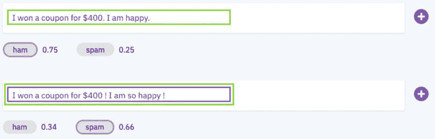
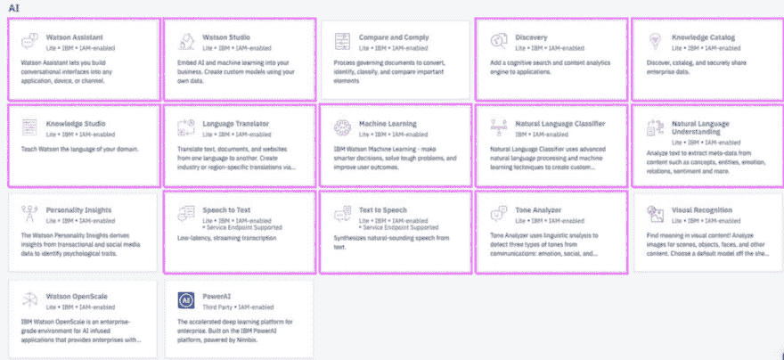

# IBM Cloud 上的 NLP 服务概述

> 原文：<https://dev.to/lidderupk/overview-of-nlp-services-on-ibm-cloud-m83>

我在圣克拉拉 hackerdojo 的一次聚会上展示 IBM Cloud 上的 NLP 时非常开心。我们在 IBM Cloud 上创建了一个自定义的自然语言分类器，用于区分垃圾邮件和业余邮件。经典问题，已经解决了无数次，但给出了一个很好的理解空间。为什么第一句比第二句更夸张？

 

<figcaption>火腿还是垃圾？</figcaption>

你可以在这里找到幻灯片和研讨会:[https://github.com/lidderupk/hackerdojo-nlp](https://github.com/lidderupk/hackerdojo-nlp)

以下是 IBM Cloud 上的一些 NLP 服务…

<figcaption>IBM 云上的 NLP</figcaption>

以下是不同 NLP 服务的简要概述…

#### [沃森助手](https://ibm.biz/BdzM8v)

Watson Assistant 允许您在任何应用程序、设备或频道中构建对话界面。它结合了机器学习、自然语言理解和集成的对话工具，在您的应用程序和用户之间创建对话流。

*   [沃森助手 API](https://ibm.biz/BdzM8m)
*   [沃森助手文档](https://ibm.biz/BdzM8a)
*   [代码模式](https://ibm.biz/BdzM8G)

#### [自然语言分类器](https://ibm.biz/BdzM88)

允许您为文本数据快速构建自定义分类器。

*   [NLC API](https://ibm.biz/BdzM8n)
*   [NLC 文件](https://ibm.biz/BdzM8e)
*   [NLC 代码模式](https://ibm.biz/BdzM8b)
*   [NLC 演示](https://ibm.biz/BdzM8p)

#### [自然语言理解](https://ibm.biz/BdzM8g)

帮助您提取文本数据中的实体、概念以及它们之间的关系。该服务还执行情感分析，反馈情感和情绪。此外，您可以为一些 API 创建定制模型，以获得适合您的领域的特定结果。

*   [NLU API](https://ibm.biz/BdzM8h)
*   [NLU 文件](https://ibm.biz/BdzM8V)
*   [NLU 码模式](https://ibm.biz/BdzM8J)
*   [NLU 演示](https://ibm.biz/BdzM8A)

#### [【文本到语音(tts)](https://ibm.biz/BdzM8L) 和[语音到文本(stt)](https://ibm.biz/BdzM83)

顾名思义，这些服务可以让你将文本转换成语音，反之亦然。此外，它们还提供了一种在您的领域数据上训练这些模型的方法。那真的很强大。请继续关注带演示的帖子。

*   [STT API](https://ibm.biz/BdzM8w)
*   [STT 文件](https://ibm.biz/BdzM8k)
*   [STT 演示](https://ibm.biz/BdzM8T)
*   [TTS API](https://ibm.biz/BdzM8C)
*   [TTS 文档](https://ibm.biz/BdzM8Q)
*   [TTS 演示](https://ibm.biz/BdzM89)

这些是 IBM Cloud 上的一些黑盒 NLP 服务。但是，它们可以根据您的自定义域数据进行扩展和训练。此外，如果您已经使用像 scikit-learn 这样的 ML 框架或像 Keras 这样的 DL 框架从头开始编写了一个模型，您可以使用 Watson Machine Learning (WML)在 IBM cloud 上部署它。

> 所以…直到下一次互联网偷窥！

感谢 Max Katz 和 IBM 开发人员 T2 在 meetup 上提供空间和美味的披萨。