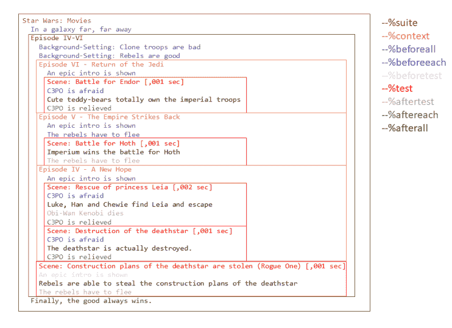

# 用 utPLSQL 注释叙述星球大战电影

> 原文：<https://dev.to/pesse/narrate-star-wars-movies-with-utplsql-annotations-3hkh>

我最近尝试了一下各种 utPLSQL 注释，发现它们非常强大。

我很确定我会写更多关于如何使用像`--%beforeall`或`--%context`这样的注释来使你的测试更有表现力，但是今天我只想展示一些技巧，讲述最初的星球大战电影的故事。

因为有趣的部分完全在包规范中，所以我将跳过这里突出显示的代码的主体。每个过程实现只包含一个对`dbms_output.put_line`的调用和一些文本。

你可以像往常一样从我的 [github](https://github.com/pesse/sith-demo-db/blob/master/100CodeExamples/utplsql/17_utplsql_narrate_star_wars_movies_with_annotations.sql) 中得到整个例子。

我创建了两个测试包，一个父包:

```
create or replace package sw_story_base as
  -- %suite(Star Wars: Movies)

  -- %beforeall
  procedure in_a_galaxy_far_away;

  -- %afterall
  procedure the_good_wins;

  procedure epic_intro;

  -- %beforeeach
  procedure deleted_scenes;

  -- %aftereach(deleted_scenes)

end;
/ 
```

<svg width="20px" height="20px" viewBox="0 0 24 24" class="highlight-action crayons-icon highlight-action--fullscreen-on"><title>Enter fullscreen mode</title></svg> <svg width="20px" height="20px" viewBox="0 0 24 24" class="highlight-action crayons-icon highlight-action--fullscreen-off"><title>Exit fullscreen mode</title></svg>

还有一个子包:

```
create or replace package sw_story_episode4_to_6 as
  -- %suite(Episode IV-VI)
  -- %suitepath(sw_story_base)

  -- %beforeall
  procedure clone_troops_are_bad;

  -- %beforeall
  procedure rebels_are_good;

  -- %test(Scene: Construction plans of the deathstar are stolen (Rogue One))
  -- %beforetest(sw_story_base.epic_intro)
  -- %aftertest(rebels_flee)
  procedure rogue_one;

  -- %context(episode4)
  -- %displayname(Episode IV - A New Hope)

    -- %beforeall(sw_story_base.epic_intro)

    -- %beforeeach(c3po_is_afraid)

    -- %test(Scene: Rescue of princess Leia)
    -- %aftertest(death_of_obiwan)
    procedure rescue_of_leia;

    procedure death_of_obiwan;

    -- %test(Scene: Destruction of the deathstar)
    procedure destroy_deathstar;

    -- %aftereach
    procedure c3po_is_relieved;

  -- %endcontext

  -- %context(episode5)
  -- %displayname(Episode V - The Empire Strikes Back)

    -- %beforeall(sw_story_base.epic_intro,rebels_flee)

    -- %test(Scene: Battle for Hoth)
    -- %aftertest(rebels_flee)
    procedure battle_for_hoth;

  -- %endcontext

  -- %context(episode6)
  -- %displayname(Episode VI - Return of the Jedi)

    -- %beforeall(sw_story_base.epic_intro)

    -- %beforeeach(c3po_is_afraid)
    -- %aftereach(c3po_is_relieved)

    -- %test(Scene: Battle for Endor)
    procedure battle_for_endor;

  -- %endcontext

  procedure c3po_is_afraid;

  procedure rebels_flee;

end;
/ 
```

<svg width="20px" height="20px" viewBox="0 0 24 24" class="highlight-action crayons-icon highlight-action--fullscreen-on"><title>Enter fullscreen mode</title></svg> <svg width="20px" height="20px" viewBox="0 0 24 24" class="highlight-action crayons-icon highlight-action--fullscreen-off"><title>Exit fullscreen mode</title></svg>

在我列出这个例子
的一些要点之前，让我们先看看`call ut.run(':sw_story_base')`(带`set serveroutput on`)的完整输出

```
Star Wars: Movies
  In a galaxy far, far away
  Episode IV-VI
    Context: Clone troops are bad
    Context: Rebels are good
    Episode VI - Return of the Jedi
      An epic intro is shown
      Scene: Battle for Endor [,001 sec]
      C3PO is afraid
      Cute teddy-bears totally own the imperial troops
      C3PO is relieved
    Episode V - The Empire Strikes Back
      An epic intro is shown
      The rebels have to flee
      Scene: Battle for Hoth [,001 sec]
      Imperium wins the battle for Hoth
      The rebels have to flee
    Episode IV - A New Hope
      An epic intro is shown
      Scene: Rescue of princess Leia [,002 sec]
      C3PO is afraid
      Luke, Han and Chewie find Leia and escape
      Obi-Wan Kenobi dies
      C3PO is relieved
      Scene: Destruction of the deathstar [,001 sec]
      C3PO is afraid
      The deathstar is actually destroyed.
      C3PO is relieved
    Scene: Construction plans of the deathstar are stolen (Rogue One) [,001 sec]
    An epic intro is shown
    Rebels are able to steal the construction plans of the deathstar
    The rebels have to flee
  Finally, the good always wins. 
```

<svg width="20px" height="20px" viewBox="0 0 24 24" class="highlight-action crayons-icon highlight-action--fullscreen-on"><title>Enter fullscreen mode</title></svg> <svg width="20px" height="20px" viewBox="0 0 24 24" class="highlight-action crayons-icon highlight-action--fullscreen-off"><title>Exit fullscreen mode</title></svg>

如果我们在套件、上下文和测试周围画一些方框，并基于使它们出现的注释突出显示不同的输出，我们会得到这样的结果:

[](https://cleandatabase.files.wordpress.com/2019/06/utplsql_annotations_starwars_movies-e1561497249965.png)

## 要点 1:“每个”——注释在子套件中不被调用

尽管我们在`sw_story_base`套件中定义了`--%beforeeach`和`--%aftereach`，但它们从未被调用过。

那是因为在`sw_story_base`套件中没有测试，只有在`sw_story_episode4_to_6`中有，但是`beforeeach`和`aftereach`仅限于同一个**套件的测试。**

但是，如果它们是在套件级别定义的，那么它们也会在上下文内部的测试中被调用。

## 要点 2:“之前”和“之后”注释可以用方法引用参数化

所有的`before`和`after`注释都允许通过引用过程来参数化:

*   `beforeall`
*   `beforeeach`
*   `beforetest`
*   `aftertest`
*   `aftereach`
*   `afterall`

被引用的过程不需要在同一个包中，但必须是可访问的。

多个引用可以用逗号分隔，它们的执行顺序是固定的。

## 外卖 3:可以从不同的标注中引用相同的方法

如果你看一下`rebels_flee`过程，它是从几个不同的注释中引用的:`beforeall`和`aftertest`。

对于引用一个方法的频率或从哪个注释引用没有限制。

正如你看到的`deleted_scenes`一样，你甚至可以用`beforeeach`注释一个方法，并额外引用它为`aftereach`(或任何其他的`before`或`after`注释)。

## 要点 4:你不能依赖于上下文和测试的顺序，而是依赖于安装和拆卸的顺序

很明显，我们的例子打乱了不同剧集和场景的调用顺序(从 3.1.7 开始，甚至有了新的随机测试执行功能)。

但是调用`before`和`after`方法的顺序总是固定的，你完全可以依赖它。

因此，虽然您应该致力于使测试和上下文相互独立，但是您可以保证它们的安装和拆卸。

## 一个请求

我希望这个有趣的小例子能给你带来一些新的东西。如果是这样，我很想听听。

但是还有另一件事:我真的很想为这个例子制作一个小动画——图片中的每一个步骤都被突出显示，并带有用于调用它的注释。我花了几个小时试图用 PowerPoint 实现它，但最终沮丧地放弃了。

如果你知道任何好的和便宜的工具，可以帮助解释这样的东西(例如通过动画突出/聚光灯)，请给我一个提示。