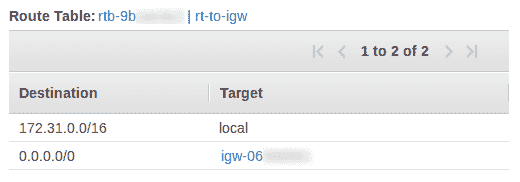
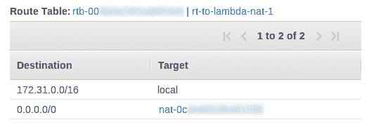
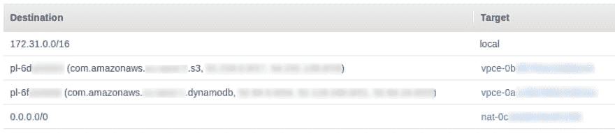
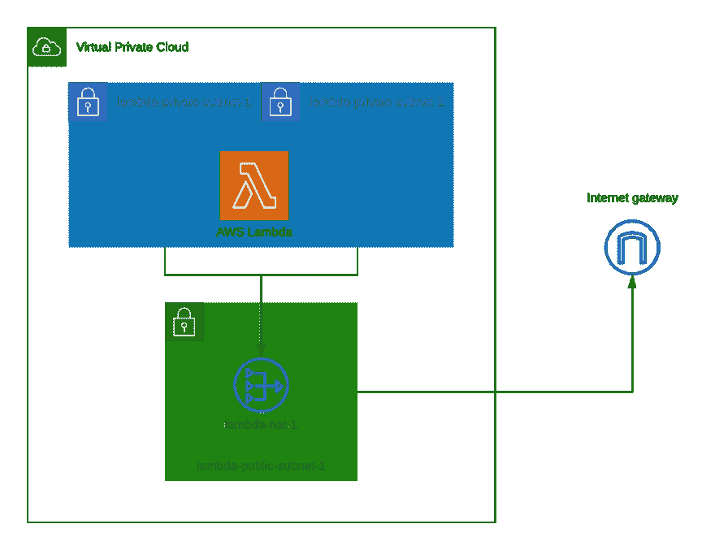

# VPC 网络公司

> 原文：<https://dev.to/eadanfahey/aws-lambda-vpc-networking-p3a>

让我们面对现实吧，AWS 网络并不完全是世界上最令人兴奋的事情。通常，我有一个 Lambda 函数，它需要连接到我的 VPC 中的一个数据库，同时仍然允许连接到互联网。说得好听点，配置 AWS 网络来处理这种常见情况是相当复杂的。这篇文章是完成它的简短手册。

1.  [创建公共子网](#create-a-public-subnet)
2.  [创建一个 NAT 网关](#create-a-nat-gateway)
3.  [创建私有子网](#create-private-subnets)
4.  [配置 VPC 网关端点](#configure-vpc-gateway-endpoints)
5.  [配置 Lambda 功能](#configure-the-lambda-function)

## 创建公共子网

子网将 VPC 可用的 IP 地址范围划分为子部分，由 [CIDR](https://en.wikipedia.org/wiki/Classless_Inter-Domain_Routing) 块定义。例如，`172.31.0.0/16`是代表从`172.31.0.0`到`172.31.255.255`的 65，536 个地址的 CIDR 块。

子网可以称为公共子网或私有子网。一个*公共子网*通过一个互联网网关路由其流量，而一个*私有子网*则没有。internet 网关是一个 VPC 组件，允许与 internet 通信。为您的 AWS 帐户自动创建的[默认](https://docs.aws.amazon.com/vpc/latest/userguide/default-vpc.html) VPC，在每个可用区域中预先配置了一个公共子网。

子网有一个*路由表*，描述其网络流量是如何定向的。公共子网的路由表如下所示。

在本例中，发往 VPC 内地址的所有流量都保持在 VPC 本地。所有其他流量(`0.0.0.0/0`)被发送到互联网网关。

要创建公共子网:

1.  导航到 AWS 控制台上的 VPC 服务。
2.  创建一个名为`rt-to-igw`的路由表。添加一个路由，将非本地流量定向到 internet 网关，如上例所示。
3.  创建一个名为`lambda-public-subnet-1`的新子网。
    *   选择与您想要连接的 AWS 资源相同的 VPC。
    *   指定子网将拥有的 CIDR 块，例如`172.31.16.0/24` (256 个地址)。不能与其它子网拥有的地址块重叠，因此您可能需要重新分配其它地方使用的地址。
4.  创建子网后，将其路由表更改为我们创建的路由表— `rt-to-igw`。

## 创建一个 NAT 网关

EC2 实例可以被分配一个公共 IP 地址。例如，这允许你从你的开发机器上通过 SSH 进入，并与外部互联网通信。然而，Lambda 函数不能被直接分配一个公共 IP 地址。相反，我们可以使用一个*网络地址转换* (NAT)网关来使一个 Lambda 函数与互联网通信。

1.  导航到 AWS 控制台上的 VPC 服务，然后选择“NAT 网关”。
2.  创建新的 NAT 网关。为其子网选择`lambda-public-subnet-1`，并为其分配一个弹性 IP。
3.  创建 NAT 网关后，将其命名为`lambda-nat-1`。
4.  创建一个名为`rt-to-lambda-nat-1`的新路由表。添加一条路由，将所有非本地流量`0.0.0.0/0`定向到 NAT 网关`lambda-nat-1`。

请注意，NAT 网关有相关的[成本](https://aws.amazon.com/vpc/pricing/)——通过它发送的每小时费用和每 GB 数据的成本。

## 创建私有子网

Lambda 函数将在私有子网内运行，该子网的路由表将非本地流量定向到我们在上一节中创建的 NAT 网关。AWS 建议将 VPC 中的 Lambda 功能分配给不同可用性区域中的至少两个子网，以获得更高的可用性。

接下来，创建两个私有子网，将外部流量定向到 NAT 网关:

1.  导航到 AWS 控制台上的 VPC 服务，然后选择“子网”
2.  创建两个名为`lambda-private-subnet-1`和`lambda-private-subnet-2`的新子网。
    *   选择与您想要连接的 AWS 资源相同的 VPC。
    *   为每个子网指定一个 CIDR 块，例如`172.31.17.0/24`和`172.31.18.0/24`
3.  创建子网后，将它们的路由表更改为`rt-to-lambda-nat-1`，这是我们在上一节中创建的。

## 配置 VPC 网关端点

这最后一步是可选的，但建议减少 NAT 网关的数据传输成本。
分配给专用子网的路由表应该如下所示:

它将所有外部流量定向到 NAT 网关，包括 Lambda 函数发送到 S3 或 DynamoDB 的任何流量。由于 NAT 网关按处理的每 GB 数据收费，在我们当前的网络配置下使用这些服务可能会很昂贵。然而，我们可以使用 [VPC 网关端点](https://docs.aws.amazon.com/vpc/latest/userguide/vpce-gateway.html)在去往 S3 和 DynamoDB 的流量上绕过 NAT。通过这些端点的数据是免费的，因此您的 AWS 账单会更低。

1.  导航到 AWS 控制台上的 VPC 服务，然后选择“端点”。
2.  创建新的端点。
3.  选择 S3 服务端点，其名称类似于`com.amazonaws.<REGION>.s3`。
4.  将此端点与路由表`rt-to-lambda-nat-1`(专用子网的路由表)相关联。
5.  对 DynamoDB 端点重复步骤 2–4。

完成这些步骤后，路由表`rt-to-lambda-nat-1`应该如下所示:

## 配置λ功能

最后，配置 Lambda 函数以使用私有子网:

1.  在 AWS 控制台中导航到 Lambda 函数。
2.  在“网络”窗格下，选择您在本指南中一直用于 Lambda 函数的 VPC。
3.  选择子网`lambda-private-subnet-1`和`lambda-private-subnet-2`。
4.  对于安全组，根据您的用例，选择一个允许访问 RDS 实例、Redshift 集群或 ElastiCache 实例的组。

## 结论

正如您所看到的，配置一个 Lambda 函数来访问 VPC 中的资源，同时仍然允许它与互联网对话是非常复杂的。但是，本指南应该为您提供一个适合您需求的工作解决方案。我们配置的 VPC 网络如下所示。

总之，公共子网`lambda-public-subnet-1`通过路由表`rt-to-igw`将流量导向互联网网关。我们在公共子网内创建了一个 NAT 网关`lambda-nat-1`。私有子网`lambda-private-subnet-1`和`lambda-private-subnet-2`通过路由表`rt-to-nat-lambda-nat-1`将其外部流量导向 NAT 网关。Lambda 函数被配置为位于私有子网内。

您可能会发现其他一些有用的资源:

*   [VPC 网络组件文档](https://docs.aws.amazon.com/vpc/latest/userguide/VPC_Networking.html)
*   [我如何向我的 VPC Lambda 功能授予互联网访问权限？](https://aws.amazon.com/premiumsupport/knowledge-center/internet-access-lambda-function/)
*   [AWS VPC 网络的黑暗艺术](https://www.verypossible.com/blog/aws-development-dark-art-of-vpc-networking)