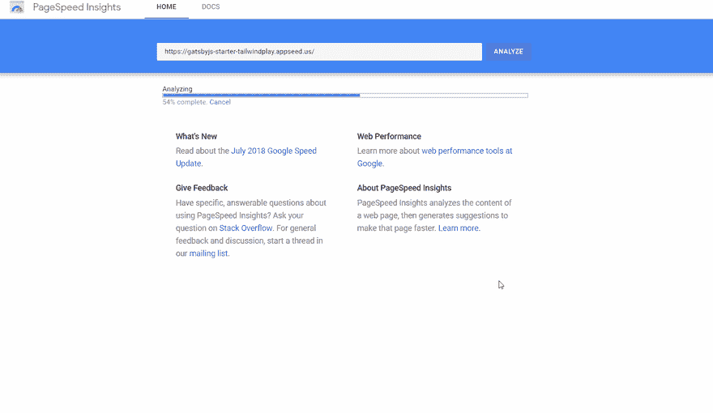
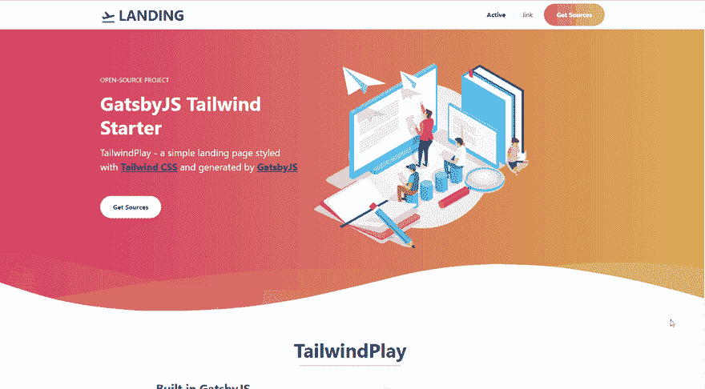

# 盖茨比-顺风播放一个超快的顺风启动器

> 原文：<https://dev.to/sm0ke/gatsbyjs-tailwind-starter-tailwindplay-19je>

各位编码员好，

## 为什么[盖茨比](https://www.gatsbyjs.org/)？

35k [Github Stars](https://github.com/gatsbyjs/gatsby) ，React based，Nice Tooling， [Starters](https://www.gatsbyjs.org/starters/?v=2) 用于几乎任何事情，综合 [docs](https://www.gatsbyjs.org/docs/)

## 为什么[顺风](https://tailwindcss.com/)？

底层 [CSS 框架](https://tailwindcss.com/#what-is-tailwind)。12k [Github 明星](https://github.com/tailwindcss/tailwindcss)。Tailwind 提供了底层的工具类，让你不用离开 HTML 就可以构建完全定制的设计。

## 为什么两者都有？

## 顺风

*   [盖茨比启动器顺风源代码](https://github.com/app-generator/gatsbyjs-starter-tailwindplay)
*   [盖茨比起动机顺风演示](https://gatsbyjs-starter-tailwindplay.appseed.us/)

### 资源

*   [GatsbyJS 应用程序](https://appseed.us/apps/gatsbyjs) -由 AppSeed 提供的索引
*   盖茨比主题 -由 HTM5Up、LekoArts、Creative-Tim 制作

**谢谢！**