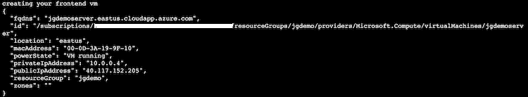
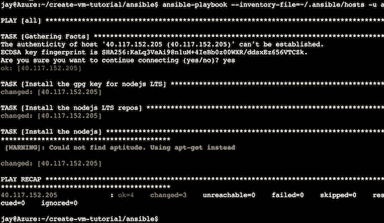
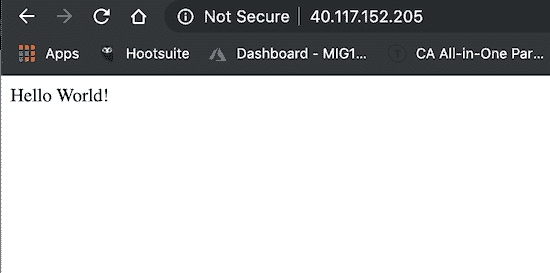

# 面向系统管理员的 Azure 云外壳技巧第二部分——使用云外壳工具进行迁移

> 原文：<https://dev.to/azure/azure-cloud-shell-tips-for-sysadmins-part-ii-using-the-cloud-shell-tools-to-migrate-3ka8>

作为 Azure 的支持者，我花时间做的事情之一就是学习初学者使用微软 Azure 的最简单的方法。今天我想和你分享一些利用 Azure 内置工具的方法。

在我的上一篇博文[Azure Cloud Shell Tips for SysAdmins(bash)](https://dev.to/azure/azure-cloud-shell-tips-for-sysadmins-bash-4h2e)中，我讨论了一些已经内置在 [Azure Cloud Shell for bash](https://docs.microsoft.com/azure/cloud-shell/quickstart?WT.mc_id=devto-blog-jagord) 中的工具。这一次，我将更深入地向您展示如何利用这些工具的组合来创建一个 UbuntuLTS Linux 服务器。一旦提供了服务器，我将演示如何使用 Ansible 从[node source 二进制存储库部署 Node.js。](https://github.com/nodesource/distributions)

教程要求:

*   Azure 帐户
*   Azure 云壳(bash)
*   一些 SSH 和文本编辑

### 这一切有什么意义？

好问题。从我作为云倡导者的旅行中，我真的注意到许多来自系统管理领域的用户在运行之前需要工具和教程。使用 Kubernetes 来编排一个复杂的分布式系统是很棒的。但是，如果这不是您在向云迁移的步骤中所处的位置，我可以从一些“提升和转移”方法开始。

### 迁移策略

我提到了“提升和转移”,应该深入探讨一下，因为在讨论您的迁移策略时会经常用到它。对于一些公司来说，将应用程序完全重构为微服务或服务网格是不可行的。为组织的迁移设定步调是一项长期计划，需要了解 IT 组织中的许多角色。

[](https://res.cloudinary.com/practicaldev/image/fetch/s--E2LB8K_o--/c_limit%2Cf_auto%2Cfl_progressive%2Cq_auto%2Cw_880/https://thepracticaldev.s3.amazonaws.com/i/6r8g2yy6i9tevzzoucka.png)

如果您想以正确的方式进行迁移，您需要了解可供您使用的资源。在微软 Azure 的例子中，有将近 600 种不同的服务提供给用户。当决定你的应用程序最终将如何在云中运行时，最理想的是了解你将如何让它们运行。“迁移和现代化”你的应用程序的想法有几个关键策略，正如 Azure 的[在本文中提到的:](https://azure.microsoft.com/en-us/migration/get-started/?WT.mc_id=devto-blog-jagord)

rehost——通常被称为“提升和转移”迁移，这种无代码选项让您可以快速地将现有的应用程序迁移到 Azure。每个应用程序都是按原样迁移的，这提供了云的优势，而没有更改代码的风险或成本。

重构——通常被称为重新打包，这种云迁移策略涉及对应用程序设计的一些更改，但不涉及对应用程序代码的大规模更改。您的应用程序可以利用基础设施即服务(IaaS)和平台即服务(PaaS)产品，如 Azure 应用服务、Azure SQL 数据库管理实例和容器。

重新构建——修改或扩展应用程序的代码基础，以针对云进行扩展和优化。将您的应用程序现代化为弹性、高度可扩展、可独立部署的架构，并使用 Azure 来加速流程、满怀信心地扩展应用程序，以及轻松管理您的应用程序…

重建——使用云原生技术从头开始重建应用。Azure 平台即服务(PaaS)在云中提供了一个完整的开发和部署环境，没有软件许可证的费用和复杂性，也不需要底层应用程序基础架构或中间件和其他资源。有了这个云迁移策略，你管理你开发的应用和服务，Azure 管理其他一切。

### 第一步

这里有一个列表，列出了将应用程序迁移到云中的不同方式。在这种情况下，我倾向于使用 Cloud Shell 中的一些工具，这些工具将帮助我从根本上“转移”或“提升”应用程序。这将是进入云的基本步骤，许多系统管理员可以使用它来开始构建更多的云原生应用程序。

首先，打开一个云壳，这可以通过访问门户中搜索栏右侧的云壳徽标来完成，或者通过访问[https://shell.azure.com/](https://shell.azure.com/?WT.mc_id=devto-blog-jagord)直接导航。

[](https://res.cloudinary.com/practicaldev/image/fetch/s--KH4xhz3S--/c_limit%2Cf_auto%2Cfl_progressive%2Cq_auto%2Cw_880/https://thepracticaldev.s3.amazonaws.com/i/8tfe4fscvxsd4uedtrvn.png)

Azure Cloud Shell 包含了本教程中使用的所有工具。这些步骤如下:

1.  使用 git 获取 helper 脚本和 ansi ble repo([create-VM-tutorial](https://github.com/jaydestro/create-vm-tutorial))
2.  查看脚本，从云 shell 中执行它以创建一个 Ubuntu LTS 服务器
3.  从云 shell 查看并执行 Ansible 剧本以安装 Node.js
4.  SSH 进入，部署[演示应用](https://github.com/jaydestro/demo-app)

对于这个例子，我们将只使用[演示应用](https://github.com/jaydestro/demo-app)来显示它都在工作。

我已经登录到我的 shell，现在我将获取包含我需要的 bash 脚本和 Ansible 剧本的 [create-vm-tutorial](https://github.com/jaydestro/create-vm-tutorial) repo。

```
git clone [git@github.com](mailto:git@github.com):jaydestro/create-vm-tutorial.git

cd create-vm-tutorial/

jay@Azure:~/create-vm-tutorial$ ls -al

total 24

drwxr-xr-x  4 jay jay 4096 Jun 25 17:30 .

drwxr-xr-x 34 jay jay 4096 Jun 25 17:30 ..

drwxr-xr-x  2 jay jay 4096 Jun 25 17:30 ansible

-rw-r--r--  1 jay jay 2478 Jun 25 17:30 create-simple-vm.sh

drwxr-xr-x  8 jay jay 4096 Jun 25 17:30 .git

-rw-r--r--  1 jay jay  838 Jun 25 17:30 README.md 
```

<svg width="20px" height="20px" viewBox="0 0 24 24" class="highlight-action crayons-icon highlight-action--fullscreen-on"><title>Enter fullscreen mode</title></svg> <svg width="20px" height="20px" viewBox="0 0 24 24" class="highlight-action crayons-icon highlight-action--fullscreen-off"><title>Exit fullscreen mode</title></svg>

现在查看 create-simple-vm.sh helper 脚本，您可以检查它的基本任务，创建一个资源组，创建一个 vm，然后为您打开几个 ssh 端口，并将应用程序绑定到端口 80。

在执行时，脚本会要求您输入一些变量。最好在运行脚本之前先获取订阅 ID，为了安全起见，我修改了一些输出:

```
az account show --out json 
```

<svg width="20px" height="20px" viewBox="0 0 24 24" class="highlight-action crayons-icon highlight-action--fullscreen-on"><title>Enter fullscreen mode</title></svg> <svg width="20px" height="20px" viewBox="0 0 24 24" class="highlight-action crayons-icon highlight-action--fullscreen-off"><title>Exit fullscreen mode</title></svg>

```
{
  "environmentName": "AzureCloud",
  "id": "fffffff-0000-42d3-a58b-fake",
  "isDefault": true,
  "name": "ca-jagord-demo-test",
  "state": "Enabled",
  "tenantId": "fffffff-0000-41af-91ab-fake",
  "user": {
    "cloudShellID": true,
    "name": "email@microsoft.com",
    "type": "user"
  } 
```

<svg width="20px" height="20px" viewBox="0 0 24 24" class="highlight-action crayons-icon highlight-action--fullscreen-on"><title>Enter fullscreen mode</title></svg> <svg width="20px" height="20px" viewBox="0 0 24 24" class="highlight-action crayons-icon highlight-action--fullscreen-off"><title>Exit fullscreen mode</title></svg>

让我们执行我们的脚本！

```
bash create-simple-vm.sh

Your subscription ID can be looked up with the CLI using: az account show --out json 
```

<svg width="20px" height="20px" viewBox="0 0 24 24" class="highlight-action crayons-icon highlight-action--fullscreen-on"><title>Enter fullscreen mode</title></svg> <svg width="20px" height="20px" viewBox="0 0 24 24" class="highlight-action crayons-icon highlight-action--fullscreen-off"><title>Exit fullscreen mode</title></svg>

输入我们之前刚刚获得的订阅 ID。

```
Enter your subscription ID:

Fffffff-0000-42d3-a58b-fake 
```

<svg width="20px" height="20px" viewBox="0 0 24 24" class="highlight-action crayons-icon highlight-action--fullscreen-on"><title>Enter fullscreen mode</title></svg> <svg width="20px" height="20px" viewBox="0 0 24 24" class="highlight-action crayons-icon highlight-action--fullscreen-off"><title>Exit fullscreen mode</title></svg>

给它一个资源组，把所有的东西放进一个盒子里，这样我们就可以一次全部删除了！

```
Enter a name for a resource group. This script will create a new group
jgdemo 
```

<svg width="20px" height="20px" viewBox="0 0 24 24" class="highlight-action crayons-icon highlight-action--fullscreen-on"><title>Enter fullscreen mode</title></svg> <svg width="20px" height="20px" viewBox="0 0 24 24" class="highlight-action crayons-icon highlight-action--fullscreen-off"><title>Exit fullscreen mode</title></svg>

选择一个蓝色区域，在这个例子中我使用`eastus` :

```
Enter the location for this deployment
List of available regions is 'centralus,eastasia,southeastasia,eastus,eastus2,westus,westus2,northcentralus,southcentralus,westcentralus,northeurope,westeurope,japaneast,japanwest,brazilsouth,australiasoutheast,australiaeast,westindia,southindia,centralindia,canadacentral,canadaeast,uksouth,ukwest,koreacentral,koreasouth,francecentral,southafricanorth,uaenorth
eastus 
```

<svg width="20px" height="20px" viewBox="0 0 24 24" class="highlight-action crayons-icon highlight-action--fullscreen-on"><title>Enter fullscreen mode</title></svg> <svg width="20px" height="20px" viewBox="0 0 24 24" class="highlight-action crayons-icon highlight-action--fullscreen-off"><title>Exit fullscreen mode</title></svg>

给服务器起个名字！

```
Enter front end VM name:
jgdemoserver 
```

<svg width="20px" height="20px" viewBox="0 0 24 24" class="highlight-action crayons-icon highlight-action--fullscreen-on"><title>Enter fullscreen mode</title></svg> <svg width="20px" height="20px" viewBox="0 0 24 24" class="highlight-action crayons-icon highlight-action--fullscreen-off"><title>Exit fullscreen mode</title></svg>

输入这些变量后，您将开始供应资源组和虚拟机的过程。对于每个步骤，您应该会看到类似于以下内容的输出:

[](https://res.cloudinary.com/practicaldev/image/fetch/s--r4vOBppP--/c_limit%2Cf_auto%2Cfl_progressive%2Cq_auto%2Cw_880/https://thepracticaldev.s3.amazonaws.com/i/qftdd37qof0tos3j37h6.png)

大约 60 秒后，我得到了新 UbuntuLTS 服务器的输出信息:

[](https://res.cloudinary.com/practicaldev/image/fetch/s--rL4XfBh---/c_limit%2Cf_auto%2Cfl_progressive%2Cq_auto%2Cw_880/https://thepracticaldev.s3.amazonaws.com/i/fixpcut39qyt7apv19vu.png)

如您所见，在部署时，会为虚拟机提供一个完全合格的域名和一个公共 IP 地址。我已经指定为我创建 ssh 密钥，并且使用 sudo 权限创建用户“azureuser”。

该脚本将继续为我们的演示应用程序打开端口 80，最终将从 http 访问提供服务。完成后，脚本将为您提供“销毁”命令:

```
Youre done, when youre ready to delete this, execute this command in Cloud Shell
az group delete -g jgdemo 
```

<svg width="20px" height="20px" viewBox="0 0 24 24" class="highlight-action crayons-icon highlight-action--fullscreen-on"><title>Enter fullscreen mode</title></svg> <svg width="20px" height="20px" viewBox="0 0 24 24" class="highlight-action crayons-icon highlight-action--fullscreen-off"><title>Exit fullscreen mode</title></svg>

坚持使用这个命令，当您想要扔掉这个资源盒时，它会变得很有用。

使用虚拟机的公共 IP 地址，以便您可以在云 shell 中使用您的资源组运行该命令(我刚刚修改了示例的 IP 地址):

```
az vm list-ip-addresses -g $RESOURCEGROUP | grep ipAddress

            "ipAddress": "1.2.3.4", 
```

<svg width="20px" height="20px" viewBox="0 0 24 24" class="highlight-action crayons-icon highlight-action--fullscreen-on"><title>Enter fullscreen mode</title></svg> <svg width="20px" height="20px" viewBox="0 0 24 24" class="highlight-action crayons-icon highlight-action--fullscreen-off"><title>Exit fullscreen mode</title></svg>

现在我有了自己的 IP 地址，我准备创建一个清单主机文件供 ansible 运行。让我们在我的 shell 中创建一个简单的命令:

```
mkdir ~/.ansible/ 
code  ~/.ansible/hosts 
```

<svg width="20px" height="20px" viewBox="0 0 24 24" class="highlight-action crayons-icon highlight-action--fullscreen-on"><title>Enter fullscreen mode</title></svg> <svg width="20px" height="20px" viewBox="0 0 24 24" class="highlight-action crayons-icon highlight-action--fullscreen-off"><title>Exit fullscreen mode</title></svg>

`~/.ansible/hosts`库存文件的内容:

```
[hosts]
1.2.3.4 
```

<svg width="20px" height="20px" viewBox="0 0 24 24" class="highlight-action crayons-icon highlight-action--fullscreen-on"><title>Enter fullscreen mode</title></svg> <svg width="20px" height="20px" viewBox="0 0 24 24" class="highlight-action crayons-icon highlight-action--fullscreen-off"><title>Exit fullscreen mode</title></svg>

保存文件并关闭代码编辑器。现在让我们进入 repo 中的 ansible 目录:

```
cd ansible 
```

<svg width="20px" height="20px" viewBox="0 0 24 24" class="highlight-action crayons-icon highlight-action--fullscreen-on"><title>Enter fullscreen mode</title></svg> <svg width="20px" height="20px" viewBox="0 0 24 24" class="highlight-action crayons-icon highlight-action--fullscreen-off"><title>Exit fullscreen mode</title></svg>

install _ node . YAML ansi ble playbook 包含安装 gpg 密钥的指导，以允许在操作系统上安装新的软件包。然后它会安装 Node.js 的 LTS 版本:

```
ansible-playbook --inventory-file=~/.ansible/hosts -u azureuser install_node.yaml 
```

<svg width="20px" height="20px" viewBox="0 0 24 24" class="highlight-action crayons-icon highlight-action--fullscreen-on"><title>Enter fullscreen mode</title></svg> <svg width="20px" height="20px" viewBox="0 0 24 24" class="highlight-action crayons-icon highlight-action--fullscreen-off"><title>Exit fullscreen mode</title></svg>

[](https://res.cloudinary.com/practicaldev/image/fetch/s--1OmVbF3t--/c_limit%2Cf_auto%2Cfl_progressive%2Cq_auto%2Cw_880/https://thepracticaldev.s3.amazonaws.com/i/tlfjzzduo2wpkriqjkks.png)

让我们进去看看吧！

```
 ssh -l azureuser 40.117.152.205

azureuser@jgdemoserver:~$ npm -v
6.4.1
azureuser@jgdemoserver:~$ node -v
v8.16.0 
```

<svg width="20px" height="20px" viewBox="0 0 24 24" class="highlight-action crayons-icon highlight-action--fullscreen-on"><title>Enter fullscreen mode</title></svg> <svg width="20px" height="20px" viewBox="0 0 24 24" class="highlight-action crayons-icon highlight-action--fullscreen-off"><title>Exit fullscreen mode</title></svg>

很酷，让我们做最后一步。应用部署时间！

获取 demo-app repo 并将其克隆到您的主目录:

```
git clone https://github.com/jaydestro/demo-app.git
cd demo-app 
npm install
sudo npm start 
```

<svg width="20px" height="20px" viewBox="0 0 24 24" class="highlight-action crayons-icon highlight-action--fullscreen-on"><title>Enter fullscreen mode</title></svg> <svg width="20px" height="20px" viewBox="0 0 24 24" class="highlight-action crayons-icon highlight-action--fullscreen-off"><title>Exit fullscreen mode</title></svg>

现在让我们在浏览器中检查 40.117.152.205:

[](https://res.cloudinary.com/practicaldev/image/fetch/s--Zk6M3hFC--/c_limit%2Cf_auto%2Cfl_progressive%2Cq_auto%2Cw_880/https://thepracticaldev.s3.amazonaws.com/i/1j6pa9r1o57lhvro9rxd.png)

### 完成并拆除

就这些了！使用 Azure Cloud Shell 中已经内置的工具开发一个基本应用程序的整个工具包。你可以在你的云 Shell 上存储你为仓库创建的所有东西，然后创建一个 ssh 密钥来同步你的 repos 和你的 Github 或者 Azure DevOps 仓库。

摧毁这一切！还记得我说过的“保持命令”吗？让我们把它全部炸掉，摧毁我们的演示基础设施:

```
az group delete -g jgdemo 
Are you sure you want to perform this operation? (y/n): y 
```

<svg width="20px" height="20px" viewBox="0 0 24 24" class="highlight-action crayons-icon highlight-action--fullscreen-on"><title>Enter fullscreen mode</title></svg> <svg width="20px" height="20px" viewBox="0 0 24 24" class="highlight-action crayons-icon highlight-action--fullscreen-off"><title>Exit fullscreen mode</title></svg>

然后，您将看到“正在运行…”直到组删除过程完成。

本教程中有大量的信息。它旨在让那些可能真的不确定如何完成这些“提升和转移”任务的用户在他们的云中世界中有一个第一次开始。迁移到云可能是一项巨大的任务，所以让初学者了解信息真的很有帮助。如果你遇到任何问题，请随时通过 Twitter @jaydestro 或这里的评论联系我。