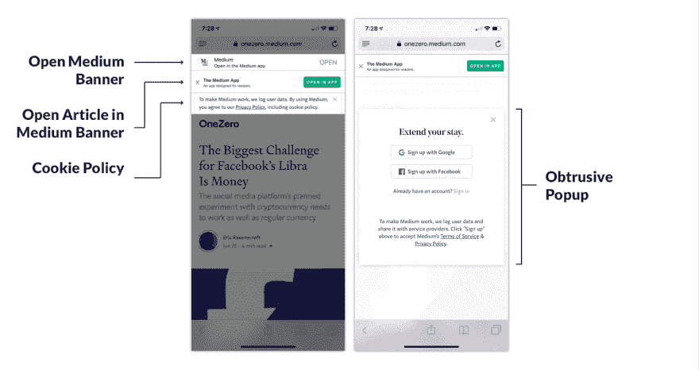

# Moving from Medium to Ghost

> 原文：[https://dev.to/darthknoppix/moving-from-medium-to-ghost-5ch0](https://dev.to/darthknoppix/moving-from-medium-to-ghost-5ch0)

## Why I chose to self-host my blog over an established platform

There are many reasons for wanting to host your own blog but why bother when Medium does a great job already? Here are the reasons I chose to take the plunge and give self-hosting a shot.

### Why are developers leaving Medium?

I dipped my toes into the Medium platform in 2015 and really began using it as part of my daily routine the following year. I was immediately attracted by it's minimal UI both for readers and creators but it's now 2019, so what's changed? Influential Medium authors with popular publications are leaving Medium for a few key reasons.

*   [Signal v. Noise](https://m.signalvnoise.com/) has a philosophical opposition to centralisation, initially lured in by an interesting new platform and community but eventually realised they were doing more for[Medium than Medium was doing for them](https://medium.com/signal-v-noise/signal-v-noise-exits-medium-56c483d827fc).
*   [Dan Abramov wanted to go in a different direction](https://medium.com/@dan_abramov/why-my-new-blog-isnt-on-medium-3b280282fbae) with [Overreacted](https://overreacted.io/) and have more control over his own blog while tinkering and collaborating with the community.
*   There is a general sentiment from the developer community that Medium may not be around forever
*   Medium it is not catered toward the developer community. Syntax highlighting is non-existent and there is low audience engagement compared with some other platforms like [dev.to](https://dev.to/)

These salient points are some notable reasons why Medium isn't the best platform for them, I agree with some of these points but these alone aren't enough for me to jump ship to another platform. Some people have real issue with the paywall, I don't mind it too much, it's an interesting business model but I see how it can be jarring if you're not signed up.

### Why am I leaving Medium?

Medium is still a great platform for writing and consuming writing by creator. It's minimal as a reader and powerful enough to communicate your point as a writer but there are a few issues that make it frustrating as a developer and infuriating as a reader.

*   **Syntax highlighting,** the most obvious issue. There just isn't any, you can define a block of code in the editor but anything beyond that, you have to look for an alternative like embedding a [Gist](https://gist.github.com/) or using [CodeSandbox](https://codesandbox.io/). These services are great but detract from the editing experience.
*   **User Experience** , when I started using Medium it was the experience that got me. It felt clean, uncluttered and fully focused on the content. This experience is marred by the mobile experience for readers not signed into Medium and fully invested in the Medium experience. A banner at the top to install the app. A banner at the bottom to sign up for an account. Awkward transitions when you follow a URL which preceeds to open the browser then the app and then finally the article you actually wanted to read. <!--kg-card-begin: image-->

<figure>

<figcaption>Highlighting the Medium experience on mobile</figcaption>

</figure>

These are the biggest annoyances I run into on a daily basis that pushed me towards self-hosting my blog.

### Why would you want to self-host?

There are myriad alternatives to Medium that offer a great experience for developers but I chose to self-host my blog powered by Ghost for some key reasons.

*   **User experience** , something you own and have full control over can be daunting but it also allows for deep customization. You're not at the whims of a platform like Medium, you can craft the experience to cater to your audience how you see fit.
*   **Forward thinking** , Medium might not be around for ever and it's not something you can easily control. The content you own should exist independent of a platform. You can control your data and where you put it more easily.

I don't plan on leaving Medium completely, there are still writers and publications I enjoy and an evolving platform. I do however plan on using Medium as a tool, a part of the bigger picture but not the be all and end all.

### How do I get started with Ghost?

Not yet convinced? Ghost has an interesting section on their site [comparing Medium to Ghost](https://ghost.org/vs/medium/). If you want to get started with your own self-hosted blog Ghost on DigitalOcean, I'll be writing about how I did it soon.

* * *

*Thank [https://www.drawkit.io/](https://www.drawkit.io/) by @JamesDaly90 for the slick illustrations used to make this banner*