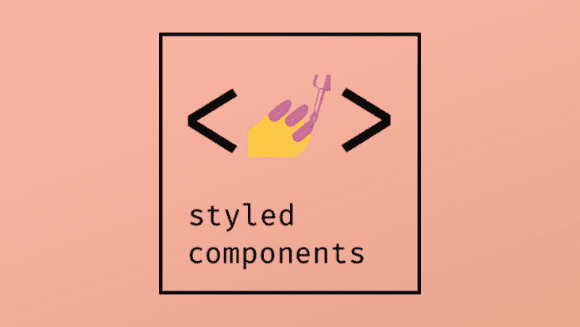
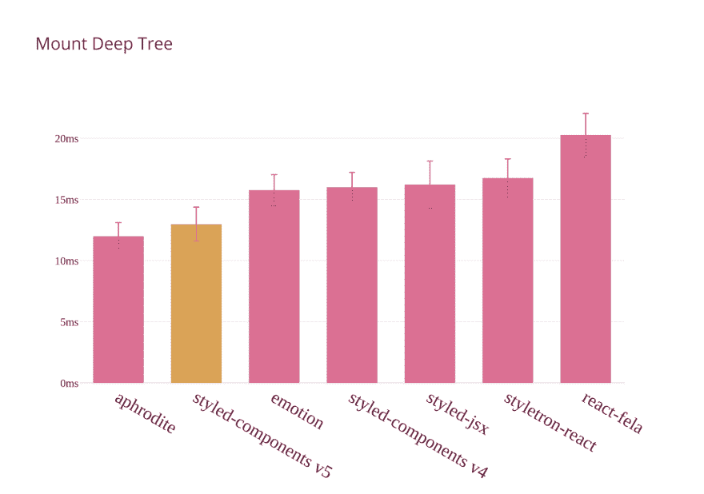

# 样式组件 5.0 的新特性

> 原文：<https://dev.to/bnevilleoneill/what-s-new-in-styled-components-5-0-38gb>

[](https://res.cloudinary.com/practicaldev/image/fetch/s--7KDJ2gOO--/c_limit%2Cf_auto%2Cfl_progressive%2Cq_auto%2Cw_880/https://thepracticaldev.s3.amazonaws.com/i/dgx2kgspz89mt24yid7g.png)

## 样式化-组件

[Styled components](http://styled-components.com/) 是一个 CSS-in-JS 样式框架，它使用 JavaScript 中的标记模板文字和 CSS 的强大功能来提供一个平台，允许您编写实际的 CSS 来样式化 react 组件。本质上，样式化组件是用[样式化组件](http://styled-components.com)库编写的易于制作的 react 组件，在这个库中，您可以用 JavaScript 代码中的普通 CSS 来样式化组件。在官方文档页面上，你会看到下面的例子:

```
const Button = styled.a`
 /* This renders the buttons above… Edit me! */
 display: inline-block;
 border-radius: 3px;
 padding: 0.5rem 0;
 margin: 0.5rem 1rem;
 width: 11rem;
 background: transparent;
 color: white;
 border: 2px solid white;
/* The GitHub button is a primary button
 * edit this to target it specifically! */ ${props => props.primary && css`
 background: white;
 color: palevioletred;
 `} ` 
```

<svg width="20px" height="20px" viewBox="0 0 24 24" class="highlight-action crayons-icon highlight-action--fullscreen-on"><title>Enter fullscreen mode</title></svg> <svg width="20px" height="20px" viewBox="0 0 24 24" class="highlight-action crayons-icon highlight-action--fullscreen-off"><title>Exit fullscreen mode</title></svg>

我们可以清楚地看到按钮是一个 JavaScript 变量，反勾号中定义的样式是普通的 CSS 样式。我们还看到了普通 CSS 样式的嵌套样式属性。这就是样式化组件在 JavaScript 中呈现 CSS 的方式。

最近，styled-components 团队发布了一个他们命名为 beast mode 的新版本，它的服务器端渲染速度快了 50%，客户端渲染速度快了 20%，包大小小了 19%，支持 RTL，并且没有重大更改！

## React dev tools 中的钩子支持

这个新版本的 styled-components 在性能和内存效率方面有很大的变化。开发工具中的风格化组件现在非常干净，包含的代码也更少了。这是因为针对该版本进行了 React hooks 重构。下面是使用以前版本时 React DevTools 中样式化的`TagLine`组件的样子:

```
<TagLine>
  <StyledComponent forwardedRef={null}>
    <Context.Consumer>
      <Context.Consumer>
        <h2 className=”H2-sc-1izft7s-7”>Hello world</h2>
      </Context.Consumer>
    </Context.Consumer>
  </StyledComponent>
</TagLine> 
```

<svg width="20px" height="20px" viewBox="0 0 24 24" class="highlight-action crayons-icon highlight-action--fullscreen-on"><title>Enter fullscreen mode</title></svg> <svg width="20px" height="20px" viewBox="0 0 24 24" class="highlight-action crayons-icon highlight-action--fullscreen-off"><title>Exit fullscreen mode</title></svg>

下面你可以看到当使用这个新版本
时，React DevTools 中相同样式的组件看起来是什么样子

```
<TagLine>
  <h2 className=”H2-sc-1izft7s-7”>Hello world</h2>
</TagLine> 
```

<svg width="20px" height="20px" viewBox="0 0 24 24" class="highlight-action crayons-icon highlight-action--fullscreen-on"><title>Enter fullscreen mode</title></svg> <svg width="20px" height="20px" viewBox="0 0 24 24" class="highlight-action crayons-icon highlight-action--fullscreen-off"><title>Exit fullscreen mode</title></svg>

现在组件嵌套明显减少，因此代码块也更加整洁。

[](https://logrocket.com/signup/)

## 超速度

styled-components 的团队一直致力于让性能更好，他们对这一决心的奉献总是产生惊人的结果。从两年前发布的[版本 2 开始，我们已经见证了各种版本在速度上的巨大进步。](https://medium.com/styled-components/announcing-v2-f01ef3766ac2)

其中包括:

*   版本 3.1 中的 10 倍性能提升
*   版本 4 中的另一个 [25%的速度提升](https://medium.com/styled-components/announcing-styled-components-v4-better-faster-stronger-3fe1aba1a112)

这个最新版本包括更小的包大小(16.2kB 对 13.63kB min+gzip)，更快的客户端挂载，更快的动态样式更新，以及更快的服务器端渲染。

有了这个新的更新，一直很快的 styled-components 现在是你能找到的最快的 CSS-in-JS 库之一。

[](https://res.cloudinary.com/practicaldev/image/fetch/s--eiI9C9ba--/c_limit%2Cf_auto%2Cfl_progressive%2Cq_auto%2Cw_880/https://i2.wp.com/cdn-images-1.medium.com/max/1600/1%2A8Z7AHbEoXwEawRL5GMuidw.png%3Fresize%3D1600%252C1123%26ssl%3D1)

安装深度组件树基准。越低越好。总体速度的新提升是由 styled-component 使用的新核心样式表引擎推动的，它在新版本中进行了重建，非常注重性能和正确性。它已经用很多工具进行了广泛的测试，但是团队仍然在寻找社区成员的反馈。如果你测试新版本有任何问题，你可以[联系这里](https://github.com/styled-components/styled-components/issues/new)。

> 如果你使用 jest 风格的组件，确保[也更新到测试版](https://github.com/styled-components/jest-styled-components/releases/tag/v7.0.0-beta.0)！

## 对 StyleSheetManager 的改进

新版本对 StyleSheetManager 进行了新的改进。StyleSheetManager 现在在版本 5 中能够用插件扩展 stylis，CSS 解析器。

这被证明对很多用例非常有用，对自定义样式的全自动 RTL 的支持是这个新版本中可能实现的事情之一。

## RTL 支持

在样式组件版本 5 中，您现在可以将您的样式从默认的从左到右对流转换为从右到左的方法。

你可以把你的样式从默认的从右到左，就像这样:

```
import { StyleSheetManager } from 'styled-components';
import stylisRTLPlugin from 'stylis-rtl';
<StyleSheetManager stylisPlugins={[stylisRTLPlugin]}>
  <App />
</StyleSheetManager> 
```

<svg width="20px" height="20px" viewBox="0 0 24 24" class="highlight-action crayons-icon highlight-action--fullscreen-on"><title>Enter fullscreen mode</title></svg> <svg width="20px" height="20px" viewBox="0 0 24 24" class="highlight-action crayons-icon highlight-action--fullscreen-off"><title>Exit fullscreen mode</title></svg>

在改进的样式表管理器的巨大帮助下，您会看到仅这个代码块就可以实现转换。

这打开了许多可能性和大量的插件，使得样式化的组件使用起来更加令人兴奋。

## 入门

要升级到最新版本，只需在您的终端中运行以下命令。

```
npm install styled-components@beta 
```

<svg width="20px" height="20px" viewBox="0 0 24 24" class="highlight-action crayons-icon highlight-action--fullscreen-on"><title>Enter fullscreen mode</title></svg> <svg width="20px" height="20px" viewBox="0 0 24 24" class="highlight-action crayons-icon highlight-action--fullscreen-off"><title>Exit fullscreen mode</title></svg>

要做到这一点，您必须确保您使用的是 React 和 React DOM 的最新版本 16.8，因为它们支持钩子。

## 样式化-组件项目

Styled-components 是一个非常受欢迎的库。它现在可以被称为一个行业标准的 CSS-in-JS 库，并不断更新，显示了核心团队对项目进展的强烈奉献精神。

styled-components 的团队希望通过参加会议、组织峰会等等来扩展这个项目。大多数核心团队成员来自世界各地，需要支持来继续维护这个令人敬畏的项目。如果你、你的团队或者你的公司使用样式化组件，考虑为样式化组件 [OpenCollective](https://opencollective.com/styled-components) 做贡献，使他们的工作更容易，扩展更快。

## 结论

您已经看到了新样式组件版本 5 中的新特性。Styled-components 作为 CSS-in-JS 框架的业界最爱，最近获得了很高的采用率，你最喜欢的新特性是什么？

* * *

## Plug: [LogRocket](https://logrocket.com/signup/) ，一款适用于网络应用的 DVR

[](https://logrocket.com/signup/)

[log rocket](https://logrocket.com/signup/)是一个前端日志工具，让你重放问题，就像它们发生在你自己的浏览器中一样。LogRocket 不需要猜测错误发生的原因，也不需要向用户询问截图和日志转储，而是让您重放会话以快速了解哪里出错了。它可以与任何应用程序完美配合，不管是什么框架，并且有插件可以记录来自 Redux、Vuex 和@ngrx/store 的额外上下文。

除了记录 Redux 动作和状态，LogRocket 还记录控制台日志、JavaScript 错误、stacktraces、带有头+体的网络请求/响应、浏览器元数据、自定义日志。它还使用 DOM 来记录页面上的 HTML 和 CSS，甚至为最复杂的单页面应用程序重新创建像素级完美视频。

[免费试用](https://logrocket.com/signup/)。

* * *

帖子[styled-components 5.0 的新特性](https://blog.logrocket.com/new-in-styled-components-5-0/)首先出现在[的博客](https://blog.logrocket.com)上。