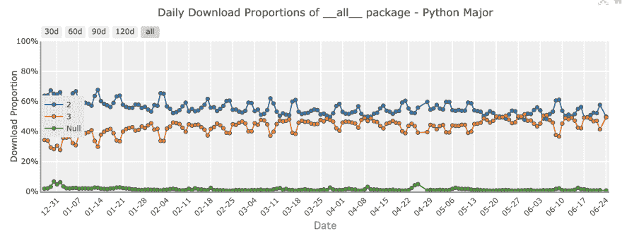
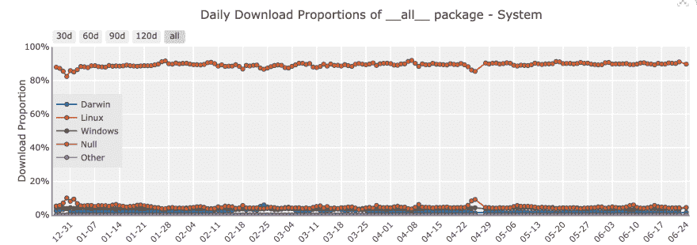
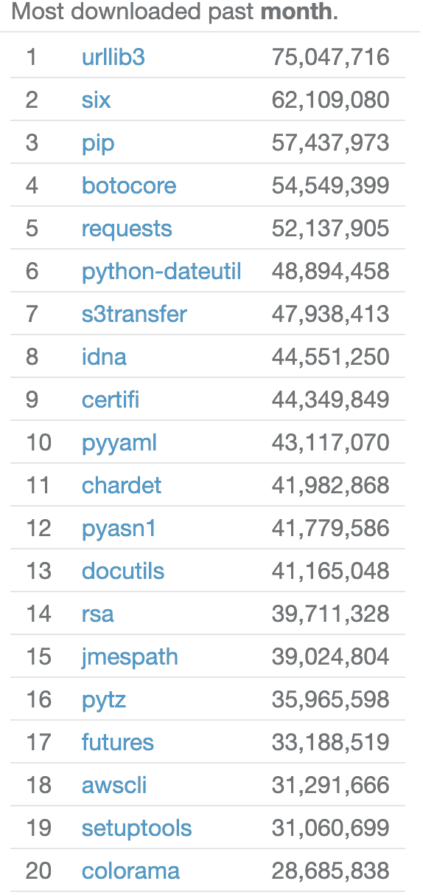
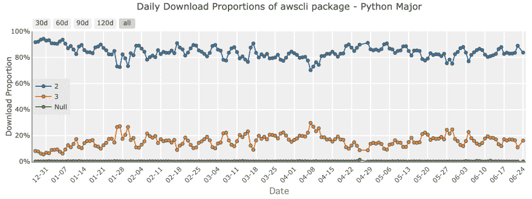

# 使用 pip3 安装 awscli

> 原文：<https://dev.to/methane/use-pip3-to-install-awscli-44pk>

> 注:AWS 提供[捆绑安装程序](https://docs.aws.amazon.com/cli/latest/userguide/install-bundle.html)。比`pip install awscli`好多了，尤其是当你在 EC2 上安装 awscli 的时候。

众所周知，Python 2 将于 2020 年 1 月 1 日停产。

但是 PyPI 超过 50%的下载仍然来自 Python 2.7。此图复制自 [PyPI Stats](https://pypistats.org/packages/__all__) 。

来自 Python 2 的如此巨大的下载量给库作者带来了持续支持 Python 2 的压力。我想通过 Python 2 EOL 来减轻这种压力。

谁用 Python 2 来`pip install`这么多？这是一个暗示。

大多数下载来自 Linux，尽管大多数 Python 用户使用的是 macOS 或 Windows。我们可以假设大多数`pip install`执行是针对 CI/CD/服务器部署的。

那么下载最多的是哪些包呢？这是来自 PyPI 统计的排名:

前 20 名的所有包都是 pip，awscli，还有那些依赖！

而且 80%的`pip install awscli`都在用 Python 2！

如果你知道一些文档或模板使用 Python 2 来安装 awscli，请向作者建议使用 Python 3。

愿 Python 2 安息。