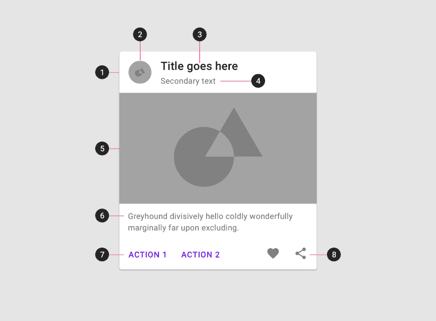
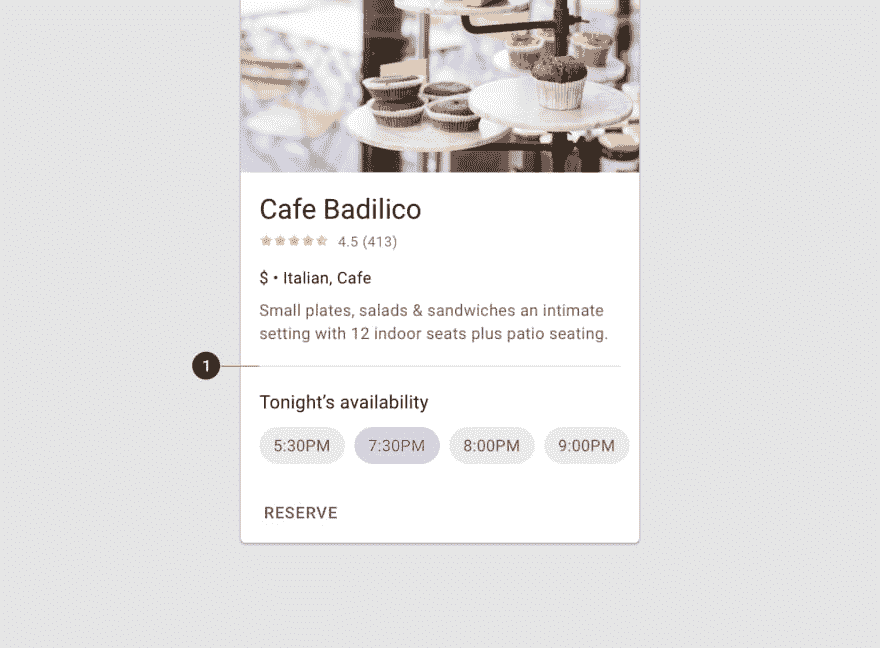

# 关于用 React 组合组件的一个注释

> 原文：<https://dev.to/mfrachet/a-note-on-composing-components-with-react-5ee4>

*最初发布于[我的博客](https://acodingdance.io/a-note-on-composing-components-with-react/)T3】*

在谈论前端框架时，我们经常听到组合。组合是一个概念，它允许通过“组装”来创建复杂的、可伸缩的 UI 组件。

几年前，Ryan Florence 制作了一个关于复合组件和拥有定义良好的可组合 API 的好处的视频。

我是一名软件开发人员，我会犯错误。几年前，我发布了 rn-placeholder ,使用了一个由于缺乏可组合性而扩展性不足的 API。

在这篇博文中，我将一路带你学习和理解拥有一个好的可组合 API 的影响，并避免我在 rn-placeholder 库上犯的错误。

## 用天真的方法实施

让我们以[材料设计卡](https://material.io/design/components/cards.html)为例。材料设计规范中的“卡”是一种使用同质 UI 表示来呈现异质内容的方式。

[](https://res.cloudinary.com/practicaldev/image/fetch/s--hK1KAlB5--/c_limit%2Cf_auto%2Cfl_progressive%2Cq_auto%2Cw_880/https://acodingdance.io/assets/mio-design_assets_1ezntdj8h1j0bfkbl23lyzewjjvmzy_uv_cards-elements-2b.png)

和一个简单的方法一样，这里是我最初定义 API 的方式:

```
<Card
  avatar="https://some/path.jpg"
  title="My title"
  subtitle="My subtitle"
  image="https://some-other/path.jpg"
  description="Super funky description"
  actionOne={() => console.log('Do job')}
  actionSecond={() => console.log('Do another job')}
  actionLike={() => console.log('Do action like')}
  actionLove={() => console.log('Do action love')}
/> 
```

Enter fullscreen mode Exit fullscreen mode

老实说，前面的代码片段是有效的代码，它可以在现实世界的应用程序中工作。

当你开始定制卡片来处理它的变化时，问题就来了。正如我上面提到的，材料设计规范中的 Card 是一种使用一些同构样式来表示异构信息的方法。

假设我们想要修改实际的卡组件，使其看起来像:

[](https://res.cloudinary.com/practicaldev/image/fetch/s--ob6aQZ_Y--/c_limit%2Cf_auto%2Cfl_progressive%2Cq_auto%2Cw_880/https://acodingdance.io/assets/mio-design_assets_0b6xusjjsulxcutqtcvl0wurpww8_cards-dividers-2.png)

保持实际的天真方法，让我们想象我们已经修改了卡组件来实现这一点:

```
<Card
  avatar="https://some/path.jpg"
  title="My title"
  subtitle="My subtitle"
  image="https://some-other/path.jpg"
  description="Super funky description"
  //actionOne={() => console.log('Do job')}
  //actionSecond={() => console.log('Do another job')}
  //actionLike={() => console.log('Do action like')}
  //actionLove={() => console.log('Do action love')}
  // new implementation
  footerTitle="Footer title"
  footerSchedules={['5pm', '7am', '2pm']}
  footerAction={() => console.log('Do footer stuff')}
/> 
```

Enter fullscreen mode Exit fullscreen mode

正如你可能已经注意到的，每次我们希望我们的卡有不同的外观，我们修改它的实现。现在想象自己是这样一个库的所有者或维护者。每次人们想要在卡片上有一个不同的组织，你应该修改你的组件，把它发布到 npm 并管理版本。

工作量很大。

## 我们做错了什么？

问题来了。目前，我们只是简单地以垂直的方式修改我们构建的组件:通过在组件上添加许多新的道具，并进行大量的条件比较来确定卡的外观和感觉。

还有一个问题。材料设计卡没有具体定义。我的意思是，它不应该提供创建`PrimaryCard`、`TinyCard`等等的方法。有了材料设计卡片的规格，你应该能够毫不费力地制作出许多不同类型的卡片。

我们到目前为止所做的实际上打破了一部分[开放封闭原则](https://en.wikipedia.org/wiki/Open%E2%80%93closed_principle)。这个原则告诉我们，一段代码应该对修改关闭，对扩展开放(也称为继承或组合)。

这个想法是为了避免创建一个包含许多复杂事物的单一“事物”,而是通过创建多个实体来分离关注点。

## 材质设计卡片使用构图

我们有更多处理 React 组件的经验，我们知道我们现在做的还不够好。没关系，我们将看到如何使用 React 的可组合特性来改进卡组件 API。

首先，值得注意的是，一个 UI 不一定意味着一个组件。并不总是一对一的匹配。如果你想了解更多关于以更抽象的方式构建复杂用户界面的信息，我邀请你阅读 Brad Frost Atomic Design。

我们将要实现的设计可能不是最好的，但它很好地展示了 React 中合成的好处。

我已经以一种可组合的方式拆分了卡片组件，所以如果我们想创建一个新的 UI，就不必修改它的实现:

```
<Card>
  <CardHeader title="My title" subtitle="subtitle" avatar={pathToImage} />
  <CardMedia source={pathToImage} />
  <CardContent>Some content with descriptions</CardContent>
  <CardActions>
    <IconButton name="favorite" onClick={handleFav} />
    <IconButton name="star" onClick={handleStar} />
  </CardActions>
</Card> 
```

Enter fullscreen mode Exit fullscreen mode

使用这种方法，我们可以制作任何类型的卡片:

[](https://res.cloudinary.com/practicaldev/image/fetch/s--7dJE-7Bu--/c_limit%2Cf_auto%2Cfl_progressive%2Cq_auto%2Cw_880/https://acodingdance.io/assets/cards003.png)

## 我依赖的气味

这是一种利用可组合性来避免 React 中复杂和不可维护的组件的方法。

将来，如果你有一些开始增长的组件，这里是我的“技巧”或者至少代码的味道(它是固执己见的，取决于用例)表明我必须把我的组件分割成更可组合的东西:

*   如果一个组件有超过 5-6 个道具
*   如果一个组件包含超过 100 行代码
*   我可以提取这个组件并在另一个应用程序中重用它吗？
*   我必须调整(或者我能调整)底层组件的道具吗？(详见本期 [rn-placeholder#38](https://github.com/mfrachet/rn-placeholder/issues/38) )
*   我可以将底层组件移动到父组件中的其他位置吗(顶部或底部)？

但是要小心！你必须在完全可组合和易于使用之间找到恰当的平衡。记住抽象并不总是一件好事。

如果您发现自己写了大量的代码来创建一个您只使用一次的组件，那么可能没有必要去寻找一个好的抽象。然而，如果它是一个将存在于多个地方的组件，并且可能会根据形状而移动，那么在实现时，您可能需要三思。

不要忘了使用新的可组合 API，我们可以创建一个看起来像旧的组件！

快乐编码😊 🎉！