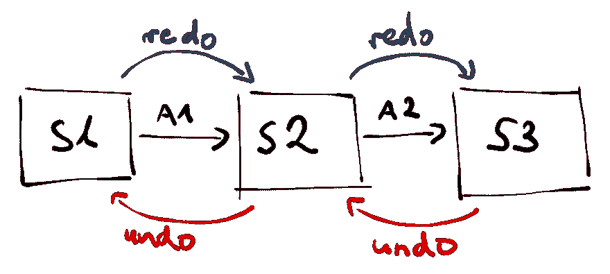
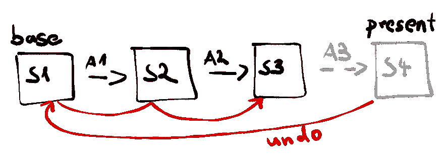
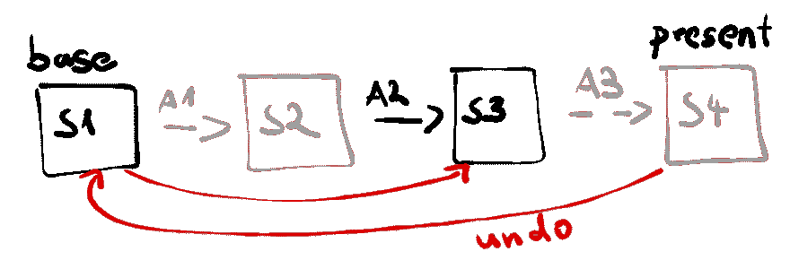

# 用 NgRx 或 Redux 实现撤销-重做

> 原文：<https://dev.to/angular/implementing-undo-redo-with-ngrx-or-redux-47oc>

<small>*原载于[nils-mehl horn . de](https://nils-mehlhorn.de/posts/angular-undo-redo-ngrx-redux)2019 年 6 月 20 日*</small>

拥有撤销你的行为的能力早已从一个[有吸引力的产品质量](https://en.wikipedia.org/wiki/Kano_model)变成了一个必须的。人们只是希望任何合理复杂的工具都具有这种容错能力。然而，正如在软件开发中经常发生的那样，不断增长的用户期望很难轻易实现。在这篇文章中，我们将看看你如何在下一个 Angular 应用中实现撤销-重做。

<figure>

[](https://res.cloudinary.com/practicaldev/image/fetch/s--4BUhiopR--/c_limit%2Cf_auto%2Cfl_progressive%2Cq_auto%2Cw_880/https://thepracticaldev.s3.amazonaws.com/i/1h43p2bk68pibmqscm7y.png)

<figcaption>Undo & redo allow you to traverse an application's state history parallel from the main application flow</figcaption>

</figure>

其核心是，一般的撤销-重做特性可以被描述为返回到以前的应用程序状态的能力，并且一旦到了以前的状态，就转而前进到将来的状态。听起来很简单，对吗？大多数人的工作流程都继承了这一点，以至于你认为这是理所当然的。然而，当轮到您将逻辑放在`Ctrl+Z`和`Ctrl+Y`之后时，您可能会大吃一惊:如果您没有提前计划，就没有——也可能没有——可插拔的解决方案。

谈到 web 应用程序中的应用程序状态，很快就会想到 Redux 模式。Redux 通过其[三大原则](https://redux.js.org/introduction/three-principles)提供了良好的基础:

**1。事实的单一来源:**通过将整个应用程序状态放在一个地方——商店——我们可以很好地掌握过去、现在和未来的状态。

**2。状态是只读的:**我们不用担心状态被破坏。

**3。用纯函数进行改变:**状态以确定的方式突变，我们可以很容易地替换整个状态。

当你在应用程序中寻找撤销重做的方法时，你很快就会在 [Redux](https://redux.js.org/) 结束——它是角度的对等物 [NgRx](https://ngrx.io/) 。这是一个提前计划的好方法，然而，正如我们将要看到的，它可能无法满足你所有的现成需求。

为了有一个可插拔的解决方案，撤销-重做可能最好
分别作为 Redux 或 NgRx 的[中间件](https://redux.js.org/advanced/middleware)或[元缩减器](https://ngrx.io/guide/store/metareducers)来实现。因此，让我们看看三种不同的方法来做到这一点。

## 切换状态

对于工作中的撤销-重做功能，我们希望恢复过去和未来的状态。有了 NgRx 和 Redux，最直接的解决方案似乎是记忆应用程序的存储内容。这种方法的数据结构可以是这样的:

```
interface History {
  past: Array<State>
  present: State
  future: Array<State>
} 
```

<svg width="20px" height="20px" viewBox="0 0 24 24" class="highlight-action crayons-icon highlight-action--fullscreen-on"><title>Enter fullscreen mode</title></svg> <svg width="20px" height="20px" viewBox="0 0 24 24" class="highlight-action crayons-icon highlight-action--fullscreen-off"><title>Exit fullscreen mode</title></svg>

该功能将实现类似于我们想要实现的。我们会在用户交互时不断地将状态保存到过去的堆栈中，并在发出撤销动作时替换当前状态。当这种情况发生时，我们将当前状态保存到未来堆栈，以便在调度重做操作时再次应用它。我们的中间件或元缩减器可以处理撤销和重做操作，如下所示:

```
const undoRedo = (reducer) => {
  let history = {
    past: [], 
    present: initialState, 
    future: []
  }
  return (state, action) => {
      switch (action.type) {
        case 'UNDO':
          // use first past state as next present ...
          const previous = history.past[0]
          // ... and remove from past
          const newPast = history.past.slice(1)
          history = {
            past: newPast,
            present: previous,
            // push present into future for redo
            future: [history.present, ...history.future]
          }
          return previous
        case 'REDO':
          // use first future state as next present ...
          const next = history.future[0]
          // ... and remove from future
          const newFuture = history.future.slice(1)
          history = {
            // push present into past for undo
            past: [history.present, ...history.past],
            present: next,
            future: newFuture
          }
          return next
        default:
          // derive next state
          const newPresent = reducer(state, action)
          history = {
              // push previous present into past for undo
              past: [history.present, ...history.past],
              present: newPresent,
              future: [] // clear future
          }
          return newPresent
      }
  }
} 
```

<svg width="20px" height="20px" viewBox="0 0 24 24" class="highlight-action crayons-icon highlight-action--fullscreen-on"><title>Enter fullscreen mode</title></svg> <svg width="20px" height="20px" viewBox="0 0 24 24" class="highlight-action crayons-icon highlight-action--fullscreen-off"><title>Exit fullscreen mode</title></svg>

这种方法类似于 [memento 模式](https://en.wikipedia.org/wiki/Memento_pattern)——一种实现撤销-重做的常用工具。虽然它确实有效，但也有一些缺陷:

它会变大。你基本上是在增加你的应用程序的状态。根据您想要应用撤销-重做的范围，这将最终使用比实际需要多得多的内存。大多数情况下，一次转变只会改变你状态的一小部分。记录状态的每一个比特都是低效的。

要么全有，要么全无。您不能将撤销-重做限制于某些操作。假设您从 S1 州开始，通过一个可撤销的用户交互移动到 S2 州。接下来你从 S2 搬到 S3，通过一些你不想被撤销的动作。如果你现在在撤销时回到 S1 状态，你将会丢失从 S2 到 S3 的过渡中引入的改变。你可以通过仔细的减速器组合来克服这个[问题](https://github.com/omnidan/redux-undo/issues/106)，尽管有时候这可能有点难以实现。

<figure>

[](https://res.cloudinary.com/practicaldev/image/fetch/s--XbfFxFDu--/c_limit%2Cf_auto%2Cfl_progressive%2Cq_auto%2Cw_880/https://thepracticaldev.s3.amazonaws.com/i/vykfyflzxi9rlklaa6aj.png)

<figcaption>When only A1 is an undoable action, you'll loose the green circle introduced by A2</figcaption>

</figure>

尽管有这些权衡，[认可的库](https://github.com/omnidan/redux-undo/)使用主 Redux 库实现撤销-重做，而[使用这种方法](https://redux.js.org/recipes/implementing-undo-history)。对 NgRx 来说没有什么大的，但是一些较小的也在使用这种方法。

## 重复历史

减速器只是纯函数。基于分派的动作计算下一个状态可以在任何时候确定性地重复，并具有相同的结果。看看下面的插图。动作 A1 将我们的州 S1 更改为 S2。同样，动作 A2 和 A3 过渡到 S3 和 S4。保存了基本状态 S1 和所有中间动作后，我们可以通过将 A1 和 A2 应用到 S1 来重新计算 S3。

<figure>

[](https://res.cloudinary.com/practicaldev/image/fetch/s--RIDboU_j--/c_limit%2Cf_auto%2Cfl_progressive%2Cq_auto%2Cw_880/https://thepracticaldev.s3.amazonaws.com/i/i8nkbfn2gcn2bawcht88.png)

<figcaption>Using actions to calculate the last state effectively replays the application's history</figcaption>

</figure>

因此，为了启用撤销，我们还可以跟踪任何调度的动作，重放除最后一个动作之外的所有动作，这样我们就可以向前迈一步。只看撤销部分，对应的数据结构可能如下所示，其中我们将应用的动作推送到一个列表，并保存一个基础状态，用于重新计算。

```
interface History {
  actions: Array<Action> // actions since base
  base: State // base state representing the furthest point we can go back
} 
```

<svg width="20px" height="20px" viewBox="0 0 24 24" class="highlight-action crayons-icon highlight-action--fullscreen-on"><title>Enter fullscreen mode</title></svg> <svg width="20px" height="20px" viewBox="0 0 24 24" class="highlight-action crayons-icon highlight-action--fullscreen-off"><title>Exit fullscreen mode</title></svg>

最后一个状态的计算可能是这样的:

```
const lastState = () => history.actions
    .slice(0, -1) // every action except the last one
    .reduce((state, action) => reducer(state, action), history.base) 
```

<svg width="20px" height="20px" viewBox="0 0 24 24" class="highlight-action crayons-icon highlight-action--fullscreen-on"><title>Enter fullscreen mode</title></svg> <svg width="20px" height="20px" viewBox="0 0 24 24" class="highlight-action crayons-icon highlight-action--fullscreen-off"><title>Exit fullscreen mode</title></svg>

Redux 类似于[命令模式](https://en.wikipedia.org/wiki/Command_pattern)，它的动作充当命令。因此，这种撤销-重做的方法充当了某种*重放命令模式*。

同样，这种方法是可行的，并且分别有用于 Redux 和 NgRx 的库。它甚至可以更轻量级，因为动作通常比整个应用程序状态更轻。然而，根据你的 reducer 逻辑，仅仅为了知道一秒钟前你在哪里，从开始递归地重新计算状态**可能是昂贵的**。但是与第一种方法相比，我们可以在重新计算期间保留某些操作，以有效地防止它们被撤消- **不再需要全有或全无**。如果我们的例子中的动作 A2 不被撤销，我们将在重新计算时保留它，因此只跳过 A1。

<figure>

[](https://res.cloudinary.com/practicaldev/image/fetch/s--9ibPTmNV--/c_limit%2Cf_auto%2Cfl_progressive%2Cq_auto%2Cw_880/https://thepracticaldev.s3.amazonaws.com/i/a82yeazk6sxyi4xx27ue.png)

<figcaption>Recalculation allows us to alter history and thus keep certain actions from being undone</figcaption>

</figure>

然而，实现所有这些可能会变得混乱，我们只涉及了一个方向。虽然绝对有可能使用[重新计算的方法来实现撤销和重做](https://github.com/JannicBeck/undox)，但对我来说这有点太复杂了。这也可能是我找不到 NgRx 库的一个原因。

## 状态不断变化

尽管 redux 中的动作可能类似于命令，但是对于使用命令模式的[常见撤销-重做实现，我们还需要它们的逆操作:返回路径，每个状态转换的返回路径。幸运的是，有一种比实现反向减速器更简单的方法来改进我们的方法。Redux 或 NgRx 中的状态可能被认为是不可变的，但是 reducers 随着时间的推移有效地改变了它们——只是没有重用同一个对象。你可以在一个所谓的](https://www.codeproject.com/Articles/33384/Multilevel-Undo-and-Redo-Implementation-in-Cshar-2) [JSON 补丁](https://tools.ietf.org/html/rfc6902) :
中跟踪这些变化

```
// initial state
const S1 = { "foo": "bar" }

// JSON Patch representing what reducer did to change the state
const patch = [
  { "op": "add", "path": "/baz", "value": "qux" }
]

// result state when applying patch to S1
const S2 = { "foo": "bar", "baz": "qux" } 
```

<svg width="20px" height="20px" viewBox="0 0 24 24" class="highlight-action crayons-icon highlight-action--fullscreen-on"><title>Enter fullscreen mode</title></svg> <svg width="20px" height="20px" viewBox="0 0 24 24" class="highlight-action crayons-icon highlight-action--fullscreen-off"><title>Exit fullscreen mode</title></svg>

更好的是:有一些库为你构建了这些补丁，而且你很可能已经在使用其中的一个——即 [immer](https://github.com/immerjs/immer) 。该库被广泛用于确保状态不变性，同时能够使用其他可变的 JavaScript APIs。immer 不仅会从您的过渡中创建补丁，还会为您提供相应的反向补丁。继续上面的例子，你可以很容易地从相应的状态转换中使用逆向补丁来撤销一个动作:

```
// result state from before
const S2 = { "foo": "bar", "baz": "qux" }

// JSON Patch representing the reverse of what reducer did to change the state
const inversePatch = [
  { "op": "remove", "path": "/baz" }
]

// resulting initial state when applying inversePatch to S2
const S1 = { "foo": "bar" } 
```

<svg width="20px" height="20px" viewBox="0 0 24 24" class="highlight-action crayons-icon highlight-action--fullscreen-on"><title>Enter fullscreen mode</title></svg> <svg width="20px" height="20px" viewBox="0 0 24 24" class="highlight-action crayons-icon highlight-action--fullscreen-off"><title>Exit fullscreen mode</title></svg>

在此基础上，我们可以从这些补丁中构建我们的历史:

```
interface Patches {
  patches: Patch[]
  inversePatches: Patch[]
}

interface History {
  undone: Patches[]
  undoable: Patches[]
} 
```

<svg width="20px" height="20px" viewBox="0 0 24 24" class="highlight-action crayons-icon highlight-action--fullscreen-on"><title>Enter fullscreen mode</title></svg> <svg width="20px" height="20px" viewBox="0 0 24 24" class="highlight-action crayons-icon highlight-action--fullscreen-off"><title>Exit fullscreen mode</title></svg>

相应的中间件或元缩减器可以遵循下面的思路——假设底层的缩减器将转发 immer 生成的所需补丁。

```
import { applyPatches } from 'immer'

const undoRedo = (reducer) => {
  let history = {
    undone: [],
    undoable: []
  }
  return (state, action) => {
      switch (action.type) {
        case 'UNDO':
          // patches from last action
          const lastPatches = history.undoable[0] 
          // push patches over so they can be used for redo
          history = {
            undone: [lastPatches, ...history.undone],
            undoable: history.undoable.slice(1),
          }
          // derive state before last action by applying inverse patches
          return applyPatches(state, lastPatches.inversePatches)
        case 'REDO':
          // patches from last undone action
          const nextPatches = history.undone[0] 
          // push patches over so they can be used for undo
          history = {
            undoable: [nextPatches, ...history.undoable],
            undone: history.undone.slice(1)
          }
          // derive state before undo (or after original action) by applying patches
          return applyPatches(state, nextPatches.patches)
        default:
          return reducer(state, action, (patches, inversePatches) => {
            // record patches through reducer callback
            history = {
              undoable: [
                {patches, inversePatches},
                ...history.undoable
              ],
              undone: [] // clear redo stack
            }
          })
      }
  }
} 
```

<svg width="20px" height="20px" viewBox="0 0 24 24" class="highlight-action crayons-icon highlight-action--fullscreen-on"><title>Enter fullscreen mode</title></svg> <svg width="20px" height="20px" viewBox="0 0 24 24" class="highlight-action crayons-icon highlight-action--fullscreen-off"><title>Exit fullscreen mode</title></svg>

使用这种方法，您可以避免记忆整个应用程序状态时的内存开销，也可以避免重新计算最后一个状态时的计算开销。通过使用必要的信息，你的实现可以是最轻量级的。就像以前的方法一样，它**不必是全有或全无**。如果你想从撤销-重做功能中忽略一个动作，你可以在撤销或重做时忽略它的补丁。

## 底线

我希望我能够让您对使用 NgRx 或 Redux 的应用程序中的撤销-重做操作有所了解。如前所述，任何方法基本上都可以让你达到目的——只是有不同的含义。通过使用库或自己制作原型来尝试它们，看看什么最适合你。

在最近的一个用例中，我发现基于补丁的方法最适合我，这促使我创建了库 [ngrx-wieder](https://github.com/nilsmehlhorn/ngrx-wieder) 用于 ngrx。它还允许你合并动作的连续变化，并跟踪你是否可以撤销或重做。这里有一个关于 StackBlitz 的例子:
[https://stackblitz.com/edit/ngrx-wieder-app?embed=1&view=preview&](https://stackblitz.com/edit/ngrx-wieder-app?embed=1&view=preview&)