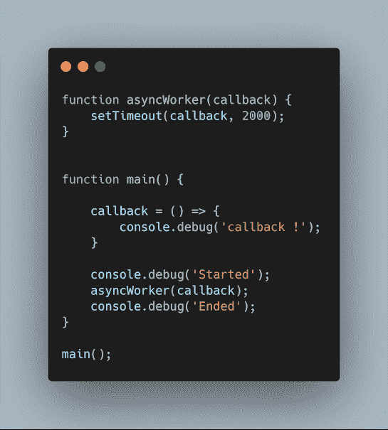
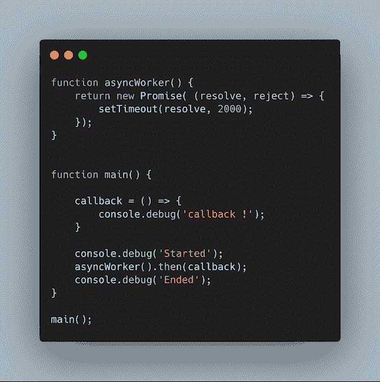
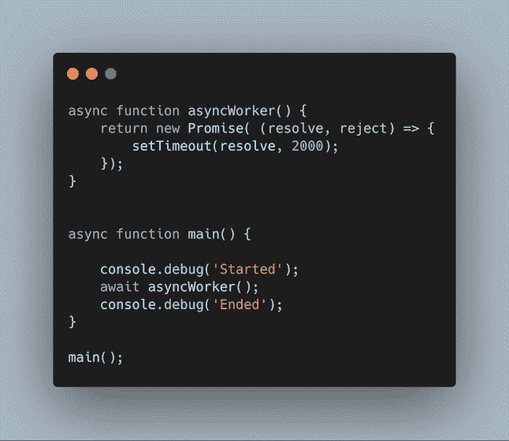
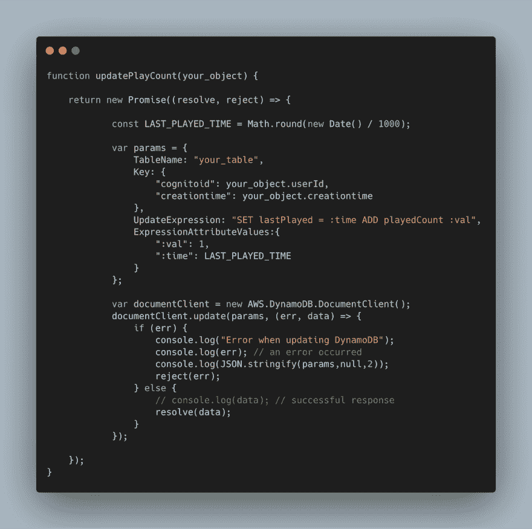

# Javascript 中的主异步 API 调用

> 原文：<https://dev.to/sebsto/master-asynchronous-api-calls-in-javascript-j51>

我经常回复 Javascript [编程问题](https://stackoverflow.com/questions/55060415/connect-aws-mobile-backend-to-dynamodb?noredirect=1#comment96870590_55060415)关于缺乏对大多数 Javascript API 的异步本质和编写异步代码的正确方法的理解的问题。通过搜索引擎找到的一些文档或示例已经过时，不能反映 2019 年的语言功能和最佳实践。

有许多好的博客文章，比如这篇文章，来解释异步编码的概念，甚至描述正确使用[承诺模式](https://www.promisejs.org/patterns/)，我不想写一篇“我也是”的文章，而是只关注三个代码样本:好的、坏的和难看的。或者我应该说:现代，古老和古董？

因此，使用三个简单的代码样本，让我们看看如何重构代码，从回调方法(丑陋的)，到使用`.then()`构造的承诺方法(糟糕的)，再到使用`async` / `await`关键字的现代承诺方法(编写现代代码的正确方法)。

最古老和传统的方法是将回调函数传递给异步函数。一旦终止，异步函数将简单地调用您的回调函数。请不要再这样做了。

[](https://res.cloudinary.com/practicaldev/image/fetch/s--ZuAu1d7R--/c_limit%2Cf_auto%2Cfl_progressive%2Cq_auto%2Cw_880/https://thepracticaldev.s3.amazonaws.com/i/7ynn9dv84x8hqf6u7d7e.png)T3】

```
$ node async_demo_1.js
Started
Ended
callback ! 
```

([代码](https://gist.github.com/sebsto/14d230185dbead90adb6a29fc2f410e9))

注意`callback`在`Ended`之后被调用，因为在`asyncWorker()`执行的同时程序继续执行。

为了避免必须管理回调地狱，许多编程语言现在提出了承诺的概念。将旧的基于回调的代码转换成承诺很容易:

*   立即返回一个`new Promise()`对象。
*   Promise 构造函数接受一个函数参数:`(resolve, reject) => { ... }`
*   当结果可用时，调用`resolve(return_value)`或在出错时调用`reject(reason)`

[](https://res.cloudinary.com/practicaldev/image/fetch/s--Wtt4t5lz--/c_limit%2Cf_auto%2Cfl_progressive%2Cq_auto%2Cw_880/https://thepracticaldev.s3.amazonaws.com/i/na6dlrotli3bpr2rxg4m.png)T3】

```
$ node async_demo_2.js
Started
Ended
callback ! 
```

([代码](https://gist.github.com/sebsto/028d23a01c93b7d15aa349c81feba819))

通知`callback`仍然在`Ended`之后被调用。还要注意异步函数会立即返回一个`Promise`对象。

这简化了很多异步代码的编写，但是你仍然会以`.then().catch()`噩梦结束。因此，要删除这些`.then().catch()`，最后的转换步骤是将您的代码迁移到`await` / `async`关键字，如下所示。

[](https://res.cloudinary.com/practicaldev/image/fetch/s--Nd2ChVy0--/c_limit%2Cf_auto%2Cfl_progressive%2Cq_auto%2Cw_880/https://thepracticaldev.s3.amazonaws.com/i/s13ynaa7fnreuwg0w11x.png)T3】

```
$ node async_demo_3.js
Started
callback !
Ended 
```

([代码](https://gist.github.com/sebsto/382b0d41ee933ea5f512d1c2e1be2707))

请注意，输出现在符合逻辑顺序。`await`阻止执行，直到该函数完成。还要注意，对异步函数所做的惟一更改是在其开头添加了关键字`async`。

最后，让我们看看如何用[AWS SDK for Javascript](https://aws.amazon.com/sdk-for-node-js/){:target = " _ blank " }和`async`和`await`包装 AWS 服务调用。下面是一个 [DynamoDB](https://aws.amazon.com/dynamodb/getting-started/) [`update`](https://docs.aws.amazon.com/AWSJavaScriptSDK/latest/AWS/DynamoDB/DocumentClient.html#update-property) 的例子。

[](https://res.cloudinary.com/practicaldev/image/fetch/s--BYyJGTEl--/c_limit%2Cf_auto%2Cfl_progressive%2Cq_auto%2Cw_880/https://thepracticaldev.s3.amazonaws.com/i/tm8fcer2c3kw1wz7waoe.png)

([代码](https://gist.github.com/sebsto/96595219569f2335891d00415e2d1569))

想法是一样的:函数立即返回一个`Promise`。然后，您的函数使用回调来调用 AWS SDK。成功的回调最终调用`resolve(<any data>)`将结果传递回调用者。出错时，错误处理代码调用`reject()`。

总结一下，一旦你知道怎么做，从回调到`async` / `await`是非常简单的。既然看了这篇短文，就没有理由不去做:-)。所有[浏览器的最新版本](https://developer.mozilla.org/en-US/docs/Web/JavaScript/Reference/Statements/async_function#Browser_compatibility)都包含了对这些结构的支持，从版本 7.6.0 开始 NodeJS 也是如此。