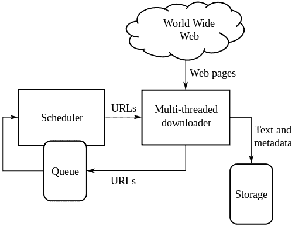
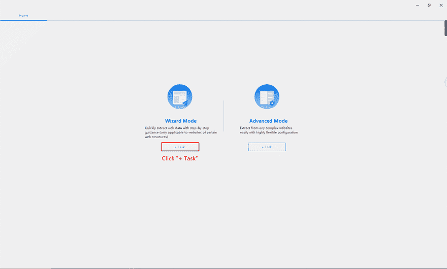

# 如何从头开始构建网络爬虫——初学者指南

> 原文：<https://dev.to/octoparse2019/how-to-build-a-web-crawler-from-scratch-a-guide-for-beginners-37oe>

今天生活在一个数字化的世界里，无疑在许多方面让我们的生活变得更加容易，因为互联网成为我们几乎可以找到所有需要的东西的最终来源；这种数字化转型给如何评估、收集、存储和分析数据带来了新的挑战。

根据 We Are Social 和 Hootsuite 发布的 2018 年全球数字报告，全球互联网用户数量刚刚超过 40 亿，比 2017 年增长 7%。人们正以前所未有的速度转向在线选项，我们在互联网上所做的所有这些正在产生大量的“用户数据”，就像我们所说的那样，比如评论、酒店预订、购买记录，简直是数不清的例子。毫不奇怪，互联网现在是分析市场趋势、监视你的竞争对手或简单地获取你需要的销售线索数据的最佳场所。访问、聚集和分析来自万维网的数据的能力已经成为做出良好的和数据驱动的商业决策所需要掌握的关键技能。

构建网络爬虫，有时也被称为蜘蛛或蜘蛛机器人，是聚合大数据集的一种智能方法。在本文中，我将解决以下问题:

1)什么是网络爬虫？

2)网络爬虫能做什么？

3)作为初学者如何搭建一个网络爬虫？

**1)什么是网络爬虫？**

网络爬虫是一种互联网机器人，它通过在互联网上索引网站的内容来工作。它是用计算机语言编写的程序或脚本，可以自动从互联网上抓取任何信息或数据。该机器人扫描并抓取每个所需页面上的某些信息，直到所有合格的页面都被处理。

[](https://res.cloudinary.com/practicaldev/image/fetch/s--B_Soqy3M--/c_limit%2Cf_auto%2Cfl_progressive%2Cq_auto%2Cw_880/https://www.octoparse.com/media/6221/11.jpg)

根据应用场景的不同，网络爬虫大致有 4 种结构:通用网络爬虫、聚焦网络爬虫、增量网络爬虫和深度网络爬虫。

**通用网络爬虫**

通用网络爬虫从一组特定的 URL 中收集尽可能多的页面来抓取大规模的数据和信息。运行通用网络爬虫需要高网速和大存储空间。首先，它是为搜索引擎和网络服务提供商收集大量数据而构建的。

**聚焦网络爬虫**

聚焦网络爬虫指的是选择性地爬行与预定义主题相关的页面的网络爬虫。与通用的网络爬虫相比，聚焦爬虫只需要抓取与预先定义的主题相关的页面。因此，它能够在较小的存储空间和较慢的网速下运行良好。

一般来说，这类网络爬虫是搜索引擎的重要组成部分之一，如 Google、Yahoo、百度等。

**增量网络爬虫**

增量式网络爬虫是一种只抓取网页中新生成信息的爬虫。由于增量爬虫只抓取新生成或更新的信息，不重新下载没有变化的信息，因此可以有效地节省抓取时间和存储空间。

**深度网络爬虫**

网页可分为表层网页和深层网页(也称隐形网页或隐藏网页)。表面页面是可以被传统搜索引擎索引的页面，或者是可以通过超链接到达的静态页面。Deep Web 是大部分内容无法通过静态链接获取的网页。它隐藏在搜索表单的后面。用户不提交某些关键字就看不到它。例如，有些页面在注册后对用户可见。深度网络爬虫帮助我们从看不见的网页中抓取信息。

网络爬虫能做什么？

由于互联网和物联网的蓬勃发展，人与网络的互动无时无刻不在发生。每次我们在互联网上搜索时，网络爬虫都会帮助我们找到我们想要的信息。此外，当需要从网络上获取大量非结构化数据时，我们可以使用网络爬虫来抓取数据。

**网络爬虫作为搜索引擎的重要组成部分**

任何门户网站上的搜索引擎或搜索功能都是使用聚焦网络爬虫实现的。它帮助搜索引擎定位与搜索主题最相关的网页。

在搜索引擎的情况下，网络爬虫会有所帮助

为用户提供相关有效的内容
为所有访问过的页面创建一个副本，以备后续处理

**聚集数据集**

网络爬虫的另一个很好的用途是为学习、商业和其他目的聚集数据集。

为公司或组织了解和分析网民的行为
收集营销信息，并在短期内做出更恰当的营销决策。
从网上收集信息，分析后用于学术研究。
收集数据，分析一个行业的长期发展趋势。
监控竞争对手的实时变化

**3)初学者如何搭建网络爬虫？**

**使用计算机语言(例如:Python)**

对于任何希望使用计算机语言构建 web scraper 的非编码人员来说，与 PHP、Java、C/C++相比，Python 可能是最容易开始的语言。Python 的语法对于任何阅读英语的人来说都相当简单易读。

下面是一个用 Python 写的网络爬虫的简单例子。

导入队列

initial _ page = "[http://www.renminribao.com](http://www.renminribao.com)

url_queue = Queue。队列()

seen = set()

seen.insert(initial_page)

url_queue.put(initial_page)

while(True):

```
 if url_queue.size()>0:

        current_url = url_queue.get()

        store(current_url)

        for next_url in extract_urls(current_url):

              if next_url not in seen:

                   seen.put(next_url)

                   url_queue.put(next_url)

   else:

          break 
```

作为不懂编程的初学者，绝对要求我们花时间和精力学习 Python，然后自己写一个网络爬虫。整个学习过程可能会持续几个月。

**使用网页抓取工具(例如:octoporse)**

当一个初学者想在合理的时间内建立一个网络爬虫时，像 Octoparse 这样的可视化网络抓取软件是一个可以考虑的好选择。这是一个免费版本的免费网页抓取工具。与其他网络抓取工具相比，对于任何希望快速抓取网站数据的人来说，Octoparse 都是一个经济高效的解决方案。【[五大网页抓取工具对比](https://www.octoparse.com/blog/top-5-web-scraping-tools-comparison)】。

**如何在 Octoparse 中“构建网络爬虫”？**

**1。一键式刮削的模板模式**

模板模式是网页抓取中最简单的方式。我们需要做的是选择一个模板并点击几个按钮。

[](https://res.cloudinary.com/practicaldev/image/fetch/s--K24BS5h7--/c_limit%2Cf_auto%2Cfl_progressive%2Cq_66%2Cw_880/https://www.octoparse.com/media/6941/walmart.gif)

**2。易于刮擦的向导模式**

向导模式将指导用户一步一步地抓取 Octoparse 中的数据，它提供了三个预建的模板——“列表或表格”、“列表和明细”和“单页”。如果预先构建的模板能够满足我们的需要，我们可以在下载 Octoparse 后点击几下就可以轻松地在 Octoparse 中构建一个“网络爬虫”。

[](https://res.cloudinary.com/practicaldev/image/fetch/s--T03JZmLg--/c_limit%2Cf_auto%2Cfl_progressive%2Cq_66%2Cw_880/https://www.octoparse.com/media/6233/%25E5%2590%2591%25E5%25AF%25BC%25E6%25A8%25A1%25E5%25BC%258F.gif)

**3。复杂网页抓取的高级模式**

由于一些网站的结构非常复杂，向导模式无法帮助我们收集所有想要的数据。因此，我们最好使用高级模式，它在抓取数据方面更加强大和灵活。

这里有一个例子:[https://www.youtube.com/watch?v=b7eX7xInIVc&t =](https://www.youtube.com/watch?v=b7eX7xInIVc&t=)

**4)结论**

新技术的顶端。网页抓取是一种获取你需要的数据的有效方式，网页抓取可以通过计算机语言如 python 或网页抓取软件如 Octoparse 等等来实现。

学习新事物和用数据智能增强我们的能力总是令人兴奋的。在这篇文章的最后，我将为那些想学习更多关于网络抓取或通过网络抓取器抓取数据的人提供一些进一步的阅读材料。