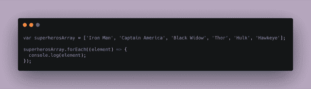
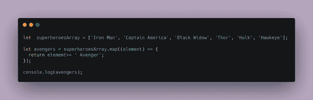
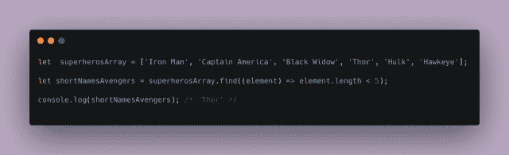
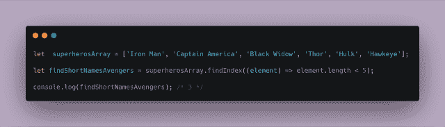
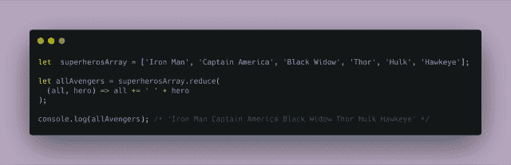
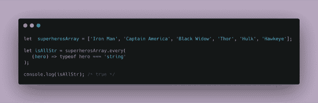
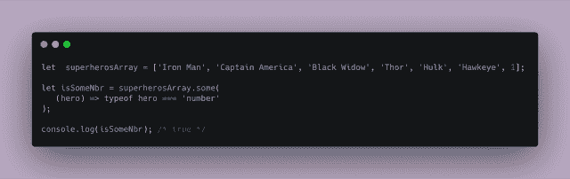

# The Array Iterators Cheatsheet (JavaScript)

> 原文：[https://dev.to/ale3oula/the-array-iterators-cheatsheet-javascript-2h8e](https://dev.to/ale3oula/the-array-iterators-cheatsheet-javascript-2h8e)

Hi! 😄 I created some superhero examples for understanding some of the most popular built-in iterators in JS! 😄

These built-in methods help us iterate through arrays and are called iteration methods or iterators. **Iterators are methods that are called on arrays to manipulate elements and return some values.**

**Array.forEach()**

Method name: forEach
Returns: undefined

--

This method executes a snippet of code (or a function) once for every element of an array.

For example:

The forEach method is called for the superheroes array. The argument of forEach() method is a *callback* function. This function is executed for every element of the array. Each element is passed as an argument to this callback function.

**Array.map()**

Method Name: map
Returns: A new array

--

This method **returns a new array** with the updated elements after calling a callback function on every element in the array.

The map method is called on the superheroes array. This method has as an argument a callback function. Map returns a *new* array, which has the string 'Avengers' concatenated in the original values! The original array doesn't change.

**Array.filter()**

Method name: filter
Returns: A new array

--

This method checks each element in an array to see if it meets a condition. It returns a new array with the elements that meet the condition.

The callback function for the .filter() method should return true or false depending on if the element length is shorter than 5\.
**The elements that cause the callback function to return true are added to the new array.**

**Array.find()**

Method name: find
Returns: The value of the first occurrence of the element, undefined if the element doesn't exist

--

This method returns the **value** of the *first* element of an array which satisfies a condition. The method will return *undefined* if none of the elements satisfies this condition.

**Array.findIndex()**

Method name: findIndex
Returns: The index of the first occurrence of the element, -1 if the element doesn't exist

--

Similar to find method. Their difference is that this method returns the **index** of the first element of an array which satisfies the condition set. The method will return *-1* if none of the elements satisfies the condition.

**Array.reduce()**

Method name: reduce
Returns: A single value

--

The reduce method is used to reduce the array to a single value. It executes a provided function for each value of the array (from left-to-right). The return value of the function is stored in an accumulator.

In this example, Reduce accepts two parameters, the accumulator (all) and the current element (hero). The reduce method iterates through each element in the array as a for-loop. In the accumulator, we store the concatenated string.

**Array.every()**

Method name: every
Returns: boolean

--

The 'every' method tests if all elements in the array pass a condition. The return value is a boolean.

**Array.some()**

Method name: some
Returns: boolean

--

The 'some' method tests if some of the elements in the array pass a condition. The return value is a boolean.

Hope you like it! 🦊