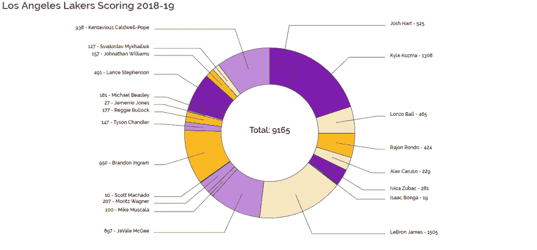
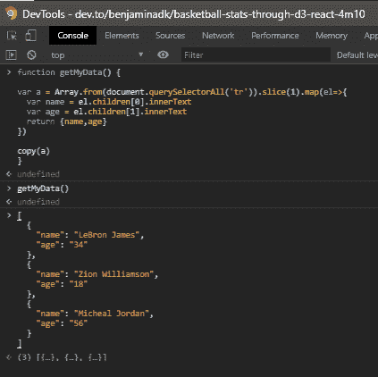

# 通过 D3 和 React 的篮球统计

> 原文：<https://dev.to/benjaminadk/basketball-stats-through-d3-react-4m10>

[](https://res.cloudinary.com/practicaldev/image/fetch/s--2gQFG5BL--/c_limit%2Cf_auto%2Cfl_progressive%2Cq_auto%2Cw_880/https://thepracticaldev.s3.amazonaws.com/i/cof58zsskyfyif4ub93k.png)

制作一个*甜甜圈图*来可视化 2018-19 赛季**洛杉机湖人**篮球队的总得分。

# 数据

我们创建数据可视化首先需要的不是巧合，是数据。这篇写得很好的文章解释了网络抓取的一些法律和道德分歧。[这个存储库](https://github.com/awesomedata/awesome-public-datasets)提供免费公共数据的链接。 **Dev.to** 本身就有很多关于数据、web 抓取器和可视化的文章。我的意见是，对于简单的数据可视化项目，老式的 Chrome Devtools 本身就足以收集和整理数据。看看这个过于简化的例子。

| 名字 | 年龄 |
| --- | --- |
| 勒布朗·詹姆斯 | Thirty-four |
| 锡安·威廉森 | Eighteen |
| 迈克尔·乔丹 | fifty-six |

根据上表，以下是处理数据的步骤:

1.  打开 **Chrome Devtools**
2.  隔离所有表格行
3.  将结果从一个*节点列表*转换成一个*数组*并删除标题行
4.  从每个表格数据单元格提取文本，并将结果映射到一个新的对象数组
5.  键入`c`(变量名)并按下`Enter`，您的新数组将显示在控制台中
6.  右键单击阵列并选择`Store as Global Variable`。您将看到`temp1`出现在控制台中。
7.  使用内置的`copy`函数将临时变量复制到剪贴板- `copy(temp1)`
8.  将你的数据粘贴到一个 **JavaScript** 或 **JSON** 文件中。
9.  🤯

```
var a = document.querySelectorAll('tr') // 2
var b = Array.from(a).slice(1) // 3
var c = b.map(el => {
  // 4
  var name = el.children[0].innerText
  var age = el.children[1].innerText
  return { name, age }
})

c // 5
// right click array
copy(temp1) // 7 
```

<svg width="20px" height="20px" viewBox="0 0 24 24" class="highlight-action crayons-icon highlight-action--fullscreen-on"><title>Enter fullscreen mode</title></svg> <svg width="20px" height="20px" viewBox="0 0 24 24" class="highlight-action crayons-icon highlight-action--fullscreen-off"><title>Exit fullscreen mode</title></svg>

请注意，每个场景都是不同的，这个示例被简化以帮助解释这个过程。此外，上述所有逻辑都可以放在一个函数中，以简化流程。记住，您可以在控制台中通过使用`Shift+Enter`创建新行来创建多行功能。通过这种方法，我们有了相当于用 **JavaScript** 101 手动抓取网页的功能。在去不应该去的地方获取数据之前，一定要阅读网站的*服务条款*。

[](https://res.cloudinary.com/practicaldev/image/fetch/s--B1G9vcrB--/c_limit%2Cf_auto%2Cfl_progressive%2Cq_auto%2Cw_880/https://thepracticaldev.s3.amazonaws.com/i/vtojf81pxsrfj6q30wtj.png)

# 创建一个圆环图

让 **D3** 和**反应**一起工作其实并没有那么复杂。通常，所需要的只是 DOM 的入口点和一些在页面加载时初始化可视化的逻辑。为了开始我们的示例项目，我们希望安装`create-react-app`。第一步是创建一个新项目。我喜欢做的第一件事是清空`src`目录，只留下`App.js`和`index.js`。不要忘记删除任何旧的`import`声明。在我们写任何代码之前，我们需要捕捉一些依赖关系。

1-下载 **D3** 和**风格组件**。

```
npm i d3 styled-components 
```

<svg width="20px" height="20px" viewBox="0 0 24 24" class="highlight-action crayons-icon highlight-action--fullscreen-on"><title>Enter fullscreen mode</title></svg> <svg width="20px" height="20px" viewBox="0 0 24 24" class="highlight-action crayons-icon highlight-action--fullscreen-off"><title>Exit fullscreen mode</title></svg>

2-在`src`目录下创建一个新文件`whatever-you-want.js`，甚至是`data.js`。示例中使用的数据可在本要点中[获得。](https://gist.github.com/benjaminadk/45f2349ab415a334be4374b5fffd4884)

3-创建一些基本的样板文件，可以用这种配置用于各种项目-也就是 **D3** + **React** + **风格的组件**。我鼓励你调整你认为合适的任何东西，就像大多数开发者一样，我有我自己的快克和模式。举个例子，我被`#000000`黑色困扰，所以我用`#333333`，我喜欢字体`Raleway`，等等。如果你以前没有使用过*钩子*，带有空`[]`依赖数组的`useEffect`钩子类似于 **React** 类组件中的`componentDidMount`。编号的注释对应于接下来的步骤，是插入这些步骤的代码的地方。

```
import React, { useRef, useEffect, useState } from 'react'
import * as d3 from 'd3'
import styled, { createGlobalStyle } from 'styled-components'
import data from './data'

const width = 1000
const height = 600
const black = '#333333'
const title = 'My Data Visualization'

// 4

// 7

export const GlobalStyle = createGlobalStyle`
@import url('https://fonts.googleapis.com/css?family=Raleway:400,600&display=swap');

body {
  font-family: 'Raleway', Arial, Helvetica, sans-serif;
  color: ${black};
  padding: 0;
  margin: 0;
}
`

export const Container = styled.div`
  display: grid;
  grid-template-rows: 30px 1fr;
  align-items: center;
  .title {
    font-size: 25px;
    font-weight: 600;
    padding-left: 20px;
  }
`

export const Visualization = styled.div`
  justify-self: center;
  width: ${width}px;
  height: ${height}px;
// 6
`

export default () => {
  const visualization = useRef(null)

  useEffect(() => {
    var svg = d3
      .select(visualization.current)
      .append('svg')
      .attr('width', width)
      .attr('height', height)
// 5

// 8
  }, [])

  return (
    <>
      <GlobalStyle/>
      <Container>
        <div className='title'>{title}</div>
        <Visualization ref={visualization} />
        {/*10*/}
      </Container>
    <>
  )
} 
```

<svg width="20px" height="20px" viewBox="0 0 24 24" class="highlight-action crayons-icon highlight-action--fullscreen-on"><title>Enter fullscreen mode</title></svg> <svg width="20px" height="20px" viewBox="0 0 24 24" class="highlight-action crayons-icon highlight-action--fullscreen-off"><title>Exit fullscreen mode</title></svg>

4-我们需要为我们的*圆环图*建立一个配色方案和一些尺寸。

我们糕点的半径。

```
const radius = Math.min(width, height) / 2 
```

<svg width="20px" height="20px" viewBox="0 0 24 24" class="highlight-action crayons-icon highlight-action--fullscreen-on"><title>Enter fullscreen mode</title></svg> <svg width="20px" height="20px" viewBox="0 0 24 24" class="highlight-action crayons-icon highlight-action--fullscreen-off"><title>Exit fullscreen mode</title></svg>

只有使用湖人的颜色主题才有意义。

```
var lakersColors = d3
  .scaleLinear()
  .domain([0, 1, 2, 3])
  .range(['#7E1DAF', '#C08BDA', '#FEEBBD', '#FDBB21']) 
```

<svg width="20px" height="20px" viewBox="0 0 24 24" class="highlight-action crayons-icon highlight-action--fullscreen-on"><title>Enter fullscreen mode</title></svg> <svg width="20px" height="20px" viewBox="0 0 24 24" class="highlight-action crayons-icon highlight-action--fullscreen-off"><title>Exit fullscreen mode</title></svg>

**D3** `pie`函数将我们的数据映射到饼图切片中。这是通过在幕后添加字段如`startAngle`和`endAngle`来实现的。我们使用一个可选的`sort`函数来打乱切片的顺序。玩玩这个，通过它`null`或者甚至不通过它来得到不同的安排。最后，我们使用`value`函数告诉 **D3** 使用`points`属性来分割馅饼。将`pie`变量记录到控制台，以帮助概念化 **D3** pie 函数对我们的数据做了什么。

```
var pie = d3
  .pie()
  .sort((a, b) => {
    return a.name.length - b.name.length
  })
  .value(d => d.points)(data) 
```

<svg width="20px" height="20px" viewBox="0 0 24 24" class="highlight-action crayons-icon highlight-action--fullscreen-on"><title>Enter fullscreen mode</title></svg> <svg width="20px" height="20px" viewBox="0 0 24 24" class="highlight-action crayons-icon highlight-action--fullscreen-off"><title>Exit fullscreen mode</title></svg>

现在我们需要使用`arc`函数创建圆形布局。变量`arc`用于我们的*甜甜圈图*，`outerArc`稍后将用作标签的向导。`getMidAngle`也是稍后要使用的帮助功能。

```
var arc = d3
  .arc()
  .outerRadius(radius * 0.7)
  .innerRadius(radius * 0.4)

var outerArc = d3
  .arc()
  .outerRadius(radius * 0.9)
  .innerRadius(radius * 0.9)

function getMidAngle(d) {
  return d.startAngle + (d.endAngle - d.startAngle) / 2
} 
```

<svg width="20px" height="20px" viewBox="0 0 24 24" class="highlight-action crayons-icon highlight-action--fullscreen-on"><title>Enter fullscreen mode</title></svg> <svg width="20px" height="20px" viewBox="0 0 24 24" class="highlight-action crayons-icon highlight-action--fullscreen-off"><title>Exit fullscreen mode</title></svg>

有了一个合适的结构，你几乎可以在屏幕上看到一些东西。

将以下链接到我们最初的`svg`变量声明。

```
 .append('g')
   .attr('transform', `translate(${width / 2}, ${height / 2})`) 
```

<svg width="20px" height="20px" viewBox="0 0 24 24" class="highlight-action crayons-icon highlight-action--fullscreen-on"><title>Enter fullscreen mode</title></svg> <svg width="20px" height="20px" viewBox="0 0 24 24" class="highlight-action crayons-icon highlight-action--fullscreen-off"><title>Exit fullscreen mode</title></svg>

现在，当我们将`pie`反馈给 **D3** 时，神奇的事情发生了。

```
svg
  .selectAll('slices')
  .data(pie)
  .enter()
  .append('path')
  .attr('d', arc)
  .attr('fill', (d, i) => lakersColors(i % 4))
  .attr('stroke', black)
  .attr('stroke-width', 1) 
```

<svg width="20px" height="20px" viewBox="0 0 24 24" class="highlight-action crayons-icon highlight-action--fullscreen-on"><title>Enter fullscreen mode</title></svg> <svg width="20px" height="20px" viewBox="0 0 24 24" class="highlight-action crayons-icon highlight-action--fullscreen-off"><title>Exit fullscreen mode</title></svg>

接下来，我们需要从每个切片中画出最终指向标签的线。名为`centroid`的函数返回一个带有`[x,y]`坐标的数组，该数组指向`arc`内`pie`切片(在本例中为`d`)的中心点。最后，我们返回一个由三个坐标数组组成的数组，它们对应于现在出现在屏幕上的每条线的原点、弯曲点和终点。`midAngle`有助于确定线尾指向哪个方向。

```
svg
  .selectAll('lines')
  .data(pie)
  .enter()
  .append('polyline')
  .attr('stroke', black)
  .attr('stroke-width', 1)
  .style('fill', 'none')
  .attr('points', d => {
    var posA = arc.centroid(d)
    var posB = outerArc.centroid(d)
    var posC = outerArc.centroid(d)
    var midAngle = getMidAngle(d)
    posC[0] = radius * 0.95 * (midAngle < Math.PI ? 1 : -1)
    return [posA, posB, posC]
  }) 
```

<svg width="20px" height="20px" viewBox="0 0 24 24" class="highlight-action crayons-icon highlight-action--fullscreen-on"><title>Enter fullscreen mode</title></svg> <svg width="20px" height="20px" viewBox="0 0 24 24" class="highlight-action crayons-icon highlight-action--fullscreen-off"><title>Exit fullscreen mode</title></svg>

现在我们的生产线已经准备好贴标签了。通过根据标签出现在图表的哪一侧来翻转`name`和`points`的顺序，增加一些对称性，标签看起来更好。注意，`pie`函数将我们原来的`data`移到了名为`data`的键中。`pie`对象的顶层键包含在`getMidAngle`功能中使用的角度测量值。

```
svg
  .selectAll('labels')
  .data(pie)
  .enter()
  .append('text')
  .text(d => {
    var midAngle = getMidAngle(d)
    return midAngle < Math.PI
      ? `${d.data.name} - ${d.data.points}`
      : `${d.data.points} - ${d.data.name}`
  })
  .attr('class', 'label')
  .attr('transform', d => {
    var pos = outerArc.centroid(d)
    var midAngle = getMidAngle(d)
    pos[0] = radius * 0.99 * (midAngle < Math.PI ? 1 : -1)
    return `translate(${pos})`
  })
  .style('text-anchor', d => {
    var midAngle = getMidAngle(d)
    return midAngle < Math.PI ? 'start' : 'end'
  }) 
```

<svg width="20px" height="20px" viewBox="0 0 24 24" class="highlight-action crayons-icon highlight-action--fullscreen-on"><title>Enter fullscreen mode</title></svg> <svg width="20px" height="20px" viewBox="0 0 24 24" class="highlight-action crayons-icon highlight-action--fullscreen-off"><title>Exit fullscreen mode</title></svg>

6-为了用某种风格润色我们的标签，我们只需要给`Visualization`风格的组件添加几行代码。使用 **D3** 在 **React** `useEffect`钩子中添加了一个`class`属性，然后使用**样式的组件**定义了那个类，看起来像是选中了集成库的复选框。

```
.label {
  font-size: 12px;
  font-weight: 600;
} 
```

<svg width="20px" height="20px" viewBox="0 0 24 24" class="highlight-action crayons-icon highlight-action--fullscreen-on"><title>Enter fullscreen mode</title></svg> <svg width="20px" height="20px" viewBox="0 0 24 24" class="highlight-action crayons-icon highlight-action--fullscreen-off"><title>Exit fullscreen mode</title></svg>

7-我们看起来很好，但为什么不添加更多的味道，给用户一个互动的感觉。我们可以使用 **D3** 中的`sum`函数快速获取总得分。

```
var total = d3.sum(data, d => d.points) 
```

<svg width="20px" height="20px" viewBox="0 0 24 24" class="highlight-action crayons-icon highlight-action--fullscreen-on"><title>Enter fullscreen mode</title></svg> <svg width="20px" height="20px" viewBox="0 0 24 24" class="highlight-action crayons-icon highlight-action--fullscreen-off"><title>Exit fullscreen mode</title></svg>

8-`showTotal`函数将简单地添加一个`text`节点来显示我们的总数。`middle`的`text-anchor`样式属性应该使文本在我们的*圆环*孔内居中。`hideTotal`功能马上就要发挥作用了。注意，我们调用了`showTotal`函数来确保页面加载时显示文本。

```
function showTotal() {
  svg
    .append('text')
    .text(`Total: ${total}`)
    .attr('class', 'total')
    .style('text-anchor', 'middle')
}

function hideTotal() {
  svg.selectAll('.total').remove()
}

showTotal() 
```

<svg width="20px" height="20px" viewBox="0 0 24 24" class="highlight-action crayons-icon highlight-action--fullscreen-on"><title>Enter fullscreen mode</title></svg> <svg width="20px" height="20px" viewBox="0 0 24 24" class="highlight-action crayons-icon highlight-action--fullscreen-off"><title>Exit fullscreen mode</title></svg>

我们应该在步骤 6 中的`label`类旁边为`total`添加另一个类。

```
.total {
  font-size: 20px;
  font-weight: 600;
} 
```

<svg width="20px" height="20px" viewBox="0 0 24 24" class="highlight-action crayons-icon highlight-action--fullscreen-on"><title>Enter fullscreen mode</title></svg> <svg width="20px" height="20px" viewBox="0 0 24 24" class="highlight-action crayons-icon highlight-action--fullscreen-off"><title>Exit fullscreen mode</title></svg>

在这一点上，编号的评论系统有点粗糙，但是如果你已经做到了这一步，你就足够聪明去跟随它。接下来的这些功能可以放在`hideTotal`下面。这些是我们将应用于每个切片的侦听器。

```
function onMouseOver(d, i) {
  hideTotal()
  setPlayer(d.data)
  d3.select(this)
    .attr('fill', d3.rgb(lakersColors(i % 4)).brighter(0.5))
    .attr('stroke-width', 2)
    .attr('transform', 'scale(1.1)')
}

function onMouseOut(d, i) {
  setPlayer(null)
  showTotal()
  d3.select(this)
    .attr('fill', lakersColors(i % 4))
    .attr('stroke-width', 1)
    .attr('transform', 'scale(1)')
} 
```

<svg width="20px" height="20px" viewBox="0 0 24 24" class="highlight-action crayons-icon highlight-action--fullscreen-on"><title>Enter fullscreen mode</title></svg> <svg width="20px" height="20px" viewBox="0 0 24 24" class="highlight-action crayons-icon highlight-action--fullscreen-off"><title>Exit fullscreen mode</title></svg>

当一个切片被悬停时，笔画和填充将被强调，轻微的放大将增加一个酷的效果。总点数文本也将被切换，这样我们就可以将一个包含更多信息的工具提示放在洞里。首先我们需要创建一个`state`，如果没有它，一个**反应**应用会是什么样子。

```
const [player, setPlayer] = useState(null) 
```

<svg width="20px" height="20px" viewBox="0 0 24 24" class="highlight-action crayons-icon highlight-action--fullscreen-on"><title>Enter fullscreen mode</title></svg> <svg width="20px" height="20px" viewBox="0 0 24 24" class="highlight-action crayons-icon highlight-action--fullscreen-off"><title>Exit fullscreen mode</title></svg>

敏锐的观察者可能已经注意到了对`this`的引用，并想知道发生了什么。下面的侦听器需要被添加到`slices` **D3** 链的末尾。

```
 .attr('class', 'slice')
   .on('mouseover', onMouseOver)
   .on('mouseout', onMouseOut) 
```

<svg width="20px" height="20px" viewBox="0 0 24 24" class="highlight-action crayons-icon highlight-action--fullscreen-on"><title>Enter fullscreen mode</title></svg> <svg width="20px" height="20px" viewBox="0 0 24 24" class="highlight-action crayons-icon highlight-action--fullscreen-off"><title>Exit fullscreen mode</title></svg>

因为我们在`slice`类上使用了一个`transform`，所以让我们通过`Visualization`风格的组件中的另外几行来控制它。

```
.slice {
  transition: transform 0.5s ease-in;
} 
```

<svg width="20px" height="20px" viewBox="0 0 24 24" class="highlight-action crayons-icon highlight-action--fullscreen-on"><title>Enter fullscreen mode</title></svg> <svg width="20px" height="20px" viewBox="0 0 24 24" class="highlight-action crayons-icon highlight-action--fullscreen-off"><title>Exit fullscreen mode</title></svg>

10-我们现在可以创建工具提示来显示`player`状态，它随着单个切片的鼠标移动而改变。

```
{
  player ? (
    <Tooltip>
      <div>
        <span className='label'>Name: </span>
        <span>{player.name}</span>
        <br />
        <span className='label'>Points: </span>
        <span>{player.points}</span>
        <br />
        <span className='label'>Percent: </span>
        <span>{Math.round((player.points / total) * 1000) / 10}%</span>
      </div>
    </Tooltip>
  ) : null
} 
```

<svg width="20px" height="20px" viewBox="0 0 24 24" class="highlight-action crayons-icon highlight-action--fullscreen-on"><title>Enter fullscreen mode</title></svg> <svg width="20px" height="20px" viewBox="0 0 24 24" class="highlight-action crayons-icon highlight-action--fullscreen-off"><title>Exit fullscreen mode</title></svg>

就新信息而言，用户只能获得当前玩家得分占球队得分的百分比。然而，由于中心位置与运动相结合，产生了良好的效果和良好的互动感。如果有更多的信息显示或者我更聪明，类似的模式可以更有效地使用。似乎最不需要的是`Tooltip`组件，它与其他样式的组件一起出现。

```
export const Tooltip = styled.div`
  position: absolute;
  top: 50%;
  left: 50%;
  transform: translate(-50%, -50%);
  width: ${radius * 0.7}px;
  height: ${radius * 0.7}px;
  display: grid;
  align-items: center;
  justify-items: center;
  border-radius: 50%;
  margin-top: 10px;
  font-size: 12px;
  background: #ffffff;
  .label {
    font-weight: 600;
  }
` 
```

<svg width="20px" height="20px" viewBox="0 0 24 24" class="highlight-action crayons-icon highlight-action--fullscreen-on"><title>Enter fullscreen mode</title></svg> <svg width="20px" height="20px" viewBox="0 0 24 24" class="highlight-action crayons-icon highlight-action--fullscreen-off"><title>Exit fullscreen mode</title></svg>

唉，我们最终的代码应该看起来像下面这样。

```
import React, { useRef, useEffect, useState } from 'react'
import * as d3 from 'd3'
import data from './data'
import styled, { createGlobalStyle } from 'styled-components'

/**
 * Constants
 */
const width = 1000
const height = 600
const radius = Math.min(width, height) / 2
const black = '#333333'
const title = 'Los Angeles Lakers Scoring 2018-19'

/**
 * D3 Helpers
 */

// total points
var total = d3.sum(data, d => d.points)

// lakers colors
var lakersColors = d3
  .scaleLinear()
  .domain([0, 1, 2, 3])
  .range(['#7E1DAF', '#C08BDA', '#FEEBBD', '#FDBB21'])

// pie transformation
var pie = d3
  .pie()
  .sort((a, b) => {
    return a.name.length - b.name.length
  })
  .value(d => d.points)(data)

// inner arc used for pie chart
var arc = d3
  .arc()
  .outerRadius(radius * 0.7)
  .innerRadius(radius * 0.4)

// outer arc used for labels
var outerArc = d3
  .arc()
  .outerRadius(radius * 0.9)
  .innerRadius(radius * 0.9)

// midAngle helper function
function getMidAngle(d) {
  return d.startAngle + (d.endAngle - d.startAngle) / 2
}
/**
 * Global Style Sheet
 */
export const GlobalStyle = createGlobalStyle`
@import url('https://fonts.googleapis.com/css?family=Raleway:400,600&display=swap');

body {
  font-family: 'Raleway', Arial, Helvetica, sans-serif;
  color: ${black};
  padding: 0;
  margin: 0;
}
`

/**
 * Styled Components
 */
export const Container = styled.div`
  display: grid;
  grid-template-rows: 30px 1fr;
  align-items: center;
  user-select: none;
  .title {
    font-size: 25px;
    font-weight: 600;
    padding-left: 20px;
  }
`

export const Visualization = styled.div`
  justify-self: center;
  width: ${width}px;
  height: ${height}px;
  .slice {
    transition: transform 0.5s ease-in;
  }
  .label {
    font-size: 12px;
    font-weight: 600;
  }
  .total {
    font-size: 20px;
    font-weight: 600;
  }
`

export const Tooltip = styled.div`
  position: absolute;
  top: 50%;
  left: 50%;
  transform: translate(-50%, -50%);
  width: ${radius * 0.7}px;
  height: ${radius * 0.7}px;
  display: grid;
  align-items: center;
  justify-items: center;
  border-radius: 50%;
  margin-top: 10px;
  font-size: 12px;
  background: #ffffff;
  .label {
    font-weight: 600;
  }
`

export default () => {
  const [player, setPlayer] = useState(null)

  const visualization = useRef(null)

  useEffect(() => {
    var svg = d3
      .select(visualization.current)
      .append('svg')
      .attr('width', width)
      .attr('height', height)
      .append('g')
      .attr('transform', `translate(${width / 2}, ${height / 2})`)

    svg
      .selectAll('slices')
      .data(pie)
      .enter()
      .append('path')
      .attr('d', arc)
      .attr('fill', (d, i) => lakersColors(i % 4))
      .attr('stroke', black)
      .attr('stroke-width', 1)
      .attr('class', 'slice')
      .on('mouseover', onMouseOver)
      .on('mouseout', onMouseOut)

    svg
      .selectAll('lines')
      .data(pie)
      .enter()
      .append('polyline')
      .attr('stroke', black)
      .attr('stroke-width', 1)
      .style('fill', 'none')
      .attr('points', d => {
        var posA = arc.centroid(d)
        var posB = outerArc.centroid(d)
        var posC = outerArc.centroid(d)
        var midAngle = getMidAngle(d)
        posC[0] = radius * 0.95 * (midAngle < Math.PI ? 1 : -1)
        return [posA, posB, posC]
      })

    svg
      .selectAll('labels')
      .data(pie)
      .enter()
      .append('text')
      .text(d => {
        var midAngle = getMidAngle(d)
        return midAngle < Math.PI
          ? `${d.data.name} - ${d.data.points}`
          : `${d.data.points} - ${d.data.name}`
      })
      .attr('class', 'label')
      .attr('transform', d => {
        var pos = outerArc.centroid(d)
        var midAngle = getMidAngle(d)
        pos[0] = radius * 0.99 * (midAngle < Math.PI ? 1 : -1)
        return `translate(${pos})`
      })
      .style('text-anchor', d => {
        var midAngle = getMidAngle(d)
        return midAngle < Math.PI ? 'start' : 'end'
      })

    function showTotal() {
      svg
        .append('text')
        .text(`Total: ${total}`)
        .attr('class', 'total')
        .style('text-anchor', 'middle')
    }

    function hideTotal() {
      svg.selectAll('.total').remove()
    }

    function onMouseOver(d, i) {
      hideTotal()
      setPlayer(d.data)
      d3.select(this)
        .attr('fill', d3.rgb(lakersColors(i % 4)).brighter(0.5))
        .attr('stroke-width', 2)
        .attr('transform', 'scale(1.1)')
    }

    function onMouseOut(d, i) {
      setPlayer(null)
      showTotal()
      d3.select(this)
        .attr('fill', lakersColors(i % 4))
        .attr('stroke-width', 1)
        .attr('transform', 'scale(1)')
    }

    showTotal()
  }, [])

  return (
    <>
      <GlobalStyle />
      <Container>
        <div className='title'>{title}</div>
        <Visualization ref={visualization} />
        {player ? (
          <Tooltip>
            <div>
              <span className='label'>Name: </span>
              <span>{player.name}</span>
              <br />
              <span className='label'>Points: </span>
              <span>{player.points}</span>
              <br />
              <span className='label'>Percent: </span>
              <span>{Math.round((player.points / total) * 1000) / 10}%</span>
            </div>
          </Tooltip>
        ) : null}
      </Container>
    </>
  )
} 
```

<svg width="20px" height="20px" viewBox="0 0 24 24" class="highlight-action crayons-icon highlight-action--fullscreen-on"><title>Enter fullscreen mode</title></svg> <svg width="20px" height="20px" viewBox="0 0 24 24" class="highlight-action crayons-icon highlight-action--fullscreen-off"><title>Exit fullscreen mode</title></svg>

[**NBA 球员薪资&表现 2018-19(泡泡图)**](https://benjaminadk.github.io/d3-nba-salaries/)

[**灵感举例甜甜圈图**](https://www.d3-graph-gallery.com/graph/donut_label.html)