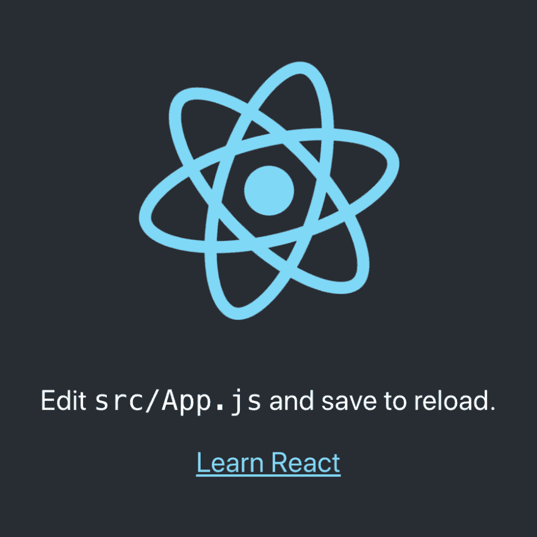
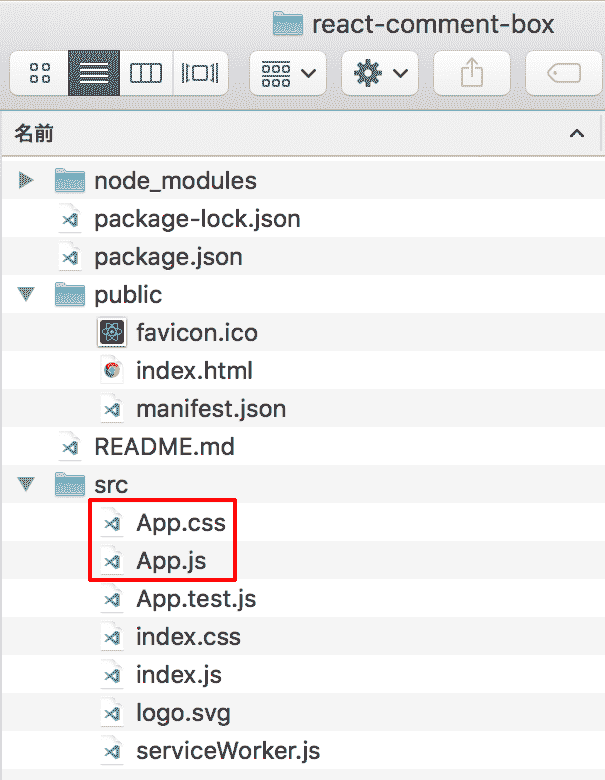
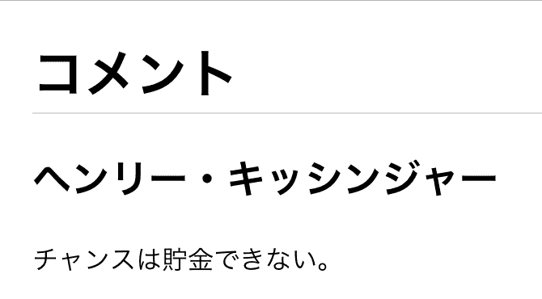
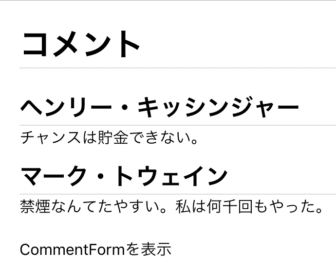

# React 入门 01 :组装组件

> 原文：<https://dev.to/gumi/react-01-2a9h>

[React](https://ja.reactjs.org/) 是 Facebook 公司正在推进开发的、关注度最高的 JavaScript 框架之一。 [将 DOM](https://developer.mozilla.org/docs/Web/API/Document_Object_Model/Introduction) ( Document Object Model )的元素与数据相关联(数据绑定)，根据数据的变化动态构成页面。

然后，将 APP 显示的功能细分为各个数据的处理和模板汇总而成的组件。 将小组件组合起来，创造出一个系统。 代码只要按每个组件确认即可，因此容易阅读，也容易维护。

只是，因为需要熟悉的句法知识和准备，所以对于初次见面的人可能会有点难以开始。 在本文中，我们将尝试组合简单的组件，创建简单的单页 APP ( spa )。

# 用 Create React App 制作 APP 应用程序的雏形

“[Create React App](https://ja.reactjs.org/docs/create-a-new-react-app.html#create-react-app) ”是制作单页面 APP 应用程序( SPA )雏形的开发环境。 将这个人偶修改成目标 APP。

首先是[Create React App 的安装](https://reactjs.org/blog/2016/07/22/create-apps-with-no-configuration.html)。 必须预先有 Node.js(npm )。 请从命令行工具在 npm 中输入以下命令:

```
npm install -g create-react-app 
```

<svg width="20px" height="20px" viewBox="0 0 24 24" class="highlight-action crayons-icon highlight-action--fullscreen-on"><title>Enter fullscreen mode</title></svg> <svg width="20px" height="20px" viewBox="0 0 24 24" class="highlight-action crayons-icon highlight-action--fullscreen-off"><title>Exit fullscreen mode</title></svg>

在`npx create-react-app`或`create-react-app`命令后输入 APP 应用程序名称，该名称将形成文件夹和 APP 应用程序的雏形。

```
npx create-react-app react-comment-box 
```

<svg width="20px" height="20px" viewBox="0 0 24 24" class="highlight-action crayons-icon highlight-action--fullscreen-on"><title>Enter fullscreen mode</title></svg> <svg width="20px" height="20px" viewBox="0 0 24 24" class="highlight-action crayons-icon highlight-action--fullscreen-off"><title>Exit fullscreen mode</title></svg>

人偶形成后，转移到 APP 软件的目录，点击`npm start`和命令，就会在本地服务器上打开人偶的页面(图 001 )。

```
cd react-comment-box
npm start 
```

<svg width="20px" height="20px" viewBox="0 0 24 24" class="highlight-action crayons-icon highlight-action--fullscreen-on"><title>Enter fullscreen mode</title></svg> <svg width="20px" height="20px" viewBox="0 0 24 24" class="highlight-action crayons-icon highlight-action--fullscreen-off"><title>Exit fullscreen mode</title></svg>

#### t0-t1■react 的雏形 APP 页

[](https://res.cloudinary.com/practicaldev/image/fetch/s--sCZnsd6g--/c_limit%2Cf_auto%2Cfl_progressive%2Cq_auto%2Cw_880/https://thepracticaldev.s3.amazonaws.com/i/ansf16dqqcbh9nfi6wso.png)

在 APP 表示的目录中，将创建以下文件(图 002 ) : 其中进行修改的是`src/App.js`和`src/App.css`。

#### [t1■002■在 APP 应用的目录中制作的文件](#%E5%9B%B3002%E2%96%A0%E3%82%A2%E3%83%97%E3%83%AA%E3%82%B1%E3%83%BC%E3%82%B7%E3%83%A7%E3%83%B3%E3%81%AE%E3%83%87%E3%82%A3%E3%83%AC%E3%82%AF%E3%83%88%E3%83%AA%E3%81%AB%E3%81%A4%E3%81%8F%E3%82%89%E3%82%8C%E3%81%9F%E3%83%95%E3%82%A1%E3%82%A4%E3%83%AB)

[](https://res.cloudinary.com/practicaldev/image/fetch/s--_3vol9TE--/c_limit%2Cf_auto%2Cfl_progressive%2Cq_auto%2Cw_880/https://thepracticaldev.s3.amazonaws.com/i/qh0mstwgukaybg2bptbn.png)

# 在 APP 情况中添加子组件

`src/App.js`是基本的组件。 雏形 APP 应用程序中还没有其他组件。 以下 JavaScript 代码的重写是一个核心框架。 首先，将样式表的文件(`App.css`)设为`import`。 函数决定组件(`App`) (请参见“[函数组件和类组件](https://ja.reactjs.org/docs/components-and-props.html#function-and-class-components)”)。 然后，必须返回[JSX](https://ja.reactjs.org/docs/glossary.html#jsx) 规定的 DOM 模板(参照[JSX 的导入](https://ja.reactjs.org/docs/introducing-jsx.html))。

```
import React from 'react';
import './App.css';

function App() {
  return (
    <div className="App"><!-- JSXのテンプレート -->
      <!-- 中略 -->
    </div>
  );
}

export default App; 
```

<svg width="20px" height="20px" viewBox="0 0 24 24" class="highlight-action crayons-icon highlight-action--fullscreen-on"><title>Enter fullscreen mode</title></svg> <svg width="20px" height="20px" viewBox="0 0 24 24" class="highlight-action crayons-icon highlight-action--fullscreen-off"><title>Exit fullscreen mode</title></svg>

JSX 的模板基本上遵循 HTML(XML )的写法。 但是，`class`属性必须更换为`className`。 应该是因为[`class`](https://developer.mozilla.org/docs/Web/JavaScript/Reference/Statements/class)成为了[ECMAScript 2015 的保留语](https://developer.mozilla.org/ja/docs/Web/JavaScript/Reference/Lexical_grammar#%E3%82%AD%E3%83%BC%E3%83%AF%E3%83%BC%E3%83%89)吧。 另外，请务必将模板合并为一个根要素。

`src/App.js`的代码改写如下。 在`import`中添加的是之后制作的子组件(`CommentList`)。 将其作为标签添加到模板中。 另外，由于不再需要文件`src/logo.svg`，所以可以从文件夹中删除。

```
import React from 'react';
import CommentList from './components/CommentList';
import './App.css';

function App() {
  return (
    <div className="App">
      <h1>コメント</h1>
      <CommentList />
    </div>
  );
}

export default App; 
```

<svg width="20px" height="20px" viewBox="0 0 24 24" class="highlight-action crayons-icon highlight-action--fullscreen-on"><title>Enter fullscreen mode</title></svg> <svg width="20px" height="20px" viewBox="0 0 24 24" class="highlight-action crayons-icon highlight-action--fullscreen-off"><title>Exit fullscreen mode</title></svg>

子组件作为`src/components/CommentList.js`，确定如下。 框架的描述是相同的，只是在模板中增加了文本元素，而不是用箭头函数表达式定义组件。

```
import React from 'react';

const CommentList = () => {
  return (
    <div className="CommentList">
      <h2 className="CommentAuthor">
      ヘンリー・キッシンジャー
      </h2>
      チャンスは貯金できない。
    </div>
  );
};

export default CommentList; 
```

<svg width="20px" height="20px" viewBox="0 0 24 24" class="highlight-action crayons-icon highlight-action--fullscreen-on"><title>Enter fullscreen mode</title></svg> <svg width="20px" height="20px" viewBox="0 0 24 24" class="highlight-action crayons-icon highlight-action--fullscreen-off"><title>Exit fullscreen mode</title></svg>

CSS 文件`src/App.css`改写为以下代码 001。 之后用的班也已经加了。 用浏览器重新读取的话，页面会被重新画出来吧。 您应该会看到子组件(`CommentList`)的文本(图 003 )。

#### 代码 001■ `src/App.css`

```
h1 {
  border-bottom: 1px solid #ddd;
}
.App {
    margin-left: 20px;
    margin-right: 20px;
}
.CommentList {
  margin-bottom: 10px;
}
.CommentForm {
  margin-top: 20px;
}
.CommentForm input {
  font-size: 12px;
}
.Comment {
  margin-bottom: 10px;
  font-size: 16px;
}
.CommentAuthor {
  border-bottom: 1px solid #ddd;
  margin: 0;
}
.CommentText {
  display: flex;
  align-items: center;
} 
```

<svg width="20px" height="20px" viewBox="0 0 24 24" class="highlight-action crayons-icon highlight-action--fullscreen-on"><title>Enter fullscreen mode</title></svg> <svg width="20px" height="20px" viewBox="0 0 24 24" class="highlight-action crayons-icon highlight-action--fullscreen-off"><title>Exit fullscreen mode</title></svg>

#### t0-t1 -在■页中显示子组件的文本

[](https://res.cloudinary.com/practicaldev/image/fetch/s--oA7WyMnW--/c_limit%2Cf_auto%2Cfl_progressive%2Cq_auto%2Cw_880/https://thepracticaldev.s3.amazonaws.com/i/gdkxx1qvo05pkjatvi6y.png)

# 进一步切出组件

在组件`src/components/CommentList.js`的模板中添加的`<div>`要素(`className`属性`CommentList`)打算设为多个列表。 为此，把这个部分切出别的组件(`Comment`)吧。 然后，除了`<h2>`要素之外的文本作为属性(`author`)提供给标签。 可以从子组件中检索此值。

```
import Comment from './Comment';

const CommentList = () => {
  return (
    <div className="CommentList">
      {/* <h2 className="CommentAuthor">
      ヘンリー・キッシンジャー
      </h2>
      チャンスは貯金できない。 */}
      <Comment author="ヘンリー・キッシンジャー">チャンスは貯金できない。</Comment>
      <Comment author="マーク・トウェイン">禁煙なんてたやすい。私は何千回もやった。</Comment>
    </div>
  );
}; 
```

<svg width="20px" height="20px" viewBox="0 0 24 24" class="highlight-action crayons-icon highlight-action--fullscreen-on"><title>Enter fullscreen mode</title></svg> <svg width="20px" height="20px" viewBox="0 0 24 24" class="highlight-action crayons-icon highlight-action--fullscreen-off"><title>Exit fullscreen mode</title></svg>

要剪切的子组件`src/components/Comment.js`的定义如以下代码 002 所示。 子组件的函数在参数(`props`)中接收父模板提供的值(请参见[函数和类组件](https://ja.reactjs.org/docs/components-and-props.html#function-and-class-components))。 属性值为属性名称，子元素为`props.children`，如以下代码 002 所示，请参见括号`{}`(请参阅“[子元素的输出( Containment )](https://ja.reactjs.org/docs/composition-vs-inheritance.html#containment)”)。 `{}`中被评价为 JavaScript 代码。

#### 代码 002■ `src/components/Comment.js`

```
import React from 'react';

const Comment = (props) => {
  return (
    <div className="Comment">
      <h2 className="CommentAuthor">
      {props.author}
      </h2>
      {props.children}
    </div>
  );
};

export default Comment; 
```

<svg width="20px" height="20px" viewBox="0 0 24 24" class="highlight-action crayons-icon highlight-action--fullscreen-on"><title>Enter fullscreen mode</title></svg> <svg width="20px" height="20px" viewBox="0 0 24 24" class="highlight-action crayons-icon highlight-action--fullscreen-off"><title>Exit fullscreen mode</title></svg>

# 再添加一个子组件

再添加一个子组件(`CommentForm`)到原始的 APP 应用程序(`src/App.js`)中吧。

```
import CommentForm from './components/CommentForm';

function App() {
  return (
    <div className="App">

      <CommentForm />
    </div>
  );
} 
```

<svg width="20px" height="20px" viewBox="0 0 24 24" class="highlight-action crayons-icon highlight-action--fullscreen-on"><title>Enter fullscreen mode</title></svg> <svg width="20px" height="20px" viewBox="0 0 24 24" class="highlight-action crayons-icon highlight-action--fullscreen-off"><title>Exit fullscreen mode</title></svg>

在`src/components/CommentForm.js`中写入的，如以下代码 003 所示，还是虚拟状态。

#### 代码 003■ `src/components/CommentForm.js`

```
import React from 'react';

const CommentForm = () => {
  return (
    <div className="CommentForm">
      CommentFormを表示
    </div>
  );
};

export default CommentForm; 
```

<svg width="20px" height="20px" viewBox="0 0 24 24" class="highlight-action crayons-icon highlight-action--fullscreen-on"><title>Enter fullscreen mode</title></svg> <svg width="20px" height="20px" viewBox="0 0 24 24" class="highlight-action crayons-icon highlight-action--fullscreen-off"><title>Exit fullscreen mode</title></svg>

现在，页面上将显示两组拆分为组件的注释，以及随后添加的组件虚拟文本(图 004 )。

#### t0004■两对评论和虚拟文本显示在页面上

[](https://res.cloudinary.com/practicaldev/image/fetch/s--GXDSGVLu--/c_limit%2Cf_auto%2Cfl_progressive%2Cq_auto%2Cw_880/https://thepracticaldev.s3.amazonaws.com/i/fneykf4h0nz3qpbat99g.png)

以下汇总登载修改后的`src/App.js`(代码 004 )和`src/components/CommentList.js`(代码 005 )。

#### 代码 004■ `src/App.js`

```
import React from 'react';
import CommentList from './components/CommentList';
import CommentForm from './components/CommentForm';
import './App.css';

function App() {
  return (
    <div className="App">
      <h1>コメント</h1>
      <CommentList />
      <CommentForm />
    </div>
  );
}

export default App; 
```

<svg width="20px" height="20px" viewBox="0 0 24 24" class="highlight-action crayons-icon highlight-action--fullscreen-on"><title>Enter fullscreen mode</title></svg> <svg width="20px" height="20px" viewBox="0 0 24 24" class="highlight-action crayons-icon highlight-action--fullscreen-off"><title>Exit fullscreen mode</title></svg>

#### 代码 005■ `src/components/CommentList.js`

```
import React from 'react';
import Comment from './Comment';

const CommentList = () => {
  return (
    <div className="CommentList">
      <Comment author="ヘンリー・キッシンジャー">チャンスは貯金できない。</Comment>
      <Comment author="マーク・トウェイン">禁煙なんてたやすい。私は何千回もやった。</Comment>
    </div>
  );
};

export default CommentList; 
```

<svg width="20px" height="20px" viewBox="0 0 24 24" class="highlight-action crayons-icon highlight-action--fullscreen-on"><title>Enter fullscreen mode</title></svg> <svg width="20px" height="20px" viewBox="0 0 24 24" class="highlight-action crayons-icon highlight-action--fullscreen-off"><title>Exit fullscreen mode</title></svg>