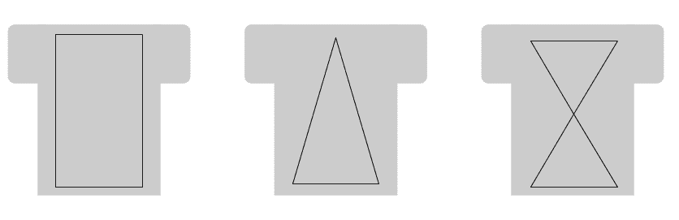

# 是的，它不仅仅是一件衬衫

> 原文：<https://dev.to/googlecloud/yes-it-s-more-than-a-shirt-2bfi>

## *快速指南更多*包容性大礼包

*问题*:给一件衣服分配二元性别信息，让我们的团队成员很难找到最适合自己的。这种性别划分也限定了项目大小的分布范围。当会员很难找到某一性别的尺寸时，他们会被引导到“另一”性别，这可能会导致个人痛苦和“被他人”的感觉。

*解决方案*:有一个直截了当的解决方案。停止分发“男性”和“女性”物品。

1/描述服装的剪裁:“直筒剪裁”、“合身剪裁”、“锥形剪裁”，用图表显示服装本身的区别，不要用可能暗示性别的体型或图像。几何形状在这里很有用。

 
**几何形状有助于人们找到裁剪合适的衬衫**

2/要求所有想要团队纪念品的团队成员通过匿名调查提交他们喜欢的服装尺寸，并提供更多明确的信息。使用一定范围的尺寸或测量值，匿名化信息并保留总体尺寸信息。

3/所有尺寸都很重要。如果我们点一份，我们就点所有的。仅与提供特定尺寸小批量产品的公司合作，以确保*所有*团队成员都能获得适合他们的切割+尺寸。(这可能意味着以一种特定的尺寸订购< 5 件商品。这些项目的成本低于一个团队成员的排除成本。)

注意:我知道大型第三方活动更难做到这一点。然而，对于第一方+团队活动，它应该在团队的能力+预算范围内，以确保我们购买+规模适当。排除的成本比一件衣服的成本还高。