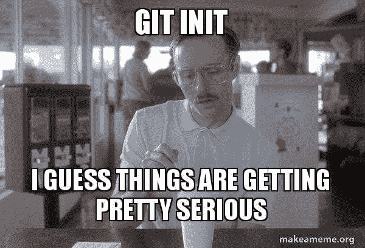

# 用 Git 给你的项目拍快照

> 原文：<https://dev.to/iam_timsmith/take-snapshots-of-your-project-with-git-1439>

Git 是一个工具，它允许你给你的项目拍快照。我将向您展示如何开始使用 git，这样您就可以改进您的工作流程。

如果你和我以前一样，你的硬盘会被同一个项目的几个不同的副本占用。每一个都代表了你所做的一系列不同的改变，所以你可以有不同的版本而不会搞砸不同的版本。虽然我有正确的想法，但我的执行力很差。

如果您已经在开发领域工作了一段时间，您可能听说过 Git。如果您刚开始做开发人员，那么让我第一个欢迎您，告诉您学习 Git 是一项很好的投资。我认为这是你可以学到的最重要的东西之一。不需要很长时间就能让基本面降下来，但很快就会有回报。

[](https://res.cloudinary.com/practicaldev/image/fetch/s--GQrng_jV--/c_limit%2Cf_auto%2Cfl_progressive%2Cq_auto%2Cw_880/https://www.iamtimsmith.com/static/526f2d86ad144dc3266fafde485aae9b/82472/napoleon-meme.jpg)

今天我们将介绍这些基础知识，这样你就可以开始在你的项目中使用 git，为你自己节省大量的时间、精力和硬盘空间。我们开始吧！

## 什么是 git？

在我们开始讨论如何使用 git 之前，我们应该先讨论一下 Git 是什么。Git 是一个帮助您组织变更、创建发布以及在项目中与其他人协作的系统。Git 项目可以存储在本地(仅在您的机器上)或远程(在线，如 GitHub、BitBucket 或 GitLab ),这取决于您想用它做什么。

在项目中使用版本控制允许您制作项目的副本，进行并测试您的更改，然后将其与原始副本合并。这里的好处是，在我们将它添加到原始项目之前，我们可以看到它正在工作，所以我们不会破坏已经在工作的东西。

## 在你的机器上安装 git

在您的机器上安装 git 通常是一项非常简单的任务。有一些不同的工具可以用来在您的计算机上安装 git，所以我将简要地讨论其中的每一个。

### 带有自制软件的 MacOS

我喜欢在我的 mac 上使用家酿软件，这让我可以快速轻松地安装软件包。要安装 Homebrew，只需[访问他们的网站](https://brew.sh/)并复制代码中显示“安装 brew”的那一行。然后你可以把它粘贴到你的终端，点击回车，让它做它的事情。

一旦安装了 brew，就可以运行下面的命令来安装 git:

```
$ brew install git 
```

Enter fullscreen mode Exit fullscreen mode

### 带安装程序的窗口

在 Windows 机器上安装 git 可以通过访问[https://gitforwindows.org/](https://gitforwindows.org/)来完成。在那里，您可以找到一个下载链接，引导您完成安装。

### 带 apt-get 的 Linux

如果你在一台装有 apt-get 的 Linux 机器上工作，你可以在你的终端上运行下面的命令，并完成所有的设置:

```
$ sudo apt-get install git 
```

Enter fullscreen mode Exit fullscreen mode

### 确保安装了 git

作为确保安装正确的最后检查，您可以转到您的终端(不考虑操作系统)并运行以下命令:

```
git --version 
```

Enter fullscreen mode Exit fullscreen mode

这将显示您已经安装的 git 的当前版本。如果您得到一个错误，那么 git 没有正确安装。一旦您确认已经正确安装了 git，您就可以继续下一节，在这里我将开始进入一些命令。

## git 中的基本命令

在 git 项目中，有几个基本命令您会一直用到。在本节中，我们将回顾这些命令，以便您可以开始自己的项目。

### 创建项目

在您真正开始在您的项目中利用 git 之前，您必须初始化它。这样做非常简单，因为它只需要两个字的命令:

```
git init 
```

Enter fullscreen mode Exit fullscreen mode

运行这个命令将创建一个名为`.git`的新目录，我们的提交历史将存储在这个目录中。现在您可以开始向您的项目添加提交。

### 上演你的改变

在您实际提交您的更改之前，您需要“准备”它们。这仅仅意味着在实际提交之前，特定文件的更改将被添加到保留区域。这是有益的，因为它允许你选择你想要提交的东西，而不是什么都做。下面的命令说明了两种方法:

```
git add example1.js example2.js

git add . 
```

Enter fullscreen mode Exit fullscreen mode

上面命令的语法是“git add ”,后跟要添加到 staging 的文件(如第一行)。在第二行中，您可以看到我已经用句点替换了文件名，这告诉 git 我想要添加所有已经更改为 staging 的文件。更多的时候，我使用句点，而不是显式地列出文件。

### 看什么在上演

要查看当前暂存和未暂存的文件，可以使用以下命令:

```
git status 
```

Enter fullscreen mode Exit fullscreen mode

绿色文本表示准备提交的文件。红色文本显示当前未暂存的文件。

### 拍快照

现在您已经准备好了您的变更，您可以提交它们了。提交本身就是此时代码的快照。随着时间的推移，项目可能会有许多提交，并且每个提交都有一个日志，以便在必要时可以重新访问以前的提交。要添加提交，请看下面的代码:

```
git commit -m "This is a message" 
```

Enter fullscreen mode Exit fullscreen mode

上面的命令以“git commit”开头，后面跟着一个标志，“-m”。这个标志告诉 git 我们正在向提交中添加一条消息，我们可以用它来描述提交中做了什么。当我们试图找到一个特定的改变时，这是非常有用的，所以要确保描述性但简洁。提交消息通常包含一到两句话。引号中的文本就是消息本身。

### 见以前的提交

既然您已经在项目中进行了提交，那么让我们来看看您的提交历史。执行此操作的命令是另一个两个单词的短语:

```
git log

commit bb50464992dcd7ed2af724c17236c6d5eecc9315
Author: Your Name <yourname@My-MacBook-Pro.local>
Date: Thu Jun 27 22:05:58 2019 -0500

    This is a message 
```

Enter fullscreen mode Exit fullscreen mode

运行上面的命令后，您应该会看到类似下面的输出。它给出了一些基本信息，比如惟一的 ID、作者、提交的日期和时间以及提交消息。随着您添加更多的提交，您将看到不止一个。要退出日志，只需输入“q ”,它会带你回到普通编辑器。

<video loop=""><source src="https://media.giphy.com/media/kRmglZUDvDG/giphy.mp4"></video> 

## 创建不同的版本

### 查看您的所有版本

在 git 中，项目的不同版本被称为分支。默认分支称为`master`，通常用作生产分支，通常不直接工作。为了解决这个问题，需要创建、修改不同的分支，并将其合并回 master 中。在一个项目中有几个不同的分支并进行不同的变更是很常见的。要查看项目中的所有分支，只需运行以下命令:

```
git branch 
```

Enter fullscreen mode Exit fullscreen mode

运行该命令将返回一个分支列表，在本例中，只有“master”旁边有一个星号。星号表示您当前所在的分支。

### 换到不同的分支

如果我们不在正确的分支上，我们可以很快切换到它。下面的命令将切换到不同的分支:

```
git checkout master 
```

Enter fullscreen mode Exit fullscreen mode

在上面的命令中，“git checkout”告诉 git 我们正在切换到一个不同的分支，“master”是您将告诉 git 您想要切换到哪个分支的地方。

### 创建分支

我提到您应该创建一个新的分支来避免直接在 master 上工作，所以我将向您展示如何做。第一步是确保您位于要为分支复制的分支上。一旦你在正确的分支上(在我们的例子中是“主”)，使用这个代码:

```
git checkout -b sample-branch 
```

Enter fullscreen mode Exit fullscreen mode

通过运行上面的代码，git 复制了我们当前的分支(master ),并在切换到它之前调用新的副本“sample-branch”。b 标志告诉 git 这是一个新的分支。请注意:分支必须有唯一的名称，如果项目中存在同名的分支，此命令将不起作用。

### 删除分支

要删除一个分支，您需要先切换到另一个分支。然后，您可以运行下面的命令来删除它。注意:这是不可撤销的。

```
git branch sample-branch -D 
```

Enter fullscreen mode Exit fullscreen mode

上面的命令以“git branch”开头，后跟您想要删除的分支的名称。末尾的“-D”标志告诉 git 您想要删除指定的分支。删除分支后，如果需要，可以重新使用分支名称。

<video loop=""><source src="https://media.giphy.com/media/zlLydol7ndM7C/giphy.mp4"></video> 

## 使用远程存储库

不不不...不是那种遥控器。git 项目被称为存储库(或简称为 repo ),当它存储在网上的某个地方时，它被称为远程存储库。有几种不同的服务可以做到这一点，但最流行的是 [Github](https://www.github.com) 、 [Bitbucket](https://www.bitbucket.com) 和 [Gitlab](https://www.gitlab.com) 。所有这些都有免费的计划让你去做，这些工作对大多数人来说。

### 添加远程位置

接下来，我们将讨论如何将其中一个添加到您的项目中。在将项目发送到远程位置之前，该远程位置需要存在一个 repo。我提到的服务使得创建一个空的存储库变得快速而简单。一旦创建了回购，获取回购的 url(通常有一个下拉列表或其他方法来获取)。然后使用下面的命令添加远程位置:

```
git remote add origin https://github.com/sampleuser/sample-remote-location.git 
```

Enter fullscreen mode Exit fullscreen mode

该命令的第一部分“git remote”告诉 git 我们正在远程位置做一些事情。“add”部分告诉 git 我们正在添加一个位置。接下来您将看到“origin ”,这是您要为 url 设置的别名(origin 是标准的命名约定),后面是该别名的 url。

### 将您的回购发送到远程位置

一旦您提交了您的更改，并准备好将它们发送到您的远程位置，您可以使用下面的命令:

```
git push origin master
git push --set-upstream origin new-branch
git push origin master -f 
```

Enter fullscreen mode Exit fullscreen mode

上面您可以看到命令的开头是“git push ”,后面是我们要将它推送到的远程 repo 的别名以及我们希望它到达的分支。如果该分支在远程位置不存在，您可以使用第二行代码。以这种方式修改命令告诉远程位置您正在提供一个新的分支，因此它需要添加这个分支，而不是更新现有的分支。应该注意的是，您在这个命令中使用的分支名称需要与您当前所在的分支相匹配。

在某些情况下，您可能会在尝试推送到远程存储库时出错。如果您正在处理一个分支，并且必须返回几次提交并进行一些更改，而现在您的本地版本在远程版本之后，就可能会出现这种情况。在这些情况下，您可以在末尾添加一个“-f”标志(如第三行)，这将迫使它根据您所推送的内容进行更新，即使它们是不同的。这通常是不推荐的，但有时是必要的，所以我想我应该包括它。

### 从远程位置获取更改

在远程位置使用 git repos 的一个巨大好处是协作机会。许多开发人员可以同时在一个回购中工作，而不会互相影响。一旦开发人员完成了他们的变更，他们将它们推到远程位置，在那里它们可以被合并到主分支或者他们正在做的任何事情中。

好的，酷。但是，我如何将他们的更改融入到我的工作中，这样我就知道它不会破坏任何东西？很高兴你问了这个问题。出于这个原因，我们可以使用另一个命令来获取对分支的远程副本所做的任何更改。如果您想确保始终拥有项目的更新版本，那么每天这样做或者更频繁地这样做通常是个好主意。要获得已经做出的任何更改，您可以使用下面的命令:

```
git pull origin master
git pull --rebase origin master 
```

Enter fullscreen mode Exit fullscreen mode

这种语法现在看起来应该很熟悉了。它是“git pull ”,后跟远程位置的别名和您想要更新的远程分支。如果您已经做了一些更改，并且想要引入任何新的更改，并在它们的基础上添加新的内容，那么您应该像第 2 行一样使用“- rebase”标志。这将暂时删除您的更改，从远程位置拉入新内容，然后将您的更改添加回它的顶部。

### 获取回购的本地副本

如果你有了一台新电脑，开始着手一个新项目，或者只是找到了一些你想在你的机器上运行的代码，那么你就有必要把它下载到你的机器上。你可以下载。压缩文件，解压缩，并粘贴在你想要的地方，但如果有一种方法可以从命令行做到这一点，岂不是很酷？

你很幸运。有。你所需要的只是回购的 url，在 Github、Bitbucket 和 Gitlab 中很容易找到。导航到您希望项目所在的文件夹，然后运行下面第一行中的命令，将 URL 替换为您的 repo 的 URL，然后看着它运行！

```
git clone https://github.com/sampleuser/sample-remote-location.git
git clone https://github.com/sampleuser/sample-remote-location.git folder-name 
```

Enter fullscreen mode Exit fullscreen mode

默认情况下，回购将被放入与远程回购同名的文件夹中，在本例中为“sample-remote-location”。如果你想要一个不同的文件夹名称，你可以在网址后添加，它会在下载时为你更改。

## 包装完毕

Git 是我推荐有经验的和新的开发人员使用的工具。它救了我很多次，让开发人员的体验更加愉快。此外，项目变得更加协作，甚至让不同内容的人一起工作！如果有一件事我建议你在开发生涯的早期学习，那就是 git。