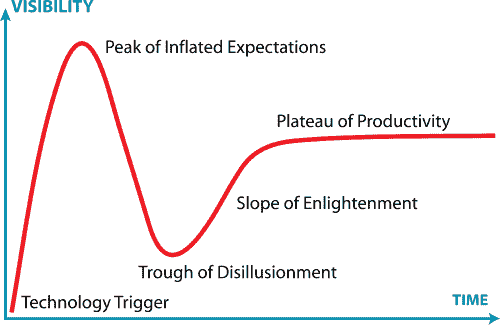

# 远程开发人员的工作正在增加。这可能是你的机会。

> 原文：<https://dev.to/remote4me/remote-developer-jobs-are-on-the-rise-this-could-be-your-chance-39ae>

“FAANG 公司的薪酬激增。”
*“远程工作成为主流。”*
这些趋势是相关的。让我们仔细看看

## 趋势

关注科技新闻的人肯定注意到了两个趋势:

1.  FAANG(脸书、苹果、亚马逊、网飞和谷歌)公司的薪酬[爆](https://www.levels.fyi/charts.html)
    

2.  远程工作成为主流。美国科技公司远程开发人员的数量在增加。
    [T3】](https://res.cloudinary.com/practicaldev/image/fetch/s--vPmxYBrf--/c_limit%2Cf_auto%2Cfl_progressive%2Cq_auto%2Cw_880/https://thepracticaldev.s3.amazonaws.com/i/x2d0d6p5woecq322d9m5.png)

这些趋势是相关的。让我们仔细看看。

## 硅谷的高薪开发者

FAANG 公司不会雇佣所有人。他们雇佣特殊类型的开发人员。

那些不知道的:几个电话面试之后，[他们会在办公室~~拷问~~面试你一整天](https://www.facebook.com/careers/life/preparing-for-your-software-engineering-interview-at-facebook/) (5 个面试，一个接一个)。

那么那些面试不过关，却住在硅谷的工程师都做些什么呢？

他们和硅谷的其他公司呆在一起。当然，报酬相对较低，但仍然相当可观。而且，它比美国其他地方要高得多。只需在此搜索“十大都市地区美元工资分布情况”[。](https://stackoverflow.blog/2018/09/05/developer-salaries-in-2018-updating-the-stack-overflow-salary-calculator/)

## 大公司——大开发中心

那么在这种情况下，更大的公司在做什么呢？

为了便于说明，我们假设“大”是指超过 150 名员工。他们只是在你能找到优秀开发者的地方开设开发中心。这些开发人员花费更少，他们将在这些类型的中心雇佣 50-80 名开发人员。

是的，这些开发人员中的许多人不会通过典型的 FAANG 式面试。

那又怎样？创造优秀软件的能力(顺便提一下，谷歌开发人员使用的软件)和在同一家谷歌通过代码面试的能力——这是两码事。

## 小型创业公司的问题

 
在这种情况下，一个年轻的初创公司的 CEO 在两个选择之间进退两难:CEO 和初创公司创始人必须在硅谷。因为投资者在这里，潜在客户(尤其是如果是 B2B 初创企业)也在这里，这是无法避免的。

开发人员也在附近听起来很合理。

通常，用投资者的钱，这样年轻的初创公司可以雇佣多达三名开发人员。或者五个。不足以征服世界。

在一个你可以找到好的开发人员并且花费更少的地方开一个开发中心——这个解决方案不适合小的创业公司。这样的开发中心会比公司总部拥有更多的员工。另外，这很难管理。

而且，你永远不知道开发中心会是什么工程文化。你创造/影响这种文化的能力非常有限。冒险的冒险。

## “100%远程团队”解决方案

此时此刻，我们的首席执行官想起了“一个 100%远程团队”。让我们更仔细地看看这只野兽。

有一个众所周知的东西叫做[“生产力高原”](https://en.wikipedia.org/wiki/Hype_cycle):

“生产力的高原”意味着所有时髦的博客都不再写关于这项技术的文章。围绕这项技术的大肆宣传平息了下来……这项技术刚刚被使用。每个人都在使用它。绝对是每个人。

在过去的几年里，下列仪器达到了生产的高峰:

*   分布式版本控制系统(是的，我指的是 Git)
*   任务跟踪者(是的，我指的是 JIRA。其他任务追踪器存在吗？)
*   信使(Skype、Slack、Google Talk、WhatsApp、Viber，数以千计)
*   “敏捷”。是的，“敏捷”不再是炒作。人们不会吹嘘这一点。成为 scrum 大师不再酷了(我相信这些人已经变成了加密货币爱好者)。现在人们只是使用敏捷。

这是组织远程工作所需的一套技术。

每个人都知道如何使用它们。不仅仅是资深开发者。

学生使用 Git 存储他们练习的答案。玩家使用信使将自己组织成部落，并协调他们的攻击。诸如此类。

对于我们想象中的年轻初创公司的首席执行官来说，组织一个 100%远程团队的想法看起来是一个理想的解决方案。

他可以雇佣 10-12 名开发人员，而不是 3-5 名。

远程工作的所有工具都在手边，他可以确保候选人知道如何使用它们。

## 居住在硅谷之外的开发者的机会

我们看到像 GitLab、Zapier 和 Buffer 这样的公司都是 100%远程创业的。今天，他们很大，但仍然很遥远:这些公司有多个远程开发人员的工作。所以，当营销专家说一家公司“进入全球人才库”时，我们现在知道它真正的意思了。

所以对于你，一个住在硅谷之外的开发者，这是你的机会。

好吧，你可能拿不到像脸书那样的薪水——但是，远程招聘的初创公司的薪水比当地市场的薪水要高(尤其是与美国以外的当地市场相比)。

所以，使用一个用你的编程语言显示远程开发人员职位的[网站，找到一个你喜欢的职位并申请吧！](https://remote4me.com/)