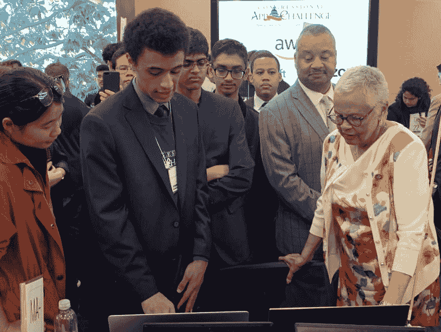
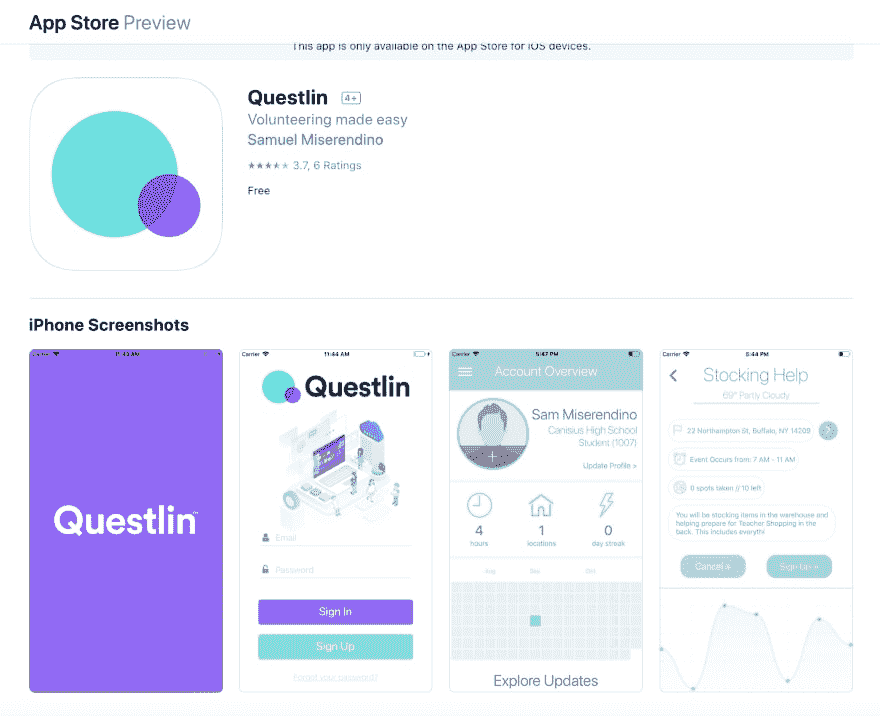

# 开发者聚焦#06:“互相合作，而不是互相对抗。”

> 原文：<https://dev.to/katyadee/developer-spotlight-06-work-with-each-other-not-against-one-another-2m3h>

## 欢迎来到*另一个*(略晚！)我们开发者聚焦系列的版本！本周，我们采访了志愿服务应用 [Questlin](https://www.questlin.com) 的创始人，18 岁的萨姆·米索伦迪诺。

这款 Dev 聚光灯非常特别...它会分两部分来找你。请继续关注下周一的第二部分。

**@katyadee** :先从基础说起。山姆是谁？

**@samdevz** :大家好，我是 Sam。我从九年级开始编程。这一直是我的激情所在。我上学的学校里有一个学生，他真的很喜欢编程…他制作了一些流行的应用程序，这让我很感兴趣。我从网页开发和一点点机器学习开始，现在我在做应用程序之类的东西。我基本上每天，或者几乎每天都使用 Repl.it，通常是为了测试代码或者让事情快速运行。

我大概在…六月联系了阿姆贾德。我想和你们一起做一些工作，或者看看我如何能以更有意义的方式做出贡献，他说不幸的是，今年夏天有太多的实习生，他们不能带我去，但我们将看看我们是否能在明年，或者可能在秋天建立一些东西…所以这对我来说真的很兴奋。我真的很高兴能有这个机会，也很高兴能和你交谈！

**@katyadee** :我其实一点都不知道！我所知道的就是你的参与[WWDC](https://developer.apple.com/wwdc19/)……我真的很好奇那是什么感觉。

**@samdevz** :哦，那真是太刺激了！我第一次申请参加苹果公司的 WWDC 会议……通常去费用很高，你必须参加抽奖，但是对于学生来说，他们有奖学金，如果你被选中，你可以免费去。所以我申请了，我赢了！

**@katyadee** :对于那些可能不知道——WWDC 是什么的人来说？

当然，所以 WWDC 是苹果的全球开发者大会。超过 5000 人去，包括 350 名学者。主要活动是著名的基调，在那里他们宣布新的功能和产品。这是苹果开发者的主要活动。最棒的是你可以见到创造这些产品的人。他们整天都有会议，还有实验室。所以你可以去找设计 Mac 或 iPhone 或任何东西的人——他们会给你很好的反馈，告诉你**可以做些什么来改进！这对开发人员来说真是一个很好的资源。**

**@katyadee** :学生时代去是什么感觉？

他们为我们做了很多很酷的事情……你可以参加所有的活动——你就像一个普通的与会者——你可以观看主题演讲，你也可以和有相似兴趣的人见面，或者和我们做同样事情的高管见面，但是级别更高。

我也有机会见到这位名叫丽莎·杰克逊的主管。她在某种程度上管理苹果公司的环境问题和社会问题——这与我正在做的事情有点关系。我制作了很多面向志愿者的应用程序，旨在帮助人们。那真的很酷。

**@katyadee** :你有最喜欢的角色吗？

**@samdevz** :天啊……这么多。所以，我有个朋友在那里。我做应用，他做游戏。我们有机会与苹果的营销团队会面，我认为这非常有价值。他们真的和我们一对一地坐下来，给了我们一些建议，关于如何提高我们在 App Store 上的地位，如何更好地营销，各种不同的建议…比如如何赚钱。总的来说，能见到运营应用商店的人真是太酷了。

他们给你的最好的建议是什么？

**@samdevz** :你总想在 App Store 上有一个吸引人的页面。你应用上的截图很重要，但是预览视频也很重要。这些让人们保持参与。还要确保你的评论是好的，并对你得到的评论做出回应。他们还谈到了货币化和不同的赚钱方式…其中一个最好的赚钱方式是广告。如果你的应用是新的，没有多少人会在应用内花钱。所以，他们向我们介绍了如何开始做广告，这也很有帮助。

**@katyadee** :哇——真敬业。听到他们如此乐于助人，我很惊讶。

那么，我们已经谈了一点你是一名应用程序开发人员…你能告诉我更多关于你的背景吗？

我开发的主要应用程序叫做 [Questlin](https://www.questlin.com) ，这是一个帮助人们找到附近志愿服务地点的应用程序。那个项目对我真的很重要，因为我的学校要求我们每年都做服务。每年，我都在做志愿服务的体力方面……但有一次，我在一个我经常去的非营利机构和一位高管交谈，我问他关于志愿服务的不同方式。

然后他说，这是我们实际上可以使用的:一个可以帮助我们跟踪志愿者和志愿服务的应用程序。我从那里开始研究 Questlin。这真的很酷，也引起了一些关注。最近，我甚至见到了国会女议员邦妮·沃森·科尔曼。

**@katyadee** :哇。那真是太神奇了。我很想听听这是怎么发生的。

@samdevz :嗯，我们参加了这个活动——它对学生来说真的很棒，我鼓励每个人都来参加。它被称为[国会应用挑战](https://www.congressionalappchallenge.us)。基本上，你在你的地区内创建一个应用程序，然后你的代表审查你的应用程序。你可以去国会，见见国会议员……很多人甚至会下载你的应用程序。那是一次非常宝贵的经历，我很高兴我做到了。

我们的下载量越来越大。新泽西有个地方在用它…

**@katyadee** :让我们倒回去一秒钟 Questlin 是为了跟踪志愿者，还是更面向消费者？

**@samdevz** :其实都是！有一个面向非营利组织和志愿者的门户。最大的挑战一直在扩大。我设计它的方式是，它只会显示附近的地方，所以对很多人来说，它现在并没有那么有用，它在某些地方比其他地方更有用。这是一个很大的障碍。

我能在奥斯汀这里下载并使用它吗，或者你们只在某些市场推出？

不幸的是，现在我们不得不手动添加非营利组织。不过，我们正努力让它更加自动化。我们正在努力改进它的版本。当我赢得挑战时，它成为了 App Store 中的一个特色应用程序，获得了更多的下载，我们收到了很多投诉，用户无法在他们所在的地方使用它。但是一些非营利组织联系了我们，所以我们现在正在努力解决这些问题。

@katyadee :不过，这些都是非常令人兴奋的障碍！

@samdevz :兴趣比我想象的要多得多，这在我的学校只是一件小事。我从来没有预料到来自不同地方的人会使用它，或者有这么多的观众。现在我们正在努力赶上需求。

你知道，这让我想起了…我不记得它的名字了。我会使用一个网站——我的意思是，这是 10 年前的事了，现在——来寻找志愿者的机会……我希望我记得这个名字，它会让我的观点更加突出。但我想我的问题是你与其他现有的和类似的产品有什么不同。

不过，也许我记不起它们就说明了一切。

**@samdevz** : *(笑)*志愿者比赛，移动发球？

你知道吗——是的，我确实认为那是志愿者比赛。你觉得你和他们有什么不同？

**@samdevz** :嗯，我们是 app。我们想整合 VolunteerMatch 的 API。

@katyadee :你们在一起工作真是太棒了。

这是一个很好的工作空间，因为每个人都想一起工作，而不是互相对抗。