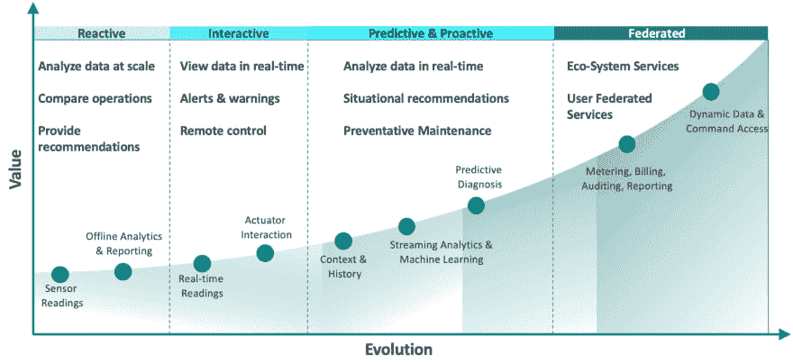

# 如何确保互联汽车计划的成功

> 原文：<https://dev.to/solacedevs/how-to-ensure-the-success-of-connected-vehicle-initiatives-26nb>

联网汽车计划对汽车行业的影响怎么强调都不为过。毕马威对汽车高管的调查发现，85%的高管同意联网汽车的数字生态系统将比汽车本身的硬件产生更高的收入。为了在这个全新的市场中建立领导地位，汽车制造商和那些提供支持服务的人需要了解存在的机会、他们面临的挑战以及如何克服这些挑战。

在这篇文章中，我将解释所有这三个，从基本的构建块开始，或者沿着路径的步骤，在其上可以构建定制的价值。

## 连接车辆创造和消费的三种信息

在探讨构建互联汽车价值的方法之前，我们先来看看互联汽车产生和消费的三种信息。

1.  **驱动数据**。例如，联网车辆系统不仅可以生成关于车辆位置和速度的有用信息，还可以生成关于加速器、制动踏板、方向盘和转向灯位置的有用信息，以及关于油耗的流数据。
2.  **诊断数据**。这包括定期测量，以确定电池充电状态、液位和轮胎压力，以及发动机、变速器和其他系统的压力和温度读数。
3.  **教学数据**。联网汽车场景中的这种信息是以另一种方式流动的。发送影响车辆行为的命令的能力，例如远程锁定或解锁汽车，改变 led 的颜色，或显示特定车辆的警报，提供了巨大的价值。

## 联网车辆的积木价值

现在，让我们来看看如何利用这三种信息为驾驶员创造价值。

联网汽车计划的第一个潜在价值是离线、事后分析和报告。我的意思是从车辆上收集数据，不是从任何地方实时收集，而是例如当它们停在家里时收集。这种服务的目标是查看联网汽车发生的一切，对此采取了什么措施，以及哪些行动可能会导致更好的结果。

当您能够实现实时监控和交互时，就实现了更高的价值。我的意思是实时查看给定车辆发生的情况，并有能力通过远程控制车辆操作的某些方面和/或提醒第三方某个情况(如爆胎)来改善结果，此时驾驶员可能需要帮助。

第三步是超越单纯的监控，进入事件驱动的警报领域，甚至是在问题发生前预测问题的能力。在部件退化或故障影响车辆的效率或运行之前预测和主动解决部件退化或故障的能力为汽车制造商提供了一种让客户满意的强大方法。一个例子可以是预测下一个 100 英里内的组件故障，这触发了主动通信和协助来替换/修理所述组件。

互联汽车价值的第四个组成部分在于能够在一个公司生态系统中联合信息和事件，这些公司在娱乐、导航、维护、故障援助、保险等领域提供服务。

## 创建价值框架

与任何转型和创新项目一样，联网汽车计划要求您创建一个战略路线图，定义哪个部门为了什么目的要做什么。在这种情况下，负责车辆本身的硬件和软件工程团队、数字服务部门、交付应用的 IT 部门以及生产和售后部门之间的必要合作路线图。

该路线图应该清楚地传达愿景和战略、项目的阶段以及每个阶段的方法和目标。同样重要的是，要理解在构建互联汽车平台的过程中，价值是在哪里产生的。下图显示了这样一个价值框架，将价值创造阶段与业务服务和底层 IT 构建块结合起来。

这个互联汽车计划价值框架示例结合了前面描述的四个级别，从左到右依次增加价值。还要注意，一旦达到**交互**级别，信息流必须变为实时，车辆必须始终保持连接。

为了进一步加深我们对各个阶段的理解，让我提供一组每个阶段都试图解决的简单问题:

*   **反应**:发生了什么事，下次我们能做得更好？
*   **互动**:如何远程控制车辆的运行？
*   预测性的&前瞻性的:现在正在发生什么，接下来可能会发生什么？
*   **联合**:我如何在整个生态系统中联合数据和事件，为车主/司机创造最佳结果？

## 克服基础设施挑战

联网汽车计划带来了巨大的挑战。你面对的是大量复杂的机器，它们由不同技术水平的司机在不同质量的道路上，在各种天气条件下高速近距离操作。

建立一个能够处理高效、事件驱动的实时数据分发的基础设施，为这种混乱局面增加联网汽车的价值并不容易，但这是可能的。

## 车辆

首先，我们来看看车辆本身。最明显的挑战是你想要连接的汽车数量，通常以百万计。第二个挑战是，许多与互联车辆的交互需要低延迟。例如，如果有人试图用手机上的应用程序打开车门，他们的耐心将在几秒钟内得到衡量。

使以低延迟连接许多车辆的需求变得复杂的是，由于汽车经常移动，它们会经历不同程度的连接——包括完全断开的时期。你的工作是双重的:以这样一种方式管理连接，你可以 a)尽可能地发送和接收来自车辆的低延迟通信，以及 b)以确保关键数据、警报和指令的最终交付的方式处理缓慢的连接和断开。

等式的车辆端的最后一个挑战是安全性。我说的不仅仅是车辆本身的安全，而是你保证驾乘人员安全的能力。这需要及时收集重要事件并采取行动，并确保每辆车的位置和操作信息保密。必须为每种类型的信息建立一个细粒度的信任框架，并且该数据的所有者必须对所述数据的共享拥有完全控制权，以确保只有授权方才能查看和处理该数据。

## 区域边缘网络

我将车辆连接的边缘节点网络称为区域边缘网络。这些边缘节点在地理上是分散的，并且尽可能靠近实际车辆放置，以最小化延迟和连接问题。每个节点管理一定数量的连接，并聚集区域内的连接。地区可以是美国东北部、德国南部等。这些节点聚集了来自全球车队子集的连接和消息，并负责将事件、数据和指令发送到 IT 应用程序和单个车辆，以及从 IT 应用程序和单个车辆接收这些数据和指令。

至关重要的是，这些节点能够处理数百万个并发连接和随之而来的大量消息，并处理由移动网络可用性导致的重复连接和断开行为。

让我们想象一个隧道——车辆在进入隧道时失去连接，当它们出现时必须立即重新连接。当你想到进出每条隧道的所有车辆，以及隧道的数量时，仅这一点就产生了许多断开/重新连接行为。

## 应用平台

在全球互联的车辆系统中，应用和服务可以部署在边缘网络、数据中心和任意数量的公共云中。现在需要连接区域边缘节点，以便能够将数据和事件分发到这些应用程序中的每一个，无论它们部署在哪里。

根据我的经验，随着平台的发展和价值的创造，应用程序会随着效率和延迟的需要而被添加、删除、复制和重新部署。因此，从边缘节点到应用程序的这些连接必须能够处理来自所有车辆的潜在所有消息和事件的聚合，并且动态地这样做——即，自动地将数据路由到任何有消费者的地方，而不需要重新连接整个基础设施。

因此，路由挑战从单个车辆转移到聚合大量事件和数据的能力，并将它们在全球范围内路由到跨混合云基础架构(包括公共云、私有云和内部环境)部署的分布式应用程序。

## 生态系统边缘网络

为了实现最高水平的价值创造，该平台还必须联合服务提供商网络中的数据和事件。从部署模型和技术角度来看，这个生态系统本质上是异构的，这意味着它必须支持不同的 API 和协议，并与已建立的 SaaS 提供商集成。这就引入了对边缘节点的需求，无论部署位置在哪里，边缘节点都可以与应用服务无缝互连。

然而，这不是主要的挑战。我们的目标是为车主和司机创造价值，而这只能通过创建一个信任框架来实现，该框架平衡了 a)以完全透明的方式共享数据和 b)尊重个人隐私的需求。如果没有可验证和可审计的数据流以及详细的同意框架，就无法建立信任。

从技术角度来看，这要求基础设施不仅要处理车辆、组织和个人的身份，还要处理数据项的身份。对每个数据项的访问必须进行大规模的管理和控制，包括访问权限的授予和撤销，以及相关的报告。当然，计量和计费记录补充了数据联合，使外部服务供应货币化。

数据共享复杂性的一个很好的例子是“交付到主干”场景。在这里，消费者选择他们的汽车作为他们购买的送货地址。这意味着在流程的整个价值链中有一个非常紧密的控制和访问框架:电子商务公司与送货公司共享汽车信息，送货公司又与送货司机共享这些信息。然而，当 a)他们靠近汽车时，例如，在 10 米的地理围栏内，以及 b)在指定的交付时间范围内，驾驶员可能只有权打开后备箱。这里的访问控制是动态的，车主的授权仅在特定的“情境”条件下给出。

下图总结了四条泳道、每条泳道的不同要求以及端到端路由的需求:

## 开发有价值的互联汽车解决方案

开发互联汽车解决方案有两个关键要素。首先是弥合应用世界和汽车世界之间的差距，即在两种环境之间建立桥梁，以便信息和事件可以在车辆和他们越来越依赖的联网车辆服务的应用和云服务之间无缝流动。

第二是建立数据分发基础设施，利用这种集成来有效地将大量信息发送到互联车辆或从互联车辆接收信息。让我们仔细看看这些要求。

## 集成应用和汽车场景

互联汽车计划需要集成许多组件和层，从企业 IT 环境到基于物联网的互联汽车世界。这包括以下类型的系统、传感器和设备:

*   **业务应用**:维护、车队管理、保险、地图
*   **集成**:API 和协议，流式 API
*   **数据基础设施**:参考数据、时间序列数据、流分析、机器学习、位置服务
*   **管理基础设施**:远程管理、安全和访问、ID/授权、隐私
*   **联网车辆**:轿车、公共汽车、卡车、火车

## 满足互联车辆程序的数据分发需求

用于大规模联网车辆部署的数据分发基础设施需要满足以下四项要求:

1.  它必须是一个灵活的、自我学习的系统，能够沿着网络路径智能地路由信息，以确保及时、可靠地传送到目的地。
2.  它必须支持各种通信协议(如 AMQP、JMS、MQTT、REST 和 WebSocket)并链接在不同云和内部计算环境中运行的系统，从而实现遗留技术和新兴技术的轻松集成。
3.  它必须促进数百或数千个节点的集中部署和管理，以支持大规模扩展，并实现企业级的性能、健壮性和可扩展性。
4.  该系统必须提供所需的访问和数据流控制，以创建所需的信任，以及审计，计量和计费“挂钩”，以货币化的产品。

满足这些要求的唯一技术是我所说的混合物联网事件网格，这是一个基础设施层，使联网车辆平台能够沿着所讨论的价值框架发展。

## 总结

在本文中，我定义了一个路线图，使用一个价值框架来阐明价值、服务、生态系统和技术如何携手创建一个成功的联网汽车计划。我将其分解为四个泳道内的一系列基础设施挑战:车辆、区域边缘网络、应用平台和生态系统边缘网络。我已经提供了一个关于如何建立信任框架的初步评估，以使人们对这个平台感到舒适。最后，我描述了[事件网格](/what-is-an-event-mesh/)如何成为互联车辆平台的理想基础。

为您的联网汽车计划选择基础技术时，请考虑以下问题:

*   **是动态的吗？**它是否支持动态路由，以便能够轻松扩展和缩减，并适应停机？
*   它开着吗？是否支持开放 API、通信协议和集成能力？
*   **简单吗？**您能否轻松管理、扩展和保护由数百或数千个节点组成的事件网格？

如果你能斩钉截铁地回答所有三个问题，是的！，你在正确的道路上。

帖子[如何确保联网汽车计划](https://solace.com/blog/connected-vehicle-initiatives/)的成功首先出现在 [Solace](https://solace.com) 上。