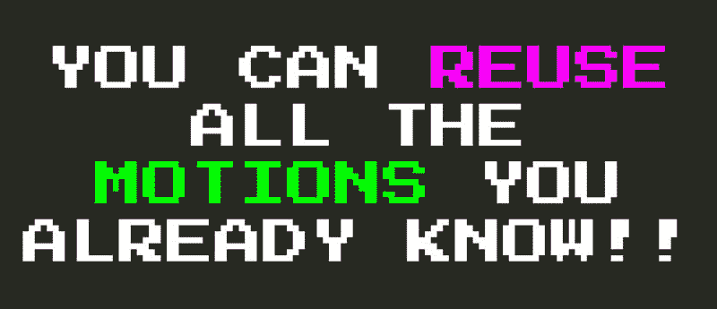

# 维姆的秘密语言

> 原文：<https://dev.to/vintharas/vim-s-secret-language-8oc>

> 这是[用 VSCode 和 Vim](https://www.barbarianmeetscoding.com/boost-your-coding-fu-with-vscode-and-vim) 提升你的编码 Fu 这本书的章节 [Vim 的密语](https://www.barbarianmeetscoding.com/boost-your-coding-fu-with-vscode-and-vim/vims-secret-language/)。

你可能已经注意到，你所学的所有 Vim 操作符、计数和运动构成了一种(编程)语言。你可以把操作符想象成函数，把计数和运动想象成参数，或者用一个更简单的类比...你可以把操作符看作动词，把计数看作形容词，把动作看作宾语。

**[Vim 的真正魔力是构图](https://medium.com/@mkozlows/why-atom-cant-replace-vim-433852f4b4d1)** 。随着你逐步积累这些操作符和动作的词汇，你会发现你可以随心所欲地将它们结合起来。就像你用口语表达一样。

这样，一旦你了解了这个世界的所有**`cl`****`caw`****`ciw`****`ct.`**，并且你去学习 **`dl`** 是如何工作的，你将不仅能够使用 **`dl`** 。不会。你马上就会知道，你还可以将 **`d`** 操作符与你已经掌握的所有动作词汇以及 **`daw`** 、 **`diw`** 、 **`dt.`** 结合起来，直到时间结束。

**这很酷**。

当使用 Vim 时，你会感觉到你在文本编辑的元宇宙中导航，就像编程或控制编辑和编写文本的机制。如果您熟悉 git 以及使用 git 命令行处理源代码控制的感觉，您可以将 Vim 视为文本编辑的 git。(撇开 Vim 比 git 早了近 30 年这个事实不谈)。

使用 Vim，你将看到一段文本，你将不再仅仅看到单词或文本，你将看到无限数量的操作符和动作同时被应用的可能性 [1](#fn1) 。

* * *

1.  Kadoooosh！神魂颠倒... [↩](#fnref1)