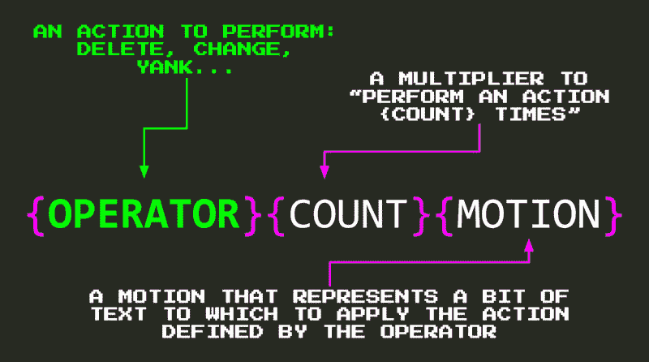
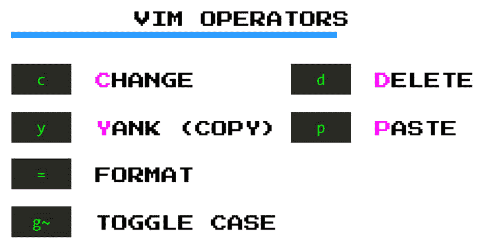
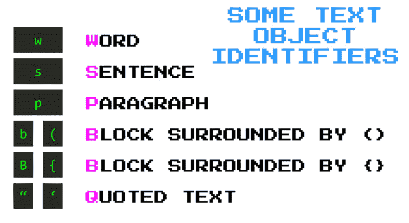
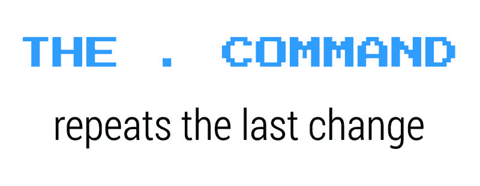

# 使用 Vim 操作符像变魔术一样编辑

> 原文：<https://dev.to/vintharas/editing-like-magic-with-vim-operators-3jo6>

> 这是《用 VSCode 和 Vim 提升你的编码能力》一书中的一章[用 Vim 操作符](https://www.barbarianmeetscoding.com/boost-your-coding-fu-with-vscode-and-vim/editing-like-magic-with-vim-operators/)像变魔术一样编辑

动作不仅仅是为了移动。它们可以和一系列叫做**操作符**的命令结合使用，以闪电般的速度编辑你的代码。

您可以按照以下任何模式一起使用操作符和运动:

```
{operator}{count}{motion}
{count}{operator}{motion} 
```

[](https://res.cloudinary.com/practicaldev/image/fetch/s--xjrrcwB0--/c_limit%2Cf_auto%2Cfl_progressive%2Cq_auto%2Cw_880/https://www.barbarianmeetscoding.cimg/vim-operators.jpg)

*   **操作符**决定了你想要执行的操作:删除、更改、拉取、格式化等等。
*   **计数**允许你通过执行一个动作一个*计数*的次数来倍增操作者的效果。
*   **动作**表示应用操作员定义的动作的文本段。

例如，`d2w`组合允许你**删除两个单词** <sup id="fnref1">[1](#fn1)</sup> 。

[](https://res.cloudinary.com/practicaldev/image/fetch/s--gX8TfcEF--/c_limit%2Cf_auto%2Cfl_progressive%2Cq_auto%2Cw_880/https://www.barbarianmeetscoding.cimg/vim-operators-d2w.jpg)

**`d`** 对应于**删除**操作符。由于 **`d`** 是一个操作符，你可以遵循`{operator}{count}{motion}`公式，并将其与你迄今为止所学的所有动作结合起来:

*   使用 **`d5j`** 向下删除 5 行
*   键入 **`df'`** 删除光标当前行的所有内容，直到第一次出现 **`'`** 字符(包括字符本身)
*   或者键入 **`dt'`** 像上面的例子那样做，但是不包括字符(所以直到或者刚好在 **`'`** 字符之前)
*   使用 **`d/hello`** 删除所有内容，直到第一次出现 **`hello`**
*   键入 **`ggdG`** 删除一个完整的文档

## 有用的运算符

[](https://res.cloudinary.com/practicaldev/image/fetch/s---t7WHqzp--/c_limit%2Cf_auto%2Cfl_progressive%2Cq_auto%2Cw_880/https://www.barbarianmeetscoding.cimg/vim-operators-commands.jpg)

除了 **`d`** 之外，还有一些更方便的运算符:

*   **`c`**(**c**hange):Change 删除一段文字，然后让你进入*插入模式*，这样你就可以继续打字，把原来的文字变成别的东西。改变操作符就像是把 **`d`** 和 **`i`** 命令组合成一个 <sup id="fnref2">[2](#fn2)</sup> 。这种二元性使它成为最有用的算子
*   **`y`** ( **y** ank):用 Vim 行话抄
*   **`p`** ( **p** ut):用 Vim 行话粘贴
*   **`g~`** (切换大小写):将字母从小写转换为大写，再转换回来。或者，使用 **`gu`** 使内容小写，使用 **`gU`** 使内容大写
*   **`>`** (右移):添加缩进
*   **`<`** (左移):删除缩进
*   **`=`** (格式代码):格式代码

您可以像使用 **delete** 一样使用这些操作符，以便:

*   **`c/hello`** 改变一切，直到第一次出现`hello`。
*   **`ggyG`** 复制整份文档
*   **`gUw`** 将一个单词大写

## 运算符速记语法

所有这些运算符都提供了额外的速记语法，旨在节省您的键入时间，并提高您执行常见编辑任务的速度:

*   **双算符使其对一整行进行操作** : **`dd`** 删除一整行， **`cc`** 改变一整行等。
*   **大写一个操作符，让它执行一个更强(或替代)版本的默认行为** : **`D`** 从光标处删除到行尾， **`C`** 更改到行尾， **`Y`** 像 **`yy`** 一样复制一个完整的行， **`P`** 在光标前粘贴一些东西，等等。

> ### 注意到命令键怎么很有意义？
> 
> Vim 中的操作符、动作和其他命令通常很容易学习，因为它们有意义并且容易猜测。想改变什么？你可能想使用 **`c`** ( **c** hange)运算符。想一个字一个字的搬？试试 **`w`** ( **w** ord)。想删点什么？试试 **`d`** ( **d** elete)运算符等等。

当我们将操作符与一类叫做**文本对象**的特殊运动结合起来时，它们真的大放异彩。

## 将文字对象的编辑提升一个档次

文本对象是结构化的文本片段，或者，如果你愿意，是文档域模型的实体。文档由什么组成？单词、句子、引用文本、段落、块、(HTML)标签等。这些是文本对象。

在命令中指定文本对象的方法是将字母 **`a`** ( **一个**文本对象加空格)或 **`i`** ( **内部**对象不带空格)与代表文本对象本身的字符结合起来:

[](https://res.cloudinary.com/practicaldev/image/fetch/s--xuF3r_By--/c_limit%2Cf_auto%2Cfl_progressive%2Cq_auto%2Cw_880/https://www.barbarianmeetscoding.cimg/vim-text-objects.jpg)T3】

```
{operator}{a|i}{text-object} 
```

内置文本对象包括:

[](https://res.cloudinary.com/practicaldev/image/fetch/s--34U936cR--/c_limit%2Cf_auto%2Cfl_progressive%2Cq_auto%2Cw_880/https://www.barbarianmeetscoding.cimg/vim-text-objects-commands.jpg)

*   **`w`** 为 **w** 曼特
*   **`s`** 为**年代**为
*   **`'`** ， **`"`** ， **`` ` ``** 为引号
*   **`p`** 为 **p** 文段
*   **`b`** (或**`(`****`)`**)为块包围 **`()`、**
*   **`B`** (或**`{`****`}`**)为块包围 **`{}`**
*   **`<`** ， **`>`** 为一块被 **`<>`** 包围的
*   **`[`** ， **`]`** 为一块被 **`[]`** 包围的
*   **`t`** 为标记。

因此，为了删除文本的不同部分，您可以使用以下任何命令:

*   **`daw`** 到**d**elete**a****w**ord(加上尾随空格)
*   **`ciw`** 到 **c** 汉格 **i** nner **w** ord
*   **`das`** 到**d**delete**a****s**entence(**`dis`**删除内部句子)
*   **`da"`** 删除双引号中的内容，包括引号本身( **`di"`** 只删除引号内的内容**I**n 省略引号)
*   **`ci"`** 改变双引号内的东西
*   **`dap`** 删除一段文字
*   **`dab`** **`da(`** 或 **`da)`** 删除一个被 **`(`** 包围的块
*   **`daB`** **`da{`** 或 **`da}`** 删除一个被 **`{`** 包围的块
*   **`dat`** 删除一个 HTML 标签
*   **`cit`** 改变一个 HTML 标签的内容

将文本对象和操作符结合起来是非常强大的，你会发现自己非常频繁地依赖它们。像`cit`、`ci"`和`cib`这样的东西真是太棒了。

假设我们想把下面这个字符串的内容换成别的:

```
const salute = 'I salute you oh Mighty Warrior' 
```

你输入`ci'Hi!<ESC>`，它就变成:

```
const salute = 'Hi!' 
```

就这样。你不需要去拿鼠标，选择文本，然后写别的东西。你打三个字母，嘣！你完了。

> ### 注意到大多数 Vim 键是怎么放在手指附近的吗？
> 
> Vim 具有模式的事实允许在每个单独的模式中重用 home 行附近的键。这一设计决策最大限度地减少了对缓慢和扭曲的组合键的需求，并提高了您的速度和手指和手腕的寿命。太棒了！

## 用点运算符重复最后一次更改

Vim 为您准备了另一个旨在节省更多击键次数的技巧:神奇的 **`.`** (点)命令。

[](https://res.cloudinary.com/practicaldev/image/fetch/s--0ATw-yyz--/c_limit%2Cf_auto%2Cfl_progressive%2Cq_auto%2Cw_880/https://www.barbarianmeetscoding.cimg/vim-dot-command.jpg)

**`.`命令允许你重复你所做的最后一次改变**。假设你运行 **`dd`** 删除一行代码。现在，让我们假设您已经准备好删除代码。删除代码很好，代码越少，需要维护的代码就越少。所以让我们删除另一行代码。你会怎么做？您可以再次键入 **`dd`** ，但是更好的是，您可以使用 **`.`** 命令，这只是一次击键。

好的。你保存一个按键。那又怎样？(我看到这里有一群难缠的人)。嗯，你可以使用 **`.`** 命令来重复**任何类型的变化**，而不仅仅是像`dd`那样的一个简单的命令。例如，你可以把`Awesome`的一个单词改成这样的`cawAwesome<Enter>`，然后通过键入一个点来重复整个命令。想想可能性吧！

如果你习惯使用文本对象，那么 **`.`** 命令会变得更加有用。文本对象比其他运动更可靠，因为你不需要太在意光标的位置。因此，带有文本对象的命令更容易重复，因此与 **`.`** 命令配合使用效果很好。

**`.`** 命令与重复搜索命令( **`;`** 、 **`,`** 、 **`n`** 或 **`N`** )结合使用效果非常好。假设您想要删除所有出现的`cucumber`。一种可能的方法是搜索黄瓜`/cucumber`，用 **`daw`** 删除它，然后，用 **`n`** 转到下一个匹配，用 **`.`** 删除它！两次击键！？！再次考虑各种可能性！！

## 更多速记文本编辑命令

除了您在本章中学习的操作符之外，Vim 还提供了一系列操作单个字符的快捷方式，有时会很有用。它们是:

*   **`x`** 相当于 **`dl`** 并删除光标下的字符
*   **`X`** 相当于 **`dh`** 并删除光标前的字符
*   **`s`** 相当于 **`ch`** ，删除光标下的字符，进入*插入模式*
*   **`~`** 对单个字符进行大小写切换

和往常一样，以上所有的支持都可以一次操作多个字符。

## 撤销和重做

迟早你会犯错误的。承认吧！你并不完美。没有人是。这没关系。不过，您不必担心，因为 Vim 会支持您:

*   键入 **`u`** 你将撤销你最后的更改，
*   输入 **`CTRL-R`** 就可以重做了，

*Pheeewww...*

## 总结

**动作不仅仅是为了移动。与操作符结合使用，你可以轻松快捷地对文本进行操作**。您可以使用按键旋律`{operator}{motion}`对动作应用操作符。

一些最有用最常用的运算符有: **`d`** 代表 **d** elete， **`c`代表 **c** hange， **`y`** 代表 **y** ank(复制)，以及 **`p`** 代表 **p** ut(粘贴)。从这些操作符和到目前为止所学的动作中可以看出，Vim 命令通常很容易学习，因为它们有意义并且容易猜测。**

**当你加倍一个操作符时，你让它在一条线上操作**。例如，您可以使用 **`dd`** 删除一整行。以类似的方式，**当你大写一个命令时，它会执行原始命令**的一个更强(或替代)的版本。例如， **`D`** 从光标处删除到行尾。这些真的很有帮助，可以节省你很多时间。学会使用它们，而不是那些更罗嗦的替代品。

**计数也与操作员**一起工作。您可以通过使用如下计数来增加操作符动作组合的效果:`{operator}{count}{motion}`。

文本对象是描述文档各部分的特殊动作:单词、句子、段落等等。它们与 Vim 操作符结合使用非常有用。**使用文本对象操作符，你可以非常精确地命令 Vim 删除一个单词，或者改变一个字符串或代码块的内部**。

文本对象提供了两种变体: **`a`** (想想 **a** 或 **a** ll)和 **`i`** (想想 **i** nner)，它们分别允许你操作一个文本对象加上周围的空白或只操作一个文本对象的内部。例如，使用 **`da"`** 删除包含尾随空格的完整引号，使用 **`di"`** 仅删除引号包围的内容。

**点命令`.`让你重复最后的改变**，因此，它是最有用的重复命令之一。**对文本对象的操作是点运算符的绝佳选择，因为它们更具可重复性**。

**利用点号命令的一个很好的方法是将其与搜索结合使用**。当你这样做的时候，你可以通过两次击键来应用连续搜索的改变: **`n`** 或 **`;`** 来查找下一个匹配，以及 **`.`** 来重复上一次的改变。

有时候你会犯错误。当这种情况发生时，**你可以用`u`命令**撤销最后的更改。如果你改变主意或者撤销太多，输入`CTRL-R`到 **r** edo。

* * *

1.  更准确地说，`d2w`允许你从光标处删除所有文本，直到第二个单词的开头。目前，让我们假设它删除了两个单词，我们很快就会谈到正确性。 [↩](#fnref1)

2.  两个命令合二为一？我觉得很棒！ [↩](#fnref2)