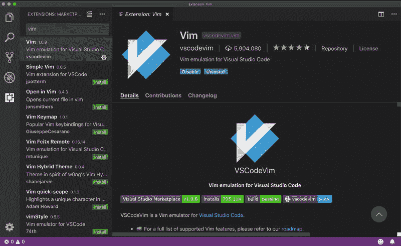
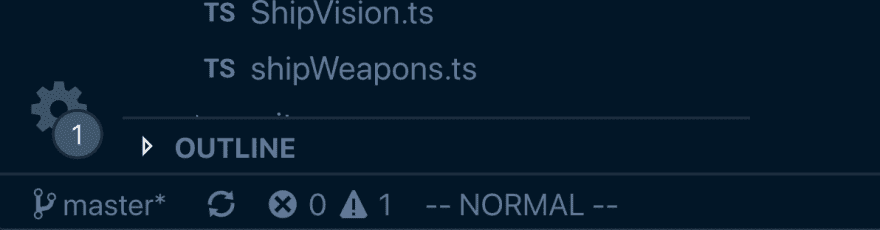
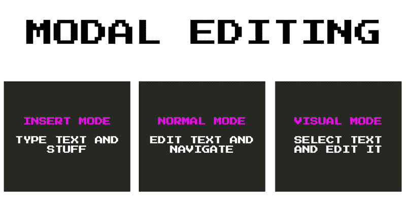
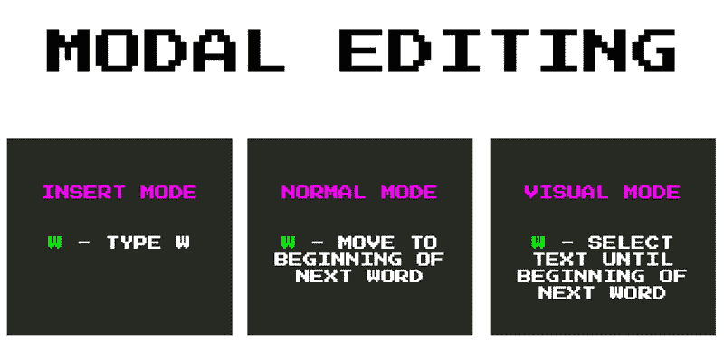
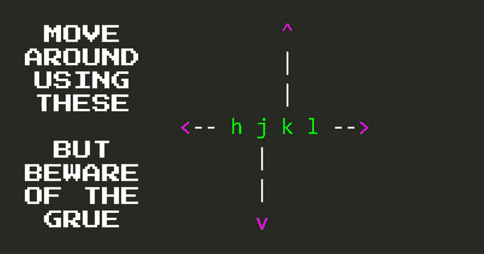
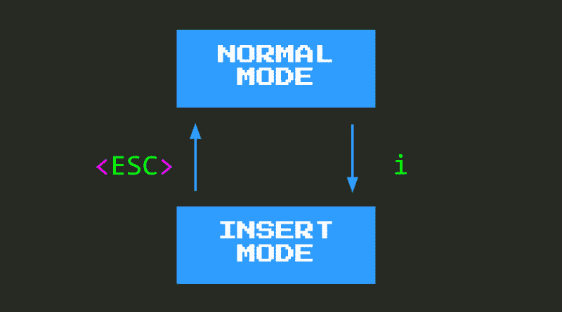

# 在 VSCode 中安装 Vim，并在 Vim 中迈出第一步

> 原文：<https://dev.to/vintharas/installing-vim-in-vscode-and-your-first-baby-steps-in-vim-2d61>

> 这是两个章节:[安装 VSCodeVim](https://www.barbarianmeetscoding.com/boost-your-coding-fu-with-vscode-and-vim/installing-vim-in-vscode/) 和[你的第一步 Vim](https://www.barbarianmeetscoding.com/boost-your-coding-fu-with-vscode-and-vim/baby-steps-in-vim/) 这本书[用 VSCode 和 Vim 提升你的编码 Fu](https://www.barbarianmeetscoding.com/boost-your-coding-fu-with-vscode-and-vim/)

为了在 Visual Studio 代码中引入 Vim 的魅力，您需要安装 [VSCodeVim 插件](https://github.com/VSCodeVim/Vim):

1.  打开 Visual Studio 代码
2.  转到*扩展*
3.  在搜索框中键入`vim`
4.  第一个名为 **Vim** 的插件就是你想要的那个( *VSCodeVim*
5.  点击*安装*按钮
6.  史诗般的胜利！

Visual Studio 代码安装完扩展后，您可能需要重新启动它以使更改生效。 [1](#fn1)

重启了吗？

太棒了。从您最新的项目中打开一个代码文件，并查看光标。它看起来像长方形吗？什么事？

那么，**欢迎来到 Vim！！**

> ### 是否使用 VSCode 命令调色板？
> 
> 如果你不用它，你一定要用。在 Mac 上键入`CMD-SHIFT-P`或者在 Windows 和 Linux 上键入`CTRL-SHIFT-P`,你会被带到命令面板。在这里，您只需键入即可访问 Visual Studio 代码中的几乎所有功能。
> 
> 例如，键入 *extensions* 并选择 *Show extensions* 转到 Extensions 选项卡。很棒吧？四处输入，看看是否能找到日常工作流程中常用的东西。
> 
> **掌握像`CMD-SHIFT-P`这样打开命令面板的快捷键，或者像`CMD-P`这样转到文件的快捷键，对于开发以键盘为中心的工作流和提高您在 Visual Studio 代码中的工作效率是必不可少的。所以学习它们，并使用它们。你以后会感谢我的。**

## 你的第一个婴儿在 Vim 迈出第一步

矩形光标...好奇！如果你现在尝试输入文本，你会惊讶地发现什么也没发生。或者更准确地说，你期望发生的事情都没有发生。首先，当你在键盘上打字时，屏幕上没有反映出任何字符。事实上，很可能在你打字的时候，你会偶然发现一些有特殊含义的命令，这些命令会让你的光标在屏幕上飞来飞去，甚至会删除或编辑一些代码。

所有这些怪异和意外的行为都是由**正常模式**造成的，这是在 Vim 中与代码交互的默认模式。并且，在*正常模式*下，不插入文本。

那么什么是**正常模式**？此外，**模式甚至是什么意思**？

## Vim 中的  模式

模式是 Vim 中最重要和最有影响力的设计决策之一，所以花一点时间真正理解模式的含义以及它们如何影响 Vim 开发人员的体验是值得的。

Vim 模式遵循相同的原则，即**在正确的情况下戴上正确的帽子**。根据手头的任务，你可能(象征性地)*戴上合适的帽子*来最大限度地调整你的思维方式、行为和心态以适应那种情况。例如，如果你正试图用新颖的方式解决一个问题，你可能想戴一顶探险家帽，这能激发你的探索思维。如果你想在不舒服的情况下无所畏惧，敢于冒险，你可以戴上维京人的头盔。外交？朝臣的帽子等。

同样，Vim 编辑器有不同的模式，最适合完成不同的任务。例如，Vim 中有三种最常见的模式:

就像戴上正确的帽子一样，当使用 Vim 时，当你的目标是插入文本时，你将使用*插入模式*。当你的目标是编辑文本或浏览你的代码库时，你将使用*正常模式*，当你想要选择一些文本时，你将使用*视觉模式*。

但是模式到底是什么意思呢？在文本编辑器的上下文中，适应手边的任务意味着什么？

本质上，这意味着您的键盘根据您所处的模式获得不同的功能。也就是说，根据你所处的模式，在你的键盘上键入一个键会导致不同的结果来适应特定的模式。以字母`w`为例。在任一模式下键入`w`,将会发生以下情况:

*   在*插入模式*中，你将**键入**字母`w`，就像在任何其他编辑器中一样。
*   在*正常模式*中，你将**移动**光标到下一个单词的开头。
*   在*视觉模式*中，您将**选择**文本，直到并包括下一个单词的开头

那么我们从 Vim 成为模态编辑器中获得了什么呢？

由于模式的存在，键盘在每一个不同的模式中都变成了一块白板。这意味着 Vim 可以自由地完全调整键盘，以最有效地执行手头的任务，让您想要的功能触手可及。因此，与其他非模态编辑器不同，Vim 不需要依赖疯狂的组合键(`CTRL+ALT+SHIT+something`)。这意味着你会更快，更有效率，而且你的手腕和手指会保持更长时间的健康。

## 正常模式

所以**正常模式**是 Vim 中的默认模式(与*插入模式*相反，后者是大多数其他编辑器中的默认且唯一的模式)。在*正常模式下*，你不插入文本。相反，你移动并编辑它。这一设计决策源于这样一种认识:我们花在阅读、导航和修改代码上的时间比我们一开始插入代码所花的时间要多得多。

**正常模式**起初可能感觉像一个充满敌意的地方，因为键入任何键都可能会导致意想不到的行为。所以做一点准备就能进入*正常模式*会有所帮助。这些是你生存和开始建立你的 Vim 技能所需要的最基本的东西:

*   **用`hjkl`键在**周围移动。
*   **使用`i`进入插入模式**，你可以像往常一样输入内容。
*   **用`<ESC>`、`<CTRL-C>`或`<CTRL-[>`回到正常模式**。

### 最基本的 Vim 动作

**`hjkl`是 Vim** 中最核心、最基本的动作。它们允许您将光标向每个方向移动一格:

在 Vim 中，它们不是最有效的，也不是最高效的移动方式。但是它们确实给了你灵活性和信心，让你在普通模式下用 T2 移动文件。有效地学习相当于学习走路，或者学习骑自行车。

在你熟悉了更多的 Vim 动作后，你就不会那么频繁地使用`hjkl`，但是对于短距离的动作和小的修正，它们会变得非常方便。`j`和`k`在文件浏览器中也非常有用，命令面板和*转到*窗格，因为它们允许你上下移动和选择不同的项目。

### 从正常模式到插入模式再返回

`i`键让你进入光标后的*插入模式*。**在你进入 Vim 之旅的开始，你可以把`i`视为通往理智的出口。**如果你感到压力很大，好像没有取得任何进展，欢迎你输入`i`，进入*插入模式*，进入一个你的编辑器像安装 Vim 之前一样工作的世界。

当你觉得你的精力和热情回来了，你可以输入`<ESC>`、`<CTRL-C>`或`<CTRL-[>`，然后你会回到*正常模式*，在那里你可以编辑和导航你的代码。随着你获得信心和学习更多的命令，你会发现你会花越来越多的时间在*正常模式*中，只有在精确的、战术性的文本编辑攻击中才会进入*插入模式*。

`<ESC>`和`<CTRL-[>`打字会不舒服，所以我倾向于推荐你用`<CTRL-C>`。由于您会经常使用`CTRL`键(虽然没有其他编辑器那么频繁),我建议您遵循以下提示:

> ### 映射您的 Caps Lock 键来控制
> 
> 使用 Vim(以及任何其他编辑器)时，有一件事非常方便，那就是将您的 *Caps Lock* 键重新映射到*控件*。
> 
> 这样做意味着您现在可以轻松地在编程中使用一个非常常用的键，如 *Control* 从舒适的主排开始。你只需要把小指向左伸出半厘米，你就到了。
> 
> 如果你使用的是 Mac，你可以直接从*偏好设置:键盘*重新映射这些键。否则 [2](#fn2) 你可能需要安装一些额外的软件来为你做按键映射。这应该很简单。谷歌是你的朋友。谷歌一下。

### Windows 和 Linux 用户的重要注意事项

等待...`<CTRL-C>`回到**正常模式**？这不就是我一生用来复制东西的东西吗？？？

安装 VSCodeVim 有一些副作用。一个是我们刚刚讨论过的那个奇怪的方形光标，另一个是一些常用的键在 Vim 中被重新映射到它们的自然功能。例如:

*   `<CTRL-C>`不再复制，取而代之的是它把你送回*正常模式*。我们在 Vim 中使用的复制命令要简单得多: **`y`** (代表 yank)。
*   `<CTRL-V>`不再粘贴，而是把你送进*视障模式*。同样，我们在 Vim 中使用的粘贴命令也不那么冗长:只有一个 **`p`** (用于粘贴)。
*   不再允许你搜索，取而代之的是允许你向前滚动一页。同样，我们在 Vim 中使用的搜索命令离您更近了:`/{term-i-am-searching-for}`。

根据你的冒险精神和你对不适的容忍度，你可能希望保持你的钥匙现在的样子，而不是继续 Vim 所做的改变。如果您想暂时禁用这些重新映射，可以使用这两种 VSCodeVim 配置:

*   `vim.useCtrlKeys`启用和禁用`CTRL`键的重映射。将其设置为`false`，用于复制、粘贴、查找等的键将恢复为 VSCode 的默认值。将其设置为`true`，Vim 将接管。
*   `vim.handleKeys`让您能够更精确地控制可以启用或禁用哪些映射。它是一个键/值对的字典，其中键是您想要启用/禁用的组合键，值是一个布尔标志，表示是否为该组合键启用了 Vim。例如，使用`"<C-d>": true`意味着`<C-d>`由 Vim 处理，而将它设置为`false`会恢复到 VSCode 本地功能。

受这些重映射影响的键的完整列表可以在`keybindings`部分下的 [VSCodeVim 扩展](https://github.com/VSCodeVim)的 [package.json](https://github.com/VSCodeVim/Vim/blob/master/package.json) 文件中找到。

## 总结

当您安装 VSCodeVim 时，您的 VSCode 编辑器将成为一个稍微陌生的地方。Vim 依靠模式来让你更有效，Vim 的默认模式是**正常模式**，在这种模式下，你不需要在屏幕上键入文本。

**普通模式**针对文本编辑和导航您的代码库进行了优化。我们经常花更多的时间编辑和探索代码，而不是从头开始插入代码，所以这是一个巧妙的设计决策。尽管如此，一开始可能会感到相当令人生畏，所以知道一些可以用来获得基本程度自治的关键是有帮助的:

*   使用 **`hjkl`** 四处移动。
*   使用 **`i`** 返回到*插入模式*，在这里你可以像在普通的 VSCode 中一样键入。
*   使用 **`<ESC>`** 、 **`<CTRL-C>`** 或 **`<CTRL-[>`** 回到*正常模式*。

随着对 Vim 哲学和这些基本键映射的更好理解，您现在已经准备好继续构建您的 Vim 技能，并且在编程方面变得更加出色。往前走！

* * *

1.  就在我写这本书的时候，Visual Studio 代码的一个新版本带来了对插件的支持，只要你一安装它们，插件就能正常工作。但是你永远不知道...重启↩总是感觉更安全

2.  在 Windows 中，我过去使用过[按键](https://lifehacker.com/the-best-key-remapper-for-windows-5883003)。早在我加入苹果粉丝(和 fangirls)和其他潮人群体并给自己买了一台 Mac 电脑之前。 [↩](#fnref2)