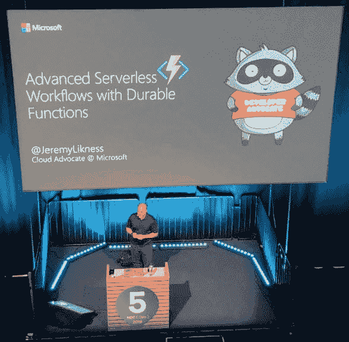
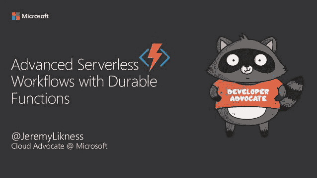

# After Your Talk 🗣: The Power 💪 of Leverage

> 原文：[https://dev.to/azure/after-your-talk-the-power-of-leverage-2enj](https://dev.to/azure/after-your-talk-the-power-of-leverage-2enj)

I've spent a decade delivering technical presentations and during that time I've learned a thing or two. The purpose of this series is sharing those lessons with you. These aren't speaker best practices or secret tips to turn you into a top tier speaker, but practical advice based on personal experience.

In this series:

*   [Why Speak?](https://dev.to/azure/a-guide-for-everyone-who-wants-to-give-technical-presentations-53bo)
*   [Where to Speak?](https://dev.to/azure/how-to-choose-where-to-give-your-technical-presentation-5g14)
*   [Talk Formats](https://dev.to/azure/the-many-flavors-of-technical-presentations-3fjj)
*   [Call for Presentations](https://dev.to/azure/the-amazing-secret-to-crafting-conference-submissions-that-don-t-suck-hgf)
*   [Build Your Presentation](https://dev.to/azure/build-a-bomb-diggity-technical-presentation-mic-drop-optional-1fhb)
*   [Practice and Feedback](https://dev.to/azure/how-to-practice-for-a-lit-presentation-51n9)
*   [Prepare to Travel](https://dev.to/azure/what-s-in-the-bag-packing-tips-for-technical-presentations-4k6n)
*   [The Day of Your Presentation](https://dev.to/azure/it-s-time-to-talk-the-day-of-your-presentation-2kpl)
*   After the Talk and Summary (you are here)

# 👆 After the Talk

Let's take a deep breath! *Your talk is finished.* YES! This is the moment you've been waiting for. Enjoy that post-talk flush of energy.

<figure>

<figcaption>That feeling when you are presenting in a stadium from a platform that is suspended by cables!</figcaption>

</figure>

*Photo Credit: [Manuel Sidler](https://twitter.com/manuelsidler)*

Most speakers find the lifecycle of a typical presentation looks something like this:

😕 Hmmm ... wonder if I'll get accepted.
😅 I got accepted!
😱 I have to put a talk together!
😊 My session is done.
😱 I have to present!
😠 This isn't worth it, I'm never speaking again.
😮 (gives talk)
😂🤣 That was awesome, when can I do it again?!

Just because the talk is over doesn't mean its impact has to end. There are a few ways you can continue to drive value and empower developers after the talk. The first, and most obvious, is to send out a link to the presentation materials:

*   **Share the presentation deck.** I make mine available under an open source license and welcome others to borrow and reuse for their own presentations. I like to "scale the presentations."
*   **Share the repository link.** Bonus points if you put together a detailed `README.md` that steps through each of the demos to make it easier for attendees to duplicate what you presented and other presenters to reuse your content.

>  <video loop="" controls=""><source src="https://video.twimg.com/amplify_video/1141352190189146117/vid/478x270/SHQ5UbCq9VR5G9Zr.mp4?tag=13" type="video/mp4"></video> Jeremy Likness ⚡️[@jeremylikness](https://dev.to/jeremylikness)I appreciate everyone who stayed for my evening [#ndcoslo](https://twitter.com/hashtag/ndcoslo) [#ndc2019](https://twitter.com/hashtag/ndc2019) session "Advanced [#Serverless](https://twitter.com/hashtag/Serverless) Workflows with Durable <⚡> Functions." Thank you for your time and attention! Here is the link to grab the full deck. It contains all of the relevant links. [jlikme.blob.core.windows.net/presentations/…](https://t.co/Z0qeKvksmN)17:00 PM - 19 Jun 2019  6  22

> ⭐ **Tip:** I find people are more drawn to post-presentation tweets when they can see what the presentation looks like. If they didn't attend the talk, it's a good preview that can help them decide if they want to take the time to download your materials. In PowerPoint, you can use the "Export As" feature to save a video. Set the transitions timing to a low number (I typically use 0.2 or 0.25 seconds). Twitter videos shouldn't be much longer than 2 minutes in duration. I generate low quality to make the file size smaller, but you can use whatever resolution you prefer. I then upload it to [Twitter studio](https://studio.twitter.com/). I set the call to action to visit a site and paste the link to download the presentation. It can be quite hectic after a talk is finished, so often I will schedule a Tweet to go out 10 minutes after my talk. That way it happens automatically, even if I'm still answering questions.

I also like to capture tweets I wrote along with tweets that reference me during the conference in a Twitter "moment." On the web app, you can click on any tweet and select "Add to new moment" to create a moment. I'll title it with the name of the conference and the year and add all conference-related tweets. When you publish a moment, Twitter automatically creates a tweet you can send out that looks like this:

> Jeremy Likness ⚡️[@jeremylikness](https://dev.to/jeremylikness)What a great event! Here are some Twitter captures for ⚡️ “NDC Oslo 2019”
> 
> [twitter.com/i/moments/1141…](https://t.co/n5ITVzVDEl)15:39 PM - 23 Jun 2019  0  6

If the conference recorded the video, I'll reply to the original link to follow-up and share that the video has been published. This may take several weeks to months after your presentation is done, so patience is required.

I also always follow up with a blog post that relates to the content. It might be a brief review of the topic, like this one:

[Managing Data 📈 in the Cloud ☁](https://blog.jeremylikness.com/blog/2019-05-16_managing-data-in-the-cloud-/)

Or it might be an in-depth article that stands on its own but is based on the steps and demo recordings from my presentation, like this one:

[Azure Event Grid: The Whole Story](https://blog.jeremylikness.com/blog/2019-02-05_azure-event-grid-the-whole-story/)

Finally, I always look for ways to evolve a session. I might start with the presentation and modify it for a different audience, extend it to add new features, or "borrow" the demo but change the story. The sky is truly the limit!

That concludes this practical and comprehensive guide to technical presentations. I hope you enjoyed it, that you received value, and that you share this with your friends, colleagues, and associates who are considering speaking for the first time. It's my desire that this is just the start of a longer conversation, so don't hesitate to share your comments and feel free to [connect with me on Twitter](https://twitter.com/jeremylikness).

🗣 **Let's discuss** What are some of the techniques you use to maximize the value of your technical presentations?

**Previous** [The Day of Your Presentation](https://dev.to/azure/it-s-time-to-talk-the-day-of-your-presentation-2kpl)

> I shared a unique video with each article to provide an example of various presentation styles. To conclude the series, I'd like to share with you this [YouTube collection of technical presentations](https://www.youtube.com/playlist?list=PL1VfiVM16kp-sQ3D3XDLopmScoaOQibFb) that covers all of my sessions and shows that have been published to YouTube.