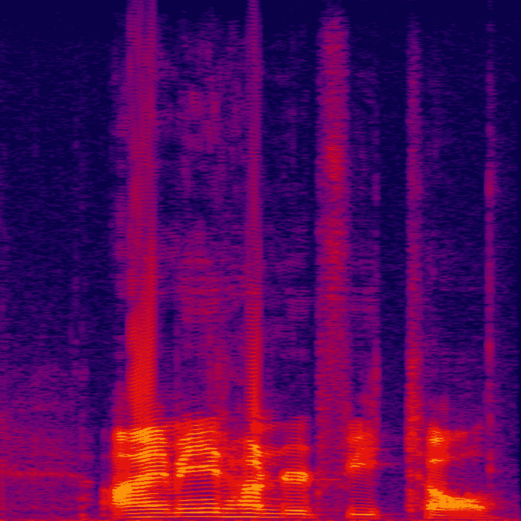

# 我从尝试用神经网络制作测谎仪中学到的是

> 原文：<https://dev.to/siddhantdubey/what-i-learned-from-trying-to-make-a-lie-detector-using-a-neural-network-3mjh>

这个周末，我试着做了一个测谎仪，它可以获取一些音频的声谱图，然后判断它是谎言还是…

在这个周末，我试图建造一个测谎仪，它可以获取一些音频的声谱图，然后决定它是否是一个谎言。在进行这个实验时，我非常确信这实际上是不可能的。所以我做了通常的事情，我收集了我的数据，我清理了它，并制作了一个训练和验证集。现在我承认，我选择的数据收集方法，记录我说不同真话和假话的声音，并不是最科学的，但对于一个家庭实验来说，它工作得很好。在这一点上，我所关注的是它是否会起作用。这让我忘记了最重要的问题。如果成功了会怎样？

很明显，测谎仪不像人们复活恐龙那样是个大问题，对吗？是时候回答这个问题了，但首先我们要看看实验的结果。我对网络进行了训练，结果让我非常震惊。它的错误率为 0！

当然，考虑到我的数据集很小，而且所有文件都来自同一个来源，错误率应该很小。所以我认为这是一个过度拟合的例子。

不知不觉中，我的心态已经从希望这个网络成功转变为希望它失败。为什么？可能是因为我意识到这绝对不是一件道德的事情。

现在真正有趣的部分来了。我把我自己的不同谎言和真相的音频文件输入它，它每次都能正确地识别文件。如果这是一个正常的神经网络，我会非常高兴。然而，这一次，我感到了强烈的忧虑。

我决定用其他人的声音来测试它，结果只比人类猜测某件事是不是谎言好一点点。我感到如释重负，但是为什么呢？

你可能会问，为什么测谎神经网络是个问题？我是说，测谎仪是存在的，这些都没问题。

是的，但是测谎仪不能变成一直监听模式的网络应用。测谎仪不能成为 Alexa 技能渗透到世界各地人们的家中。在远离受试者的情况下，测谎仪无法持续获取信息。

让神经网络完成有趣的任务已经变得难以置信的容易，但是随之而来的是缺乏对网络实际上做什么的思考。我们匆忙制作它是因为它有多酷，但是我们忘记了思考这个行为的道德性。

现在，这不是一个天网级别的问题，但就像所有的技术一样，神经网络可以被社会中不完全关心我们最佳利益的人所利用。这就是为什么监管人工智能和机器学习变得如此重要。如果没有一种适当的方法来监管神经网络的有害意图，那么某人很容易对一个看似无害的应用进行破坏。

当然，尽管我过度使用了这个版本的测谎仪，但其他版本在过去已经被多个研究人员迭代过，并且迭代将继续进行。这不是一个我们是否能做到的问题，因为我们肯定能做到，这是一个如何在道德上做到的问题。

毕竟，人类的道德指南针是其最优秀的特质之一。