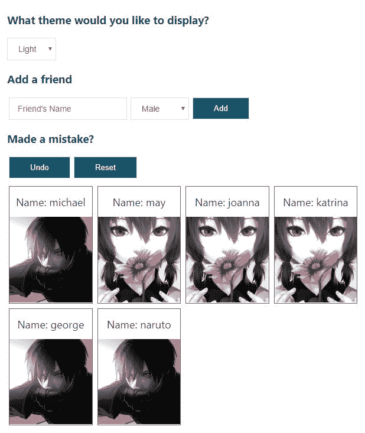
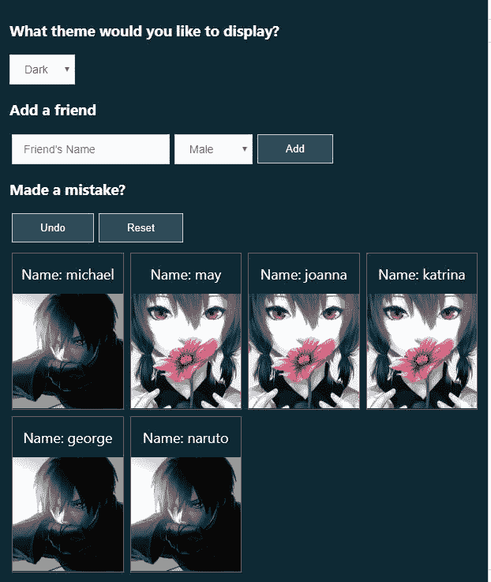
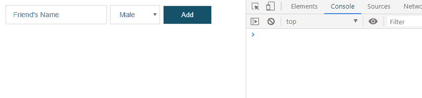
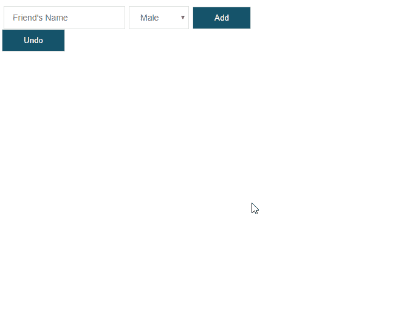
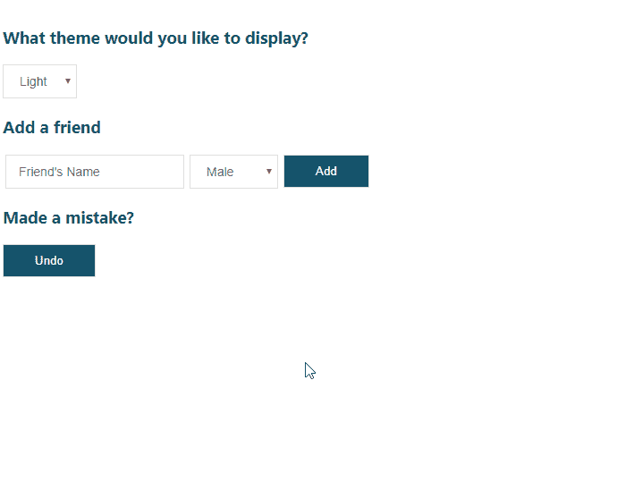
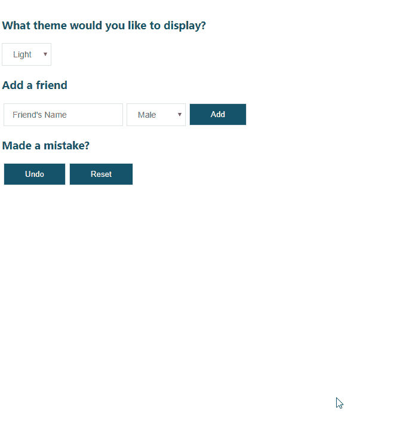
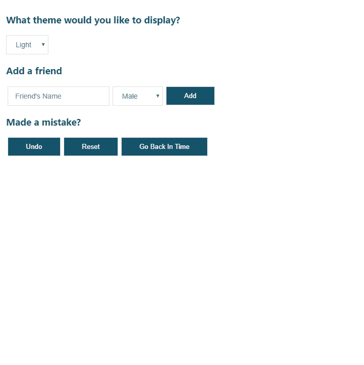

# 使用撤销和重置功能增强 React 应用程序

> 原文：<https://dev.to/jsmanifest/enhance-your-react-app-with-undo-and-reset-abilities-2l6h>

在[媒体](https://medium.com/@jsmanifest)上找到我

你有没有开发过出错时希望有*撤销*功能的东西？那么*复位*呢？

幸运的是，我们使用的软件中总是有撤销或重置功能。我说的是 [vscode](https://code.visualstudio.com/) 中的 *ctrl + z* ，或者是 90 年代表单中常见的一个 *reset* 按钮。

我们为什么需要它们？嗯，因为人类总是会犯错。无论是书面文章中的打字错误还是用词错误，我们都需要*以某种方式*来撤销某些东西。不过，当你想到这一点时，你会发现几乎在任何地方都有方法可以撤销某些事情*。铅笔有橡皮，电话可以被拆开，用户可以选择重设密码，可擦笔可以擦掉墨水——这样的例子不胜枚举。*

但是作为应用程序的开发人员，如何实现撤销或重置功能*？你从哪里开始？你应该从哪里寻求建议？*

好了，别再看了，因为我在这里向您展示如何用*撤销*和*重置*功能来增强您的应用程序！从这篇文章中你会发现实现起来并不难，而且*你也能做到*。

我们将建立的是一个用户界面，用户可以通过名字添加他们的朋友，并指定他们朋友的性别。当朋友被插入时，卡片将被附加到显示朋友注册信息的屏幕上。此外，如果他们的朋友是女性，它会显示一条*热粉色*的边界线，而男性会显示一条*蓝绿色*的边界线。如果用户在注册好友时出错，他或她可以选择*撤销*该动作，或者*将整个界面重置*回初始状态。最后，他们将能够改变他们的界面主题颜色，以防他们喜欢黑暗而不是光明，反之亦然。

这就是它的样子:

## 光

[](https://res.cloudinary.com/practicaldev/image/fetch/s--uILhFuOK--/c_limit%2Cf_auto%2Cfl_progressive%2Cq_auto%2Cw_880/https://jsmanifest.s3-us-west-1.amazonaws.com/posts/enhance-your-react-app-with-undo-reset-abilities/final-light.jpg)

## 黑暗

[](https://res.cloudinary.com/practicaldev/image/fetch/s--IX_jAMjF--/c_limit%2Cf_auto%2Cfl_progressive%2Cq_auto%2Cw_880/https://jsmanifest.s3-us-west-1.amazonaws.com/posts/enhance-your-react-app-with-undo-reset-abilities/final-dark.jpg)

事不宜迟，我们开始吧！

在本教程中，我们将使用 create-react-app 快速生成一个 react 项目。

(如果你想从 github 获得一份库的副本，点击[这里](https://github.com/jsmanifest/undo-reset))。

继续使用下面的命令创建一个项目。在本教程中，我将我们的项目称为*撤销-重置*。

```
npx create-react-app undo-reset 
```

<svg width="20px" height="20px" viewBox="0 0 24 24" class="highlight-action crayons-icon highlight-action--fullscreen-on"><title>Enter fullscreen mode</title></svg> <svg width="20px" height="20px" viewBox="0 0 24 24" class="highlight-action crayons-icon highlight-action--fullscreen-off"><title>Exit fullscreen mode</title></svg>

一旦完成，现在进入目录:

```
cd undo-reset 
```

<svg width="20px" height="20px" viewBox="0 0 24 24" class="highlight-action crayons-icon highlight-action--fullscreen-on"><title>Enter fullscreen mode</title></svg> <svg width="20px" height="20px" viewBox="0 0 24 24" class="highlight-action crayons-icon highlight-action--fullscreen-off"><title>Exit fullscreen mode</title></svg>

在主入口`src/index.js`内部，我们将对其进行一些清理:

> src/index.js

```
import React from 'react'
import ReactDOM from 'react-dom'
import App from './App'
import './styles.css'
import * as serviceWorker from './serviceWorker'

ReactDOM.render(<App />, document.getElementById('root'))
serviceWorker.unregister() 
```

<svg width="20px" height="20px" viewBox="0 0 24 24" class="highlight-action crayons-icon highlight-action--fullscreen-on"><title>Enter fullscreen mode</title></svg> <svg width="20px" height="20px" viewBox="0 0 24 24" class="highlight-action crayons-icon highlight-action--fullscreen-off"><title>Exit fullscreen mode</title></svg>

以下是开始的风格:

src/styles.css

```
body {
  margin: 0;
  font-family: -apple-system, BlinkMacSystemFont, 'Segoe UI', 'Roboto',
    'Oxygen', 'Ubuntu', 'Cantarell', 'Fira Sans', 'Droid Sans',
    'Helvetica Neue', sans-serif;
  -webkit-font-smoothing: antialiased;
  -moz-osx-font-smoothing: grayscale;
} 
```

<svg width="20px" height="20px" viewBox="0 0 24 24" class="highlight-action crayons-icon highlight-action--fullscreen-on"><title>Enter fullscreen mode</title></svg> <svg width="20px" height="20px" viewBox="0 0 24 24" class="highlight-action crayons-icon highlight-action--fullscreen-off"><title>Exit fullscreen mode</title></svg>

现在创建`src/App.js`。这将呈现我们将在整个教程中构建的所有组件:

src/App.js

```
import React, { useState } from 'react'

const App = () => {
  const [name, setName] = useState('')
  const [gender, setGender] = useState('Male')
  const onNameChange = (e) => setName(e.target.value)
  const onGenderChange = (e) => setGender(e.target.value)

  return <div />
}

export default App 
```

<svg width="20px" height="20px" viewBox="0 0 24 24" class="highlight-action crayons-icon highlight-action--fullscreen-on"><title>Enter fullscreen mode</title></svg> <svg width="20px" height="20px" viewBox="0 0 24 24" class="highlight-action crayons-icon highlight-action--fullscreen-off"><title>Exit fullscreen mode</title></svg>

因为我们将让用户添加他们的朋友并指定姓名和性别，所以我们定义了几个 react 钩子来保存输入值，我们还将定义更新它们的方法。

然后，我们将实现钩子将自己附加到的元素和输入字段:

src/App.js

```
const App = () => {
  const [name, setName] = useState('')
  const [gender, setGender] = useState('Male')
  const onNameChange = (e) => setName(e.target.value)
  const onGenderChange = (e) => setGender(e.target.value)

  return (
    <div>
      <form className="form">
        <div>
          <input
            onChange={onNameChange}
            value={name}
            type="text"
            name="name"
            placeholder="Friend's Name"
          />
        </div>
        <div>
          <select onChange={onGenderChange} name="gender" value={gender}>
            <option value="Male">Male</option>
            <option value="Female">Female</option>
            <option value="Other">Other</option>
          </select>
        </div>
        <div>
          <button type="submit">Add</button>
        </div>
      </form>
    </div>
  )
} 
```

<svg width="20px" height="20px" viewBox="0 0 24 24" class="highlight-action crayons-icon highlight-action--fullscreen-on"><title>Enter fullscreen mode</title></svg> <svg width="20px" height="20px" viewBox="0 0 24 24" class="highlight-action crayons-icon highlight-action--fullscreen-off"><title>Exit fullscreen mode</title></svg>

src/styles.css

```
form {
  display: flex;
  align-items: center;
}

form > div {
  margin: auto 3px;
}

input,
select {
  transition: all 0.15s ease-out;
  border: 1px solid #ddd;
  padding: 10px 14px;
  outline: none;
  font-size: 14px;
  color: #666;
}

input:hover,
select:hover {
  border: 1px solid #c6279f;
}

select {
  cursor: pointer;
  padding-top: 9px;
  padding-bottom: 9px;
}

button {
  transition: all 0.15s ease-out;
  background: #145269;
  border: 1px solid #ddd;
  padding: 10px 35px;
  outline: none;
  cursor: pointer;
  color: #fff;
}

button:hover {
  color: #145269;
  background: #fff;
  border: 1px solid #145269;
}

button:active {
  background: rgb(27, 71, 110);
  border: 1px solid #a1a1a1;
  color: #fff;
} 
```

<svg width="20px" height="20px" viewBox="0 0 24 24" class="highlight-action crayons-icon highlight-action--fullscreen-on"><title>Enter fullscreen mode</title></svg> <svg width="20px" height="20px" viewBox="0 0 24 24" class="highlight-action crayons-icon highlight-action--fullscreen-off"><title>Exit fullscreen mode</title></svg>

现在我不喜欢在我的教程中保持我的界面超级简单——毕竟，我*确实*重视你花在阅读我的帖子上的时间，所以我在风格上提供了一些想法，让你远离无聊:)

接下来，我们需要一个稳固的地方来放置撤销和重置逻辑，因此我们将创建一个自定义钩子来处理状态更新:

src/useapp . js〔t0〕

```
const useApp = () => {
  const onSubmit = (e) => {
    e.preventDefault()
    console.log('Submitted')
  }

  return {
    onSubmit,
  }
}

export default useApp 
```

<svg width="20px" height="20px" viewBox="0 0 24 24" class="highlight-action crayons-icon highlight-action--fullscreen-on"><title>Enter fullscreen mode</title></svg> <svg width="20px" height="20px" viewBox="0 0 24 24" class="highlight-action crayons-icon highlight-action--fullscreen-off"><title>Exit fullscreen mode</title></svg>

上面的 *onSubmit* 将被传递到我们之前定义的*表单*中，这将有助于在用户提交好友时将他们添加到好友列表中:

src/App.js

```
import React, { useState } from 'react'
import useApp from './useApp'

const App = () => {
  const { onSubmit } = useApp()

  const [name, setName] = useState('')
  const [gender, setGender] = useState('Male')
  const onNameChange = (e) => setName(e.target.value)
  const onGenderChange = (e) => setGender(e.target.value)

  return (
    <div>
      <form className="form" onSubmit={onSubmit({ name, gender })}>
        <div>
          <input
            onChange={onNameChange}
            value={name}
            type="text"
            name="name"
            placeholder="Friend's Name"
          />
        </div>
        <div>
          <select onChange={onGenderChange} name="gender" value={gender}>
            <option value="Male">Male</option>
            <option value="Female">Female</option>
            <option value="Other">Other</option>
          </select>
        </div>
        <div>
          <button type="submit">Add</button>
        </div>
      </form>
    </div>
  )
}

export default App 
```

<svg width="20px" height="20px" viewBox="0 0 24 24" class="highlight-action crayons-icon highlight-action--fullscreen-on"><title>Enter fullscreen mode</title></svg> <svg width="20px" height="20px" viewBox="0 0 24 24" class="highlight-action crayons-icon highlight-action--fullscreen-off"><title>Exit fullscreen mode</title></svg>

这里需要注意的是， *onSubmit* 被赋予字段参数作为参数。如果我们回头看看我们的 *onSubmit* 处理程序，它不是一个[高阶函数](https://codeburst.io/here-are-7-ways-higher-order-functions-can-improve-your-life-a392aa6b29d2)。这意味着它将在组件挂载时立即被调用，因此我们需要将 onSubmit 处理程序转换为一个高阶函数来绕过它，并赋予它接收字段值的能力:

src/useapp . js〔t0〕

```
const useApp = () => {
  const onSubmit = (friend) => (e) => {
    e.preventDefault()
    console.log(friend)
  }

  return {
    onSubmit,
  }
}

export default useApp 
```

<svg width="20px" height="20px" viewBox="0 0 24 24" class="highlight-action crayons-icon highlight-action--fullscreen-on"><title>Enter fullscreen mode</title></svg> <svg width="20px" height="20px" viewBox="0 0 24 24" class="highlight-action crayons-icon highlight-action--fullscreen-off"><title>Exit fullscreen mode</title></svg>

到目前为止，我们有这个:

[](https://res.cloudinary.com/practicaldev/image/fetch/s--hC270Yzx--/c_limit%2Cf_auto%2Cfl_progressive%2Cq_66%2Cw_880/https://jsmanifest.s3-us-west-1.amazonaws.com/posts/enhance-your-react-app-with-undo-reset-abilities/1.gif)

接下来，我们将开始实现逻辑。但是首先，我们需要定义*状态结构*:

src/useapp . js〔t0〕

```
const initialState = {
  friends: [],
  history: [],
} 
```

<svg width="20px" height="20px" viewBox="0 0 24 24" class="highlight-action crayons-icon highlight-action--fullscreen-on"><title>Enter fullscreen mode</title></svg> <svg width="20px" height="20px" viewBox="0 0 24 24" class="highlight-action crayons-icon highlight-action--fullscreen-off"><title>Exit fullscreen mode</title></svg>

本教程最重要的部分是*历史*。当用户提交一个动作时，我们将*捕获*应用程序的状态，并将其安全地存储在一个地方，我们可以在以后引用来撤销用户的动作。这个*【存储】*就是 *state.history* 只有*我们的自定义钩子需要知道。然而，它也可以在用户界面中用于有趣的功能——比如允许用户通过一个网格查看他们以前的操作，以及*选择*返回哪个。这是一个方便的小功能，让你的用户惊叹不已！*

接下来，我们将在 reducer 中添加开关案例，以便我们的状态可以实际更新:

src/useapp . js〔t0〕

```
const reducer = (state, action) => {
  switch (action.type) {
    case 'add-friend':
      return {
        ...state,
        friends: [...state.friends, action.friend],
        history: [...state.history, state],
      }
    case 'undo': {
      const isEmpty = !state.history.length
      if (isEmpty) return state
      return { ...state.history[state.history.length - 1] }
    }
    default:
      return state
  }
} 
```

<svg width="20px" height="20px" viewBox="0 0 24 24" class="highlight-action crayons-icon highlight-action--fullscreen-on"><title>Enter fullscreen mode</title></svg> <svg width="20px" height="20px" viewBox="0 0 24 24" class="highlight-action crayons-icon highlight-action--fullscreen-off"><title>Exit fullscreen mode</title></svg>

当我们*分派*一个类型为*‘添加好友’*的动作时，我们继续将这个新朋友添加到列表中。但是*用户不知道的是*我们在*默默保存他们之前的编辑*。我们捕获了应用程序的最新状态，并将其保存在*历史*数组中。这样，如果用户想回到以前的状态，我们可以帮助他们实现:)

因为我们使用的是 react hook api，所以我们不能忘记从 *react* 导入它。我们还需要在我们的自定义钩子中定义 *useReducer* 实现，以便我们获取 api 来发送信号以更新我们的本地状态:

src/useapp . js〔t0〕

```
import { useReducer } from 'react'

// ... further down inside the custom hook:
const [state, dispatch] = useReducer(reducer, initialState) 
```

<svg width="20px" height="20px" viewBox="0 0 24 24" class="highlight-action crayons-icon highlight-action--fullscreen-on"><title>Enter fullscreen mode</title></svg> <svg width="20px" height="20px" viewBox="0 0 24 24" class="highlight-action crayons-icon highlight-action--fullscreen-off"><title>Exit fullscreen mode</title></svg>

现在我们已经获得了 API，让我们将它们整合到需要它的地方:

src/useapp . js〔t0〕

```
const onSubmit = (friend) => (e) => {
  e.preventDefault()
  if (!friend.name) return
  dispatch({ type: 'add-friend', friend })
}

const undo = () => {
  dispatch({ type: 'undo' })
} 
```

<svg width="20px" height="20px" viewBox="0 0 24 24" class="highlight-action crayons-icon highlight-action--fullscreen-on"><title>Enter fullscreen mode</title></svg> <svg width="20px" height="20px" viewBox="0 0 24 24" class="highlight-action crayons-icon highlight-action--fullscreen-off"><title>Exit fullscreen mode</title></svg>

到目前为止，我们的定制钩子是这样的:

src/useapp . js〔t0〕

```
import { useReducer } from 'react'

const initialState = {
  friends: [],
  history: [],
}

const reducer = (state, action) => {
  switch (action.type) {
    case 'add-friend':
      return {
        ...state,
        friends: [...state.friends, action.friend],
        history: [...state.history, state],
      }
    case 'undo': {
      const isEmpty = !state.history.length
      if (isEmpty) return state
      return { ...state.history[state.history.length - 1] }
    }
    default:
      return state
  }
}

const useApp = () => {
  const [state, dispatch] = useReducer(reducer, initialState)

  const onSubmit = (friend) => (e) => {
    e.preventDefault()
    if (!friend.name) return
    dispatch({ type: 'add-friend', friend })
  }

  const undo = () => {
    dispatch({ type: 'undo' })
  }

  return {
    ...state,
    onSubmit,
    undo,
  }
}

export default useApp 
```

<svg width="20px" height="20px" viewBox="0 0 24 24" class="highlight-action crayons-icon highlight-action--fullscreen-on"><title>Enter fullscreen mode</title></svg> <svg width="20px" height="20px" viewBox="0 0 24 24" class="highlight-action crayons-icon highlight-action--fullscreen-off"><title>Exit fullscreen mode</title></svg>

接下来，我们将需要呈现插入到 *state.friends* 中的朋友列表，以便用户可以在界面中看到他们:

src/App.js

```
const App = () => {
  const { onSubmit, friends } = useApp()

  const [name, setName] = useState('')
  const [gender, setGender] = useState('Male')
  const onNameChange = (e) => setName(e.target.value)
  const onGenderChange = (e) => setGender(e.target.value)

  return (
    <div>
      <form className="form" onSubmit={onSubmit({ name, gender })}>
        <div>
          <input
            onChange={onNameChange}
            value={name}
            type="text"
            name="name"
            placeholder="Friend's Name"
          />
        </div>
        <div>
          <select onChange={onGenderChange} name="gender" value={gender}>
            <option value="Male">Male</option>
            <option value="Female">Female</option>
            <option value="Other">Other</option>
          </select>
        </div>
        <div>
          <button type="submit">Add</button>
        </div>
      </form>
      <div className="boxes">
        {friends.map(({ name, gender }, index) => (
          <FriendBox key={`friend_${index}`} gender={gender}>
            <div className="box-name">Name: {name}</div>
            <div className="gender-container">
              
            </div>
          </FriendBox>
        ))}
      </div>
    </div>
  )
} 
```

<svg width="20px" height="20px" viewBox="0 0 24 24" class="highlight-action crayons-icon highlight-action--fullscreen-on"><title>Enter fullscreen mode</title></svg> <svg width="20px" height="20px" viewBox="0 0 24 24" class="highlight-action crayons-icon highlight-action--fullscreen-off"><title>Exit fullscreen mode</title></svg>

如果你想知道这奇怪的一行在做什么:

```
 
```

<svg width="20px" height="20px" viewBox="0 0 24 24" class="highlight-action crayons-icon highlight-action--fullscreen-on"><title>Enter fullscreen mode</title></svg> <svg width="20px" height="20px" viewBox="0 0 24 24" class="highlight-action crayons-icon highlight-action--fullscreen-off"><title>Exit fullscreen mode</title></svg>

实际上，我只是提供了自己的图像来渲染在 *img* 元素上，以便在界面中轻松区分*女性*和*男性*——出于演示目的。如果您需要它们的副本，那些正在克隆存储库的人将能够在 *src/images* 目录中看到它们:)

我们在 *App.js* 的顶部导入女性/男性图像，在 *App* 组件的正上方，我们将定义一个 *FriendBox* 组件，当用户将它们添加到列表中时，它将负责呈现一个 *friend* 框:

src/App.js

```
// At the top
import female from img/female.jpg'
import male from img/male.jpg'

// Somewhere above the App component
const FriendBox = ({ gender, ...props }) => (
  <div
    className={cx('box', {
      'teal-border': gender === 'Male',
      'hotpink-border': gender === 'Female',
    })}
    {...props}
  />
) 
```

<svg width="20px" height="20px" viewBox="0 0 24 24" class="highlight-action crayons-icon highlight-action--fullscreen-on"><title>Enter fullscreen mode</title></svg> <svg width="20px" height="20px" viewBox="0 0 24 24" class="highlight-action crayons-icon highlight-action--fullscreen-off"><title>Exit fullscreen mode</title></svg>

为了在视觉上进一步区分*女*和*男*，我额外添加了基本样式来代表每一种:

src/styles.css

```
.teal-border {
  border: 1px solid #467b8f;
}

.hotpink-border {
  border: 1px solid #c1247d;
} 
```

<svg width="20px" height="20px" viewBox="0 0 24 24" class="highlight-action crayons-icon highlight-action--fullscreen-on"><title>Enter fullscreen mode</title></svg> <svg width="20px" height="20px" viewBox="0 0 24 24" class="highlight-action crayons-icon highlight-action--fullscreen-off"><title>Exit fullscreen mode</title></svg>

以下是我们目前对 *App.js* 文件的了解:

src/App.js

```
import React, { useState } from 'react'
import cx from 'classnames'
import female from img/female.jpg'
import male from img/male.jpg'
import useApp from './useApp'

const FriendBox = ({ gender, ...props }) => (
  <div
    className={cx('box', {
      'teal-border': gender === 'Male',
      'hotpink-border': gender === 'Female',
    })}
    {...props}
  />
)

const App = () => {
  const { onSubmit, friends } = useApp()

  const [name, setName] = useState('')
  const [gender, setGender] = useState('Male')
  const onNameChange = (e) => setName(e.target.value)
  const onGenderChange = (e) => setGender(e.target.value)

  return (
    <div>
      <form className="form" onSubmit={onSubmit({ name, gender })}>
        <div>
          <input
            onChange={onNameChange}
            value={name}
            type="text"
            name="name"
            placeholder="Friend's Name"
          />
        </div>
        <div>
          <select onChange={onGenderChange} name="gender" value={gender}>
            <option value="Male">Male</option>
            <option value="Female">Female</option>
            <option value="Other">Other</option>
          </select>
        </div>
        <div>
          <button type="submit">Add</button>
        </div>
      </form>
      <div className="boxes">
        {friends.map(({ name, gender }, index) => (
          <FriendBox key={`friend_${index}`} gender={gender}>
            <div className="box-name">Name: {name}</div>
            <div className="gender-container">
              
            </div>
          </FriendBox>
        ))}
      </div>
    </div>
  )
}

export default App 
```

<svg width="20px" height="20px" viewBox="0 0 24 24" class="highlight-action crayons-icon highlight-action--fullscreen-on"><title>Enter fullscreen mode</title></svg> <svg width="20px" height="20px" viewBox="0 0 24 24" class="highlight-action crayons-icon highlight-action--fullscreen-off"><title>Exit fullscreen mode</title></svg>

这里的盒子使用的样式有:

src/styles.css

```
.boxes {
  margin: 10px 0;
  padding: 3px;
  display: grid;
  grid-gap: 10px;
  grid-template-columns: repeat(3, 1fr);
  grid-template-rows: 1fr;
}

.box {
  font-size: 18px;
  display: flex;
  justify-content: center;
  align-items: center;
  flex-direction: column;
  width: 100%;
  height: 100%;
  overflow: hidden;
}

.box-name {
  display: flex;
  align-items: center;
  height: 50px;
}

.box.gender-container {
  position: relative;
}

.box img {
  object-fit: cover;
  width: 100%;
  height: 100%;
} 
```

<svg width="20px" height="20px" viewBox="0 0 24 24" class="highlight-action crayons-icon highlight-action--fullscreen-on"><title>Enter fullscreen mode</title></svg> <svg width="20px" height="20px" viewBox="0 0 24 24" class="highlight-action crayons-icon highlight-action--fullscreen-off"><title>Exit fullscreen mode</title></svg>

哦，真倒霉！我们忘记做的一件事是引入 *undo* 方法，这样我们就可以在界面中使用它了！继续从*使用 App* 将其销毁，并将其放置在*撤销*按钮上:

src/App.js

```
const App = () => {
  const { onSubmit, friends, undo } = useApp()

  const [name, setName] = useState('')
  const [gender, setGender] = useState('Male')
  const onNameChange = (e) => setName(e.target.value)
  const onGenderChange = (e) => setGender(e.target.value)

  const resetValues = () => {
    setName('')
    setGender('Male')
  }

  return (
    <div>
      <form className="form" onSubmit={onSubmit({ name, gender }, resetValues)}>
        <div>
          <input
            onChange={onNameChange}
            value={name}
            type="text"
            name="name"
            placeholder="Friend's Name"
          />
        </div>
        <div>
          <select onChange={onGenderChange} name="gender" value={gender}>
            <option value="Male">Male</option>
            <option value="Female">Female</option>
            <option value="Other">Other</option>
          </select>
        </div>
        <div>
          <button type="submit">Add</button>
        </div>
      </form>
      <div className="undo-actions">
        <div>
          <button type="button" onClick={undo}>
            Undo
          </button>
        </div>
      </div>
      <div className="boxes">
        {friends.map(({ name, gender }, index) => (
          <FriendBox key={`friend_${index}`} gender={gender}>
            <div className="box-name">Name: {name}</div>
            <div className="gender-container">
              
            </div>
          </FriendBox>
        ))}
      </div>
    </div>
  )
} 
```

<svg width="20px" height="20px" viewBox="0 0 24 24" class="highlight-action crayons-icon highlight-action--fullscreen-on"><title>Enter fullscreen mode</title></svg> <svg width="20px" height="20px" viewBox="0 0 24 24" class="highlight-action crayons-icon highlight-action--fullscreen-off"><title>Exit fullscreen mode</title></svg>

现在，当用户点击*撤销*按钮时，他们的最后一个动作应该被恢复！

[](https://res.cloudinary.com/practicaldev/image/fetch/s--ymdTUZX_--/c_limit%2Cf_auto%2Cfl_progressive%2Cq_66%2Cw_880/https://jsmanifest.s3-us-west-1.amazonaws.com/posts/enhance-your-react-app-with-undo-reset-abilities/2.gif)

一切都按计划完美进行。用户可以将他们的朋友添加到列表中，很容易在界面中注意到哪些是女性和男性，并撤销他们之前的提交。

...你有没有注意到在*应用*组件中现在有一个 *resetValues* 方法，它被作为第二个参数传递给 *onSubmit* ？用户可能会觉得有点奇怪的一件事是，在他们提交朋友后，他们的输入没有被清除。那里还需要同样的名字吗？除非他们有两三个同名的朋友，否则他们肯定会按下退格键，自己清除掉。但是我们作为开发者有能力让他们的生活变得更简单，所以这就是为什么我们实现了一个 *resetValues* 。

话虽如此，但由于我们在 UI 组件中将其作为*第二个参数*传入，所以应该将其声明为*第二个参数*到 *onSubmit* :

src/useapp . js〔t0〕

```
const useApp = () => {
  const [state, dispatch] = useReducer(reducer, initialState)

  const onSubmit = (friend, resetValues) => (e) => {
    e.preventDefault()
    if (!friend.name) return
    dispatch({ type: 'add-friend', friend })
    resetValues()
  }

  const undo = () => {
    dispatch({ type: 'undo' })
  }

  return {
    ...state,
    onSubmit,
    undo,
  }
} 
```

<svg width="20px" height="20px" viewBox="0 0 24 24" class="highlight-action crayons-icon highlight-action--fullscreen-on"><title>Enter fullscreen mode</title></svg> <svg width="20px" height="20px" viewBox="0 0 24 24" class="highlight-action crayons-icon highlight-action--fullscreen-off"><title>Exit fullscreen mode</title></svg>

我们的撤销功能现在应该 100%正常工作了，但是我将进一步使它变得复杂一点，因为*撤销*可以兼容几乎任何东西。

因此，我们将允许用户为界面声明一个主题颜色，这样他们就不会对白色感到厌倦:

src/useapp . js〔t0〕

```
const initialState = {
  friends: [],
  history: [],
  theme: 'light',
} 
```

<svg width="20px" height="20px" viewBox="0 0 24 24" class="highlight-action crayons-icon highlight-action--fullscreen-on"><title>Enter fullscreen mode</title></svg> <svg width="20px" height="20px" viewBox="0 0 24 24" class="highlight-action crayons-icon highlight-action--fullscreen-off"><title>Exit fullscreen mode</title></svg>

src/useapp . js〔t0〕

```
const reducer = (state, action) => {
  switch (action.type) {
    case 'set-theme':
      return { ...state, theme: action.theme, history: insertToHistory(state) }
    case 'add-friend':
      return {
        ...state,
        friends: [...state.friends, action.friend],
        history: insertToHistory(state),
      }
    case 'undo': {
      const isEmpty = !state.history.length
      if (isEmpty) return state
      return { ...state.history[state.history.length - 1] }
    }
    case 'reset':
      return { ...initialState, history: insertToHistory(state) }
    default:
      return state
  }
} 
```

<svg width="20px" height="20px" viewBox="0 0 24 24" class="highlight-action crayons-icon highlight-action--fullscreen-on"><title>Enter fullscreen mode</title></svg> <svg width="20px" height="20px" viewBox="0 0 24 24" class="highlight-action crayons-icon highlight-action--fullscreen-off"><title>Exit fullscreen mode</title></svg>

此外，我声明了一个 *insertToHistory* 实用程序，为我们带来额外的好处，以防我们将来为 state 参数传递一个奇怪的值，您可能已经注意到了:

```
const insertToHistory = (state) => {
  if (state && Array.isArray(state.history)) {
    // Do not mutate
    const newHistory = [...state.history]
    newHistory.push(state)
    return newHistory
  }
  console.warn(
    'WARNING! The state was attempting capture but something went wrong. Please check if the state is controlled correctly.',
  )
  return state.history || []
} 
```

<svg width="20px" height="20px" viewBox="0 0 24 24" class="highlight-action crayons-icon highlight-action--fullscreen-on"><title>Enter fullscreen mode</title></svg> <svg width="20px" height="20px" viewBox="0 0 24 24" class="highlight-action crayons-icon highlight-action--fullscreen-off"><title>Exit fullscreen mode</title></svg>

我想补充一点，随着你的应用变得越来越大越来越复杂，提前思考是一个非常重要的习惯。

现在继续讨论*主题实现*，我们将定义一个用户界面组件可以利用的自定义方法:

src/useapp . js〔t0〕

```
const onThemeChange = (e) => {
  dispatch({ type: 'set-theme', theme: e.target.value })
}

return {
  ...state,
  onSubmit,
  undo,
  onThemeChange,
} 
```

<svg width="20px" height="20px" viewBox="0 0 24 24" class="highlight-action crayons-icon highlight-action--fullscreen-on"><title>Enter fullscreen mode</title></svg> <svg width="20px" height="20px" viewBox="0 0 24 24" class="highlight-action crayons-icon highlight-action--fullscreen-off"><title>Exit fullscreen mode</title></svg>

将主题组件和方法应用于界面:

src/App.js

```
import React, { useState } from 'react'
import cx from 'classnames'
import female from img/female.jpg'
import male from img/male.jpg'
import useApp from './useApp'

const FriendBox = ({ gender, ...props }) => (
  <div
    className={cx('box', {
      'teal-border': gender === 'Male',
      'hotpink-border': gender === 'Female',
    })}
    {...props}
  />
)

const App = () => {
  const { onSubmit, friends, undo, theme, onThemeChange } = useApp()

  const [name, setName] = useState('')
  const [gender, setGender] = useState('Male')
  const onNameChange = (e) => setName(e.target.value)
  const onGenderChange = (e) => setGender(e.target.value)

  const resetValues = () => {
    setName('')
    setGender('Male')
  }

  return (
    <div>
      <div>
        <h3>What theme would you like to display?</h3>
        <div>
          <select onChange={onThemeChange} name="theme" value={theme}>
            <option value="light">Light</option>
            <option value="dark">Dark</option>
          </select>
        </div>
      </div>
      <div>
        <h3>Add a friend</h3>
        <form
          className="form"
          onSubmit={onSubmit({ name, gender }, resetValues)}
        >
          <div>
            <input
              onChange={onNameChange}
              value={name}
              type="text"
              name="name"
              placeholder="Friend's Name"
            />
          </div>
          <div>
            <select onChange={onGenderChange} name="gender" value={gender}>
              <option value="Male">Male</option>
              <option value="Female">Female</option>
              <option value="Other">Other</option>
            </select>
          </div>
          <div>
            <button type="submit">Add</button>
          </div>
        </form>
      </div>
      <div>
        <h3>Made a mistake?</h3>
        <div className="undo-actions">
          <div>
            <button type="button" onClick={undo}>
              Undo
            </button>
          </div>
        </div>
      </div>
      <div className="boxes">
        {friends.map(({ name, gender }, index) => (
          <FriendBox key={`friend_${index}`} gender={gender}>
            <div className="box-name">Name: {name}</div>
            <div className="gender-container">
              
            </div>
          </FriendBox>
        ))}
      </div>
    </div>
  )
}

export default App 
```

<svg width="20px" height="20px" viewBox="0 0 24 24" class="highlight-action crayons-icon highlight-action--fullscreen-on"><title>Enter fullscreen mode</title></svg> <svg width="20px" height="20px" viewBox="0 0 24 24" class="highlight-action crayons-icon highlight-action--fullscreen-off"><title>Exit fullscreen mode</title></svg>

因为我们添加了主题变化的特性，所以添加一些条件样式来适应变化可能是个好主意，对吗？

```
 <div className={cx({
    'theme-light': theme === 'light',
    'theme-dark': theme === 'dark',
  })}
  // ...rest of the component 
```

<svg width="20px" height="20px" viewBox="0 0 24 24" class="highlight-action crayons-icon highlight-action--fullscreen-on"><title>Enter fullscreen mode</title></svg> <svg width="20px" height="20px" viewBox="0 0 24 24" class="highlight-action crayons-icon highlight-action--fullscreen-off"><title>Exit fullscreen mode</title></svg>

这是它的风格:

src/styles.css

```
.theme-light,
.theme-dark {
  box-sizing: border-box;
  transition: all 0.15s ease-out;
  padding: 12px;
  min-height: 100vh;
}

.theme-light {
  color: #145269;
  background: #fff;
}

.theme-dark {
  color: #fff;
  background: #0b2935;
} 
```

<svg width="20px" height="20px" viewBox="0 0 24 24" class="highlight-action crayons-icon highlight-action--fullscreen-on"><title>Enter fullscreen mode</title></svg> <svg width="20px" height="20px" viewBox="0 0 24 24" class="highlight-action crayons-icon highlight-action--fullscreen-off"><title>Exit fullscreen mode</title></svg>

厉害！下面是我们的界面现在能做的！

[](https://res.cloudinary.com/practicaldev/image/fetch/s--pxjFxvYp--/c_limit%2Cf_auto%2Cfl_progressive%2Cq_66%2Cw_880/https://jsmanifest.s3-us-west-1.amazonaws.com/posts/enhance-your-react-app-with-undo-reset-abilities/3.gif)

为自己走到这一步鼓掌吧！

不过我们先不要庆祝，因为这篇文章的标题还提到了界面的 *reset* 特性。

现在，让我们通过在我们现有的减速器上定义开关箱来实现这一点:

src/useapp . js〔t0〕

```
const reducer = (state, action) => {
  switch (action.type) {
    case 'set-theme':
      return { ...state, theme: action.theme, history: insertToHistory(state) }
    case 'add-friend':
      return {
        ...state,
        friends: [...state.friends, action.friend],
        history: insertToHistory(state),
      }
    case 'undo': {
      const isEmpty = !state.history.length
      if (isEmpty) return state
      return { ...state.history[state.history.length - 1] }
    }
    case 'reset':
      return { ...initialState, history: insertToHistory(state) }
    default:
      return state
  }
} 
```

<svg width="20px" height="20px" viewBox="0 0 24 24" class="highlight-action crayons-icon highlight-action--fullscreen-on"><title>Enter fullscreen mode</title></svg> <svg width="20px" height="20px" viewBox="0 0 24 24" class="highlight-action crayons-icon highlight-action--fullscreen-off"><title>Exit fullscreen mode</title></svg>

当然，这意味着接下来必须定义一种方法，向减速器发送状态变化的信号。别忘了在钩子的末端归还它！

src/useapp . js〔t0〕

```
const reset = () => {
  dispatch({ type: 'reset' })
}

const onThemeChange = (e) => {
  dispatch({ type: 'set-theme', theme: e.target.value })
}

return {
  ...state,
  onSubmit,
  onThemeChange,
  undo,
  reset,
} 
```

<svg width="20px" height="20px" viewBox="0 0 24 24" class="highlight-action crayons-icon highlight-action--fullscreen-on"><title>Enter fullscreen mode</title></svg> <svg width="20px" height="20px" viewBox="0 0 24 24" class="highlight-action crayons-icon highlight-action--fullscreen-off"><title>Exit fullscreen mode</title></svg>

从 UI 组件中的挂钩析构它:

src/App.js

```
const { onSubmit, friends, undo, theme, onThemeChange, reset } = useApp() 
```

<svg width="20px" height="20px" viewBox="0 0 24 24" class="highlight-action crayons-icon highlight-action--fullscreen-on"><title>Enter fullscreen mode</title></svg> <svg width="20px" height="20px" viewBox="0 0 24 24" class="highlight-action crayons-icon highlight-action--fullscreen-off"><title>Exit fullscreen mode</title></svg>

src/App.js

```
<div>
  <h3>Made a mistake?</h3>
  <div className="undo-actions">
    <div>
      <button type="button" onClick={undo}>
        Undo
      </button>
    </div>
    <div>
      <button type="button" onClick={reset}>
        Reset
      </button>
    </div>
  </div>
</div> 
```

<svg width="20px" height="20px" viewBox="0 0 24 24" class="highlight-action crayons-icon highlight-action--fullscreen-on"><title>Enter fullscreen mode</title></svg> <svg width="20px" height="20px" viewBox="0 0 24 24" class="highlight-action crayons-icon highlight-action--fullscreen-off"><title>Exit fullscreen mode</title></svg>

最后但同样重要的是，用于这些动作的样式使它们水平对齐:

src/styles.css

```
.undo-actions {
  display: flex;
  align-items: center;
}

.undo-actions > div {
  margin: auto 3px;
} 
```

<svg width="20px" height="20px" viewBox="0 0 24 24" class="highlight-action crayons-icon highlight-action--fullscreen-on"><title>Enter fullscreen mode</title></svg> <svg width="20px" height="20px" viewBox="0 0 24 24" class="highlight-action crayons-icon highlight-action--fullscreen-off"><title>Exit fullscreen mode</title></svg>

结果:

[](https://res.cloudinary.com/practicaldev/image/fetch/s--ceR8hbfI--/c_limit%2Cf_auto%2Cfl_progressive%2Cq_66%2Cw_880/https://jsmanifest.s3-us-west-1.amazonaws.com/posts/enhance-your-react-app-with-undo-reset-abilities/4.gif)

难道你不喜欢通过*撤销*来重置界面吗？

如果您选择下载并克隆存储库，您将看到如下所示的细微修改:

src/App.js

```
import React, { useState } from 'react'
import cx from 'classnames'
import useApp from './useApp'
import ThemeControl from './ThemeControl'
import AddFriend from './AddFriend'
import UndoResetControl from './UndoResetControl'
import Friends from './Friends'
import './styles.css'

const App = () => {
  const { friends, theme, onSubmit, onThemeChange, undo, reset } = useApp()

  const [name, setName] = useState('')
  const [gender, setGender] = useState('Male')
  const onNameChange = (e) => setName(e.target.value)
  const onGenderChange = (e) => setGender(e.target.value)

  const resetValues = () => {
    setName('')
    setGender('Male')
  }

  return (
    <div
      className={cx({
        'theme-light': theme === 'light',
        'theme-dark': theme === 'dark',
      })}
    >
      <ThemeControl theme={theme} onChange={onThemeChange} />
      <AddFriend
        onSubmit={onSubmit({ name, gender }, resetValues)}
        onNameChange={onNameChange}
        onGenderChange={onGenderChange}
        currentValues={{ name, gender }}
      />
      <UndoResetControl undo={undo} reset={reset} />
      <Friends friends={friends} />
    </div>
  )
}

export default App 
```

<svg width="20px" height="20px" viewBox="0 0 24 24" class="highlight-action crayons-icon highlight-action--fullscreen-on"><title>Enter fullscreen mode</title></svg> <svg width="20px" height="20px" viewBox="0 0 24 24" class="highlight-action crayons-icon highlight-action--fullscreen-off"><title>Exit fullscreen mode</title></svg>

这是相同的*代码，除了我通过将组件分离到它们自己的文件中来组织它，使它更具可读性和可维护性。*

## 奖金

在本教程开始的时候，我提到了一个你可以向用户显示的界面——让他们可以选择应用程序之前的状态，如果需要的话，他们可以恢复到之前的状态。下面是一个使用中的例子:

[](https://res.cloudinary.com/practicaldev/image/fetch/s--Xep-gB4U--/c_limit%2Cf_auto%2Cfl_progressive%2Cq_66%2Cw_880/https://jsmanifest.s3-us-west-1.amazonaws.com/posts/enhance-your-react-app-with-undo-reset-abilities/bonus.gif)

## 结论

撤销事情对我们非常有用，因为我们人类从未停止犯错...让我们面对现实吧。我希望这意味着您发现这对您非常有用:)

下次再见，如果你以后想从我这里读到更多，可以关注我！

欢迎随时关注我的 [medium](https://medium.com/@jsmanifest) ！