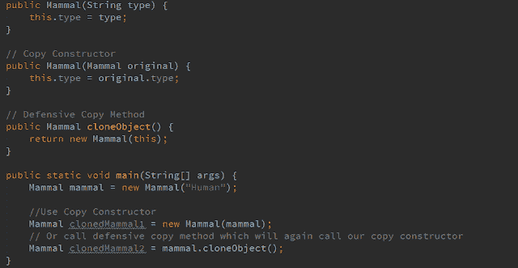

# Java 克隆——为什么仅仅复制构造函数是不够的

> 原文：<https://dev.to/njnareshjoshi/java-cloning-why-even-copy-constructors-are-not-sufficient-mlo>

这是 [Java 克隆](https://programmingmitra.blogspot.in/search/label/Java%20Cloning?max-results=6)系列的第三篇文章，在前两篇文章 [Java 克隆和类型克隆(浅层和深层)详细介绍](https://programmingmitra.blogspot.in/2016/11/Java-Cloning-Types-of-Cloning-Shallow-Deep-in-Details-with-Example.html)和 [Java 克隆-复制构造函数与克隆](https://programmingmitra.blogspot.in/2017/01/Java-cloning-copy-constructor-versus-Object-clone-or-cloning.html)中，我详细讨论了 Java 克隆，并解释了每个概念，如什么是克隆，它如何工作，我们需要遵循什么步骤来实现克隆，如何使用 Object.clone()，什么是浅层和深层克隆，我们如何使用序列化和复制构造函数来实现克隆，以及复制构造函数的复制相对于 Java 克隆的优势。

如果你读过这些文章，你就会很容易理解为什么使用复制构造函数比使用 cloning 或 Object.clone()好。

在这篇文章中，我将讨论为什么即使是复制构造函数也是不够的？

[](////2.bp.blogspot.com/-55GvTwONJJQ/WHzFc4zE-8I/AAAAAAAAKY0/C0mGFqV0ohkfItyuPsuUprF8J5hAP3JegCK4B/s1600/Why-Copy-Constructors-Are-Not-Sufficient.png)

是的，你没看错，复制构造函数本身是不够的，复制构造函数不是多态的，因为构造函数不会从父类继承到子类。如果我们试图从父类引用中引用一个子对象，我们在使用复制构造函数克隆它时会遇到问题。为了理解它，让我们以两个类哺乳动物和人类为例，其中人类扩展了哺乳动物，哺乳动物类有一个字段类型和两个构造函数，一个创建对象，一个复制构造函数创建对象的副本

```
class Mammal {

    protected String type;

    public Mammal(String type) { this.type = type; }

    public Mammal(Mammal original) { this.type = original.type; }

    public String getType() { return type; }

    public void setType(String type) { this.type = type; }

    @Override
    public boolean equals(Object o) {
        if (this == o) return true;
        if (o == null || getClass() != o.getClass()) return false;

        Mammal mammal = (Mammal) o;

        if (!type.equals(mammal.type)) return false;

        return true;
    }

    @Override
    public int hashCode() { return type.hashCode(); }

    @Override
    public String toString() {
        return "Mammal{" + "type='" + type + "'}";
    }
} 
```

<svg width="20px" height="20px" viewBox="0 0 24 24" class="highlight-action crayons-icon highlight-action--fullscreen-on"><title>Enter fullscreen mode</title></svg> <svg width="20px" height="20px" viewBox="0 0 24 24" class="highlight-action crayons-icon highlight-action--fullscreen-off"><title>Exit fullscreen mode</title></svg>

和扩展哺乳动物类的人类类都有一个名称字段、一个普通构造函数和一个复制构造函数来创建副本

```
class Human extends Mammal {

    protected String name;

    public Human(String type, String name) {
        super(type);
        this.name = name;
    }

    public Human(Human original) {
        super(original.type);
        this.name = original.name;
    }

    public String getName() { return name; }

    public void setName(String name) { this.name = name; }

    @Override
    public boolean equals(Object o) {
        if (this == o) return true;
        if (o == null || getClass() != o.getClass()) return false;
        if (!super.equals(o)) return false;

        Human human = (Human) o;

        if (!type.equals(human.type)) return false;
        if (!name.equals(human.name)) return false;

        return true;
    }

    @Override
    public int hashCode() {
        int result = super.hashCode();
        result = 31 * result + name.hashCode();
        return result;
    }

    @Override
    public String toString() {
        return "Human{" + "type='" + type + "', name='" + name + "'}";
    }
} 
```

<svg width="20px" height="20px" viewBox="0 0 24 24" class="highlight-action crayons-icon highlight-action--fullscreen-on"><title>Enter fullscreen mode</title></svg> <svg width="20px" height="20px" viewBox="0 0 24 24" class="highlight-action crayons-icon highlight-action--fullscreen-off"><title>Exit fullscreen mode</title></svg>

> 在这两个复制构造函数中，我们都在进行深度克隆。

现在让我们为这两个类创建对象

```
Mammal mammal = new Mammal("Human");
Human human = new Human("Human", "Naresh"); 
```

<svg width="20px" height="20px" viewBox="0 0 24 24" class="highlight-action crayons-icon highlight-action--fullscreen-on"><title>Enter fullscreen mode</title></svg> <svg width="20px" height="20px" viewBox="0 0 24 24" class="highlight-action crayons-icon highlight-action--fullscreen-off"><title>Exit fullscreen mode</title></svg>

现在，如果我们想为哺乳动物或人类创建一个克隆体，我们可以简单地通过调用它们各自的复制构造函数来实现

```
Mammal clonedMammal = new Mammal(mammal);
Human clonedHuman = new Human(human); 
```

<svg width="20px" height="20px" viewBox="0 0 24 24" class="highlight-action crayons-icon highlight-action--fullscreen-on"><title>Enter fullscreen mode</title></svg> <svg width="20px" height="20px" viewBox="0 0 24 24" class="highlight-action crayons-icon highlight-action--fullscreen-off"><title>Exit fullscreen mode</title></svg>

我们这样做不会出错，两个对象都将成功克隆，正如我们在下面的测试中看到的

```
System.out.println(mammal == clonedMammal); // false
System.out.println(mammal.equals(clonedMammal)); // true

System.out.println(human == clonedHuman); // false
System.out.println(human.equals(clonedHuman)); // true 
```

<svg width="20px" height="20px" viewBox="0 0 24 24" class="highlight-action crayons-icon highlight-action--fullscreen-on"><title>Enter fullscreen mode</title></svg> <svg width="20px" height="20px" viewBox="0 0 24 24" class="highlight-action crayons-icon highlight-action--fullscreen-off"><title>Exit fullscreen mode</title></svg>

但是如果我们试图从哺乳动物的参照物来指代人类的物体呢

```
Mammal mammalHuman = new Human("Human", "Mahesh"); 
```

<svg width="20px" height="20px" viewBox="0 0 24 24" class="highlight-action crayons-icon highlight-action--fullscreen-on"><title>Enter fullscreen mode</title></svg> <svg width="20px" height="20px" viewBox="0 0 24 24" class="highlight-action crayons-icon highlight-action--fullscreen-off"><title>Exit fullscreen mode</title></svg>

为了克隆 mammalHuman，我们不能使用构造函数 Human，因为 mammalHuman 类型是哺乳动物，而 Human 类的构造函数接受 Human，所以会导致编译错误。

```
Mammal clonedMammalHuman = new Human(mammalHuman); // compilation error 
```

<svg width="20px" height="20px" viewBox="0 0 24 24" class="highlight-action crayons-icon highlight-action--fullscreen-on"><title>Enter fullscreen mode</title></svg> <svg width="20px" height="20px" viewBox="0 0 24 24" class="highlight-action crayons-icon highlight-action--fullscreen-off"><title>Exit fullscreen mode</title></svg>

如果我们试图使用哺乳动物的复制构造函数克隆哺乳动物，我们将得到哺乳动物的对象而不是人类，但是哺乳动物拥有人类的对象

```
Mammal clonedMammalHuman = new Mammal(mammalHuman); 
```

<svg width="20px" height="20px" viewBox="0 0 24 24" class="highlight-action crayons-icon highlight-action--fullscreen-on"><title>Enter fullscreen mode</title></svg> <svg width="20px" height="20px" viewBox="0 0 24 24" class="highlight-action crayons-icon highlight-action--fullscreen-off"><title>Exit fullscreen mode</title></svg>

因此，mammalHuman 和 clonedMammalHuman 并不是您在下面的代码输出中看到的相同对象

```
System.out.println("Object " + mammalHuman + " and copied object " + clonedMammalHuman + " are == : " + (mammalHuman == clonedMammalHuman));
System.out.println("Object " + mammalHuman + " and copied object " + clonedMammalHuman + " are equal : " + (mammalHuman.equals(clonedMammalHuman)) + "\n"); 
```

<svg width="20px" height="20px" viewBox="0 0 24 24" class="highlight-action crayons-icon highlight-action--fullscreen-on"><title>Enter fullscreen mode</title></svg> <svg width="20px" height="20px" viewBox="0 0 24 24" class="highlight-action crayons-icon highlight-action--fullscreen-off"><title>Exit fullscreen mode</title></svg>

输出:

```
Object Human{type='Human', name='Mahesh'} and copied object Mammal{type='Human'} are == : false
Object Human{type='Human', name='Mahesh'} and copied object Mammal{type='Human'} are equal : false 
```

<svg width="20px" height="20px" viewBox="0 0 24 24" class="highlight-action crayons-icon highlight-action--fullscreen-on"><title>Enter fullscreen mode</title></svg> <svg width="20px" height="20px" viewBox="0 0 24 24" class="highlight-action crayons-icon highlight-action--fullscreen-off"><title>Exit fullscreen mode</title></svg>

正如我们所见，复制构造函数遭受继承问题，他们也不是多态的。那么我们该如何解决这个问题呢，有各种各样的解决方案，比如创建静态工厂方法，或者创建一些通用类来为我们解决这个问题，这样的例子不胜枚举。

但是有一个非常简单的解决方案，它需要复制构造函数，并且也是多态的。我们可以使用防御性复制方法来解决这个问题，我们将在我们的类中包含这个方法，并从它调用复制构造函数，再次覆盖它的子类，并从它调用它的复制构造函数。

防御性复制方法也给了我们依赖注入的优势，我们可以注入依赖，而不是让我们的代码紧密耦合，我们可以让它松散耦合，我们甚至可以创建一个接口来定义我们的防御性复制方法，然后在我们的类中实现它并覆盖该方法。

因此，在哺乳动物类中，我们将创建一个无参数方法 cloneObject，但是，我们可以随意将此方法命名为任何名称，如 clone、copy 或 copyInstance

```
public Mammal cloneObject() {
    return new Mammal(this);
} 
```

<svg width="20px" height="20px" viewBox="0 0 24 24" class="highlight-action crayons-icon highlight-action--fullscreen-on"><title>Enter fullscreen mode</title></svg> <svg width="20px" height="20px" viewBox="0 0 24 24" class="highlight-action crayons-icon highlight-action--fullscreen-off"><title>Exit fullscreen mode</title></svg>

我们可以在“人类”类中覆盖相同的内容

```
@Override
public Human cloneObject() {
    return new Human(this);
} 
```

<svg width="20px" height="20px" viewBox="0 0 24 24" class="highlight-action crayons-icon highlight-action--fullscreen-on"><title>Enter fullscreen mode</title></svg> <svg width="20px" height="20px" viewBox="0 0 24 24" class="highlight-action crayons-icon highlight-action--fullscreen-off"><title>Exit fullscreen mode</title></svg>

现在要克隆哺乳动物，我们可以简单地说

```
Mammal clonedMammalHuman = mammalHuman.clone(); 
```

<svg width="20px" height="20px" viewBox="0 0 24 24" class="highlight-action crayons-icon highlight-action--fullscreen-on"><title>Enter fullscreen mode</title></svg> <svg width="20px" height="20px" viewBox="0 0 24 24" class="highlight-action crayons-icon highlight-action--fullscreen-off"><title>Exit fullscreen mode</title></svg>

对于最后两个系统输出，我们将低于输出，这是我们的预期行为。

```
Object Human{type='Human', name='Mahesh'} and copied object Human{type='Human', name='Mahesh'} are == : false
Object Human{type='Human', name='Mahesh'} and copied object Human{type='Human', name='Mahesh'} are equal : true 
```

<svg width="20px" height="20px" viewBox="0 0 24 24" class="highlight-action crayons-icon highlight-action--fullscreen-on"><title>Enter fullscreen mode</title></svg> <svg width="20px" height="20px" viewBox="0 0 24 24" class="highlight-action crayons-icon highlight-action--fullscreen-off"><title>Exit fullscreen mode</title></svg>

正如我们所看到的，除了获得多态性的优势之外，这个选项还让我们不用传递任何参数。

您可以在这个 [Github 资源库](https://github.com/njnareshjoshi/exercises/blob/master/src/org/programming/mitra/exercises/CopyConstructorExample.java)上找到本文的完整源代码，请随时提供您的宝贵反馈。