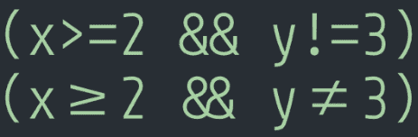
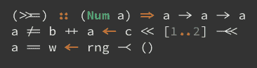
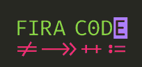
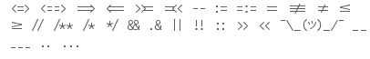
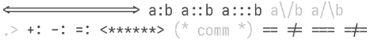
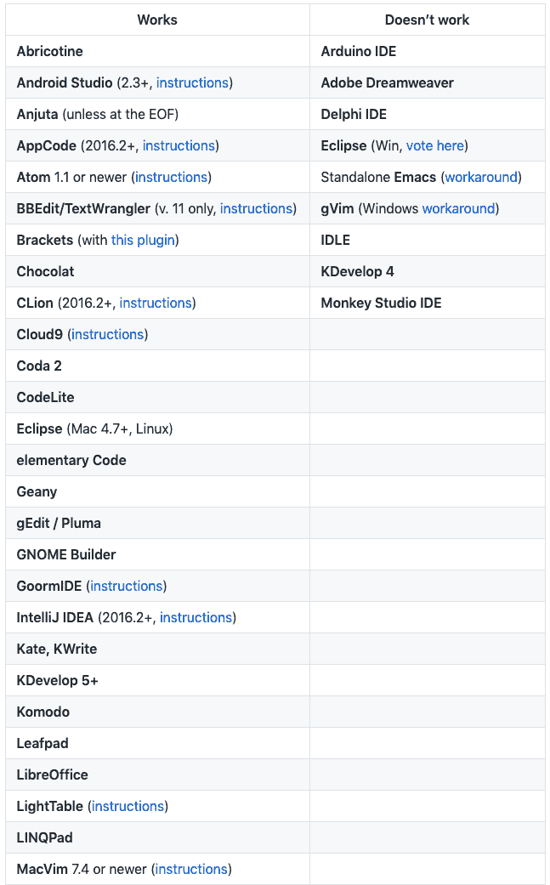
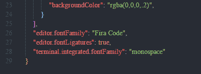
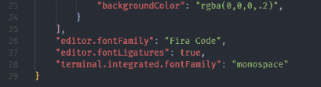
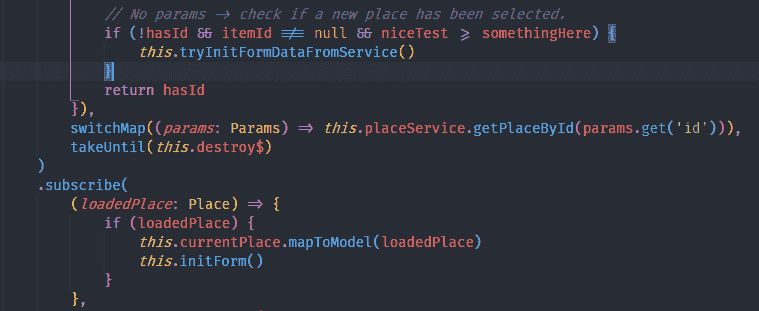
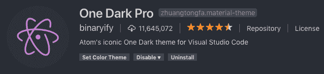

# 使用字体连字来提高代码可读性

> 原文：<https://dev.to/paco_ita/use-font-ligatures-to-improve-code-readability-2j7o>

这篇博文将介绍字体连字以及开发者如何从中受益。

但首先什么是字体连字？

<cite>来自维基百科</cite>

> 在书写和排版中，两个或多个字形或字母连接成一个字形时会出现连字。一个例子是英语中使用的字符，其中字母 a 和 e 是连在一起的。普通的与号(&)是由手写的拉丁字母 e 和 t(拼写为 et，来自拉丁语的“和”)组合而成的连字

使用字体连字的主要好处是一些常用的字符组合(例如，大于、不等于等。)以更独特、更清晰的方式呈现:

[](https://res.cloudinary.com/practicaldev/image/fetch/s--MtimVM4V--/c_limit%2Cf_auto%2Cfl_progressive%2Cq_auto%2Cw_880/https://thepracticaldev.s3.amazonaws.com/i/jl9geoectlyrz280n9eo.png)

第一行显示了我们每天在编码时使用的*普通*字符。

第二种采用字体连字，相同的字符显示不同。它们看起来就像我们在纸上徒手画出来的一样。典型的人物 **≥** 和**≦**往往比 **> =** 和**更容易理解！=** (也是因为数学书上是这样展示的📗而我们已经习惯了它们)。

等宽连字有不同的代码字体(下面是其中一些):

*   [用途](https://github.com/i-tu/Hasklig) 
*   [Fira 代码](https://github.com/tonsky/FiraCode) 
*   [幺半群](https://larsenwork.com/monoid/) 
*   [约谢夫卡](https://github.com/be5invis/Iosevka) 

在本文中，我们将关注如何在可视代码中安装和使用`Fira Code`。然而 Fira 代码支持的[编辑器](https://github.com/tonsky/FiraCode#editor-support)列表非常广泛。你可以将它安装在你最喜欢的编辑器中:

[](https://res.cloudinary.com/practicaldev/image/fetch/s--3TE0gZqp--/c_limit%2Cf_auto%2Cfl_progressive%2Cq_auto%2Cw_880/https://thepracticaldev.s3.amazonaws.com/i/6owbogc9l12ei4iatfv7.png) 
<cite>以上截图仅显示部分列表...</cite>

## 下载 Fira 代码

首先我们必须[下载](https://github.com/tonsky/FiraCode/archive/master.zip)并安装字体(。ttf 文件)。

我们还可以在 Windows 或 Mac 机器上分别使用 chocolatey 或 brew/buck。

## 在可视代码中安装字体连字

要在可视代码中使用 Fira 代码，让我们通过以下方式打开`settings.json`文件:

`File menu > Preferences > Settings`

或者使用快捷键 ctrl(Mac 上的命令)+"，"(逗号)，粘贴以下行并保存更改:

```
{  "editor.fontLigatures":  true,  "editor.fontFamily":  "Fira Code"  } 
```

<svg width="20px" height="20px" viewBox="0 0 24 24" class="highlight-action crayons-icon highlight-action--fullscreen-on"><title>Enter fullscreen mode</title></svg> <svg width="20px" height="20px" viewBox="0 0 24 24" class="highlight-action crayons-icon highlight-action--fullscreen-off"><title>Exit fullscreen mode</title></svg>

我第一次安装 Fira 代码时，它从一开始就看起来不对:

[](https://res.cloudinary.com/practicaldev/image/fetch/s--xfPElwK8--/c_limit%2Cf_auto%2Cfl_progressive%2Cq_auto%2Cw_880/https://thepracticaldev.s3.amazonaws.com/i/ul9c8dssvxwayqja082m.png)

然而，我只需重启可视代码，让它应用更改:

[](https://res.cloudinary.com/practicaldev/image/fetch/s--l2mWBWYm--/c_limit%2Cf_auto%2Cfl_progressive%2Cq_auto%2Cw_880/https://thepracticaldev.s3.amazonaws.com/i/afwkpb9gniuqmehhqzom.png)

现在一切都设置好了，我们可以开始在编码时使用字体连字。

[](https://res.cloudinary.com/practicaldev/image/fetch/s--ICCF_ARt--/c_limit%2Cf_auto%2Cfl_progressive%2Cq_auto%2Cw_880/https://thepracticaldev.s3.amazonaws.com/i/sf8y48kglxkgh4ngj5gg.png)

我一开始对这种字体有点怀疑，因为我不习惯它，它看起来有点奇怪。然而，在越来越熟悉并每天使用它之后，我开始喜欢它，因为我认为它使阅读代码更容易。

### 奖金

如果你想知道我在上面截图的可视代码中使用了哪个主题:

[](https://res.cloudinary.com/practicaldev/image/fetch/s--vvonqce2--/c_limit%2Cf_auto%2Cfl_progressive%2Cq_auto%2Cw_880/https://thepracticaldev.s3.amazonaws.com/i/pq7m9p6rlvwlhlrj9nxm.png)