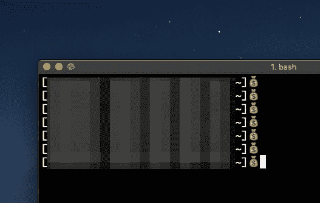

# How to motivate yourself for coding.

> 原文：[https://dev.to/feb19/how-to-motivate-yourself-for-coding-326f](https://dev.to/feb19/how-to-motivate-yourself-for-coding-326f)

Change your $ to 💰.

for bash

```
export PS1='[\u@\h \W]💰' 
```

for zsh

```
PROMPT="[%n@%m]💰" 
```

[](https://res.cloudinary.com/practicaldev/image/fetch/s--H5yaYZh5--/c_limit%2Cf_auto%2Cfl_progressive%2Cq_auto%2Cw_880/https://thepracticaldev.s3.amazonaws.com/i/iygvdmuon9m0333dcn0o.png)