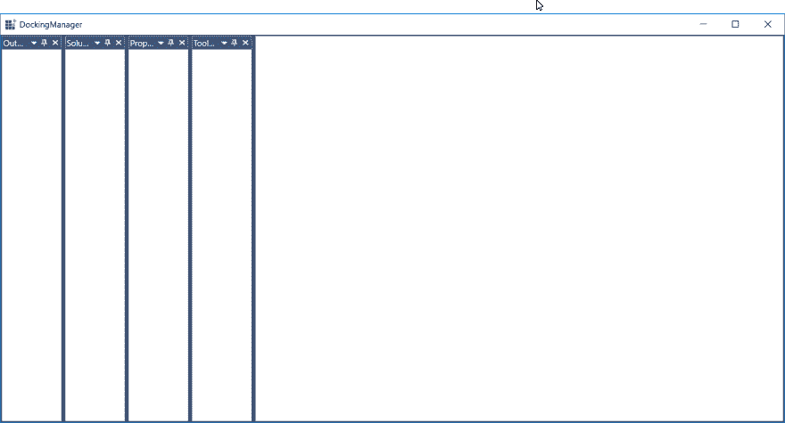
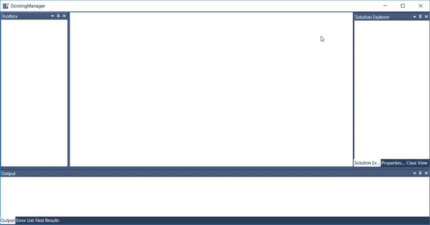
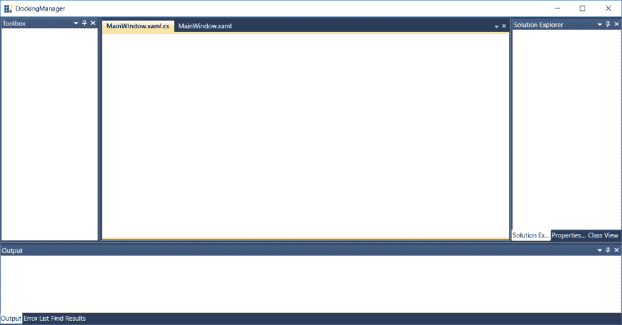
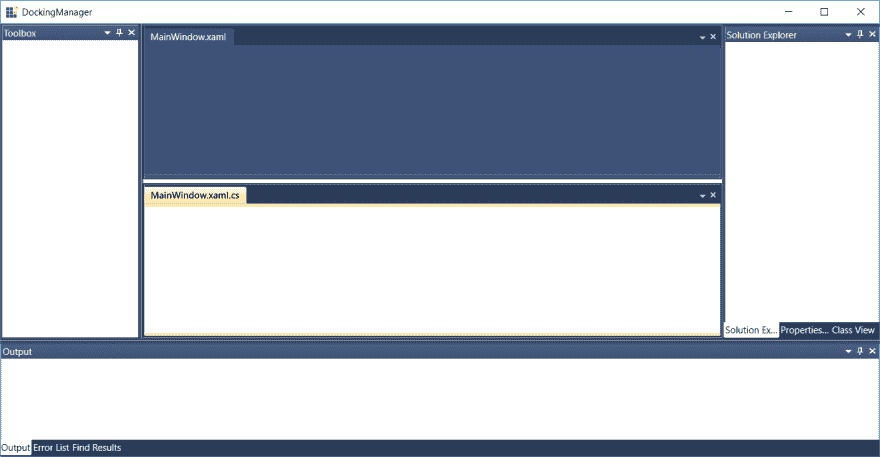
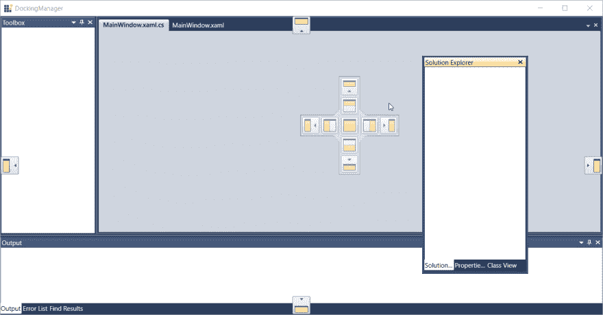
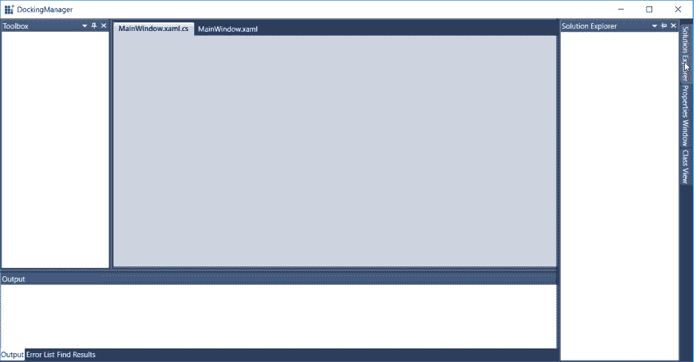

# 在 WPF 创建类似 Visual Studio 的停靠窗口

> 原文：<https://dev.to/syncfusion/create-visual-studio-like-docking-windows-in-wpf-1pa4>

作为。NET 开发人员来说，我们都在 [Visual Studio](https://visualstudio.microsoft.com/) 中工作过，在某些时候可能会对包含解决方案资源管理器、代码窗口、工具箱等的停靠窗口感到疑惑。Visual Studio 样式的停靠窗口允许您调整、移动和更改窗口的行为，以创建适合各种开发模型的布局。Syncfusion [停靠管理器](https://www.syncfusion.com/wpf-ui-controls/docking)允许用户通过拖拽窗口到想要的位置来创建他们自己的布局。用户可以使用内置的序列化选项来保持布局。停靠窗口的每个部分都可以定制，并且包括各种内置主题来改变窗口外观。

在这篇博文中，我们将演示如何在 WPF 应用程序中创建类似 Visual Studio 的停靠窗口，并定制它们的布局。

## 概观

停靠管理器组件允许您向应用程序添加 Visual Studio 样式的停靠窗口和选项卡式文档界面。它允许在屏幕上交互式拖动停靠窗口，使它们悬浮在任何位置。与在 Visual Studio 中一样，停靠管理器提供不同种类的窗口:

*   码头
*   浮动
*   文件
*   自动隐藏

## 停靠管理器入门

按照以下步骤为停靠管理器配置 WPF 应用程序:

1.  在 Visual Studio 中，创建新的 WPF 项目。对于我们的演示，我们将把它命名为**visual studio likedockwindow**。
2.  安装 [Syncfusion。工具. WPF](https://www.nuget.org/packages/Syncfusion.Tools.WPF/)n 将包拿到项目中。
3.  添加 XML 名称空间**[http://schemas.syncfusion.com/wpf](http://schemas.syncfusion.com/wpf)**，前缀为 XAML。这里我们使用 **syncfusion** 作为名称空间的前缀。` ` xml `'
4.  使用名称空间前缀将 **DockingManager** 添加到窗口中。` ` xml `'
5.  添加子控件以创建停靠窗口。子控件可以是任何 **FrameworkElement** 。在下一步显示的这个例子中，我们添加了四个 **ContentControl** 作为孩子。
6.  使用停靠管理器的附加属性 **Header** 设置停靠窗口的标题。` ` xml `'
7.  将应用程序的**视觉样式**设置为一种视觉样式。这里我们将其设置为 **VS2010** 。可用款式的完整列表可以在[我们的文档](https://help.syncfusion.com/wpf/dockingmanager/styling-and-templates)中找到。` ` xml `'

[](https://res.cloudinary.com/practicaldev/image/fetch/s--VMoF9HTr--/c_limit%2Cf_auto%2Cfl_progressive%2Cq_auto%2Cw_880/https://www.syncfusion.com/blogs/wp-content/uploads/2019/06/Docking-Windows-before-arranging.png) 

<figure>

<figcaption>停靠窗口前排列</figcaption>

</figure>

## 排列和停靠窗口

与 Visual Studio 中的工具箱和解决方案资源管理器窗口一样，客户希望将窗口停靠在容器的任何一侧。停靠管理器允许用户通过设置 **SideInDockMode** attached 属性将窗口停靠在停靠管理器中的任何位置。

停靠管理器还引入附加属性 **TargetNameInDockedMode** 来决定一个窗口是相对于停靠管理器还是另一个停靠窗口停靠。通过使用 SideInDockMode 中的选项卡式选项，将子窗口排列为选项卡式窗口。

**DesiredHeightInDockedMode**和**desiredhwidthindockedmode**帮助控制停靠窗口的大小。

在这里，我们将向解决方案资源管理器添加选项卡，并输出 **DockingManager** 的子元素。

```
<syncfusion:DockingManager x:Name="DockingManager" >

<ContentControl Name="Output" syncfusion:DockingManager.Header="Output"
                syncfusion:DockingManager.SideInDockedMode="Bottom"
                syncfusion:DockingManager.DesiredHeightInDockedMode="150">

<!-- Output docking window -->

</ContentControl>

<ContentControl Name="FindResults" syncfusion:DockingManager.Header="Find Results"
                syncfusion:DockingManager.SideInDockedMode="Tabbed"
                syncfusion:DockingManager.TargetNameInDockedMode="Output" >

<!-- Find Results docking window -->

</ContentControl>

<ContentControl Name="ErrorList" syncfusion:DockingManager.Header="Error List"
                syncfusion:DockingManager.SideInDockedMode="Tabbed"
                syncfusion:DockingManager.TargetNameInDockedMode="Output" >

<!-- Error List docking window -->

</ContentControl>

<ContentControl Name="SolutionExplorer"
                syncfusion:DockingManager.Header="Solution Explorer"
                syncfusion:DockingManager.SideInDockedMode="Right"
                syncfusion:DockingManager.DesiredWidthInDockedMode="200">

<!-- Solution Explorer docking window -->

</ContentControl>

<ContentControl Name="ClassView" syncfusion:DockingManager.Header="Class View"
                syncfusion:DockingManager.SideInDockedMode="Tabbed"
                syncfusion:DockingManager.TargetNameInDockedMode="SolutionExplorer" >

<!-- Class View docking window -->

</ContentControl>

<ContentControl Name="Properties" syncfusion:DockingManager.Header="Properties Window"
                syncfusion:DockingManager.SideInDockedMode="Tabbed"
                syncfusion:DockingManager.TargetNameInDockedMode="SolutionExplorer" >

<!-- Properties docking window -->

</ContentControl>

<ContentControl Name="Toolbox" syncfusion:DockingManager.Header="Toolbox"
                syncfusion:DockingManager.State="Dock"
                syncfusion:DockingManager.DesiredWidthInDockedMode="180">

<!-- Toolbox docking window -->

</ContentControl>

</syncfusion:DockingManager> 
```

[](https://res.cloudinary.com/practicaldev/image/fetch/s--7hGYa3Ck--/c_limit%2Cf_auto%2Cfl_progressive%2Cq_auto%2Cw_880/https://www.syncfusion.com/blogs/wp-content/uploads/2019/06/Docking-Windows-after-arranging.png) 

<figure>

<figcaption>停靠窗口后排列</figcaption>

</figure>

## 配置文档窗口

配置文档状态以构建类似 Visual Studio 的选项卡式文档。像停靠窗口一样添加文档窗口。另外，设置 **UseDocumentContainer** 属性的值为 **True** ，设置**文档**为子窗口 **State** 属性的值。

```
<syncfusion:DockingManager  x:Name="SyncDockingManager" UseDocumentContainer="True">
<ContentControl Name="MainWindowXAMLView" syncfusion:DockingManager.Header="MainWindow.xaml" syncfusion:DockingManager.State="Document">

</ContentControl>

<ContentControl Name="MainWindowCSView" syncfusion:DockingManager.Header="MainWindow.xaml.cs" syncfusion:DockingManager.State="Document">
</ContentControl>

</syncfusion:DockingManager> 
```

[](https://res.cloudinary.com/practicaldev/image/fetch/s--kTNJlbyT--/c_limit%2Cf_auto%2Cfl_progressive%2Cq_auto%2Cw_880/https://www.syncfusion.com/blogs/wp-content/uploads/2019/06/Visual-Studio-Like-Docking-Windows.png) 

<figure>

<figcaption>类 Visual Studio 停靠窗口</figcaption>

</figure>

### 选项卡组

停靠管理器允许您创建一组类似于 Visual Studio 的选项卡式文档。选项卡组分割工作区，并允许用户处理两个或多个打开的文档。这可以在水平和垂直方向上创建，并允许文档在它们之间混洗。**新增水平选项卡组**和**新增垂直选项卡组**选项在每个文档的上下文菜单中都有，当用户右键单击文档的选项卡标题时会显示出来。

[](https://res.cloudinary.com/practicaldev/image/fetch/s--AUgLCM-J--/c_limit%2Cf_auto%2Cfl_progressive%2Cq_auto%2Cw_880/https://www.syncfusion.com/blogs/wp-content/uploads/2019/06/Document-Tab-Group.png) 

<figure>

<figcaption>文档标签组</figcaption>

</figure>

通过将子窗口作为参数传递给 **CreateHorizontalTabGroup** 或 **CreateVerticalTabGroup** 方法，以编程方式创建选项卡组。

```
DockingManager.CreateHorizontalTabGroup(MainWindowXAMLView);

DockingManager.CreateVerticalTabGroup(MainWindowXAMLView); 
```

## 浮动停靠或文档窗口

我们可以将停靠和文档窗口拖放到屏幕上的任何位置。默认情况下，通过单击并拖动窗口标题来拖动停靠窗口。但是一旦 **IsVS2010DraggingEnabled** 启用，就可以通过点击拖动相应文档的 tab 头来拖动文档窗口。或者，通过双击窗口标题，停靠窗口和文档窗口可以浮动。要在双击文档时启用此浮动功能，请将停靠管理器的**EnableDocumentToFloatOnDoubleClick**属性设置为 **True** 。

停靠管理器中的浮动窗口是有大小限制的弹出窗口。为了克服这个限制，您可以通过启用 **UseNativeFloatWindow** 将浮动窗口配置为 WPF 窗口。

```
<syncfusion:DockingManager  x:Name="SyncDockingManager" UseDocumentContainer="True" UseNativeFloatWindow="True" EnableDocumentToFloatOnDoubleClick="True" IsVS2010DraggingEnabled="True">
</syncfusion:DockingManager> 
```

当用户拖动浮动窗口时，停靠管理器提供指示有效放置位置的停靠提示。当一个窗口将要停靠时，将显示一个停靠预览来显示该窗口将被放置的位置。

[](https://res.cloudinary.com/practicaldev/image/fetch/s--LP64shBp--/c_limit%2Cf_auto%2Cfl_progressive%2Cq_auto%2Cw_880/https://www.syncfusion.com/blogs/wp-content/uploads/2019/06/Floating-Window.png) 

<figure>

<figcaption>浮动窗口</figcaption>

</figure>

每当你需要创建非浮动窗口时，你可以使用停靠管理器的 **CanFloat** attached 属性来限制停靠和文档窗口。

```
<ContentControl Name="MainWindowXAMLView" syncfusion:DockingManager.State="Document"
             syncfusion:DockingManager.CanFloat="False">

</ContentControl> 
```

## 关闭并锁定停靠窗口

如果你不想在你的应用程序中有更多的窗口，停靠窗口可以通过点击标题栏中的**关闭**按钮来关闭。通过选择相应的选项卡并使用文档容器右侧的通用**关闭**按钮关闭文档窗口。通过将 **DocumentCloseButtonType** 属性设置为 **Individual** ，每个文档在其对应的选项卡中都可以有一个单独的**关闭**按钮。

```
DockingManager.DocumentCloseButtonType = CloseButtonType.Individual; 
```

要将关闭的窗口恢复到您的应用程序，请将特定的子窗口传递给 **RestoreElement** 。

```
DockingManager.RestoreElement(SolutionExplorer); 
```

停靠管理器还允许用户将停靠窗口固定到工作区的边缘。固定停靠窗口会自动将它们隐藏在屏幕的任何一侧，它们的名称会出现在容器边缘的选项卡上。要再次使用锁定的窗口，只需将鼠标放在标签上，该窗口就会滑回视图中。标题栏中的**锁定**按钮允许您锁定窗口并将其重新停靠到视图。

[](https://res.cloudinary.com/practicaldev/image/fetch/s--qIqJL2az--/c_limit%2Cf_auto%2Cfl_progressive%2Cq_auto%2Cw_880/https://www.syncfusion.com/blogs/wp-content/uploads/2019/06/Autohidden-Window.png) 

<figure>

<figcaption>自动隐藏窗口</figcaption>

</figure>

## 布局持久性

通过启用**持续状态**，停靠管理器允许您在关闭应用程序时自动保存停靠的窗口排列。它还允许用户用 **SaveDockState** 保存应用程序的当前停靠布局。当您想要将保存的布局加载回您的应用程序时，可以通过使用 **LoadDockState** 来恢复它。

```
DockingManager.PersistState = true;

// To save the current layout of DockingManager
DockingManager.SaveDockState();

// To load the last saved layout of DockingManager
DockingManager.LoadDockState(); 
```

## 结论

现在，您可以为您的应用程序创建 Visual Studio 样式的布局，并自定义您的窗口布局以最适合各种开发工作流。

在这篇博客中，我们只讨论了停靠管理器的基本特性。有关其他高级主题的更多信息和细节，请参考我们的[文档](https://help.syncfusion.com/wpf/dockingmanager/overview)，在那里您会看到这里没有涉及的特性的代码示例。您可以了解的其他特性包括处理窗口状态更改、可停靠性、多文档界面等等。

欢迎在下面的评论中分享你的反馈。您也可以通过我们的[支持论坛](https://www.syncfusion.com/forums)或 [Direct-Trac](https://www.syncfusion.com/support/directtrac/) 联系我们。我们很乐意为您提供帮助！

这篇博文中解释的特性的示例代码可以从这个 [GitHub 库](https://github.com/SyncfusionExamples/wpf-visual-studio-docking-windows-demo)下载。