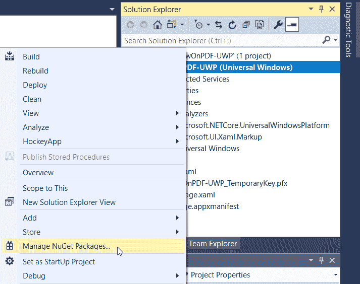
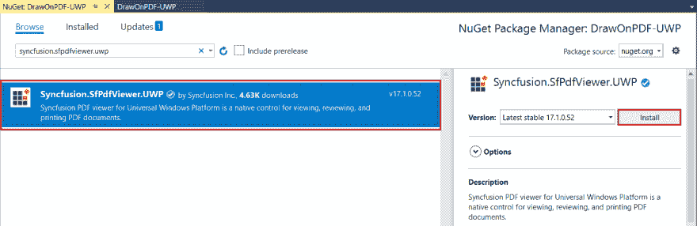
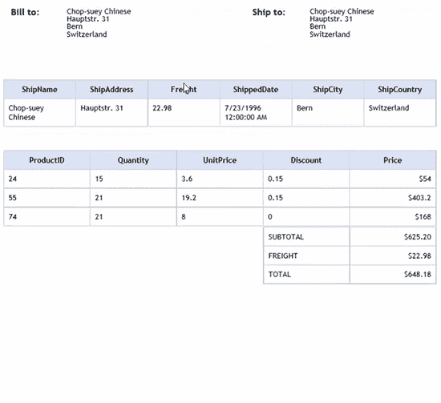

# How to Draw on a PDF in a Windows App

> 原文：[https://dev.to/syncfusion/how-to-draw-on-a-pdf-in-a-windows-app-4hfp](https://dev.to/syncfusion/how-to-draw-on-a-pdf-in-a-windows-app-4hfp)

[Portable Document Format](https://en.wikipedia.org/wiki/PDF) (PDF) is one of the most widely used document formats for sharing data. The requirement to review a PDF document in a desktop application by scribbling on it freehand is very common, but most PDF editors only provide provisions to review a PDF document using text markup annotations (highlight, underline, strikethrough text) and shape annotations (line, rectangle, ellipse).

Luckily, the [Syncfusion PDF Viewer](https://www.syncfusion.com/uwp-ui-controls/pdf-viewer) provides support to draw on PDF documents freehand in desktop apps and [Xamarin](https://www.syncfusion.com/xamarin-ui-controls/xamarin-pdf-viewer) mobile apps. In this blog, I am going to walk you through inking a PDF document freehand in a Windows application.

## Creating a UWP application

1.  Open Visual Studio and create a Blank App (Universal Windows). Name it **DrawOnPDF-UWP**.

2.  Right-click the project file listed in **Solution Explorer** and open **Manage NuGet Packages for Solution**.

[](https://res.cloudinary.com/practicaldev/image/fetch/s--AZR9E5IF--/c_limit%2Cf_auto%2Cfl_progressive%2Cq_auto%2Cw_880/https://blog.syncfusion.com/blogs/wp-content/uploads/2019/06/Manage-NuGet-Packages-for-Solution.png)

<figure>

<figcaption>Open Manage NuGet Packages</figcaption>

</figure>

1.  Browse for the [**SfPdfViewer.UWP**](https://www.nuget.org/packages/Syncfusion.SfPdfViewer.UWP/) NuGet package and install it in the project.

[](https://res.cloudinary.com/practicaldev/image/fetch/s--Qm7ihGYO--/c_limit%2Cf_auto%2Cfl_progressive%2Cq_auto%2Cw_880/https://blog.syncfusion.com/blogs/wp-content/uploads/2019/06/Install-Syncfusion.SfPdfViewer.UWP-NuGet.png)

<figure>

<figcaption>Install Syncfusion.SfPdfViewer.UWP NuGet Package</figcaption>

</figure>

1.  Open **MainPage.xaml** and add an XML namespace to refer to the PDF Viewer assembly. Then add **SfPdfViewer** as a child to the **Grid** element.

```
<Page
    x:Class="DrawOnPDF_UWP.MainPage"
    xmlns="http://schemas.microsoft.com/winfx/2006/xaml/presentation"
    xmlns:x="http://schemas.microsoft.com/winfx/2006/xaml"
    xmlns:local="using:DrawOnPDF_UWP"
    xmlns:d="http://schemas.microsoft.com/expression/blend/2008"
    xmlns:mc="http://schemas.openxmlformats.org/markup-compatibility/2006"
    mc:Ignorable="d"
    xmlns:syncfusion="using:Syncfusion.Windows.PdfViewer"
    Background="{ThemeResource ApplicationPageBackgroundThemeBrush}">

    <Grid>
        <syncfusion:SfPdfViewerControl x:Name="pdfViewerControl"/>
    </Grid>
</Page> 
```

## Loading PDF document

The PDF Viewer control supports loading a PDF document into it as a [**Stream**](https://docs.microsoft.com/en-us/dotnet/api/system.io.stream?view=netframework-4.8) object. In this project, we are going to add a PDF document as an **Embedded Resource** and load its stream into the PDF Viewer.

1.  Add a PDF document into the **Assets** folder of the project and set its [**Build Action**](https://docs.microsoft.com/en-us/visualstudio/ide/build-actions?view=vs-2019) property as **Embedded Resource**.

[](https://res.cloudinary.com/practicaldev/image/fetch/s--t7QDro3T--/c_limit%2Cf_auto%2Cfl_progressive%2Cq_auto%2Cw_880/https://blog.syncfusion.com/blogs/wp-content/uploads/2019/06/Adding-PDF-file.png)

<figure>

<figcaption>Set Build Action to Embedded Resource</figcaption>

</figure>

1.  Add a view model class to the project and name it [**PdfViewerViewModel**](https://github.com/SyncfusionExamples/draw-on-pdf-windows-app/blob/master/DrawOnPDF-UWP/PdfViewerViewModel.cs). Declare a **Stream** object to bind the PDF document stream to the PDF Viewer.

```
using System.ComponentModel;
using System.IO;
using System.Reflection;

namespace DrawOnPDF_UWP
{
    class PdfViewerViewModel : INotifyPropertyChanged
    {
        private Stream documentStream;
        public event PropertyChangedEventHandler PropertyChanged;

        /// <summary>
        /// Stream object to be bound to the ItemsSource of the PDF Viewer.
        /// </summary>
        public Stream DocumentStream
        {
            get
            {
                return documentStream;
            }
            set
            {
                documentStream = value;
                OnPropertyChanged(new PropertyChangedEventArgs("DocumentStream"));
            }
        }

        public PdfViewerViewModel()
        {
            //Loads the stream from the embedded resource.
            Assembly assembly = typeof(MainPage).GetTypeInfo().Assembly;
            DocumentStream = assembly.GetManifestResourceStream("DrawOnPDF_UWP.Assets.Invoice.pdf");
        }

        public void OnPropertyChanged(PropertyChangedEventArgs e)
        {
            PropertyChanged?.Invoke(this, e);
        }
    }
} 
```

1.  Now, set the **DataContext** of the **Page** to **PdfViewerViewModel** and bind the **ItemsSource** of the PDF Viewer control to the **DocumentStream** of the view model class.

```
<Page
    x:Class="DrawOnPDF_UWP.MainPage"
    xmlns="http://schemas.microsoft.com/winfx/2006/xaml/presentation"
    xmlns:x="http://schemas.microsoft.com/winfx/2006/xaml"
    xmlns:local="using:DrawOnPDF_UWP"
    xmlns:d="http://schemas.microsoft.com/expression/blend/2008"
    xmlns:mc="http://schemas.openxmlformats.org/markup-compatibility/2006"
    mc:Ignorable="d"
    xmlns:syncfusion="using:Syncfusion.Windows.PdfViewer"
    Background="{ThemeResource ApplicationPageBackgroundThemeBrush}">
    <Page.DataContext>
        <local:PdfViewerViewModel/>
    </Page.DataContext>
    <Grid>
        <syncfusion:SfPdfViewerControl ItemsSource="{Binding DocumentStream}"/>
    </Grid>
</Page> 
```

With this, we have successfully created a UWP application and displayed a PDF document in it.

## Draw on the PDF

The ink annotation feature of the PDF Viewer can be used to perform freehand drawing over PDF documents.

1.  Split the **Grid** containing the PDF Viewer into two rows and add the PDF Viewer to the second row. Add a **StackPanel** in the first row with a **CheckBox** and a **Button**. The CheckBox will be used to toggle the ink mode and the Button will be used to save the modified PDF document.

```
<Grid>
        <Grid.RowDefinitions>
            <RowDefinition Height=”40”></RowDefinition>
            <RowDefinition Height=”*”></RowDefinition>
        </Grid.RowDefinitions>
        <StackPanel Grid.Row=”0” Orientation=”Horizontal” HorizontalAlignment=”Center”>
            <CheckBox Content=”Ink the PDF”></CheckBox>
            <Button Content=”Save PDF” Click=”SaveButton_OnClick”/>
        </StackPanel>
        < yncfusion:SfPdfViewerControl Grid.Row=”1” ItemsSource=”{Binding DocumentStream}”/>
</Grid> 
```

1.  Now bind the **Command** of **CheckBox** with the **InkAnnotationCommand** of the **PdfViewer** element and bind the **CommandParameter** with the **IsChecked** property of the **CheckBox**.

```
<CheckBox Content="Ink the PDF" Command="{Binding ElementName=pdfViewerControl, Path=InkAnnotationCommand}" CommandParameter="{Binding IsChecked, RelativeSource={RelativeSource Self}}"/> 
```

1.  In the **SaveButton_OnClick** method in the code-behind, add the following code to save the PDF document along with any ink added to it.

```
private async void SaveButton_OnClick(object sender, RoutedEventArgs e)
{
    string filename = "output.pdf";
    Stream stream = pdfViewer.Save();
    stream.Position = 0;

    FileSavePicker savePicker = new FileSavePicker
    {
        DefaultFileExtension = ".pdf",
        SuggestedFileName = filename
    };
    savePicker.FileTypeChoices.Add("Adobe PDF Document", new List<string>() { ".pdf" });
    StorageFile stFile = await savePicker.PickSaveFileAsync();
    if (stFile != null)
    {
        Windows.Storage.Streams.IRandomAccessStream fileStream = await stFile.OpenAsync(FileAccessMode.ReadWrite);
        Stream streamForWrite = fileStream.AsStreamForWrite();
        streamForWrite.SetLength(0);
        streamForWrite.Write((stream as MemoryStream).ToArray(), 0, (int)stream.Length);
        streamForWrite.Flush();
        streamForWrite.Dispose();
        fileStream.Dispose();
        MessageDialog msgDialog = new MessageDialog("File has been saved successfully.");
        IUICommand cmd = await msgDialog.ShowAsync();
    }
} 
```

1.  Now deploy, run the project, ink the PDF document, and save it.

[](https://res.cloudinary.com/practicaldev/image/fetch/s--teu1w09n--/c_limit%2Cf_auto%2Cfl_progressive%2Cq_66%2Cw_880/https://blog.syncfusion.com/blogs/wp-content/uploads/2019/06/Draw-on-PDF_550.gif)

<figure>

<figcaption>Draw on a PDF in Windows App</figcaption>

</figure>

## Conclusion

From this blog, we have learned how to draw on a PDF document in a UWP application and save the resultant document using the Syncfusion PDF Viewer for UWP. Please use the demo project in [this GitHub repository](https://github.com/SyncfusionExamples/draw-on-pdf-windows-app) as a reference while trying it on your own. For more details about customizing the color, thickness, opacity, adding pop-up notes and so on, refer to our [documentation](https://help.syncfusion.com/uwp/sfpdfviewer/concepts-and-features/working-with-ink-annotation).

If you’re already a Syncfusion user, you can download the product setup by [logging in to your account](https://www.syncfusion.com/account/downloads). Otherwise, you can download a free, 30-day trial from the [Syncfusion website](https://www.syncfusion.com/downloads/fileformats/verify).

If you have any questions or require clarifications about these features, please contact us through our [support forum](https://www.syncfusion.com/forums), [Direct-Trac](https://www.syncfusion.com/support/directtrac/), or [Feedback Portal](https://www.syncfusion.com/feedback/). We are happy to assist you!

If this blog interests you, we think you would also love the following blog:

[Interactive Form Filling in 4 Easy Steps](https://www.syncfusion.com/blogs/post/interactive-form-filling-in-pdf-using-pdf-viewer-control.aspx)

The post [Draw on a PDF in a Windows App](https://blog.syncfusion.com/post/draw-on-a-pdf-in-a-windows-app.aspx) appeared first on [Syncfusion Blogs](https://blog.syncfusion.com).