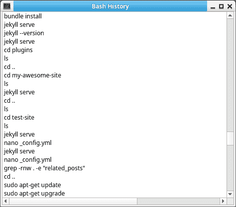

# Bash 历史查看器(每日项目)

> 原文：<https://dev.to/petercour/bash-history-viewer-daily-project-2cdp>

今日项目:制作了一个 bash 历史查看器，可以自动滚动到控制台的底部。

Bash history 是 Linux 和 Apple 系统上的一个文件，它记录了控制台命令。文件是~/。bash _ 历史。

简单的程序，但比在终端中滚动更容易。如果使用另一个终端模拟器(zsh？鱼？)，您的文件将位于另一个位置。

资源:

*   [https://github.com/petercour/bash-history-viewer-qt](https://github.com/petercour/bash-history-viewer-qt)
*   [https://pythonbasics.org/pyqt/](https://pythonbasics.org/pyqt/)
*   [https://pythonprogramminglanguage.com/pyqt-tutorials](https://pythonprogramminglanguage.com/pyqt-tutorials)