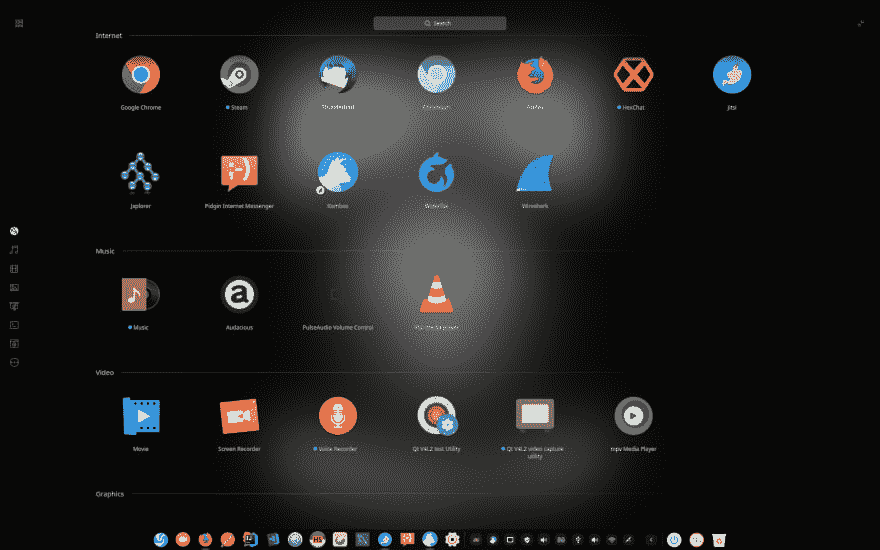
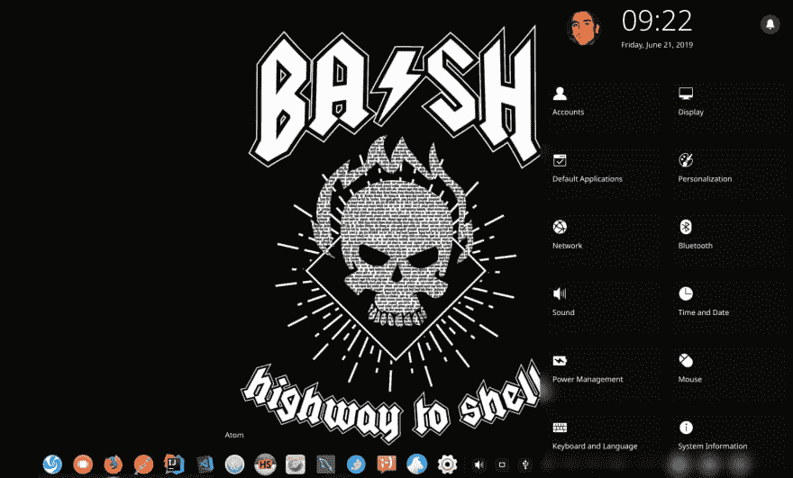
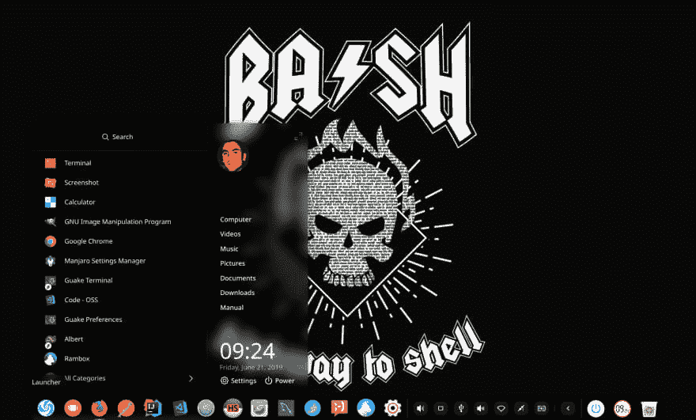
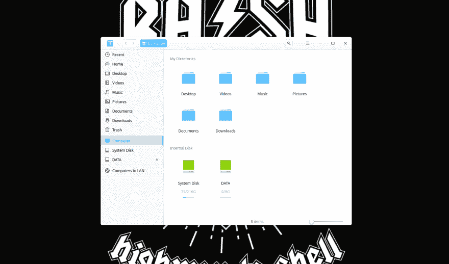
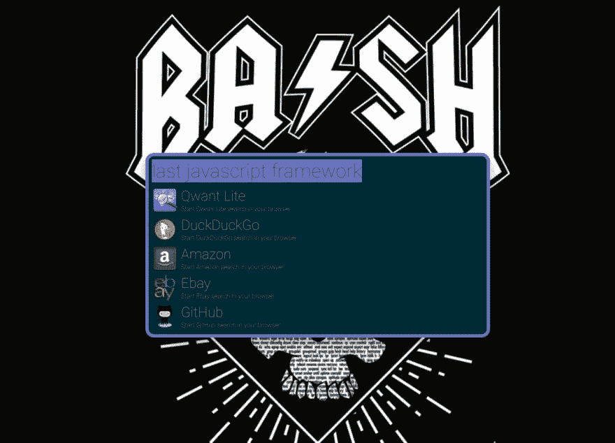
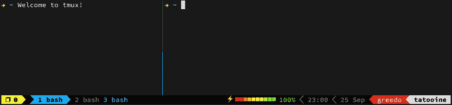
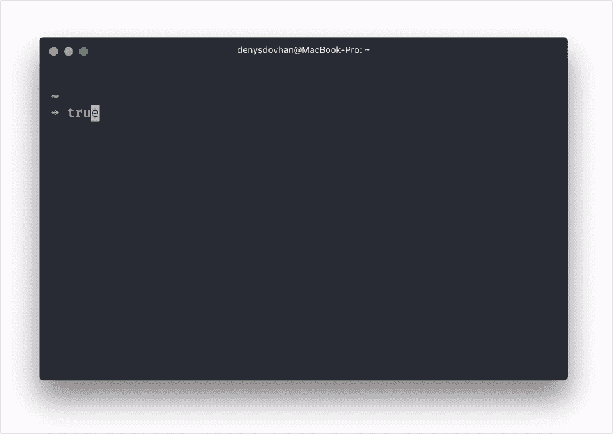
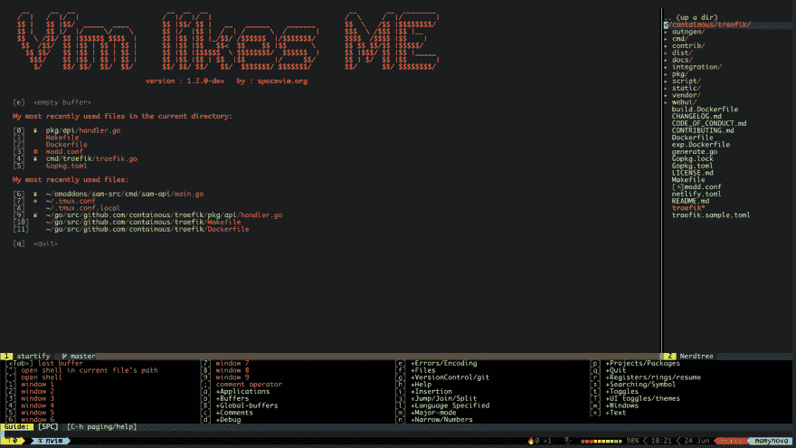
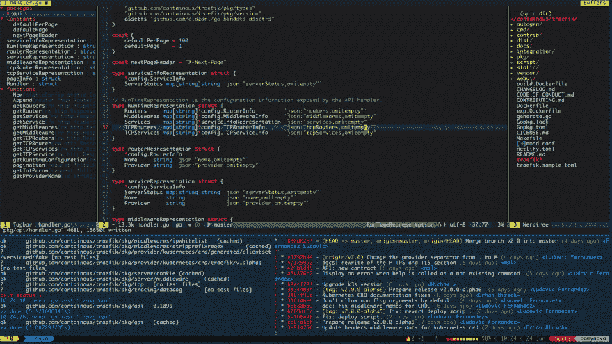

# 🔥 🤩我他妈的牛逼的开发设置🤩 🔥

> 原文：<https://dev.to/biros/my-fucking-awesome-dev-setup-bfn>

> 这篇文章的灵感来自我最近看到的另一个帖子:
> 
>  [## 我美丽的 Linux 开发环境
> 
> ### deepu K Sasidharan 6 月 16 日 196 分钟阅读
> 
> #linux #fedora #development #gnome](/deepu105/my-beautiful-linux-development-environment-2afc)
> It always amazes me that such weekly articles always get so popular. So I wrote another one.

# 🔍快速概述

*   OS: [Manjaro](https://manjaro.org/)
*   Windows 管理:[深入桌面环境](https://www.deepin.org/en/dde/)
*   IDE: [Intellij](https://www.jetbrains.com/idea)
*   Editor: [Neovim](https://neovim.io/)
*   终端:[瓜克](http://guake-project.org/)
*   贝壳:[鱼](https://fishshell.com/)
*   工具:
    *   终端复用器: [Tmux](https://github.com/tmux/tmux/wiki)
    *   通用发射器:[艾伯特](https://github.com/albertlauncher/albert)
    *   文件观察者: [Modd](https://github.com/cortesi/modd)

* * *

# 🐧 Manjaro

[Manjaro](https://manjaro.org/) 是基于 ArchLinux 的 Linux 发行版。这是一个滚动版本，这意味着你可以很快获得应用程序的更新。这对开发者来说很好，因为我们不想等待安全或特色更新，但这也很危险，因为这样的发行版更容易崩溃。所以安装要自担风险！话虽如此，我必须告诉你，我不是一个伟大的 Linux 专家，我从来没有被我的 Manjaro 卡住。

Pacman 是默认的 CLI 软件包管理器。很基础很初级。现在我用 [yay](https://github.com/Jguer/yay) 更人性化。如果你更喜欢图形应用，看看[的 pamac](https://gitlab.manjaro.org/applications/pamac) 。

# 🗔 Deepin 桌面环境

当谈到为 Linux 发行版选择合适的桌面环境时，我们经常被迫选择不那么糟糕的一个。你可能觉得我有点过分，但是很多知名的窗口管理器(Gnome，KDE，Cinnamon，xfce，...)的默认配置非常糟糕。

在尝试了很多(xfce、Gnome、Budgie、i3wm、awesomewm)之后，我最终选择了桌面环境中的[deep。它就像一个开箱即用的魔咒，因为我是一个懒惰的开发人员，它非常适合我。*的外观和感觉*显然是受 macOS 的启发。dock 很相似，设置面板也是。既清纯又优雅。它的主要优点也是它的主要缺点:完全不可配置。所以要么它符合你的需要，要么你选择另一个。](https://www.deepin.org/en/dde/)

**Deepin 应用浏览器**

**深度设置面板**

**Deepin 快速启动器**

**Deepin 文件管理器**

# 艾伯特

[阿尔伯特](https://github.com/albertlauncher/albert)是一个[阿尔弗雷德](https://www.alfredapp.com/)般的启动器，在一个简单的搜索栏中带给你许多功能。只需通过一些用户定义的热键(我用的是`<ctrl>+SPC`)调用它并开始输入！

您可以触发 web 搜索、内嵌翻译、计算、shell 命令，...并且它可以通过插件广泛扩展。

# 👨🏼‍💻Intellij Ultimate + Go 插件

作为一个围棋开发者，我是很务实的。因此，我选择了最适合我需要的工具，它是 Intellij with Go plugin。它拥有我在现代 IDE 中需要的一切:完成、浏览、调试、重构、语法突出显示，...但这不是最终的选择。我已经尝试了其他几个 IDE: VSCode、Atom、Vim，多少有些成功。虽然前两个没有完全开箱即用，但最后一个(Vim)令人印象深刻(与 [SpaceVim](https://spacevim.org/) )。但是由于我对键盘快捷键不太适应，我最终放弃了 Intellij。我可能很快会重新考虑这件事...

# 👽瓜克+ Tmux +鱼+ Vim + Modd

在 Linux 下，您需要一个 shell 来运行命令。但是这个壳不能单独运行。它需要一个终端模拟器。假设你想编辑一个文件，你需要运行一个终端模拟器(比如说`xterm`)，它将启动你的默认 shell(比如说`bash`)，然后你就可以运行`vim`。这就像俄罗斯娃娃(xterm > bash > vim)。如果您想将您的终端分成几个窗格，您需要在您的终端模拟器和您的 shell 之间再加一层:`tmux`(xterm>tmux>bash>vim)。

🧙‍♂️:这就是 Unix 互操作性的魔力:每个应用程序都做好自己的工作，而且只做好自己的工作。

## 💻瓜克

[Guake](http://guake-project.org/) 是一个下拉终端，灵感来自游戏《雷神之锤》中使用的终端。我定制了它来移除滚动条、标签栏和标题栏，这样它看起来就像一个裸体终端。默认情况下它是隐藏的，当我按下`<F12>`时它就会出现。我用`<F11>`全屏。

我的会议:

*   字体: [Monaco 为电力线常规，10 号](https://github.com/cstrap/monaco-font)
*   透明度:10%
*   默认解释器:tmux
*   主题:莫洛凯岛

## 🤖Tmux

Tmux 是一款功能强大的终端多路复用器。

> 截图作者 [@gpakozs](https://github.com/gpakosz/.tmux)

今年早些时候，我发表了一篇关于我的自定义设置的文章。如果你感兴趣，可以看看:

 [## 用 Tmux 构建自定义 IDE

### 鲍里斯·贾莫特·✊/2 月 5 日 194 分钟阅读

#cli #showdev #craftsmanship #githunt](/biros/building-a-custom-ide-with-tmux-2aeg)

## 🐟鱼壳

Fish 是一个面向用户的 shell，具有强大的功能，如自动建议、完成、命令颜色，...

因为 shell 是我花时间最多的地方，所以我需要在其中保存最有用和最清晰的信息。这就是为什么我使用 [SpaceFish](https://github.com/matchai/spacefish) 提示符。它赋予你 git 信息，你最喜欢的语言的版本，Docker 的版本，Vi 模式，最后一个命令状态&持续时间，...

我还用 [oh-my-fish](https://github.com/oh-my-fish/oh-my-fish) 框架用插件扩展外壳(我推荐`grc`、`g2`、`fzf`、`pj`、&、`z`)。

## 📝 Neovim

Neovim 是 vim 的一个重构，它带来了一个更好的插件系统，也更容易贡献。

##  [ neovim ](https://github.com/neovim) / [ neovim](https://github.com/neovim/neovim)

### Vim-fork 关注可扩展性和可用性

<article class="markdown-body entry-content container-lg" itemprop="text">

[文档](https://neovim.io/doc) | [聊天](https://gitter.im/neovim/neovim) | [推特](https://twitter.com/Neovim)

[T11】](https://snapcraft.io/nvim)

Neovim 是一个旨在积极重构 vim 的项目，目的是:

*   简化维护并鼓励[贡献](https://raw.githubusercontent.com/neovim/neovim/master/CONTRIBUTING.md)
*   在多个开发人员之间分配工作
*   启用[高级用户界面](https://github.com/neovim/neovim/wiki/Related-projects#gui),无需修改内核
*   最大化[扩展性](https://github.com/neovim/neovim/wiki/Plugin-UI-architecture)

更多信息请参见[简介](https://github.com/neovim/neovim/wiki/Introduction)维基页面和[路线图](https://neovim.io/roadmap/)。

## 特征

*   现代图形用户界面
*   [API 访问](https://github.com/neovim/neovim/wiki/Related-projects#api-clients)从任何语言包括 C/C++、C#、Clojure、D、Elixir、Go、Haskell、Java JavaScript/Node.js、Julia、Lisp、Lua、Perl、Python、Racket、Ruby、Rust
*   嵌入式、可编写脚本的[终端仿真器](https://neovim.io/doc/user/nvim_terminal_emulator.html)
*   异步[作业控制](https://github.com/neovim/neovim/pull/2247)
*   [多个编辑器实例间的共享数据(shada)](https://github.com/neovim/neovim/pull/2506)
*   [XDG 基础目录](https://github.com/neovim/neovim/pull/3470)支持
*   兼容大多数 Vim 插件，包括 Ruby 和 Python 插件

完整名单见 [`:help nvim-features`](https://neovim.io/doc/user/vim_diff.html#nvim-features) ！

## 从软件包安装

在[发布版](https://github.com/neovim/neovim/releases/)页面上可以找到针对 Windows、macOS 和 Linux 的预构建包。

[托管包](https://github.com/neovim/neovim/wiki/Installing-Neovim#install-from-package)在家酿， [Debian](https://packages.debian.org/testing/neovim) ， [Ubuntu](http://packages.ubuntu.com/search?keywords=neovim) ， [Fedora](https://apps.fedoraproject.org/packages/neovim) ，[Arch Linux](https://www.archlinux.org/packages/?q=neovim)[Gentoo](https://packages.gentoo.org/packages/app-editors/neovim)等等！

## 从源安装

构建是…

</article>

[View on GitHub](https://github.com/neovim/neovim)

SpaceVim 是一个 Vim 发行版，为开发者提供了一些默认配置。它带有一个大纲(按下`<F2>`)、一个树形视图(按下`<F3>`)和许多支持的语言(`golang`、`php`、`python`、`javascript`)，...)的 IDE 特性(完成、语法突出显示、重构、代码浏览、调试，...).通过一个简单的 TOML 文件，配置变得很容易。对于新手来说是踏入 Vim 的好方法。

## 🕺🏼一起

下面是包含以下窗格的树窗格视图:

*   主窗格中的 vim(`golang`space vim 层，带有`Tagbar`和`Nerdtree`插件)
*   在左下方的窗格中运行我的单元测试修改
*   右下角窗格中运行 git 命令的 shell(`git lg`)

# 👾令人惊叹的开发 CLI 工具列表

*   [停靠](https://github.com/lirantal/dockly):CLI 中的停靠 UI
*   [httpie](https://httpie.org/) :牛逼 CLI HTTP 客户端
*   [jq](https://stedolan.github.io/jq/)&[FX](http://fx.wtf/):CLI JSON 查看器
*   [lnav](http://lnav.org/) :日志文件导航器
*   [扫视](https://github.com/nicolargo/glances):观察您的系统
*   bat :带有语法高亮和 Git 集成的 cat 克隆
*   [exa](https://the.exa.website/) :终极`ls`
*   tig:为 CLI 用户提供的强大 git 包装器
*   newman :在 CLI 或 CI/CD 中自动化你的 Postman 测试
*   icdiff :一个用户友好的比较工具(与 git 一起使用)

* * *

在这里！

希望你觉得有用。不要犹豫，在评论中建议其他工具吧！
看到这样的*【牛逼】*文章看腻了就直说吧！；)