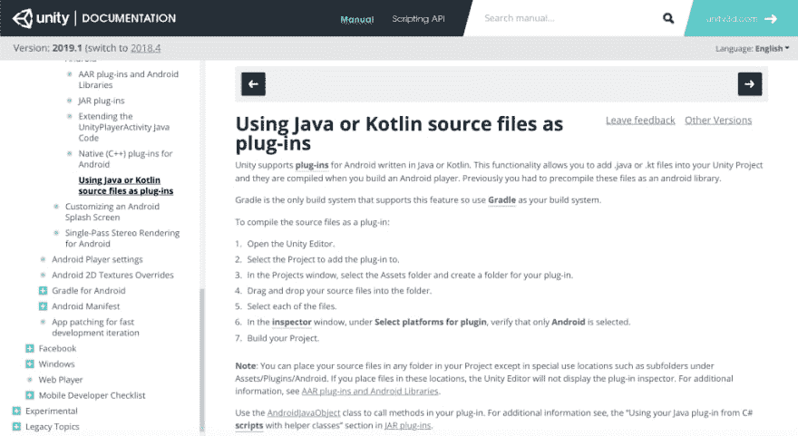
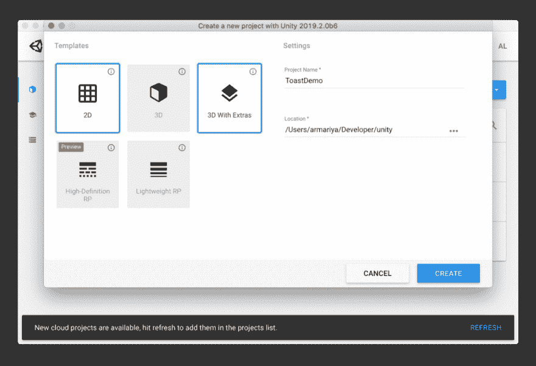
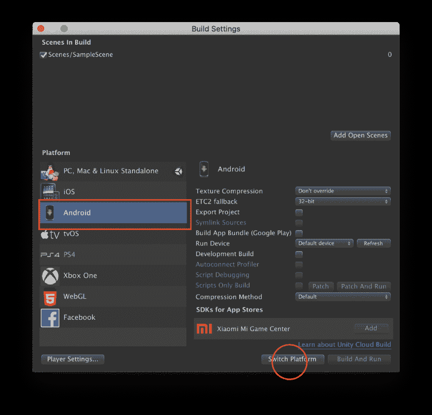
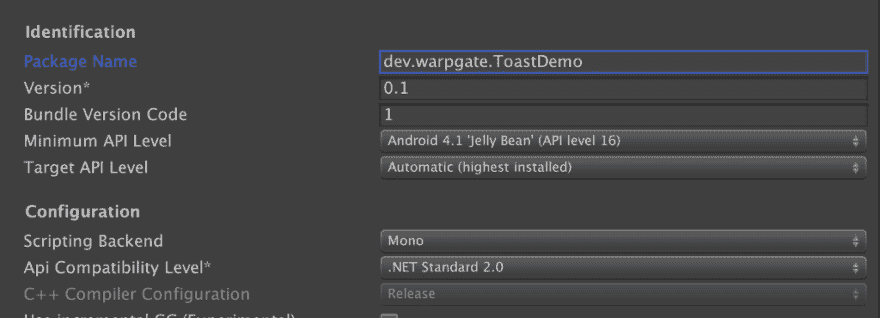
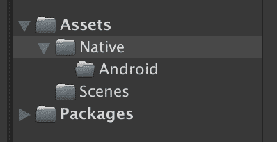
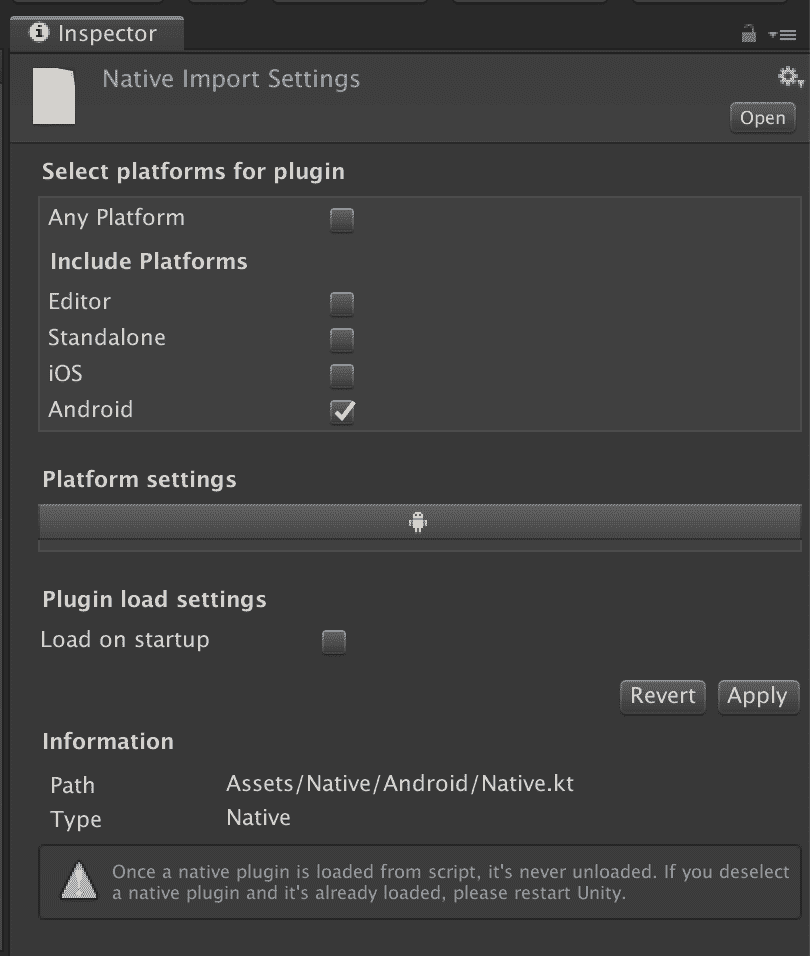
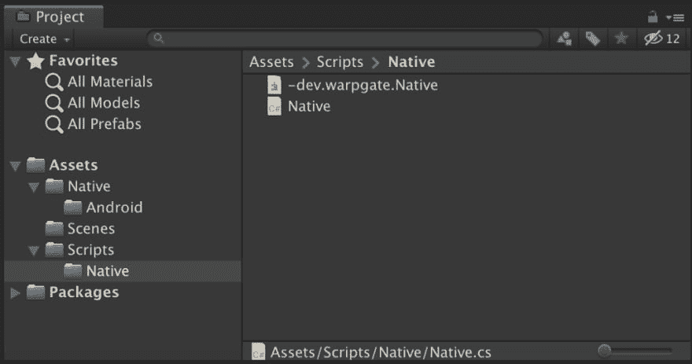
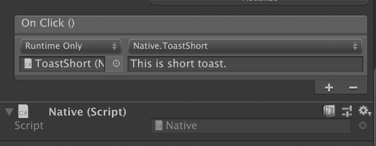
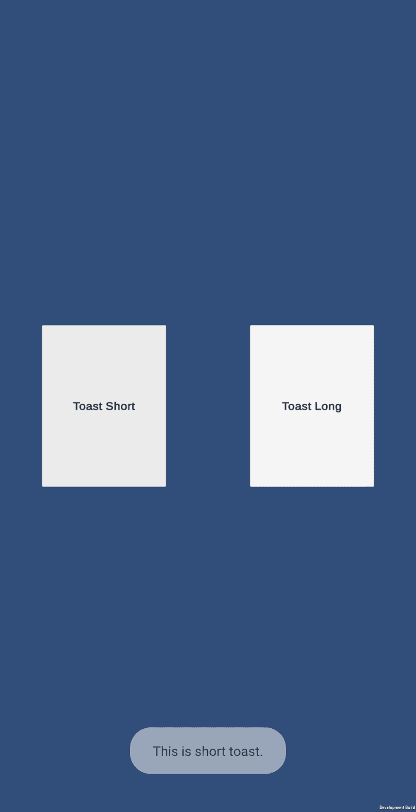

# 用 Kotlin 文件直接在 Unity3d 上作证如何编写插件 Android

> 原文：<https://dev.to/armariya/plugin-android-unity3d-kotlin-g06>

你好，我是 Plugin Android 的作者，在去年的博客《t0㎡之后

因为我刚去看过他在 Document 上写的《自然》一书，但没人提起它。拿着这个机会。如果有人想读的话，就试试看。团结 3d。com/manual/androidjavasourcepluginshtml 可以了

<figure>[](https://res.cloudinary.com/practicaldev/image/fetch/s--NyCGeHU3--/c_limit%2Cf_auto%2Cfl_progressive%2Cq_auto%2Cw_880/https://cdn-images-1.medium.com/max/1024/1%2AOz2LAWFaRuoNeoN1sTQ-tw.png) 

<figcaption>【页面告诉公平”，删除 Kotlin/Java 文件，使之成为 Plugin 【T】。</figcaption>

</figure>

这是为 Android 屏幕上的 Toast 打印出来的插件。

**先决条件**

*   2019 年 3d 团结。2.0b6(真的是 2019 年 1 好的，但是在使用这个版本的时候是合适的。)

首先制作一个名为 toastdemo 2d 的项目，因为我们没做太多的事，所以就装了 create lode。

<figure>[](https://res.cloudinary.com/practicaldev/image/fetch/s--FDXeIxqu--/c_limit%2Cf_auto%2Cfl_progressive%2Cq_auto%2Cw_880/https://cdn-images-1.medium.com/max/1024/1%2AucDXCq1BxYx7MBcO3ieYwQ.png) 

<figcaption>【项目创建时的页面】</figcaption>

</figure>

。

进入专案后，请到「档案」>「层设定」，选取「Android」，然后按「切换平台」。

<figure>[](https://res.cloudinary.com/practicaldev/image/fetch/s--Xt-ypmbu--/c_limit%2Cf_auto%2Cfl_progressive%2Cq_auto%2Cw_880/https://cdn-images-1.medium.com/max/1024/1%2AlTar6YzA4BWnGvbWLb0Few.png) 

<figcaption>【平台切换】为 Android</figcaption>

</figure>

。

交换机完成后，请继续按左侧的“播放器设置”，然后进入“以太设置”部分，以设置此项目的“设备识别器”(Bundle Identifier)。warpgate .. .ToastDemo(真的可以是任何东西，也可以是这个)

<figure>[](https://res.cloudinary.com/practicaldev/image/fetch/s--heQ6OOzx--/c_limit%2Cf_auto%2Cfl_progressive%2Cq_auto%2Cw_880/https://cdn-images-1.medium.com/max/1024/1%2AL0HvJp2-HtzxGmfAnNTCIA.png)

<figcaption></figcaption>

</figure>

工程的支架设置

接下来，我们来创建一个 Kotlin 文件夹。非常重要的一点是，不要放在任何特殊的 Unity 文件夹中。

<figure>[](https://res.cloudinary.com/practicaldev/image/fetch/s--y-2vmnwG--/c_limit%2Cf_auto%2Cfl_progressive%2Cq_auto%2Cw_880/https://cdn-images-1.medium.com/max/398/1%2Aum7c6cxwVRNQdKox3rRocw.png) 

<figcaption>【工程结构文件夹】t5㎡T6㎡。</figcaption>

</figure>

打开外部项目，创建一个本机文件。kt:好的。打开文件，输入代码。请载入
。

```
// Native.kt

package dev.WarpGate.WarpGate

import android.content.Context

import android.widget.Toast

class _Native_ {

  fun toastShort(context: _Context_, text: _String_) {

    _Toast_.makeText(context, text, _Toast_._LENGTH\_SHORT_).show()

  }

  fun toastLong(context: _Context_, text: _String_) {

    _Toast_.makeText(context, text, _Toast_._LENGTH\_LONG_).show()

  }

} 
```

这是 Android 中的一个很普通的程式码。用来启动 Toast。注意，上面的封包名称与 b 是相同的。

写完后，我们要去选一个平台上的 Import 档案。当然，我们只需要选择 Android。

<figure>[](https://res.cloudinary.com/practicaldev/image/fetch/s--zfGs35YB--/c_limit%2Cf_auto%2Cfl_progressive%2Cq_auto%2Cw_880/https://cdn-images-1.medium.com/max/810/1%2AlCwtGBKU5dXxQgS-b1tvHg.png) 

<figcaption>【平台调整为剩余，但 Android</figcaption>

</figure>

。

之后，我们要编写一个 C#文件，通过 Unity 调用这个插件，创建脚本/本机/本机。好的，我是 cs

<figure>[](https://res.cloudinary.com/practicaldev/image/fetch/s--ApimSaRm--/c_limit%2Cf_auto%2Cfl_progressive%2Cq_auto%2Cw_880/https://cdn-images-1.medium.com/max/1024/1%2Ad_j2-qOL7UkD__MwbUG2Aw.png) 

<figcaption>【生成 C#文件，用于调用 Plugin</figcaption>

</figure>

。

然后就可以放一个完整的单音代码，t0㎡。

```
// Native.cs

using UnityEngine;

public class _Native_ : MonoBehaviour {

  private const string m\_UnityPlayerClass = "com.unity3d.player.UnityPlayer";
  private const string m\_NativeClass = "dev.warpgate.ToastDemo.Native";
  private const string m\_ToastShortMethod = "toastShort";
  private const string m\_ToastLongMethod = "toastLong";

  public void ToastShort(string text) {
    using (AndroidJavaClass unityPlayer = new AndroidJavaClass(m\_UnityPlayerClass)) {
      using (AndroidJavaObject currentActivity = unityPlayer.GetStatic<AndroidJavaObject>("currentActivity")) {
        using (AndroidJavaObject context = currentActivity.Call<AndroidJavaObject>("getApplicationContext")) {
          using (AndroidJavaObject native = new AndroidJavaObject(m\_NativeClass)) {
            native.Call(m\_ToastShortMethod, context, text);
          }
        }
      }
    }
  }

  public void ToastLong(string text) {
    using (AndroidJavaClass unityPlayer = new AndroidJavaClass(m\_UnityPlayerClass)) {
      using (AndroidJavaObject currentActivity = unityPlayer.GetStatic<AndroidJavaObject>("currentActivity")) {
        using (AndroidJavaObject context = currentActivity.Call<AndroidJavaObject>("getApplicationContext")) {
          using (AndroidJavaObject native = new AndroidJavaObject(m\_NativeClass)) {
            native.Call(m\_ToastLongMethod, context, text);
          }
        }
      }
    }
  }
} 
```

之后，让我们把这些功能放入按钮，然后构建成 Android。让我们试一试。

<figure>[](https://res.cloudinary.com/practicaldev/image/fetch/s--pKl7SHbI--/c_limit%2Cf_auto%2Cfl_progressive%2Cq_auto%2Cw_880/https://cdn-images-1.medium.com/max/776/1%2A_yHuKpF_hA8Y64Fj6wb4uw.png) 

<figcaption>【代码段】屏幕输入按钮</figcaption>

</figure>

。

我们终于到了这个时候，耶苔莎就可以这样了

<figure>[](https://res.cloudinary.com/practicaldev/image/fetch/s--UAxJt73X--/c_limit%2Cf_auto%2Cfl_progressive%2Cq_auto%2Cw_880/https://cdn-images-1.medium.com/max/1024/1%2AGxn7S4YcvMZ3cebxuNA5Pw.png)

<figcaption>【demo】外观的成功</figcaption>

</figure>

。

你看，下面有一个东海岸，它被认为是非常成功的。耶。

用 Kotlin 档案写 Plugin Android 已经结束了。如果有人不了解它的位置，或者没有遵循它，请在下面输入 Comment