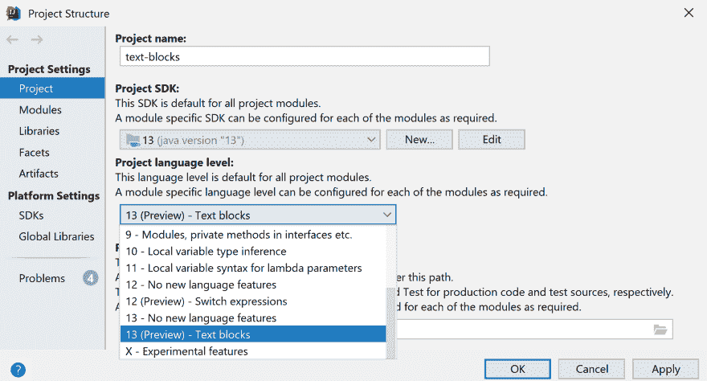

# Java 13 文本块-多行字符串文字

> 原文：<https://dev.to/vojtechruz/java-13-text-blocks-6nb>

在放弃了 Java 12 的类似功能后，Java 13 最终带来了对多行字符串的支持。

## Java 中的字符串文字

在 Java 中声明一个字符串很容易:

```
String myString = "Behold, a string literal!"; 
```

没什么新鲜的，对吧？然而，传统的字符串文字有一些不便的限制。

首先，整个文字需要在一行中。这对于简单的短字符串是可以的，但是对于较长的字符串，您需要将多个字符串连接起来。如果你想包含换行符，你需要添加`\n`。

```
String myString = "This is my string\n" +
        "which I want to be \n" +
        "on multiple lines."; 
```

这很麻烦，很难阅读。另一个问题是各种字符不能直接表示，需要转义，比如`"`或者`\`。这使得您的字符串更难阅读和工作。

```
String path = "Open \"C:\\Program Files\\Java\\jdk1.8.0_152\""; 
```

在正则表达式这样的情况下，这变得尤其混乱。但是如何处理这个问题呢？

## 其他 JVM 语言

像往常一样，Java 很晚才引入一个在许多其他语言中已经很常见的功能，甚至在 JVM 上也是如此。Kotlin、Scala 或 Groovy 已经支持使用`"""`符号而不是通常的`"`的多行字符串文字。看看下面科特林的例子。

```
val text = """
This is my cool string,
which I want to span
multiple lines.
It can have backslash \
and even double-quotes "
""" 
```

正如您所注意到的，它不仅是多行的，而且您不再需要对您的字符进行转义。这被称为原始字符串文字，这意味着所有的字符都被解释为原样，不需要转义。

## Java 中的原始字符串文字

在 Java 12 中，最初的提议是包含[原始字符串文字(JEP-326)](http://openjdk.java.net/jeps/326) 。这种行为与上面 Kotlin 中的例子非常相似。但是它没有像在其他 JVM 语言中那样使用`""""`,而是使用了反勾符号。这个概念有点不寻常，因为您可以使用任意数量的反斜线，并在末尾使用相同数量的反斜线。这样，无论出现多少个连续的反斜线，都没有必要在 spring 文本中转义反斜线。

原始字符串的一个问题通常是缩进。多行原始字符串文字中的每个字符都被解释为包括缩进，缩进只是为了提高代码可读性，而不是文字本身的一部分。考虑下面的例子:

```
public static void main(String[] args) {
      String myString =
      `This is my string
      which I want to be
      on multiple lines.`;
      System.out.println(myString);
  } 
```

如果打印出来，除了第一行，所有的行将出现缩进。

```
This is my string
        which I want to be
        on multiple lines. 
```

您需要手动解决这个问题，可能需要使用新提出的 String 方法`align()`和`indent()`。不太实际，但如果使用原始字符串，这是你必须忍受的。

您可以在下面的文章中阅读更多关于原始字符串文字的建议:

然而，这个提议在 Java 12 的最终版本之前[就被放弃了，现在被认为是过时了。](http://mail.openjdk.java.net/pipermail/jdk-dev/2018-December/002402.html)

> 虽然我们可以预期，对于任何语言功能，都会有大量“我会更喜欢不同的”反馈，但在回顾我们收到的反馈时，我不再相信我们已经在复杂性和表达性之间取得了正确的平衡，或者我们已经探索了足够的设计空间，可以确信当前的设计是我们所能做到的最好的。通过撤回，我们可以继续完善设计，探索更多的选项，并以实际满足预览功能流程要求的预览为目标(JEP 12)。

## Java 中的多行字符串

在撤回最初的提议后，[讨论重新开始](https://mail.openjdk.java.net/pipermail/amber-spec-experts/2019-January/000931.html)并产生了一个全新的提议，它将作为预览功能在 Java 13 中引入。它叫做 [JEP 355:文本块(预览)](https://openjdk.java.net/jeps/355)。

它不应该是原始字符串文字的实现，而是多行字符串文字的实现，这仍然允许转义，尽管您不需要使用所有的转义。最重要的是，不需要处理所有的缩进问题，而这对于原始字符串是必要的。

## 预览功能

在 Java 13 中，文本块只能作为预览功能使用。这是什么意思？

> 预览语言或 VM 特性是 Java SE 平台的一个新特性，它是完全指定的、完全实现的，但不是永久的。它在 JDK 的一个功能发布中可用，以激发开发人员基于真实世界使用的反馈；这可能会导致它在未来的 Java SE 平台中永久存在。
> 
> 在下一个 JDK 特性发布之前，将评估该特性的“真实世界”优势和劣势，以决定该特性是否在 Java SE 平台中具有长期作用，如果是，是否需要改进。因此，该特征可以被授予最终和永久状态(有或没有改进)，或者经历进一步的预览期(有或没有改进)，或者被移除。

此类功能在 JDK 提供，但默认情况下不启用。您需要显式地使他们能够使用它们。不用说，它不是为生产使用而设计的，而是用于评估和实验，因为它可能会在未来的版本中被删除或大量更改。

你需要下载 JDK 13 号。在 IntelliJ 中，转到`File → Project Structure`并确保在项目 SDK 下选择了 JDK 13。要启用文本块作为预览功能，请务必选择`Project language level`下的`13 (Preview) - Text blocks`。

[](https://res.cloudinary.com/practicaldev/image/fetch/s--6MaV_Bxz--/c_limit%2Cf_auto%2Cfl_progressive%2Cq_auto%2Cw_880/https://www.vojtechruzicka.com/linked/text-blocks/jdk-13-idea-preview.png)

当手动构建您的应用程序时，您需要通过向`javac` :
提供以下参数来指定应该打开预览功能

```
javac --release 13 --enable-preview ... 
```

这是针对编译时的。在运行时，您只需提供`--enable-preview`

```
java --enable-preview ... 
```

## 文本块

与被拒绝的原始字符串不同，文本块被三个双引号`""""`包围，这与 Groovy 或 Kotlin 中的情况相同。它与普通字符串和其他 JVM 语言更加同步。

```
String myBlock = """
                  line 1
                  line 2
                  line 3
                  """ 
```

文本块和字符串文字在运行时没有区别。两者都会产生一个 String 实例。如果它们具有相同的值，它们将像往常一样被扣留，并以相同的实例结束。在任何可以使用字符串文字的地方，你也可以使用文本块。

## 处理

与常规字符串不同，编译器分三步处理文本块:

1.  线端被规范化
2.  多余的空白被删除
3.  转义字符被解释

### 线端归一化

基于 Windows 和 UNIX 的操作系统有不同的字符来表示行尾。

Windows 使用回车符`\r`和换行符`\n`，而基于 Unix 的系统只使用换行符。问题是文本块直接使用源代码中的换行符，而不是使用常规字符串文字等`\n`。这意味着在 Unix 上创建的源代码在 windows 上编译时会有不同行尾的字符串。这些字符串用肉眼看起来是一样的，但是会有不同的行尾。

为了防止这种情况，Java 编译器获取文本块中的所有行尾，并将其规范化为换行符`\n`。重要的是，这是在计算转义字符之前完成的。这意味着，如果您明确需要使用`\r`包含回车，您可以这样做，因为它是在行尾规范化之后计算的，不会受到影响。

### 压痕去除

还记得原始字符串和缩进的例子吗？原始字符串解释所有字符，包括缩进。所以原本只是为了让你的源代码更容易阅读的空白实际上变成了你的字符串的一部分。在绝大多数情况下，这不是我们想要的行为。

幸运的是，Java 编译器在编译文本块时删除了不需要的空白。

*   所有尾随的空白都从行尾删除。
*   从每一行的开头删除了常见的前导空白。

这到底是什么意思？我们来看下面这段代码:

```
public static void main(String[] args) {
    String html = """
                  <html>
                    <body>
                      <p>Hello, world</p>
                    </body>
                  </html>
                  """;
} 
```

HTML 代码片段包含大量空白，但它并不真正属于它。它只是让它在源文件中很好地对齐。重要的是块内部的相对缩进。

换句话说:如果截取的每一行都以 22 个空格开始，我们可以忽略它们。这 22 个空格是*常见的空白前缀*，可以忽略，只保留最上面的部分。

让我们用`.`代替常用前缀。所有这些空格都将被丢弃。只有标有`-`的空格会被保留，因为它们超出了常用的空白前缀。

```
String html = """
..............<html>
..............--<body>
..............----<p>Text Blocks are awesome!</p>
..............--</body>
..............</html>
.............."""; 
```

结果将是:

```
<html>
  <body>
    <p>Text Blocks are awesome!</p>
  </body>
</html> 
```

请注意，在这一步中，只有直接空白被删除。如果您有转义字符形式的空格，如`\n`或`\t`，它将不会被删除。

### 逃跑

文本块不是原始字符串，您仍然可以使用转义。但是，最常见的就不需要费心了。

*   不再需要新行`\n`，因为文本块本质上是多行的。
*   您不需要转义双引号，因为它们不再标记字符串文字结尾

```
String myBlock = """
                 First line
                 Second Line with " quotes
                 """ 
```

由于引用是允许的，所以从技术上讲，您可以包含`\n`和`\"`，但这不是必需的，也不鼓励这样做。你仍然需要躲避斜线`\\`。但是总的来说，文本块比传统的字符串文字涉及的转义要少得多。所有可用于字符串文字的转义序列也可用于文本块。查看 Java 规范中的完整列表。

将转义字符解释为三个步骤中的最后一个步骤非常重要，因为您的转义不受行尾规范化和空白移除的影响。

## 新的字符串方法

作为文本块提议的一部分，`String`类有三个新方法。

1.  `translateEscapes()` -将字符串 escept 中的转义序列转换为 unicode 字符。
2.  `stripIndent()` -去除每行开头的普通空白。
3.  `formatted(Object... args)` -方便的方法，相当于 String.format(string，args)

## 结论

*   文本块提供了一种处理多行字符串的便捷方式。
*   要创建一个文本块，只需用`""""`将字符串括起来。
*   您可以在任何可以使用字符串的地方使用文本块
*   行尾被规范化为 LF
*   多余的空白从每一行的开头和结尾去掉。仅保留相对缩进。
*   它是 Java 13 中的一个预览特性，需要显式启用
*   Java 12 中取消了原始字符串的提议；文本块是后来引入的