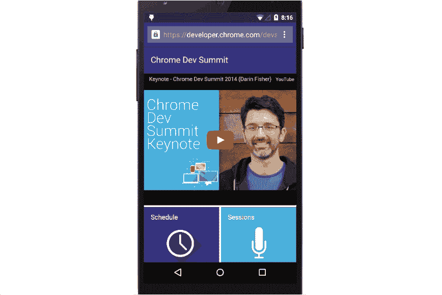
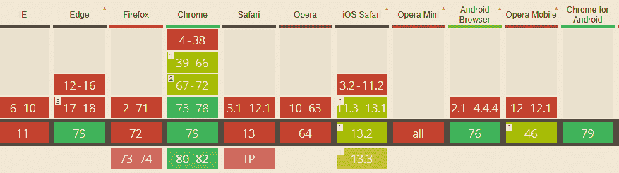
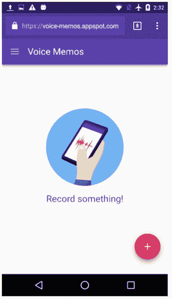
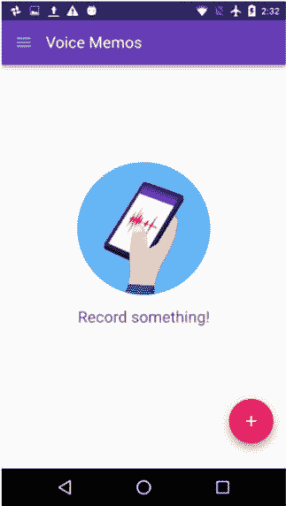
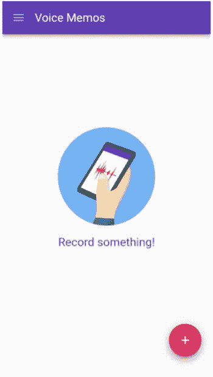
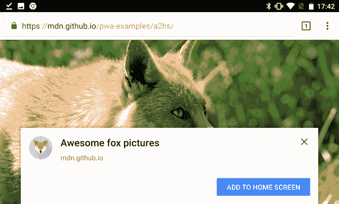
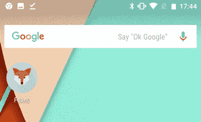
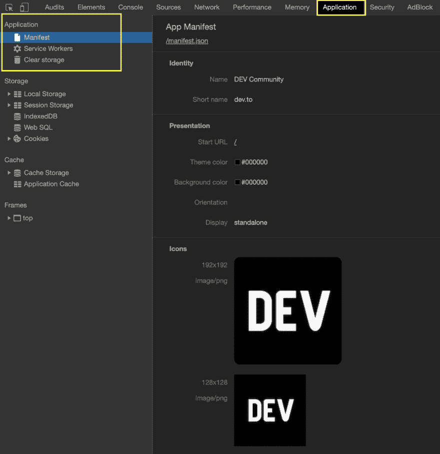

# 如何在用户设备上安装 PWA

> 原文：<https://dev.to/paco_ita/install-a-pwa-on-the-user-s-device-step-2-27pa>

欢迎来到关于艾滋病的第二个帖子🙋

在第一篇文章中，我们发现了 pwa 的潜力以及它们与原生应用的不同之处。
如果错过了，就去看看；你可能会发现一些未知的细节，即使你已经熟悉了 PWAs！

在本帖中，我们将看到如何在用户设备上安装 PWA，使其看起来完全像一个本地应用。
只需轻轻一触，我们就可以直接访问我们的网络应用，无需与浏览器互动，也无需输入网址。更加直观和用户友好的方法。

[](https://res.cloudinary.com/practicaldev/image/fetch/s--NqvTGsFu--/c_limit%2Cf_auto%2Cfl_progressive%2Cq_66%2Cw_880/https://dev-to-uploads.s3.amazonaws.com/i/f6ej9m5f1l6f7ljer8eh.gif)

## Web 应用清单

MDN 文档给出了一个伟大而清晰的定义:

> web 应用清单在 JSON 文本文件中提供关于 web 应用的信息，这是 web 应用被下载并类似于本地应用被呈现给用户所必需的(例如，被安装在设备的主屏幕上，向用户提供更快的访问和更丰富的体验)。

通常，我们将 web 应用程序清单放在 web 应用程序的根目录下。我们可以将其命名为`manifest.json`或`manifest.webmanifest`，并使用媒体类型`application/manifest+json`提供服务。

为了将清单与 web 应用程序相关联，我们在 HTML 文档(通常是 index.html)的`<head>`部分使用了`<link>`标记:

```
<head>
  <link rel="manifest" href="/manifest.webmanifest">
</head> 
```

<svg width="20px" height="20px" viewBox="0 0 24 24" class="highlight-action crayons-icon highlight-action--fullscreen-on"><title>Enter fullscreen mode</title></svg> <svg width="20px" height="20px" viewBox="0 0 24 24" class="highlight-action crayons-icon highlight-action--fullscreen-off"><title>Exit fullscreen mode</title></svg>

上面的代码片段向用户代理表明，必须采用清单的元数据，而不是`Document`中的元数据。但是，如果某些属性设置不正确，用户代理将退回到`Document`元数据。

对清单的请求是在没有任何凭证的情况下做出的(即使它在同一个域中)。因此，如果清单需要凭证，我们必须添加属性`crossorigin="use-credentials"` :

```
<head>
  <link rel="manifest" href="/manifest.webmanifest" crossorigin="use-credentials">
</head> 
```

<svg width="20px" height="20px" viewBox="0 0 24 24" class="highlight-action crayons-icon highlight-action--fullscreen-on"><title>Enter fullscreen mode</title></svg> <svg width="20px" height="20px" viewBox="0 0 24 24" class="highlight-action crayons-icon highlight-action--fullscreen-off"><title>Exit fullscreen mode</title></svg>

从 MDN web 文档:

> 如果该属性不存在，则在没有 CORS 请求的情况下获取资源(即，不发送原始 HTTP 头)，从而防止其未受感染的使用。如果无效，就像使用枚举关键字 anonymous 一样处理。

我曾经在一个项目中遇到一个问题，其中的`manifest.json`文件产生了一个一般性错误，而在 localhost 上一切都运行良好:

```
Manifest: Line: 1, column: 1, Unexpected token. 
```

<svg width="20px" height="20px" viewBox="0 0 24 24" class="highlight-action crayons-icon highlight-action--fullscreen-on"><title>Enter fullscreen mode</title></svg> <svg width="20px" height="20px" viewBox="0 0 24 24" class="highlight-action crayons-icon highlight-action--fullscreen-off"><title>Exit fullscreen mode</title></svg>

相当笼统的描述😟

我唯一要做的事情是添加`crossorigin`属性，然后清单文件在浏览器中被正确地提供，没有任何错误。

大多数浏览器都支持清单文件:

[](https://res.cloudinary.com/practicaldev/image/fetch/s--pM0Ejxms--/c_limit%2Cf_auto%2Cfl_progressive%2Cq_auto%2Cw_880/https://thepracticaldev.s3.amazonaws.com/i/o4h63ppb9x99vbdhj4ua.PNG)

Safari 目前正在努力增加支持。

## 文件结构

典型的 web 应用清单如下所示:

```
{  "short_name":  "MyCoolPWA",  "name":  "My cool Progressive Web App",  "start_url":  "/?source=pwa",  "display":  "standalone",  "icons":  [  {  "src": img/icons-144.png",  "type":  "image/png",  "sizes":  "144x144"  },  {  "src": img/icons-192.png",  "type":  "image/png",  "sizes":  "192x192"  },  {  "src": img/icons-512.png",  "type":  "image/png",  "sizes":  "512x512"  }  ],  "orientation":  "landscape",  "description":  "A simple experiment with PWAs",  "background_color":  "#3367D6",  "theme_color":  "#3367D6"  "scope":  "/",  } 
```

<svg width="20px" height="20px" viewBox="0 0 24 24" class="highlight-action crayons-icon highlight-action--fullscreen-on"><title>Enter fullscreen mode</title></svg> <svg width="20px" height="20px" viewBox="0 0 24 24" class="highlight-action crayons-icon highlight-action--fullscreen-off"><title>Exit fullscreen mode</title></svg>

我们把文件分解一下，一步一步描述。

以下字段是使`add to home screen`对话框出现所必需的:

*   **name/short_name:** 一旦安装在用户设备上，应用程序图标下使用的值。在 Chrome 中，当 PWA 正在加载时，应用程序名称也用在闪屏中。如果没有足够的空间，就使用短名称，因此我们应该保持它的简短。

*   **start_url:** 是应用程序启动时应该加载的资产的路径。这非常有用，因为我们希望我们的应用程序总是从同一个页面(如主页)开始，而不是从应用程序中最后访问的页面开始。
    你可能想知道为什么我们在上面的例子中有一个查询字符串。通过向 url 添加查询字符串，我们的 web 分析工具可以确定有多少用户通过主屏幕上的图标访问了 web 应用程序。这给了我们更多关于用户行为的信息。

*   **显示:**指定应用程序在浏览器中的显示方式。可能有不同的值:

**浏览器:**提供标准的浏览器体验，就像我们用移动设备访问任何网站一样。

[](https://res.cloudinary.com/practicaldev/image/fetch/s--BujmeVvb--/c_limit%2Cf_auto%2Cfl_progressive%2Cq_auto%2Cw_880/https://thepracticaldev.s3.amazonaws.com/i/kc7ar9kjr53l3onfpp0x.png)

**独立:**这个选项非常有趣，因为应用程序是在一个独立的窗口中打开的，与浏览器使用的窗口分开，使我们的 PWA 看起来像是一个本机应用程序。此外，一些 UI 浏览器元素——如地址栏——不再可见。

[](https://res.cloudinary.com/practicaldev/image/fetch/s---s93FBn---/c_limit%2Cf_auto%2Cfl_progressive%2Cq_auto%2Cw_880/https://thepracticaldev.s3.amazonaws.com/i/l5ciwj8n6oa5kiat6dnt.png)

**全屏:**顾名思义，我们的 PWA 会使用设备的整个屏幕。不呈现任何 UI 浏览器元素。此选项特别适合游戏或多媒体应用程序。

[](https://res.cloudinary.com/practicaldev/image/fetch/s--BO0mXXhD--/c_limit%2Cf_auto%2Cfl_progressive%2Cq_auto%2Cw_880/https://thepracticaldev.s3.amazonaws.com/i/iiqbntpqbar8e0ekws11.png)

*   **图标:**表示浏览器在显示应用程序时使用的图标。作为最低要求，我们必须提供一个分辨率至少为 144 像素的图标。
    Chrome 建议有两个:一个 192 像素，一个 512 像素。Chrome 会根据用户的设备来缩放图标。确保我们向用户提供像素完美体验的最佳方法是确定哪些是我们的目标设备，然后添加具有相对分辨率的图标。

*   **background_color:** 设置我们应用的背景颜色。如果我们使用 Chrome 将 PWA 添加到主屏幕，背景色也将用于闪屏。

还有其他属性是可选的，但被认为是推荐的:

*   **方向:**允许我们指定应用程序应该以纵向(垂直)还是横向(水平)模式显示。后者通常更适合游戏/媒体应用。

*   在移动设备上，它设置网站周围的主题颜色。在桌面上，主题颜色用于设计标题栏的样式。

*   **描述:**描述我们的 app。

*   **范围:**定义我们网站上下文的导航范围。如果用户在范围之外导航，它将返回到浏览器窗口内的正常网页。

如果我们不想手工创建清单，我们可以使用一个[清单生成器](https://app-manifest.firebaseapp.com/)。这是一个简单的工具，它提供了一个清单框架，因此我们只需要用我们想要的值填充属性。

## 添加到主屏幕对话框(A2HS)

要显示 A2HS 对话框，仅正确初始化清单属性是不够的。我们还需要通过安全连接(HTTPS)服务的应用程序。Chrome 特别要求应用程序还必须注册一名服务人员。如果所有这些都满足，浏览器将显示 A2HS 对话框。

[](https://res.cloudinary.com/practicaldev/image/fetch/s--B4GgK3iW--/c_limit%2Cf_auto%2Cfl_progressive%2Cq_auto%2Cw_880/https://thepracticaldev.s3.amazonaws.com/i/afy3uqzhlb02kwd6748f.png)

如果用户关闭对话框而不接受应用程序安装，该对话框将在大约 90 天内不会再次出现。如果应用程序被添加到主屏幕，它将看起来完全像一个本地应用程序，使用我们在清单文件中定义的图标之一。通过看图标，我们无法分辨出背后是原生 app 还是 PWA。

<figure>

<figcaption>source Mozilla web docs</figcaption>

</figure>

## 测试清单

为了验证我们的清单设置正确，我们可以使用 Chrome DevTools。打开`Application tab`并接近左侧的`Manifest section`。

[](https://res.cloudinary.com/practicaldev/image/fetch/s--cXmCoZPv--/c_limit%2Cf_auto%2Cfl_progressive%2Cq_auto%2Cw_880/https://thepracticaldev.s3.amazonaws.com/i/0o7fz1nmt2p4db6o2wd8.png)

我们可以看到在我们的清单文件中定义的属性和图标在这个部分中报告(这里是 dev.to 清单文件)。如果您可以在此选项卡中看到您的清单属性，那么您已经设置好了！您已将 web 应用程序清单正确部署到 PWA🎉

您还可以使用一个[清单验证器](https://manifest-validator.appspot.com/)来验证您的清单。

在下一篇文章(步骤 3)中，我们将讨论服务人员，以及如何在用户离线时为我们的应用提供服务。

[](/paco_ita) [## 解释了服务工作者和缓存策略

### Francesco lear dini 6 月 30 日 198 分钟阅读

#pwa #frontend #webdev #javascript](/paco_ita/service-workers-and-caching-strategies-explained-step-3-m4f)

你可以关注我:

[](https://twitter.com/paco_ita)