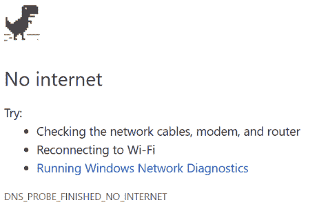
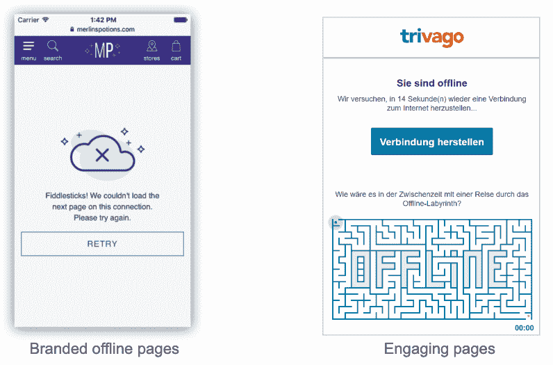
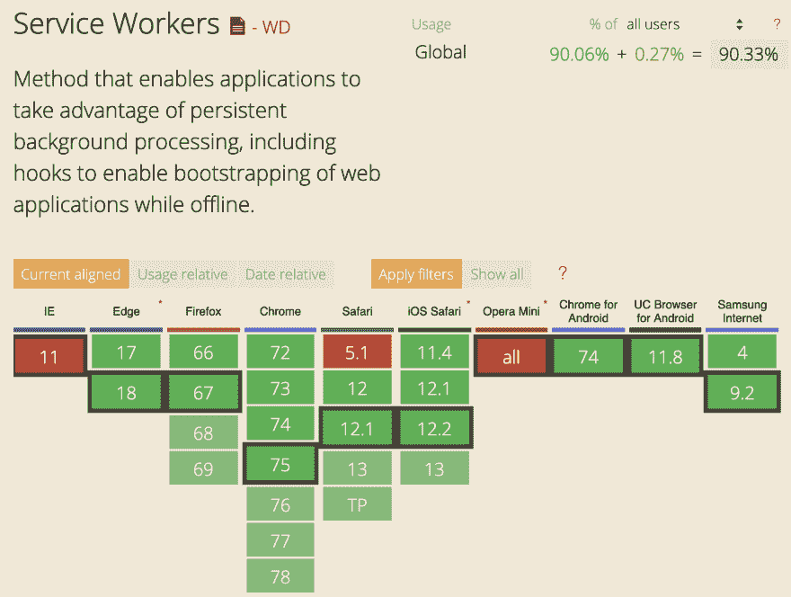
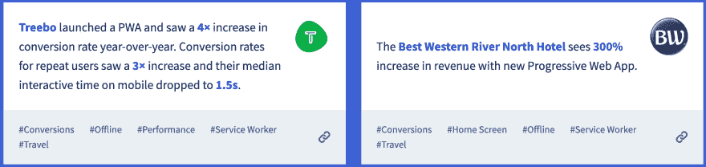
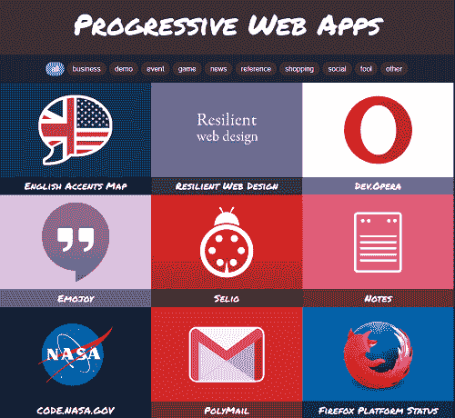
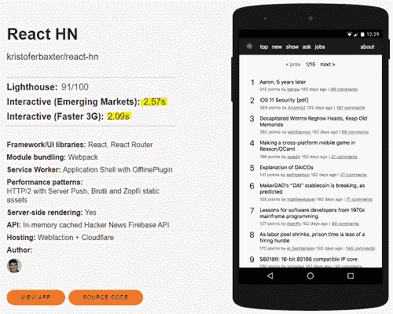
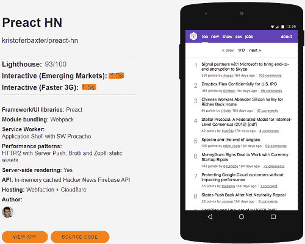
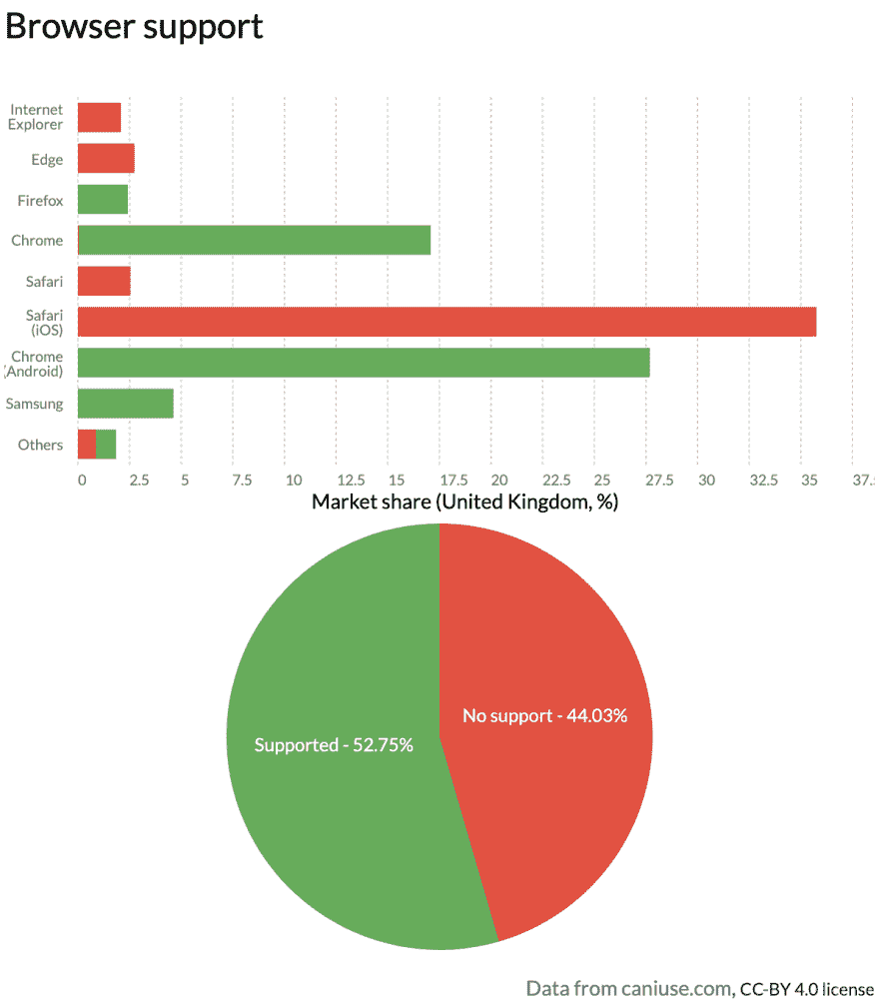

# 渐进式网络应用的温和介绍

> 原文：<https://dev.to/paco_ita/a-gentle-introduction-to-progressive-web-apps-step-1-24da>

这是关于艾滋病系列文章的第一篇。我们将从基础开始，然后逐渐深入到技术特性和真实案例场景。

我的目标是在每一步提供足够的信息，而不是一下子让你不知所措。

## 让我们开始旅程...

渐进式 Web 应用程序(PWAs)近年来变得非常流行，这是有充分理由的，因为它们不仅可以提高性能，而且当用户离线时也可以访问。

在没有服务人员的情况下访问网络应用**...**

[](https://res.cloudinary.com/practicaldev/image/fetch/s--lFk6N_Ar--/c_limit%2Cf_auto%2Cfl_progressive%2Cq_auto%2Cw_880/https://thepracticaldev.s3.amazonaws.com/i/0sdd30rhlo14812ou85q.png)

...**与**服务人员:

[](https://res.cloudinary.com/practicaldev/image/fetch/s--V7Ge9gBu--/c_limit%2Cf_auto%2Cfl_progressive%2Cq_auto%2Cw_880/https://thepracticaldev.s3.amazonaws.com/i/vf6f5t0cjprsih5er2q3.png)

差别很大，不是吗？

至少，我们可以提供带有公司徽标和颜色的品牌离线页面，或者还包括一些静态信息，如电话号码或电子邮件地址。一些公司走得更远，在用户失去连接的情况下提供离线游戏。
用户的注意力一直锁定在游戏上，直到连接恢复，所请求的内容被自动传送。这是一个聪明的方法，可以留住潜在客户，否则他们会放弃网站。

## 浏览器支持

现在几乎所有的浏览器都支持服务人员:

<figure>

<figcaption>source caniuse.com</figcaption>

</figure>

IE11 没有被邀请参加聚会(如果你还和它一起工作的话😢).

## PWA 的一个定义

渐进式 web 应用程序只是一个 web 应用程序，由于现代 web 功能，它可以提供更丰富的用户体验，与原生应用程序非常相似。

根据谷歌的说法，一个 PWA 有以下特点:

*   **渐进式:**如果用户有一个旧的浏览器(IE 11)，应用程序仍将像普通的 web 应用程序一样工作，不提供任何渐进式功能。

*   **离线工作:**通过服务人员，我们可以决定当用户离线或处于低质量网络时，缓存哪些资产或数据请求并使其可用。

*   安全:服务人员只能通过安全连接(HTTPS 或本地主机)进行安装。这个我们后面会详细讨论)。

*   **重新参与:**通过在后台运行的网络通知提高用户的重新参与度，即使应用程序关闭，也可以联系到我们的用户。

*   **可安装:**由于 web 应用程序清单，PWA 可以安装在用户设备的主屏幕上。

*   **响应迅速:**适用于任何设备:台式机、手机或平板电脑。

## 激发资源

[pwastats.com](https://www.pwastats.com/)收集了几个不同领域的公司的成功故事，这些公司受益于在他们的业务中采用 PWAs。

[](https://res.cloudinary.com/practicaldev/image/fetch/s--VKyygz5S--/c_limit%2Cf_auto%2Cfl_progressive%2Cq_auto%2Cw_880/https://thepracticaldev.s3.amazonaws.com/i/a14kk917davd0aubotkg.png)

在网站 [pwa.rocks](https://pwa.rocks/) 你可以看到很多 pwa 的例子。

[](https://res.cloudinary.com/practicaldev/image/fetch/s--ivEZjXc6--/c_limit%2Cf_auto%2Cfl_progressive%2Cq_auto%2Cw_880/https://thepracticaldev.s3.amazonaws.com/i/riux89hjawu873zc3m9r.PNG)

最后，你还应该访问一下 hnpwa.com 的页面。它列出了用各种前端框架实现的 Hacker News 网站的演示实现，并展示了慢速网络连接的响应时间的比较。

[](https://res.cloudinary.com/practicaldev/image/fetch/s--mMc_69Th--/c_limit%2Cf_auto%2Cfl_progressive%2Cq_auto%2Cw_880/https://thepracticaldev.s3.amazonaws.com/i/j3au46kt74r0z6t3cozk.PNG)

[](https://res.cloudinary.com/practicaldev/image/fetch/s--8FDs4M5k--/c_limit%2Cf_auto%2Cfl_progressive%2Cq_auto%2Cw_880/https://thepracticaldev.s3.amazonaws.com/i/wy8yr7543ic4aojyeiyv.PNG)

有些结果确实令人印象深刻，充分证明了 PWAs 的潜力。

* * *

如果您想收到更多文章更新，请关注我:

[](https://twitter.com/paco_ita) 

* * *

## PWA 或原生 App...这就是问题所在

我们看到了 PWAs 如何致力于提供与原生应用相同的体验。然而，有些功能我们仍然无法实现，例如与手机的联系人列表互动*或发送短信。另一方面，现在有许多功能是几年前无法想象的。

*(这部分是真的，因为在撰写本文时，谷歌正在实现一个非常新的 API，仍处于测试阶段，名为 [Contact Picker API](https://web.dev/contact-picker/) ，为用户提供了一种轻松共享联系人列表中联系人的方式。)

> 你知道吗，我们可以用震动 API 让设备震动？

我们可以通过指定一个单独的值:
使振动硬件产生一次脉冲

```
window.navigator.vibrate(100); 
```

<svg width="20px" height="20px" viewBox="0 0 24 24" class="highlight-action crayons-icon highlight-action--fullscreen-on"><title>Enter fullscreen mode</title></svg> <svg width="20px" height="20px" viewBox="0 0 24 24" class="highlight-action crayons-icon highlight-action--fullscreen-off"><title>Exit fullscreen mode</title></svg>

也可以提供整数数组。它们将被交替解释为设备应该振动的毫秒数和应该暂停的毫秒数:

```
window.navigator.vibrate([100, 50, 100]); 
```

<svg width="20px" height="20px" viewBox="0 0 24 24" class="highlight-action crayons-icon highlight-action--fullscreen-on"><title>Enter fullscreen mode</title></svg> <svg width="20px" height="20px" viewBox="0 0 24 24" class="highlight-action crayons-icon highlight-action--fullscreen-off"><title>Exit fullscreen mode</title></svg>

上述方法将使设备振动 100 毫秒，然后暂停 50 毫秒，然后再次振动 100 毫秒。

如果没有振动硬件存在，那么什么也不会发生。这是一种渐进的方法，只在有能力的设备上起作用，在其他设备上将被忽略，而不会崩溃或性能下降。

[](https://res.cloudinary.com/practicaldev/image/fetch/s--a39mhkzX--/c_limit%2Cf_auto%2Cfl_progressive%2Cq_auto%2Cw_880/https://thepracticaldev.s3.amazonaws.com/i/8ka8qfg1rmo0a8znkddt.png) 
不过这个功能目前并不是所有的浏览器都有。这次 Safari 和 Edge 也没有被邀请参加聚会。

在网站 [whatwebcando.today](https://whatwebcando.today/) 上，您可以验证您当前用来访问页面的浏览器当前可用的所有 Web APIs(您可以通过单击它来检查每个 API 的支持状态)。

让我们分析一些其他的差异:

##### app 审核无等待时间

不需要经过苹果或者 Play 商店的验证过程；我们的 PWA 一经部署，公众便可立即使用。

##### 简易版本管理

我们只提供一个版本。用户将自动收到最新版本，而不会受到更新请求的困扰。

##### 开发成本

如果我们有前端开发人员在我们的公司网站上工作，只需很少的额外努力，他们也可以创建一个 PWA。这不是移动开发的情况，我们需要额外的资源，因为通常我们至少需要两个移动团队:一个负责 iOS，一个负责 Android(忽略 Windows mobiles)。

##### 可共享链接

根据定义，PWA 的每个页面都必须是可动态链接的。这非常重要——尤其是对于社交媒体——因为我们可以轻松地共享我们的应用程序页面，而无需我们的收件人安装相同的应用程序。

##### 离线使用

关于离线使用，也许两个备选方案势均力敌。只有服务工作者才允许缓存 GET 请求，而不允许缓存 POST 或 PUT 请求，因为这些请求会改变服务器状态。许多原生应用程序只有在稳定的互联网连接下才能运行，尽管有些允许离线使用。在我们未来的一个链接中，我们将探索如何克服这个弱点，并允许缓存 POST/PUT 请求。

##### 限制对硬件的访问

我们之前刚刚看到，现代 API 允许与设备硬件进行越来越多的交互，但仍缺少一些功能，浏览器支持也有限。因此，在这种情况下，本地应用仍然是赢家。

##### 商场上的供货情况

直到最近，本地应用程序仍然处于领先地位，但由于 TWA(可信网络活动)，现在可以在 Play Store 中使用我们的 pwa。因此，离原生应用又近了一步😂

#### 什么时候开发 PWA 而不是原生 app？

**渐进式网络应用:**

*   该应用程序必须尽快上市
*   可用预算有限
*   计划在上线后进行几项更新
*   跨平台兼容性是一项要求

**原生 app:**

*   速度和响应能力是关键因素
*   需要使用特定硬件设备的功能
*   该应用程序必须与其他第三方应用程序集成

## 结论

我希望我能够向您概述 PWAs 的特性。这真的有可能改善用户体验，向我们的观众证明更加丰富和先进的功能。我们还可以大幅优化我们的 web 应用程序的性能，减少它们的响应时间，并使它们能够在用户离线时显示数据。

请继续关注下一篇文章，我们将深入挖掘所有的 PWAs 可能性！

目前，我计划描述的主题具有以下结构:

*   在**步骤 2** 中，我们将学习如何在用户的设备上安装 PWA，以及指导浏览器如何呈现我们的应用程序的不同选项。

[](/paco_ita) [## 如何在用户设备上安装 PWA

### 弗朗切斯科·里尔迪尼 6 月 23 日 196 分钟阅读

#pwa #webdev #frontend #javascript](/paco_ita/install-a-pwa-on-the-user-s-device-step-2-27pa)

*   **第三步**将描述🔥`service workers`🔥，不同的缓存策略以及在什么情况下我们应该使用它们。

[](/paco_ita) [## 解释了服务工作者和缓存策略

### Francesco lear dini 6 月 30 日 198 分钟阅读

#pwa #frontend #webdev #javascript](/paco_ita/service-workers-and-caching-strategies-explained-step-3-m4f)

*   **步骤 4** 将描述目前可用于创建 pwa 的工具。有些独立于任何 JS 框架，但是我们也将看到如何使用 Angular 从头开始创建一个完全工作的 PWA。

[](/paco_ita) [## 使用 Angular 和其他免费工具创建渐进式 Web 应用程序！

### 弗朗切斯科·里尔迪尼 7 月 7 日 1914 分钟阅读

#angular #pwa #beginners #javascript](/paco_ita/create-progressive-web-apps-with-angular-workbox-pwa-builder-step-4-27d)

*   **第 5 步**我们已经简要提到了服务人员如何只能缓存`GET`个请求。在这篇文章中，我们将把我们的 PWA 提升到一个新的水平，允许我们的应用程序享受完整的 CRUD 操作💪。

[](/paco_ita) [## 创建永不离线的 web 应用程序！

### 弗朗切斯科·里尔迪尼 7 月 15 日 194 分钟阅读

#pwa #javascript #firebase #webdev](/paco_ita/break-the-cache-api-limits-in-our-pwa-oo3)

*   **第 6 步**将教我们如何使用推送通知重新吸引我们的目标用户。