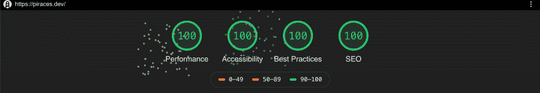
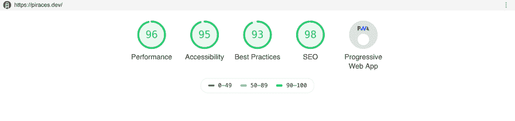
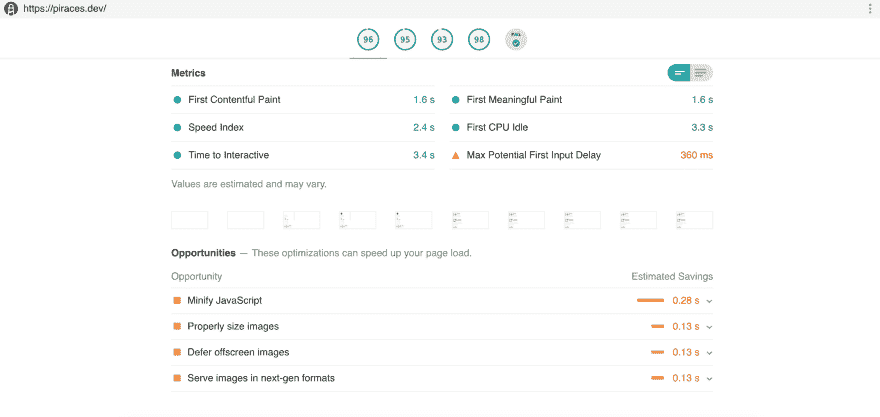

# 在我的博客中记录我提高灯塔分数的方法

> 原文：<https://dev.to/piraces/notes-on-my-way-to-improve-my-lighthouse-score-in-my-blog-a34>

半年前，我开始了这个博客项目，试图学习新的东西，写下它们，并希望为一些人提供伟大的内容。

我开始尝试使用带有一些 [Jekyll](https://jekyllrb.com/) stater 主题的 [Github 页面](https://pages.github.com/)，但在很短的时间内，我使用启动主题 [Lumen](https://github.com/alxshelepenok/gatsby-starter-lumen) 切换到了 [GatsbyJS](https://www.gatsbyjs.org) ，因为我觉得 React 更舒服，而且在我看来它更具可定制性。还将部署切换到 [Netlify](https://netlify.com) 来尝试新的东西。

Gatsby 的速度快得像闪电一样，因为它只生成静态内容来提供服务，并且具有强大的功能，使网站在默认情况下具有出色的性能。我使用的简单入门主题，也有很好的 SEO 和 accesibility 特性，让我的旅程更容易。

然而，当我第一次使用 [Lighthouse](https://developers.google.com/web/tools/lighthouse/?hl=en) 对我的新博客进行审计时，这是我的初始得分:

这是一个很好的结果，但我觉得我可以做得更多，解决报告的问题，并获得最高分。对我来说，这是一个挑战，在这里我可以获得更多关于 web 最佳实践的知识(以及新概念)。

我开始仔细查看报告的每一部分，并改进每个主要类别。

## 表现

性能是该工具报告的最差分数之一...第一幅内容丰富的绘画( [FCP](https://developers.google.com/web/tools/lighthouse/audits/first-contentful-paint) )并不出色，第一次交互的时间可以改进，图像没有优化，Javascript 执行需要几秒钟才能完成(这是一个非常简单的网站)。

首先，我开始优化我的图片。我只在登录页面中使用了一张图片(我的个人资料图片)，所有其他图片都是从第三方加载的。这张图片是以原始的分辨率和质量上传的，这对于在一个小图片框中使用它来说并不太好...
我使用我电脑上的默认图像编辑器来更改分辨率，然后 [Squoosh](https://squoosh.app/) 将文件转换为 WebP，并优化资产的最终大小([考虑到允许该格式的网络浏览器](https://caniuse.com/#feat=webp))。正如预期的那样，它的大小减少了几千字节...

第二，我意识到主题使用了自定义字体([，这可能会影响网站性能](https://developers.google.com/web/updates/2016/02/font-display)，并更改了一些 CSS 属性，以允许浏览器*将*从默认系统字体切换到可用的自定义字体。只有在应用自定义字体的地方应用`font-display: swap;`就足够了。这比预期的性能提高更多！

关于这一点，我的成绩是 98 分左右。
最后，使用谷歌 Chrome 开发工具，我意识到服务器用来提供文件的压缩算法是 *gz* 。然后我想到了我读过的一些关于 [*brotli*](https://github.com/google/brotli) 和其他压缩算法的文章，这些算法可以提高文件的大小和压缩速度。

切换到 brotli 算法进行压缩(通过[插件](https://www.gatsbyjs.org/packages/gatsby-plugin-brotli/))和更新所有项目包(以获得最新的改进)是最后要做的事情，以获得 100 分的性能分数，并减少服务文件的时间和大小。

*   注意:现在 Netlify 不支持 brotli。尽管如此，在 Nginx(或支持的服务器)上运行，会得到最好的结果。

## 可接受性

报告中显示的关于可访问性的唯一关注点是在链接中使用`aria-label`属性来提供更多关于链接目的/意义的信息。

主要是联系链接和社交媒体链接，我提供了推荐属性，然后所有问题都解决了。

## 最佳实践

为了达到“最佳实践”100 分中的 100 分，我改变了网站，默认使用 HTTPS，不使用 HTTP 加载任何东西(图像、脚本、资产)，因为它们被认为是不安全的资源。我还必须检查以正确的宽高比显示的图像。

最后，我检查了整个应用程序，寻找不推荐的功能和一些[谷歌建议避免](https://developers.google.com/web/tools/lighthouse/audits/appcache)的功能，并改变它们。

## SEO

我对 SEO 评分的主要问题是一些没有描述性文字的[链接和一些大小不合适的](https://developers.google.com/web/tools/lighthouse/audits/descriptive-link-text)[点击目标](https://developers.google.com/web/tools/lighthouse/audits/tap-targets)。

第一个问题很容易解决。主要问题是社交媒体账户上的联系我链接没有描述性文字...所以我添加了一些描述性的文字，比如“在 Twitter 上关注我”，这样就解决了这个问题。

最后，一些用于在文章和页面之间导航的按钮看起来没有必要的大小来允许移动用户正确地点击它们而没有任何问题。这个问题可以通过增加报告按钮和点击目标的大小以及增加它们的边距来解决。

## 渐进式网络应用(PWA)

我使用的 Gatsby started 主题符合 PWA 的标准，所以我得到的 PWA 分数没有任何变化。
Gatsby 为实施 PWA 提供了大量资源，并满足了三个标准:

*   必须在 HTTPS ✔️下运行
*   必须包括一个 Web 应用程序清单✔️(盖茨比插件清单)
*   必须实现一个服务工作者✔️(盖茨比-插件-离线)

## 结论

一路走来，我学到了很多关于 web 最佳实践的知识。我将把这些知识应用到进一步的网站开发中，使我的网站更快、更易访问、更好。

我将继续接受挑战，审核我的网站，并改进它们，以充分利用它们，因为我认为这是在这个领域学习的一个很好的方式。

你呢？你在做什么来提高你的衡量标准？

*原发于我的个人博客:[https://piraces.dev/posts/improve-lighthouse-score-audit/](https://piraces.dev/posts/improve-lighthouse-score-audit/)T3】*