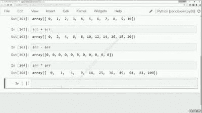
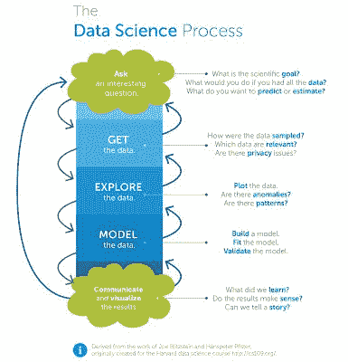
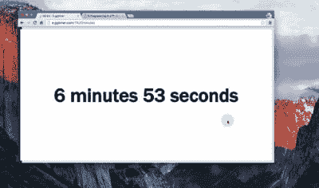
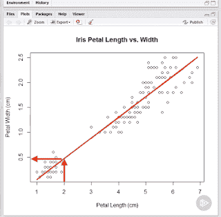
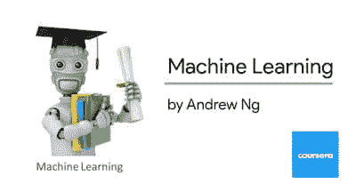

# 面向初学者的 6 门最佳数据科学和机器学习课程

> 原文：<https://dev.to/javinpaul/top-online-courses-to-learn-data-science-and-machine-learning-for-beginners-best-of-lot-37k8>

*披露:这篇文章包括附属链接；如果您从本文提供的不同链接购买产品或服务，我可能会收到报酬。*

许多程序员正转向数据科学和机器学习，希望获得更好的薪酬和职业机会——这是有原因的。在过去的几年里，[数据科学家](http://javarevisited.blogspot.sg/2018/02/top-10-highest-paying-technical-jobs-programmers-software-developers.html#axzz58Gi5STbU)一直被列为 Glassdoor 的**第一工作，根据 Indeed 的数据，一名数据科学家在美国的平均工资超过** 12 万美元* *。**

数据科学不仅在金钱方面是一个有回报的职业，而且它还为你提供了解决一些世界上最有趣的问题的机会。依我看，这是许多优秀程序员走向[数据科学](https://javarevisited.blogspot.sg/2018/03/top-5-data-science-and-machine-learning-online-courses-to-learn-online.html)、[机器学习](https://javarevisited.blogspot.com/2018/08/top-5-tensorflow-and-machine-learning-courses-online-programmers.html)和人工智能的主要动机。

如果你也在同一条船上，想成为一名数据科学家，那么你来对地方了。在这篇文章中，我将分享一些你可以通过学习[数据科学](https://medium.com/javarevisited/my-favorite-data-science-and-machine-learning-courses-from-coursera-udemy-and-pluralsight-eafc73acc73f)、[机器学习](https://medium.com/javarevisited/top-10-machine-learning-and-data-science-certifications-and-training-courses-for-beginners-and-a6308497b764)和[人工智能](https://medium.com/javarevisited/7-best-courses-to-learn-artificial-intelligence-in-2020-26d59d62f6fe)成为数据科学家的**最佳在线课程。**

说到编程语言和库， [Python](http://javarevisited.blogspot.sg/2018/03/top-5-courses-to-learn-python-in-2018.html) 和 [R](http://www.java67.com/2017/12/10-programming-languages-to-learn-in.html) 显然是机器学习、数据分析和人工智能领域的两种领先编程语言。这些语言正在发生许多令人兴奋的发展，而且它们已经有了一些有用的库。

如果你有一些编程或脚本编写经验，这些课程将教你科技行业中真正的数据科学家和机器学习从业者使用的技术，并为你进入这一热门而有利可图的职业道路做准备。

## 初学者学习数据科学的最佳在线课程

早些时候，我已经分享了[最佳数据科学书籍](https://javarevisited.blogspot.com/2019/08/top-5-python-books-for-data-science-and-machine-learning.html)和[最佳机器学习书籍](https://medium.com/javarevisited/top-10-resources-to-learn-data-science-and-machine-learning-best-of-lot-f153e1f44e89)，这里是我列出的学习数据科学和机器学习并成为数据科学家的顶级在线课程。

这些课程将为您提供宝贵的见解、建议、技巧和推荐，让您的数据科学职业生涯更上一层楼。

它包含了关于 Python 和 T2 的课程，这两种语言是数据科学家最流行的编程语言。

#### [1。用于数据科学和机器学习的 Python 训练营](https://click.linksynergy.com/fs-bin/click?id=JVFxdTr9V80&subid=0&offerid=323058.1&type=10&tmpid=14538&RD_PARM1=https%3A%2F%2Fwww.udemy.com%2Fpython-for-data-science-and-machine-learning-bootcamp%2F):

我的许多已经转向数据科学的朋友和同事已经选择 Python 作为他们的语言选择。一个原因是 Python 可能是最流行的语言，它提供了一切。

他们已经在使用 [Python](http://www.java67.com/2018/02/5-free-python-online-courses-for-beginners.html) 编写脚本和[面向对象编程](http://www.java67.com/2018/02/5-free-object-oriented-programming-online-courses.html)，如果你已经知道这门语言，学习数据科学会比学习像 r 这样的新语言更容易

这是掌握数据科学和机器学习 python 库的最佳课程之一。

您将学习如何使用大多数流行的 Python 机器学习和深度学习库，如 [NumPy](http://bit.ly/2CwoE3b) 、 [Pandas](http://bit.ly/2Ml6Kpa) 、Seaborn、Matplotlib、Plotly、 [Scikit-learn](http://bit.ly/2CwoOYl) 、 [Meeshkan](http://bit.ly/2CxzExs) 、 [TensorFlow](https://hackernoon.com/top-5-tensorflow-and-ml-courses-for-programmers-8b30111cad2c) 、 [Keras](http://bit.ly/2CwDyXt) 等等！

本课程是为有一些编程经验的初学者和希望向数据科学迈进的有经验的开发人员设计的！

它可以与通常花费数千美元的其他数据科学训练营相媲美，但现在，你可以以很少的成本学习所有信息-只需* * $ 9.99 * *，如果你幸运地在 Udemy 的闪购期间买到它。

#### [2。用 Python 进行数据科学、深度学习和机器学习](https://click.linksynergy.com/fs-bin/click?id=JVFxdTr9V80&subid=0&offerid=323058.1&type=10&tmpid=14538&RD_PARM1=https%3A%2F%2Fwww.udemy.com%2Fdata-science-and-machine-learning-with-python-hands-on%2F):

这是一门难得的实践课程，学习雇主正在寻求的神经网络、人工智能和机器学习技术。

这门课程是通过分析最大的科技雇主对数据科学家职位清单的真实要求而设计的，这意味着它涵盖了真实雇主正在寻找的机器学习和数据挖掘技术。

#### [3。数据科学职业 A-Z](https://click.linksynergy.com/fs-bin/click?id=JVFxdTr9V80&subid=0&offerid=323058.1&type=10&tmpid=14538&RD_PARM1=https%3A%2F%2Fwww.udemy.com%2Fcareers-in-data-science-a-ztm%2F) :

如果你对数据分析和机器学习感兴趣，并想知道如何成为顶级数据科学家，那么这是适合你的课程。

在本课程中，您不仅将学习如何成为一名数据科学家的基本步骤，还将学习让您的数据科学职业生涯更上一层楼的实际技巧和诀窍。

#### [4。Tableau 10 A-Z:数据科学实践 Tableau 培训！](https://click.linksynergy.com/fs-bin/click?id=JVFxdTr9V80&subid=0&offerid=323058.1&type=10&tmpid=14538&RD_PARM1=https%3A%2F%2Fwww.udemy.com%2Ftableau10%2F)

Tableau 是数据科学家中最受欢迎的工具之一，这是因为对了解 Tableau 的数据科学家有很大的需求。

本课程将循序渐进地教你 Tableau 10 for data science。**它包含现实生活中的数据分析练习和测验，让您直接体验 Tableau** 。

您将学习 Tableau 中的所有功能，这些功能允许您轻松、快速、漂亮地探索、试验、修复、准备和呈现数据。

#### [5。R 编程 A-Z: R 为数据科学配真实练习！](https://click.linksynergy.com/fs-bin/click?id=JVFxdTr9V80&subid=0&offerid=323058.1&type=10&tmpid=14538&RD_PARM1=https%3A%2F%2Fwww.udemy.com%2Fr-programming%2F)

R 是另一种流行的数据科学编程语言，本课程从数据科学的角度对 R 进行了很好的概述。那里有很多课程和讲座。

然而， **R 有一个非常陡峭的学习曲线**，学生们经常会不知所措。

这门课程确实是循序渐进的。在每一个新的教程中，我们都在已经学过的基础上又向前迈了一步。

**6。** [**用 R by Pluralsight**](https://pluralsight.pxf.io/c/1193463/424552/7490?u=https%3A%2F%2Fwww.pluralsight.com%2Fcourses%2Fr-data-science) \
数据科学是将数据转化为知识的实践， [R](https://hackernoon.com/5-free-r-programming-courses-for-data-scientists-and-ml-programmers-5732cb9e10) 是数据科学家最常用的编程语言之一。

在本[课程](https://pluralsight.pxf.io/c/1193463/424552/7490?u=https%3A%2F%2Fwww.pluralsight.com%2Fcourses%2Fr-data-science)中，您将首先了解数据科学的实践、R 编程语言，以及如何使用它们将数据转化为可操作的洞察力。

接下来，您将学习如何转换和清理数据，创建和解释描述性统计数据、数据可视化和统计模型。

最后，您将学习如何处理[大数据](http://www.java67.com/2018/05/top-5-free-big-data-courses-to-learn-Hadoop-Apache-Spark.html)，使用机器学习算法进行预测，并将 R 部署到生产中。

[**6。吴恩达**的机器学习](https://click.linksynergy.com/fs-bin/click?id=JVFxdTr9V80&subid=0&offerid=467035.1&type=10&tmpid=18061&RD_PARM1=https%3A%2F%2Fwww.coursera.org%2Flearn%2Fmachine-learning) \
这大概是斯坦福大学和 [Coursera](https://medium.com/@CourseraEng) 提供的最受欢迎的学习机器学习的课程，同时还提供认证。您将在本课程中学习的每一个主题上接受测试，根据完成情况和您获得的最终分数，您还将获得证书。

这门课程是* *免费的* *，但如果你想获得*证书，你需要付费。尽管如此，它确实为你作为开发者提供了价值，让你很好地理解了你提出的所有机器学习[算法](https://hackernoon.com/10-data-structure-algorithms-and-programming-courses-to-crack-any-coding-interview-e1c50b30b927)背后的数学原理。

我个人真的很喜欢这个。[吴恩达](https://medium.com/@andrewng)用 Octave 带你完成整个课程，Octave 是一个很好的工具，可以在你的项目投入使用之前测试你的算法。

这就是成为数据科学家的一些最好的课程。正如我在第一段中所说的，数据科学是一个非常赚钱的职业，有很多令人兴奋的机会来解决世界上一些最有趣的问题。

如果你对数据分析和解决问题有热情，并希望在你的职业生涯和世界上有所作为，这是你行动的正确时机。

随着我在这些领域知识的增长，我将为 [Python](https://hackernoon.com/top-5-courses-to-learn-python-in-2018-best-of-lot-26644a99e7ec) 和 [Java](https://javarevisited.blogspot.com/2017/12/10-things-java-programmers-should-learn.html#axzz53ENLS1RB) 开发人员写更多关于数据科学和机器学习的文章。

我的许多读者询问了关于用于机器学习的 Java 和 Python 的库、框架和书籍，这是我今年要做的事情。这些在线课程是一个很好的起点。

顺便说一句，这里有一些其他的编程和开发课程，你可能会喜欢:

*   [面向 Java 开发人员的 5 门大数据和 Apache Spark 课程](http://javarevisited.blogspot.sg/2017/12/top-5-courses-to-learn-big-data-and.html)
*   [面向 Java 开发者的 5 门春季微服务课程](http://javarevisited.blogspot.sg/2018/02/top-5-spring-microservices-courses-with-spring-boot-and-spring-cloud.html)
*   [能帮助你成为 Scrum 高手的 5 门课程](http://javarevisited.blogspot.sg/2018/01/top-5-free-agile-courses-for-programmers.html)\[2018 年学习 Python 的 5 门课程](http://javarevisited.blogspot.sg/2018/03/top-5-courses-to-learn-python-in-2018.html)
*   [5 面向 JavaScript 开发者的 React 原生课程](http://javarevisited.blogspot.sg/2018/02/5-react-native-courses-to-learn-mobile-development-using-JavaScript.html)
*   [学习 Spring Boot 和 Spring MVC 的 5 门免费课程](http://www.java67.com/2017/11/top-5-free-core-spring-mvc-courses-learn-online.html)
*   【Java 开发者学习 DevOps 的 10 门免费 Docker 课程
*   [面向 Java 开发人员的 5 门免费 Jenkins 和 Maven 课程](http://www.java67.com/2018/02/6-free-maven-and-jenkins-online-courses-for-java-developers.html)

#### 期末备注

谢谢，你坚持到了文章的结尾...祝你的数据科学和机器学习之旅好运！这当然不容易，但是通过遵循这个路线图和指南，你离成为一名[数据科学家](http://bit.ly/2CJb3pv)更近了一步。

如果你喜欢这些数据科学和机器学习课程，那么请分享给你的朋友和同事，别忘了在 Twitter 上关注 [javinpaul](https://twitter.com/javinpaul) ！

此外，请注意，如果您使用本文中的链接购买任何课程，我会向您支付额外费用，但您应该只购买可以连接到讲师的课程。

建议你先查看一下这些课程的预习，再给你选一两门。每个人都有不同的口味，即使这些是最好的课程，你也需要选择最适合你的课程。

### 附:如果需要一些免费资源，可以查看[深度学习必备:Python 中的 Numpy 栈](http://bit.ly/2CwoE3b) 开始你的旅程。