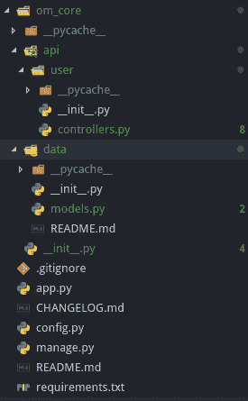

# 我如何构建我的 Flask 应用程序

> 原文：<https://dev.to/itachiuchiha/how-i-structure-my-flask-apps-3eh8>

*这篇文章之前发表在我的[博客](https://aligoren.com/how-i-structure-my-flask-apps/)T3 上*

* * *

你好。5 年来，我一直在开发 Flask 应用程序作为副业。这么多年过去了，我找到了适合自己的结构。

## 第一步

首先，我总是使用 virtualenv 来隔离我的项目。例如，我们想开发一个民意调查应用程序。

```
mkdir poll_app

cd poll_app

virtualenv .

source bin/activate 
```

<svg width="20px" height="20px" viewBox="0 0 24 24" class="highlight-action crayons-icon highlight-action--fullscreen-on"><title>Enter fullscreen mode</title></svg> <svg width="20px" height="20px" viewBox="0 0 24 24" class="highlight-action crayons-icon highlight-action--fullscreen-off"><title>Exit fullscreen mode</title></svg>

## 我一直使用的 Python 库

我正在开发需要数据库的应用程序。所以，我总是使用 **flask_script** 和 **flask_migrate** 库。我不喜欢 Flask 的 CLI 工具。

*   烧瓶脚本:[https://flask-script.readthedocs.io/en/latest/](https://flask-script.readthedocs.io/en/latest/)
*   烧瓶-迁移:[https://flask-migrate.readthedocs.io/en/latest/](https://flask-migrate.readthedocs.io/en/latest/)

我在根文件夹中创建了一个名为 **manage.py** 的 python 文件，比如 Django 的。比如说；

```
from MYAPP.data.models import db
from MYAPP import app
from flask_script import Manager
from flask_migrate import Migrate, MigrateCommand

db.init_app(app)
migrate = Migrate(app, db)
manager = Manager(app)

manager.add_command('db', MigrateCommand)

if __name__ == "__main__":
    manager.run() 
```

<svg width="20px" height="20px" viewBox="0 0 24 24" class="highlight-action crayons-icon highlight-action--fullscreen-on"><title>Enter fullscreen mode</title></svg> <svg width="20px" height="20px" viewBox="0 0 24 24" class="highlight-action crayons-icon highlight-action--fullscreen-off"><title>Exit fullscreen mode</title></svg>

我就是这样用的；

```
python manage.py db init # --> init migrations

python manage.py db migrate # --> migrate models

python manage.py db upgrade # --> apply changes

python manage.py db --help # --> :) 
```

<svg width="20px" height="20px" viewBox="0 0 24 24" class="highlight-action crayons-icon highlight-action--fullscreen-on"><title>Enter fullscreen mode</title></svg> <svg width="20px" height="20px" viewBox="0 0 24 24" class="highlight-action crayons-icon highlight-action--fullscreen-off"><title>Exit fullscreen mode</title></svg>

## 主 app 文件

当我创建一个新项目时，我在根文件夹中创建了一个文件 **app.py** ，然后它就这样改变了。

```
from MYAPP import app

# To do: This place will change later config = {
    "development": "config.Development"
}

if __name__ == "__main__":
    app.config.from_object(config["development"])
    app.run() 
```

<svg width="20px" height="20px" viewBox="0 0 24 24" class="highlight-action crayons-icon highlight-action--fullscreen-on"><title>Enter fullscreen mode</title></svg> <svg width="20px" height="20px" viewBox="0 0 24 24" class="highlight-action crayons-icon highlight-action--fullscreen-off"><title>Exit fullscreen mode</title></svg>

## 配置文件

我还在根文件夹中创建了一个名为 **config.py** 的文件。

```
 class BaseConfig(object):
    """ Base config class. This fields will use by production and development server """

    ORIGINS = ["*"] # for api calls
    SECRET_KEY = 'YOUR SECRET KEY'

class Development(BaseConfig):
    """ Development config. We use Debug mode """

    PORT = 5000
    DEBUG = True
    TESTING = False
    ENV = 'dev'

# Currently we only have development config.
# If you have production, you will need to pass it to here. config = {
    'development': 'config.Development'
}

def configure_app(app):
    """ 
        App configuration will be here. 

        Parameters
        ----------

        app : Flask
            app instance
    """

    app.config.from_object(config['development']) 
```

<svg width="20px" height="20px" viewBox="0 0 24 24" class="highlight-action crayons-icon highlight-action--fullscreen-on"><title>Enter fullscreen mode</title></svg> <svg width="20px" height="20px" viewBox="0 0 24 24" class="highlight-action crayons-icon highlight-action--fullscreen-off"><title>Exit fullscreen mode</title></svg>

## 文件夹结构

我在根目录下创建了一个文件夹。假设文件夹名为 **om_core** 。我在 **om_core** 中创建了两个文件夹。

它们的名字 **api** 和**数据**。 **api** 文件夹存储应用程序逻辑和路由。例如，我创建了一个名为**用户**的文件夹。

这个文件夹包含两个名为 ****init** 的文件。py** 和**控制器. py** 文件。我们的其他 api 层也将如此。控制器文件应该是这样的；

```
from flask import Blueprint, jsonify, request

from MYAPP.data.models import db, User

user = Blueprint('user', __name__)

@user.route('/', methods=['GET'])
def get_users():

    return jsonify({ "message": "Hi user :)"})

@user.route('/<int:id>', methods=['GET'])
def users(id):

    return jsonify({ "id": id }) 
```

<svg width="20px" height="20px" viewBox="0 0 24 24" class="highlight-action crayons-icon highlight-action--fullscreen-on"><title>Enter fullscreen mode</title></svg> <svg width="20px" height="20px" viewBox="0 0 24 24" class="highlight-action crayons-icon highlight-action--fullscreen-off"><title>Exit fullscreen mode</title></svg>

我总是用蓝图。

**数据**文件夹存储模型。例如，我创建了一个名为**models . py**T4 的文件

```
from flask_sqlalchemy import SQLAlchemy
from MYAPP import app

# We didn't pass app instance here. db = SQLAlchemy()

class User(db.Model):
    """ Model for user management """

    id = db.Column(db.Integer, primary_key=True)
    email = db.Column(db.String(100), unique=True)
    password = db.Column(db.String(100))
    name = db.Column(db.String(100))
    surname = db.Column(db.String(100))
    active = db.Column(db.Boolean(), default=True)
    created_at = db.Column(db.DateTime, default=db.func.now())
    updated_at = db.Column(db.DateTime, default=db.func.now())

    def __init__(self, email, password, name, surname, active, created_at, updated_at):
        self.email = email
        self.password = password
        self.name = name
        self.surname = surname
        self.active = active
        self.created_at = created_at
        self.updated_at = updated_at 
```

<svg width="20px" height="20px" viewBox="0 0 24 24" class="highlight-action crayons-icon highlight-action--fullscreen-on"><title>Enter fullscreen mode</title></svg> <svg width="20px" height="20px" viewBox="0 0 24 24" class="highlight-action crayons-icon highlight-action--fullscreen-off"><title>Exit fullscreen mode</title></svg>

让我们回到 **om_core** 文件夹。我创建了一个名为 ****init** 的文件。py** 使用 API 层作为端点。

```
from flask import Flask
from flask_cors import CORS

from config import BaseConfig
from config import configure_app

app = Flask(__name__)

from MYAPP.api.user.controllers import user

""" Corst settings will be here. We maybe use this endpoint later. """
cors = CORS(app, resources={
    r'/api/*': {
        'origins': BaseConfig.ORIGINS
    }
})

configure_app(app)

app.url_map.strict_slashes = False

app.register_blueprint(user, url_prefix='/api/users') 
```

<svg width="20px" height="20px" viewBox="0 0 24 24" class="highlight-action crayons-icon highlight-action--fullscreen-on"><title>Enter fullscreen mode</title></svg> <svg width="20px" height="20px" viewBox="0 0 24 24" class="highlight-action crayons-icon highlight-action--fullscreen-off"><title>Exit fullscreen mode</title></svg>

如果你不想允许来自不同来源的请求，你不需要使用[烧瓶-CORS](https://flask-cors.readthedocs.io/en/latest/) 。我用它来允许来自不同来源的请求。

## 我的项目结构截图

这是我的项目结构的截图。

[](https://res.cloudinary.com/practicaldev/image/fetch/s--mjZOkOoE--/c_limit%2Cf_auto%2Cfl_progressive%2Cq_auto%2Cw_880/https://thepracticaldev.s3.amazonaws.com/i/c9zw3zp0syfaw8ydquyj.png)

仅此而已。如果你想在 GitHub 上看到这个项目:[https://github.com/foss-dev/open-monitoring](https://github.com/foss-dev/open-monitoring)

感谢阅读。