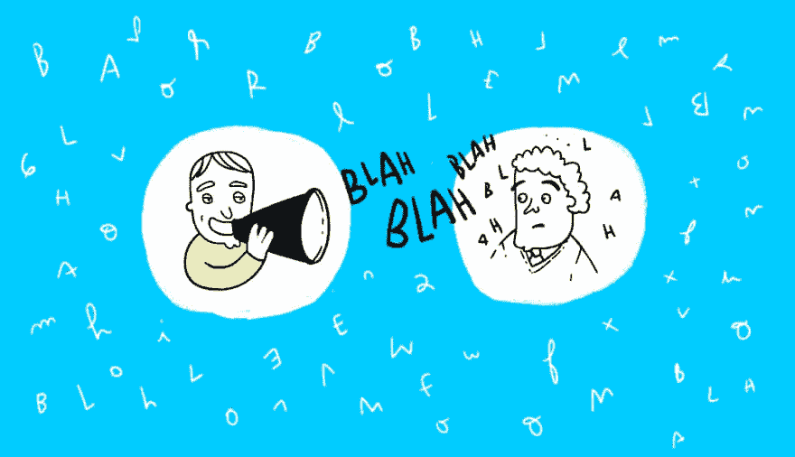
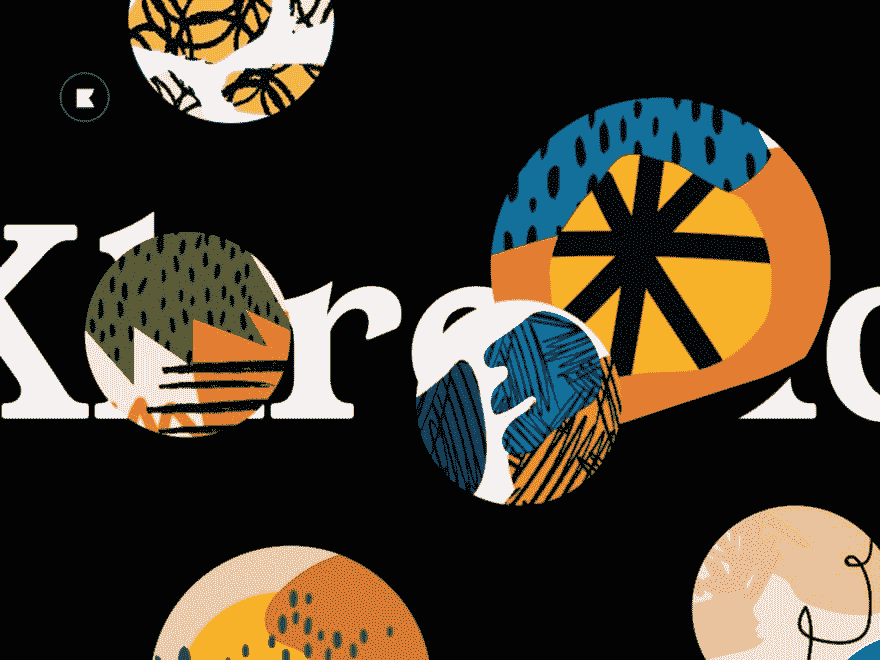
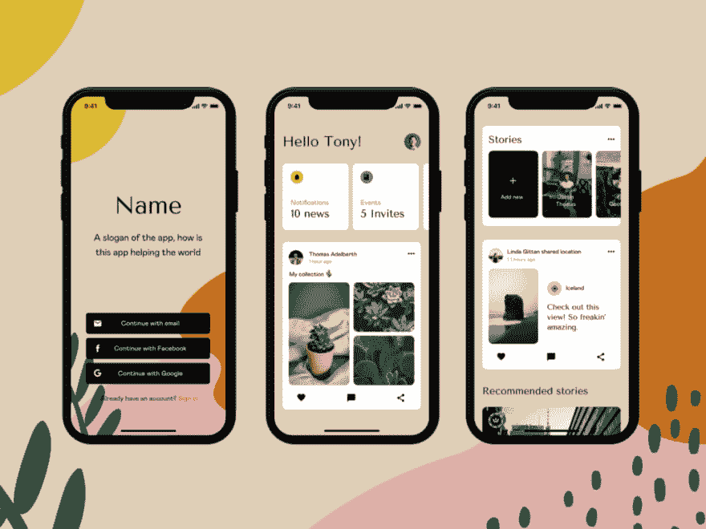

# Information overload, Facebook Libra, baseline grids — and more UX links this week

> 原文：[https://dev.to/uxcollective/information-overload-facebook-libra-baseline-grids-and-more-ux-links-this-week-3a9o](https://dev.to/uxcollective/information-overload-facebook-libra-baseline-grids-and-more-ux-links-this-week-3a9o)

#### A weekly selection of design links, brought to you by your friends at the UX Collective.

*   [**How to combat with info overload**](https://www.interaction-design.org/literature/article/information-overload-why-it-matters-and-how-to-combat-it) → How to avoid presenting so much data that you leave the user unable to make a decision.
*   [**Marking required fields in forms**](https://www.nngroup.com/articles/required-fields/) → Using asterisk for required fields, or indicating the ones that are optional?
*   [**Experimenting in UX research**](https://www.uxmatters.com/mt/archives/2019/06/practicing-what-you-preach-experimenting-and-iterating-in-ux-research.php) → Design thinking, failing fast, iterating, and other popular design buzzwords.

### Stories from the community

[**One design concept, infinite revisions?**](https://uxdesign.cc/one-design-concept-infinite-revisions-b815a75a1acd?source=friends_link&sk=845bb60b4358f5dd9f2075f87370ffab) →

On building flexibility into your creative process.

By [Benek Lisefski](https://medium.com/u/1933a0f84e4b)

[**How to improve your product with Lean UX**](https://uxdesign.cc/how-to-improve-your-digital-product-with-lean-ux-methodology-1b6ad6e57020?source=friends_link&sk=5d36d78ec0cef68d122ee8bf1f32a63b) →

Processes that are quick, sustainable, and flexible.

By [Adam Fard](https://medium.com/u/1c3087c41151)

[**How I overcame the fear of testing my design**](https://uxdesign.cc/how-i-overcame-the-fear-of-testing-my-design-cfe69d35886b?source=friends_link&sk=4fc1637b3d2ab3d56ae826ff3bbc9f93) →

Who loves the feeling of being rejected?

By [Porhour LY](https://medium.com/u/5c4a4778bcd4)

More top stories:

*   [**The UI commute: why screens are burning you out**](https://uxdesign.cc/the-ui-commute-the-actual-reason-why-screens-are-burning-you-out-4634121305aa?source=friends_link&sk=7165a95f6bdda181daa100299649dc72) → By [Stefan Nikolovski](https://medium.com/u/f87e88da918b)
*   [**How good UX leads to great security**](https://uxdesign.cc/how-good-ux-leads-to-great-security-293327c83a90?source=friends_link&sk=31b53f8cf5c3e8a9443663aac28422a8) → By [Josh Ben-David](https://medium.com/u/5ad1a767bcce)
*   [**Writing a press release before jumping into Design**](https://uxdesign.cc/a-press-release-before-ux-design-df250539c974?source=friends_link&sk=44e8b59ecab64dab5c11a3c5e919d7ef) → By [Shani Prathibha](https://medium.com/u/26dfe01d202f)
*   [**3 ways of thinking about accessibility**](https://uxdesign.cc/3-ways-of-thinking-about-accessibility-c2f791e683f5?source=friends_link&sk=a4f47869e29832383f52c9c39b5c148c) → By [Alastair Somerville](https://medium.com/u/cddafb176d61)
*   [**What is the role of an AI designer?**](https://uxdesign.cc/what-is-the-role-of-an-a-i-designer-6943711046ec?source=friends_link&sk=01ce606d7876d76ffe064affdb2b3e8b) → By [Amanda Linden](https://medium.com/u/3f17faeb1605)
*   [**The illusion of different design processes**](https://uxdesign.cc/the-illusion-of-different-design-processes-dc5bed14a7e7?source=friends_link&sk=e42baa9c38ed681ae4511965e49065cc) → By [Maximilian Schmidt](https://medium.com/u/65de1a3e47c)
*   [**The things we forget on the inside looking out**](https://uxdesign.cc/the-things-we-forget-on-the-inside-looking-out-4a6907f2952c?source=friends_link&sk=9e2651ba02d0d94e9e4de50da9144f7e) → By [Quinn Keast](https://medium.com/u/3e06b42dd370)

> Fabricio Teixeira@fabriciotThis week marks 26 out of the 52 UX mentorship sessions I have decided to offer for free this year. Here’s what I learned so far. (Thread) [#UX](https://twitter.com/hashtag/UX)11:20 AM - 18 Jun 2019  18  80

### News & ideas

*   [**Facebook Libra**](https://www.theverge.com/2019/6/18/18683867/facebook-cryptocurrency-libra-calibra-trust-banking) → Facebook launches [Libra](https://libra.org/en-US/white-paper/) (cryptocurrency) and [Calibra](https://calibra.com/) (app), with a serious [trust problem](https://www.theverge.com/2019/6/18/18683867/facebook-cryptocurrency-libra-calibra-trust-banking).
*   [**Spot the Fake**](https://www.fastcompany.com/90364471/adobe-has-an-ambitious-plan-to-help-the-public-spot-fake-images) → Adobe has an ambitious plan to help the public spot fake images.
*   [**Atoms & Ions**](https://www.cjcid.com/articles/ions-introduction/) → Introducing “Ions”, an extension to the Atomic Design concept.
*   [**Sustainable Web**](https://www.sustainablewebmanifesto.com/) → A manifesto about making the web a more sustainable, open, and honest place.

<figcaption>[**Featured work: Lucie Bajgart**](https://dribbble.com/LucieBajgart) →</figcaption>

### Tools & resources

*   [**Iconography 101**](https://www.designsystems.com/iconography-guide/) → A comprehensive guide about iconography, its whys and hows.
*   [**Mind Maps**](https://whimsical.com/product/introducing-whimsical-mind-maps/) → Whimsical is launching mind maps to help organize your ideas.
*   [**Baseline Grids**](https://observablehq.com/@gianordoli/baseline-grid) → A thorough investigation into a commonly overlooked design element.
*   [**Pock**](https://pock.dev/) → Display your MacOS doc on your Touch Bar.

* * *