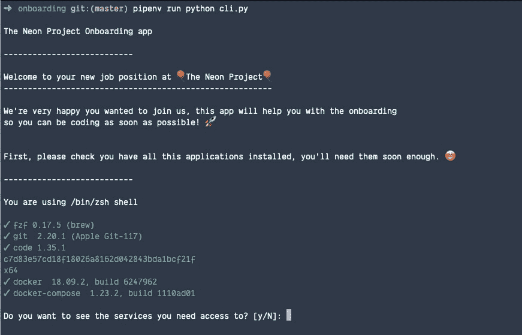
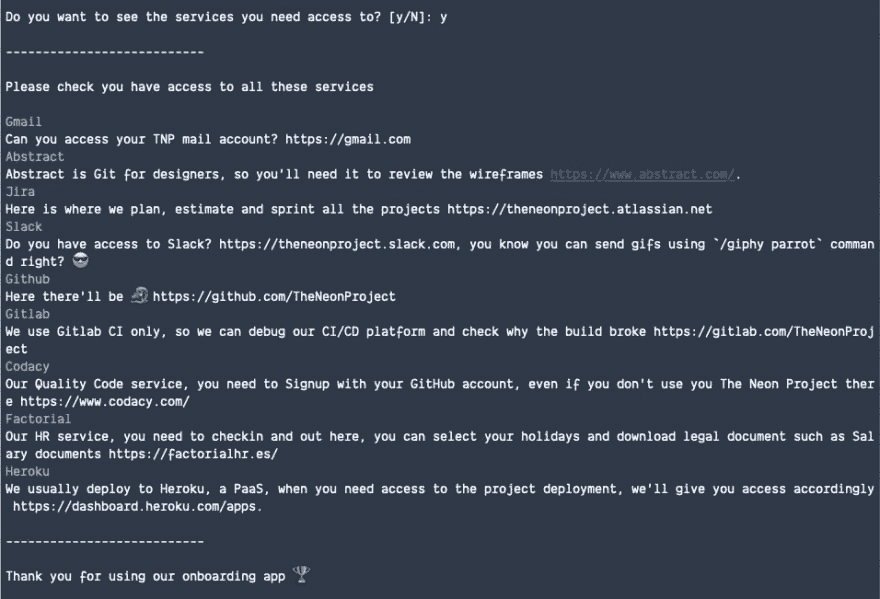

# 使用这个简单的应用程序(Python 语言)自动化您的新开发人员的团队入职

> 原文：<https://dev.to/wealize/automatize-your-new-developer-s-team-onboarding-with-this-simple-app-in-python-22pg>

当一个新的开发人员加入我们的团队时，每个人都想给他们最好的体验🙌。

[](https://i.giphy.com/media/FQyQEYd0KlYQ/giphy.gif)

我们已经用 Python 创建了一个简单的命令行应用程序，用最少的配置帮助新开发人员以一种极客的方式设置他/她的环境并检查一切是否正常！它还提供了关于他们可以访问哪些服务的信息，这样他们就可以进行检查，而不需要去其他地方获取这些信息。

我们使用 Python 中的库 [Click](https://click.palletsprojects.com/en/7.x/) 创建命令行界面，并使用 YAML 进行配置。该配置有一个特定的结构，此外，我们可以配置文件路径，以便有人可以重用自己公司的项目🤓。

[文档在自述文件](https://github.com/TheNeonProject/onboarding)中。您可以在配置中设置公司信息，就像我们自己的[一样，您可以用它作为](https://github.com/TheNeonProject/onboarding/blob/master/config.yml)的例子。要使用您的配置文件，您可以设置`ONBOARDING_FILE_PATH`。

可以用 [pipenv](https://github.com/pypa/pipenv) 安装。

```
pip3 install pipenv
pipenv --python 3.7
pipenv install 
```

<svg width="20px" height="20px" viewBox="0 0 24 24" class="highlight-action crayons-icon highlight-action--fullscreen-on"><title>Enter fullscreen mode</title></svg> <svg width="20px" height="20px" viewBox="0 0 24 24" class="highlight-action crayons-icon highlight-action--fullscreen-off"><title>Exit fullscreen mode</title></svg>

一旦这个命令完成，我们可以使用`pipenv`运行它。

```
export ONBOARDING_FILE_PATH=config.yml
pipenv run python cli.py 
```

<svg width="20px" height="20px" viewBox="0 0 24 24" class="highlight-action crayons-icon highlight-action--fullscreen-on"><title>Enter fullscreen mode</title></svg> <svg width="20px" height="20px" viewBox="0 0 24 24" class="highlight-action crayons-icon highlight-action--fullscreen-off"><title>Exit fullscreen mode</title></svg>

[它也具有从 VS 代码调试选项卡启动的配置](https://github.com/TheNeonProject/onboarding/blob/master/.vscode/launch.json)。

你可以在这里看到我的公司配置的应用程序的输出。

[](https://res.cloudinary.com/practicaldev/image/fetch/s--qJrwgirB--/c_limit%2Cf_auto%2Cfl_progressive%2Cq_auto%2Cw_880/https://user-images.githubusercontent.com/488556/59706185-3a765680-9200-11e9-90ce-490c377e7016.png)

[](https://res.cloudinary.com/practicaldev/image/fetch/s--buLSAVLf--/c_limit%2Cf_auto%2Cfl_progressive%2Cq_auto%2Cw_880/https://user-images.githubusercontent.com/488556/59706184-3a765680-9200-11e9-9a29-a10e7fe8fff1.png)

这个项目是开源的，你可以从 GitHub 中克隆它。

如果有时间，我们可能会创建一个 Python 包并添加更多功能🎸，但目前来看，它确实有用。:-)

*哈雷戴维森在 Unsplash 上拍摄的封面图片*